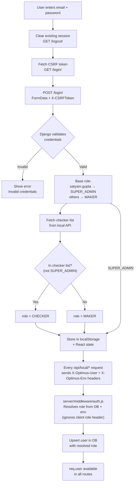

# AUTH Flow — Authentication & Role Assignment

> **Source:** `src/services/AuthService.js`, `src/context/AuthContext.jsx`, `server/middleware/auth.js`
> **Config:** `src/config/Feature/AuthConfig.js`

---

## 1. Overview

Optimus has two layers of authentication:

1. **Django login** — User logs into `samaan.apnamart.in` to get a session (CSRF token + session cookie). This is the identity provider.
2. **Local role resolution** — The Express backend resolves the user's role server-side from email + CheckerList table. Client-sent role headers are **ignored**.

```
┌──────────────┐                    ┌──────────────────────┐
│  Login Page  │ ── credentials ──▶ │  Django Backend      │
│  (frontend)  │ ◀── session ─────  │  samaan.apnamart.in  │
└──────┬───────┘                    └──────────────────────┘
       │
       │  localStorage: { email, role, name, csrfToken }
       │  localStorage: optimus_env = 'UAT' | 'PROD'
       │
       ▼
┌──────────────┐   X-Optimus-User   ┌──────────────────────┐
│  React App   │ ── X-Optimus-Env ─▶│  Express :3001       │
│  (Vite)      │ ◀── { user } ────  │  server/middleware/  │
└──────────────┘                    │  auth.js resolves    │
                                    │  role from DB + env  │
                                    └──────────────────────┘
```

> **Environment Isolation:** The local Express backend receives `X-Optimus-Env` header (UAT or PROD) on every request. CheckerList entries are **per-environment** — a user can be CHECKER in UAT but MAKER in PROD.

---

## 2. Login Flow (Step-by-Step)

**Source:** `src/services/AuthService.js`, `src/components/Auth/LoginPage.jsx`

```
0. User selects environment (UAT or PROD) on login page
   - Toggle pills above username field
   - Stored in localStorage.optimus_env (default: PROD)
   - Sets API_BASE prefix: /uat or /prod (Vite proxy routes to correct backend)
   - Color: PROD = green, UAT = orange
1. User enters email + password on login page
2. Frontend clears any existing session:
   - GET /logout/ (clear Django session)
   - Clear local cookies
3. Frontend fetches CSRF token:
   - GET /login/ → Django sets csrftoken cookie
4. Frontend submits login:
   - POST /login/ with FormData (username, password, csrfmiddlewaretoken)
   - X-CSRFToken header included
5. Django validates credentials:
   - Success → redirects away from /login
   - Failure → stays on /login with error messages
6. Frontend validates response:
   - Check for Django errorlist in HTML
   - Check if URL still contains /login
   - Check if login form still present
   - Check HTTP status
7. If all checks pass → login successful
8. Base role assigned (environment-aware):
   - PROD: satyam.gupta@apnamart.in → SUPER_ADMIN
   - UAT: satyam → SUPER_ADMIN
   - Everyone else → MAKER
9. User object stored in localStorage
```

### Login Validation Checks

| Check | What It Detects | Failure Means |
|-------|----------------|---------------|
| Django errorlist in HTML | Invalid credentials message | Wrong email/password |
| URL contains `/login` | Redirect didn't happen | Login rejected |
| Login form still in HTML | `type="password"` present | Not logged in |
| HTTP status `!ok` | Server error | Backend issue |

---

## 3. Role Assignment

### Roles

| Role | Who Gets It | Powers |
|------|-------------|--------|
| **MAKER** | Anyone who can login to `samaan.apnamart.in` (default) | Create, edit, delete widgets; submit for review |
| **CHECKER** | Users promoted by SUPER_ADMIN via Manage Users panel | Preview, approve, reject, re-open, deploy |
| **SUPER_ADMIN** | Only `satyam.gupta@apnamart.in` (hardcoded, cannot be changed) | All CHECKER powers + add/remove checkers |

### Resolution Flow

Role is resolved **server-side** on every API request. The client-sent `X-Optimus-Role` header is ignored. CheckerList is **per-environment** — the same user can have different roles in UAT vs PROD.

```
User sends X-Optimus-User: john@apnamart.in
           X-Optimus-Env: UAT
        │
        ▼
  Is email satyam.gupta@apnamart.in or satyam?
        │
    YES │                   NO
        ▼                    ▼
   SUPER_ADMIN        Is email in CheckerList table
                      WHERE env = 'UAT'?
                            │
                       YES  │          NO
                            ▼           ▼
                         CHECKER      MAKER
```

### Two-Layer Resolution

| Layer | Where | What It Does |
|-------|-------|-------------|
| **Frontend (login time)** | `AuthService.js` + `AuthContext.jsx` | Base role from email + checker list from local API |
| **Backend (every request)** | `server/middleware/auth.js` | Resolves role from email + CheckerList DB table + **environment**. **This is the source of truth.** |

### Server-Side Code

```javascript
// server/middleware/auth.js
const SUPER_ADMIN_IDENTIFIERS = ['satyam.gupta@apnamart.in', 'satyam'];
const env = req.headers['x-optimus-env'] || 'PROD'; // UAT or PROD

if (SUPER_ADMIN_IDENTIFIERS.includes(lowerEmail)) {
    role = 'SUPER_ADMIN';                    // Hardcoded, never overridden
} else if (user has CheckerList entry WHERE env = env) {
    role = 'CHECKER';                        // Promoted by SUPER_ADMIN via UI, per-environment
} else {
    role = 'MAKER';                          // Default for all logged-in users
}
```

### Frontend-Side Code

```javascript
// AuthService.js — Base role (login time, environment-aware)
if (ACTIVE_ENV === 'UAT' && lowerUser === 'satyam') {
    role = 'SUPER_ADMIN';
} else if (lowerUser === 'satyam.gupta@apnamart.in') {
    role = 'SUPER_ADMIN';
}

// AuthContext.jsx — Dynamic override (login time)
const approvalUsers = await GoogleSheetService.getApprovalUsers();
if (userData.role !== 'SUPER_ADMIN') {
    const isInCheckerList = approvalUsers.some(
        (u) => u.email.toLowerCase() === email.toLowerCase()
    );
    if (isInCheckerList) {
        userData.role = 'CHECKER';
    }
}
```

---

## 4. Checker Management

Only `satyam.gupta@apnamart.in` (SUPER_ADMIN) can add/remove checkers.

**Checker list is per-environment.** Adding a checker in UAT does NOT make them a checker in PROD (and vice versa). Each environment has its own independent checker list.

### Adding a Checker

```
1. SUPER_ADMIN clicks "Users" button in header
2. Enters email + name in the panel
3. Clicks "Add Checker"
4. Backend: User upserted with role=CHECKER + added to CheckerList table
   with env = current environment (UAT or PROD)
5. Takes effect immediately — next API request resolves as CHECKER
   (only in the environment where they were added)
```

### Removing a Checker

```
1. SUPER_ADMIN clicks trash icon next to a checker
2. Backend: User removed from CheckerList table for current environment
   - If user still has checker entries in other environments, role stays CHECKER
   - If no checker entries remain in any environment, role reset to MAKER
3. Takes effect immediately — next API request resolves as MAKER (in this environment)
```

### Guard Rails

| Action | Result |
|--------|--------|
| MAKER tries to add/remove checker | 403 — Only SUPER_ADMIN can manage checkers |
| Add SUPER_ADMIN to checker list | 400 — Already has all checker powers |
| Remove SUPER_ADMIN from checker list | 400 — Cannot remove SUPER_ADMIN |
| CHECKER tries to manage checkers | 403 — Only SUPER_ADMIN |

### API Endpoints

All checker endpoints are **environment-scoped** via the `X-Optimus-Env` header (UAT or PROD).

| Action | Method | Route | Who Can Call | Environment-Scoped |
|--------|--------|-------|-------------|-------------------|
| List checkers | GET | `/api/local/users/checkers` | Anyone | Yes — only checkers for current env |
| Add checker | POST | `/api/local/users/checkers` | SUPER_ADMIN only | Yes — adds to current env only |
| Remove checker | DELETE | `/api/local/users/checkers` | SUPER_ADMIN only | Yes — removes from current env only |
| Current user | GET | `/api/local/users/me` | Anyone | Yes — role resolved per env |

### Checker List Response

```json
[
  {
    "id": "uuid",
    "email": "satyam.gupta@apnamart.in",
    "name": "Satyam Gupta",
    "role": "SUPER_ADMIN",
    "addedAt": null,
    "isSuperAdmin": true
  },
  {
    "id": "uuid",
    "email": "john.doe@apnamart.in",
    "name": "John Doe",
    "role": "CHECKER",
    "addedAt": "2026-02-20T09:43:27.547Z"
  }
]
```

SUPER_ADMIN always appears at top with `isSuperAdmin: true` and no `addedAt` (not removable).

---

## 5. User Object

```javascript
// Stored in localStorage as 'optimus_user'
{
  name: "Satyam Gupta",
  email: "satyam.gupta@apnamart.in",
  role: "SUPER_ADMIN",   // or "CHECKER" or "MAKER"
  csrfToken: "sVCVPj..."
}
```

### Context Helpers (AuthContext)

```javascript
isAuthenticated   // !!user
isSuperAdmin      // user?.role === 'SUPER_ADMIN'
isChecker         // user?.role === 'CHECKER' || user?.role === 'SUPER_ADMIN'
isMaker           // user?.role === 'MAKER'
checkerList       // [{email, name, addedAt, isSuperAdmin?}]
addChecker(email, name)
removeChecker(email)
fetchCheckerList()
switchRole()      // Dev-only: toggle MAKER ↔ CHECKER
```

> **Note:** `isChecker` returns `true` for both CHECKER and SUPER_ADMIN, since SUPER_ADMIN has all checker powers.

---

## 6. CSRF Token Handling

**Source:** `src/services/AuthService.js`, `src/Backend/ApiClient.js`

### How CSRF Works

```
1. Django sets 'csrftoken' cookie on GET /login/
2. Frontend reads cookie: document.cookie → csrftoken=xxx
3. Login POST includes:
   - FormData field: csrfmiddlewaretoken=xxx
   - Header: X-CSRFToken: xxx
4. After login, csrfToken stored in user object
5. ApiClient.js reads csrftoken from cookie for all API calls
```

### Session Recovery (403 Handling)

**Source:** `src/services/withSessionRetry.js`, `src/config/BackendFlow.js`

```
API call returns 403 (session expired)
        │
        ▼
   GET /login/ (refresh CSRF cookie)
        │
        ▼
   Retry original request (up to 2 times)
        │
        ▼
   Still 403? → Show error to user
```

Config:
```javascript
// BackendFlow.js
SESSION_CONFIG = {
    maxRetryOn403: 2,
    refreshEndpoint: '/login/',
    cookieName: 'csrftoken',
}
```

---

## 7. Logout Flow

```
1. User clicks Logout
2. Frontend calls GET /logout/ on Django backend
3. localStorage cleared (optimus_user removed)
4. React state cleared (user=null, checkerList=[])
5. User redirected to login page
```

---

## 8. Manage Users Panel

```
┌─────────────────────────────────────────┐
│  Manage Approval Users          [UAT]   │
│  (showing checkers for current env)     │
│                                         │
│  Email: [____________] Name: [________] │
│  [+ Add Checker]                        │
│                                         │
│  ── Current Checkers (3) ──────────     │
│                                         │
│  Satyam Gupta                           │
│    satyam.gupta@apnamart.in             │
│    [Super Admin]          (not removable)│
│                                         │
│  John Doe                               │
│    john.doe@apnamart.in   Added 2/17    │
│                              [Remove]   │
│                                         │
│  Jane Smith                             │
│    jane.smith@apnamart.in Added 2/15    │
│                              [Remove]   │
└─────────────────────────────────────────┘
```

Visible only to SUPER_ADMIN. Triggered by "Users" button in header.
**Environment-scoped:** Only shows checkers added to the current environment (UAT or PROD). Adding/removing checkers affects only the current environment.

---

## 9. End-to-End Auth Diagram



---

## 10. Source Files

| File | Purpose |
|------|---------|
| `src/services/AuthService.js` | Django login/logout, base role assignment, CSRF handling |
| `src/context/AuthContext.jsx` | React context: user state, checker list, role helpers |
| `server/middleware/auth.js` | Server-side role resolution (source of truth) |
| `src/services/withSessionRetry.js` | 403 recovery (auto-refresh CSRF) |
| `src/config/Feature/AuthConfig.js` | Auth configuration constants |
| `src/config/Feature/MakerCheckerConfig.js` | Approval workflow config (roles, statuses, transitions) |
| `src/config/BackendFlow.js` | SESSION_CONFIG, RETRY_CONFIG |

---

## 11. Related Documentation

- [Feature-Maker-Checker.md](./Feature-Maker-Checker.md) — Approval workflow (submit, approve, reject)
- [DATA-Architecture.md](./DATA-Architecture.md) — Database schema and API routes
- [Backend-work-flow.md](./Backend-work-flow.md) — End-to-end widget lifecycle
