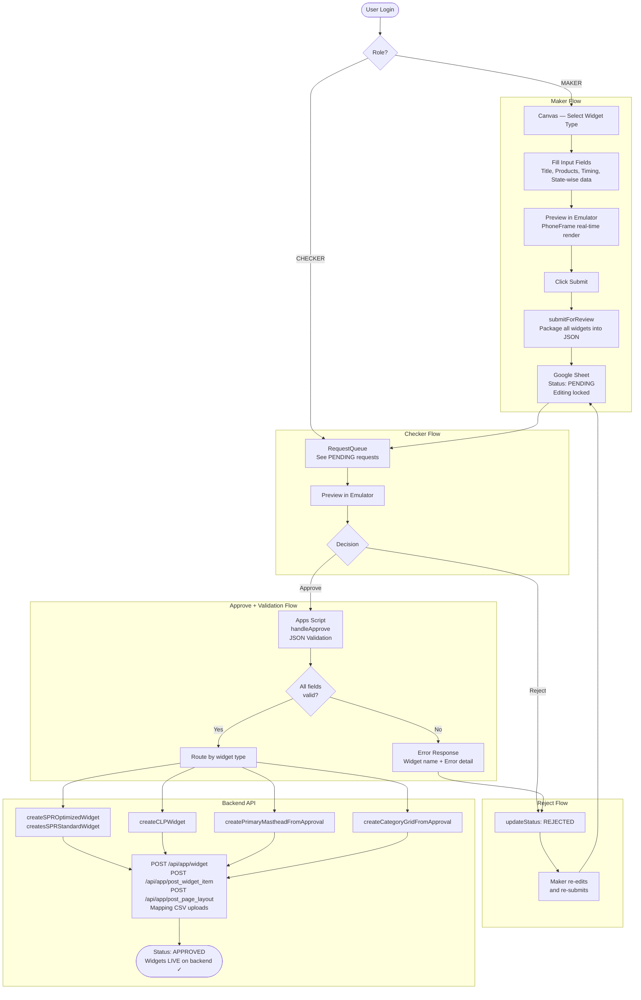

# Backend Work Flow — End-to-End Widget Lifecycle

## 1. Overview

Yeh document pura backend workflow describe karta hai — jab se **user UI mein aata hai** aur widget create karta hai, tab se lekar **approval aur backend deployment** tak ka complete flow.

```
User → UI (Canvas) → Widget Form Fill → Emulator Preview → Submit
    → Backend JSON Validation → Approval Queue → Checker Review
    → Approve / Reject → Backend API Deployment
```

---

## 2. Full Flow — Step by Step

### Step 1 — User UI Mein Aata Hai

User Optimus tool open karta hai aur login karta hai.

- **Role resolve** hoti hai login pe: `MAKER`, `CHECKER`, ya `SUPER_ADMIN`
- MAKER ko canvas dikhta hai jahan widgets create kiye ja sakte hain
- CHECKER ko `RequestQueue` dikhta hai — pending approvals ke liye

```
┌─────────────────────────────────────────┐
│  OPTIMUS                    [👤 Login]   │
│                                         │
│  Left Sidebar     │  Canvas (Center)    │
│  ─────────────    │  ─────────────────  │
│  Widget Types ▼   │  (empty canvas)     │
│  [Select Type]    │                     │
│  [+ Add Widget]   │                     │
│                   │  Right → Emulator   │
└─────────────────────────────────────────┘
```

---

### Step 2 — Widget Type Select Karna

User sidebar mein widget type choose karta hai:

| Widget Type | Backend Type Resolved |
| :--- | :--- |
| Single Product Row | `single_product_row` |
| Single Product Row (Optimized) | `single_product_row_v2` |
| Collection Banner (Scroll) | `carousel` |
| Collection Banner (Stick) | `category` |
| Primary Masthead | `masthead_primary` |
| Secondary Masthead | `masthead_secondary_category_hp` |

> See [Feature-Creation-Widget.md](./Feature-Creation-Widget.md) for full variant matrix.

---

### Step 3 — Input Fields Fill Karna

Widget add karne ke baad, **Property Editor** (right sidebar) open hota hai. User saare required fields fill karta hai.

**Common Fields (sabhi widgets):**
```
┌──────────────────────────────────────────┐
│  Title (EN):   [______________________]  │
│  Title (HI):   [______________________]  │
│  Start Time:   [2026-02-19 10:00:00]     │
│  End Time:     [2026-07-01 18:00:00]     │
└──────────────────────────────────────────┘
```

**Widget-Specific Fields** (example: Product Rail):
```
┌──────────────────────────────────────────┐
│  Rows:       ○ Single    ○ Double        │
│  ☐ Optimized (V2)                        │
│  ☐ Multimedia Background                 │
│                                          │
│  Product Codes: [1001, 1002, 1003____]   │
│                                          │
│  ─── State-Wise (if Optimized) ───────   │
│  Global:     [1001, 1002, 1003_______]   │
│  Jharkhand:  [1003, 1004, 1005_______]   │
│  [ + Add State ]                         │
└──────────────────────────────────────────┘
```

All input fields config-driven hain — `WidgetRegistry.js` → `ProductRailConfig.js` etc. se aate hain.

---

### Step 4 — Emulator Mein Preview

Input fields fill karne ke baad, widget **real-time emulator** mein dikhta hai (right panel — PhoneFrame).

```
┌─ Phone Emulator ──────────────────────┐
│                                        │
│  ┌────────────────────────────────┐   │
│  │  ★ Rice Mela Rail    View All  │   │
│  │  ┌─────┐ ┌─────┐ ┌─────┐      │   │
│  │  │ img │ │ img │ │ img │      │   │
│  │  │ ₹99 │ │₹149 │ │₹199 │      │   │
│  │  │Rice │ │Atta │ │Dal  │      │   │
│  │  └─────┘ └─────┘ └─────┘      │   │
│  └────────────────────────────────┘   │
│                                        │
└────────────────────────────────────────┘
```

Emulator sirf **visual preview** hai — backend mein kuch create nahi hota abhi tak.

---

### Step 5 — Submit Karna (Maker)

Sab kuch theek lagane ke baad, Maker **"Submit"** button click karta hai.

```
Maker clicks "Submit"
    ↓
WidgetContext.submitForReview() called
    ↓
All canvas widgets packaged into JSON payload
    ↓
GoogleSheetService.createRequest() → Google Sheet mein store
    ↓
pageStatus → PENDING
    ↓
Canvas editing locked ✗
```

**Submit Payload (Google Sheet mein jaata hai):**

```json
{
    "action": "create",
    "id": "550e8400-e29b-41d4-a716-446655440000",
    "user": "john.doe@apnamart.in",
    "type": "Homepage Update",
    "status": "PENDING",
    "widgets": [
        {
            "type": "Single Product Row",
            "title": "Rice Mela",
            "products": ["1001", "1002", "1003"],
            "startTime": "2026-02-19 10:00:00",
            "endTime": "2026-07-01 18:00:00"
        }
    ],
    "headerWidgets": {
        "primaryMasthead": { ... },
        "secondaryMasthead": { ... }
    }
}
```

---

### Step 6 — Backend JSON Validation

**Approve se pehle**, Google Apps Script (`Approval_Automation.gs`) widget ka JSON check karta hai — saare fields sahi hain ya nahi.

```
Checker "Approve" click karta hai
    ↓
GoogleSheetService.approveRequest() → Apps Script ko bheja
    ↓
Apps Script: handleApprove() called
    ↓
Har widget ke liye validation:
    ┌─────────────────────────────────────────┐
    │  1. widget_type valid hai?              │
    │  2. Required fields present hain?       │
    │     - slug_name                         │
    │     - heading_en / text_en              │
    │     - start_time / end_time             │
    │     - product_list (if applicable)      │
    │  3. Multimedia slug valid hai?          │
    │     (agar multimedia field empty nahi)  │
    │  4. State-wise data sahi format mein?   │
    └─────────────────────────────────────────┘
    ↓
Sab theek → Backend API calls shuru
Koi galti → Error return, status PENDING rehta
```

**Validation Error Response (agar koi field galat hai):**

```json
{
    "success": false,
    "results": [
        {
            "widget": "Rice Mela",
            "status": "failed",
            "error": "Required field missing: product_list cannot be empty"
        },
        {
            "widget": "Primary Masthead",
            "status": "failed",
            "error": "Background Multimedia Name is invalid — omit field if empty"
        }
    ]
}
```

**Error UI Toast:**
```
┌─────────────────────────────────────────────────┐
│  ✗ Approval Failed                               │
│                                                   │
│  Widget: "Rice Mela"                             │
│  Error: product_list cannot be empty             │
│                                                   │
│  Widget: "Primary Masthead"                      │
│  Error: Background Multimedia Name is invalid    │
└─────────────────────────────────────────────────┘
```

Checker phir **Reject** kar sakta hai aur Maker ko batana padta hai kya fix karna hai.

---

### Step 7 — Checker Review (Approval Queue)

Checker **RequestQueue** mein jaata hai aur pending requests dekhta hai.

```
┌──────────────────────────────────────────────┐
│  Review Queue                    [Filter ▼]   │
│                                               │
│  ┌──────────────────────────────────────┐    │
│  │  John Doe              2 min ago     │    │
│  │  ● PENDING    3 Widgets              │    │
│  │                                      │    │
│  │  [✓] Single Product Row - Rice Mela  │    │
│  │  [✓] Category Grid - Grocery         │    │
│  │  [✓] Primary Masthead - Diwali       │    │
│  │                                      │    │
│  │  [Preview]   [Approve]   [Reject]    │    │
│  └──────────────────────────────────────┘    │
│                                               │
│  ┌──────────────────────────────────────┐    │
│  │  Jane Smith            1 hour ago    │    │
│  │  ✓ APPROVED   2 Widgets  [Deploy]    │    │
│  └──────────────────────────────────────┘    │
└──────────────────────────────────────────────┘
```

**Checker ke options:**

| Action | Tab se | Kya hota hai |
| :--- | :--- | :--- |
| **Preview** | PENDING | Canvas mein widgets restore, emulator mein dikhta hai |
| **Approve** | PENDING | Automation trigger, backend pe create |
| **Reject** | PENDING | Status REJECTED, Maker re-edit kar sakta hai |
| **Re-open** | APPROVED | Status DRAFT, editing phir se open |
| **Deploy** | APPROVED | Manual re-deploy (agar automation fail ho) |

---

### Step 7.1 — Widget Selection (Approve se Pehle)

Checker **approve karne se pehle** yeh decide karta hai ki kaun se widgets actually backend pe deploy hone chahiye. Yeh **partial approval** allow karta hai — ek hi submission mein se sirf kuch widgets approve ho sakte hain.

**Flow:**

```
Request card expand karo (Show Widgets ▼)
    ↓
Header Widgets aur Body Widgets alag-alag list mein dikhte hain
    ↓
Checkbox se select/deselect karo
    ↓
Minimum 1 widget select hona zaroori hai
    ↓
[Approve] → sirf selected widgets ke liye API calls honge
```

**Selection UI (expanded card view):**

```
┌── Request: John Doe — PENDING ──────────────────────────┐
│                                                           │
│  ▼ Hide Widgets                                           │
│                                                           │
│  ┌─── Header Widgets ────────────────────────────────┐  │
│  │  [☑] 🎨 Primary Masthead   "Diwali Campaign"      │  │  ← gradient bg
│  │  [☐] 🎨 Secondary Masthead "Category Carousel"    │  │  ← unchecked, dimmed
│  └───────────────────────────────────────────────────┘  │
│                                                           │
│  ┌─── Body Widgets ──────────────────────────────────┐  │
│  │  [☑]  Single Product Row   "Rice Mela"            │  │  ← checked, blue bg
│  │  [☐]  Category Grid        "Grocery"              │  │  ← unchecked, dimmed
│  │  [☑]  Single Product Row   "Atta Deals"           │  │  ← checked
│  └───────────────────────────────────────────────────┘  │
│                                                           │
│  [Preview]     [Approve]     [Reject]                     │
└───────────────────────────────────────────────────────────┘
```

**Widget Selection Rules:**

| Rule | Behaviour |
| :--- | :--- |
| Default state | All widgets **unchecked** — Checker must explicitly select |
| Min selection | **At least 1** widget must be selected to Approve |
| Header widgets | Primary Masthead aur Secondary Masthead separately selectable |
| Partial selection | Checker sirf 2 of 4 select kar sakta hai — baaki skip |
| Maker view | Checkboxes **not shown** — Maker sirf list dekh sakta hai (read-only) |

**Code reference:**

| State | Location | Description |
| :--- | :--- | :--- |
| `selectedWidgets` | `RequestQueue.jsx` | `Map<reqId → Set<widgetIndex>>` — body widget selections |
| `selectedHeaderWidgets` | `RequestQueue.jsx` | `Map<reqId → Set<'primaryMasthead'/'secondaryMasthead'>>` |
| `handleApprove()` | `RequestQueue.jsx` | Filters `req.widgets[]` + `req.headerWidgets{}` by selection before passing to `GoogleSheetService.approveRequest()` |

**Why partial selection?**

Ek maker ek saath multiple widgets submit karta hai — kuch ready hoti hain, kuch mein abhi issues hain. Checker sirf ready wali approve kar sakta hai, baaki PENDING mein rehti hain ya reject hoti hain.

---


### Step 8 — Approve: Backend API Deployment

Checker approve karta hai → Apps Script widget type ke hisaab se route karta hai:

```javascript
switch (widget.type) {
    case 'Single Product Row Optimize':
        createSPROptimizedWidget(widget);   // PLP ecosystem + Homepage Row
        break;
    case 'Single Product Row':
        createSPRStandardWidget(widget);    // Direct widget creation
        break;
    case 'Banner With Product Listing':
        createCLPWidget(widget);            // Carousel + PLP
        break;
    case 'Primary Masthead':
        createPrimaryMastheadFromApproval(widget);
        break;
    case 'Category Grid':
        createCategoryGridFromApproval(widget);
        break;
}
```

**Backend API Calls (example: Product Rail Standard):**

```
1. POST /api/app/post_page_layout/     → Page Layout create
2. POST /api/app/post_widget_item/     → Widget Item create (products)
3. POST /api/app/widget/               → Homepage Widget create
4. Mapping CSV upload                  → Widget Item → Widget link
5. Mapping CSV upload                  → Widget → Page Layout link
6. Mapping CSV upload                  → Page → Global registry link
```

**Success Response:**

```json
{
    "success": true,
    "message": "Processed 3 widgets",
    "results": [
        {
            "widget": "Rice Mela",
            "status": "success",
            "slug": "rice_mela_spr"
        },
        {
            "widget": "Grocery Grid",
            "status": "success",
            "slug": "grocery_cm_hp"
        },
        {
            "widget": "Diwali Masthead",
            "status": "success",
            "slug": "diwali_pm_hp"
        }
    ],
    "errors": []
}
```

---

### Step 9 — Reject Flow

Agar Checker reject karta hai (ya validation fail hoti hai):

```
Checker "Reject" click karta hai
    ↓
GoogleSheetService.updateStatus(id, 'REJECTED')
    ↓
Status: REJECTED
    ↓
Maker ko editing access wapas milti hai
    ↓
Maker fields fix karta hai
    ↓
Maker phir se "Submit" karta hai → PENDING
    ↓
Checker phir review karta hai
```

---

## 3. Complete End-to-End Flow Diagram



---

## 4. Status Lifecycle

```
          submitForReview()
DRAFT ────────────────────→ PENDING
  ↑                            │
  │ resetToDraft()    ┌────────┴────────┐
  │                   │                 │
  │              approvePage()     rejectPage()
  │                   │                 │
  │                   ↓                 ↓
  │               APPROVED          REJECTED
  │                   │                 │
  │           [Deploy available]   Maker re-edits
  └─────────────────────────────────────┘
```

| Status | Maker Kar Sakta Hai | Checker Kar Sakta Hai |
| :--- | :--- | :--- |
| `DRAFT` | Create, Edit, Delete, Submit | Preview only |
| `PENDING` | Sirf dekh sakta, edit nahi | Preview, Approve, Reject |
| `APPROVED` | Kuch nahi | Re-open, Deploy |
| `REJECTED` | Edit, Re-submit | Preview |

---

## 5. Error Reference — Common Validation Failures

| Error | Widget | Cause | Fix |
| :--- | :--- | :--- | :--- |
| `product_list cannot be empty` | Product Rail | Products add nahi kiye | Product codes daalo |
| `Background Multimedia Name is invalid` | Masthead / SPR Multimedia | `background_multimedia` field empty string bheja | Multimedia field blank rakhne pe field hi mat bhejo |
| `slug_name already exists` | Any | Wahi slug already backend pe exist karta hai | Naya unique slug use karo |
| `start_time format invalid` | Any | Date format galat hai | `YYYY-MM-DD HH:MM:SS` format use karo |
| `Type not supported` | Any | Widget type Apps Script mein register nahi | Apps Script mein naya `case` add karo |
| `Session expired (403)` | Any | Apps Script ke cookies expire ho gayi | `Approval_Automation.gs` mein cookies refresh karo |
| `Sub-category items missing` | Optimized SPR / CLP | State-wise items nahi banaye | Saare states ke items create karo |

---

## 6. Key Components Reference

| Component | File | Role |
| :--- | :--- | :--- |
| **WidgetLibrary** | `src/components/Sidebar/WidgetLibrary.jsx` | Widget type selector + "Add" button |
| **PropertyEditor** | `src/components/Sidebar/PropertyEditor.jsx` | Input fields (config-driven) |
| **PhoneFrame / Emulator** | `src/components/Layout/MainLayout.jsx` | Real-time visual preview |
| **WidgetContext** | `src/context/WidgetContext.jsx` | State, submit, approve, reject logic |
| **GoogleSheetService** | `src/services/GoogleSheetService.js` | Google Sheet CRUD — requests store/fetch |
| **Approval_Automation.gs** | `scripts/Approval_Automation.gs` | Backend routing + API calls on approve |
| **AuthContext** | `src/context/AuthContext.jsx` | Role management (MAKER/CHECKER) |
| **RequestQueue** | `src/components/Dashboard/RequestQueue.jsx` | Checker review UI |
| **WidgetRegistry** | `src/config/WidgetRegistry.js` | Widget config lookup + BackendFlow integration |
| **BackendFlow** | `src/config/BackendFlow.js` | Workflow stages, roles, validation, routing config |

---

## 7. Config File — `src/config/BackendFlow.js`

Yeh file poore backend workflow ka **config source of truth** hai. `WidgetRegistry.js` isey import karta hai aur apne methods mein expose karta hai.

### Exports

| Export | Type | Kya hai |
| :--- | :--- | :--- |
| `WORKFLOW_STAGES` | Object | `DRAFT`, `PENDING`, `APPROVED`, `REJECTED` — har stage ka description, allowed roles, aur valid next transitions |
| `ROLE_PERMISSIONS` | Object | Har role (`MAKER`, `CHECKER`, `SUPER_ADMIN`) ke liye allowed actions (canSubmit, canApprove, canReject...) |
| `SUBMIT_PAYLOAD_SCHEMA` | Object | Google Sheet ko bheje jaane wale payload ka schema |
| `SHEET_COLUMNS` | Object | Google Sheet columns A–G ka mapping (field, type, example) |
| `VALIDATION_RULES` | Object | Universal + per-type validation rules (field, rule, error message) |
| `APPROVAL_ROUTING` | Object | Canvas widget type → Apps Script function name (`createSPROptimizedWidget` etc.) |
| `BACKEND_ENDPOINTS` | Object | Saare backend REST endpoints (`/api/app/widget/`, `/api/app/post_widget_item/` etc.) |
| `APPROVAL_RESPONSE_SCHEMA` | Object | Apps Script approval response ka expected shape |
| `FETCHED_WIDGET_MARKERS` | Object | `_fetched: true`, `slug`, `_rawData` — fetched widget identifiers |
| `ERROR_CATALOGUE` | Array | Known validation errors — cause + fix for each |
| `WORKFLOW_SUMMARY` | Object | Name, version, wikiRef, stages list, roles list, Apps Script sheet ID |

### WidgetRegistry Methods (BackendFlow se powered)

Yeh methods `WidgetRegistry.js` mein add hue hain — `BackendFlow.js` ke data pe based:

```javascript
// Poora workflow config ek hi call mein:
WidgetRegistry.getWorkflowConfig()
// → { stages, roles, validation, routing, endpoints, errors, summary }

// Role + status ke hisaab se allowed actions:
WidgetRegistry.getAllowedActions('MAKER', 'DRAFT')
// → ['canCreate', 'canEdit', 'canDelete', 'canSubmit']

// Canvas widget type → Apps Script function:
WidgetRegistry.getApprovalRoute('Single Product Row Optimize')
// → { fn: 'createSPROptimizedWidget', script: '...', description: '...' }

// Universal + type-specific validation rules:
WidgetRegistry.getValidationRules('Single Product Row')
// → [{ field: 'type', rule: 'required', ... }, { field: 'products', rule: 'minItems:1', ... }]
```

### Import Pattern

```javascript
// Option A — via WidgetRegistry (recommended)
import { WidgetRegistry } from 'src/config/WidgetRegistry';
const { stages, roles } = WidgetRegistry.getWorkflowConfig();

// Option B — direct named imports (re-exported from WidgetRegistry)
import { WORKFLOW_STAGES, APPROVAL_ROUTING } from 'src/config/WidgetRegistry';

// Option C — direct from BackendFlow (if WidgetRegistry not needed)
import { VALIDATION_RULES, ERROR_CATALOGUE } from 'src/config/BackendFlow';
```

---

## 8. Related Documentation

- [Feature-Creation-Widget.md](./Feature-Creation-Widget.md) — Har widget ke creation steps aur API payloads
- [Feature-Maker-Checker.md](./Feature-Maker-Checker.md) — Approval workflow detail (roles, states, sheet)
- [Feature-Mapping-Widget.md](./Feature-Mapping-Widget.md) — Mapping types aur CSV formats
- [FEATURE-Fetch-Widget.md](./FEATURE-Fetch-Widget.md) — Existing widgets fetch, edit, re-submit
- [PLP-PAGE-widget-support.md](./PLP-PAGE-widget-support.md) — 3-layer PLP ecosystem
- [WIDGET-Product-Rail.md](./WIDGET-Product-Rail.md) — Product Rail variants
- [WIDGET-Collection-Banner.md](./WIDGET-Collection-Banner.md) — Carousel + Category Grid
- [WIDGET-Masthead.md](./WIDGET-Masthead.md) — Primary aur Secondary Masthead

---

## 9. Reliability Improvements

Feb 2026 mein implement kiye gaye 9 reliability features. Yeh all production-critical flows ko robust banate hain.

---

### 9.1 Session Auto-Refresh (403 Recovery)

**Files:** `src/services/withSessionRetry.js`, `src/config/BackendFlow.js` → `SESSION_CONFIG`

Jab bhi koi API call 403 return kare (expired CSRF session), `fetchWithSessionRetry()` automatically `GET /login/` call karta hai ta ke fresh CSRF cookie mil sake, aur phir original request retry karta hai.

```
API Call → 403 Received → GET /login/ (refresh CSRF cookie) → Retry → Success ✅
                                                                ↓ max 2 retries
                                                             → Still 403 → Re-login needed
```

**Config:** `SESSION_CONFIG.maxRetryOn403 = 2`, `SESSION_CONFIG.refreshEndpoint = '/login/'`

---

### 9.2 Pre-Submit Frontend Validation

**Files:** `src/services/ValidationService.js` → `validateWidgets()`, `src/context/WidgetContext.jsx` → `submitForReview()`

Submit button dabane se pehle, `validateAndCheckSlugs()` saare widgets validate karta hai `WidgetRegistry.getValidationRules()` se. Koi bhi validation fail hone par submit block hota hai aur toast error dikhta hai.

**Validations run:** required fields, minItems, minLength, datetime format, slug_name presence.

---

### 9.3 API Retry Logic (Exponential Backoff)

**Files:** `src/services/BackendSyncService.js` → `fetchWithRetry()`, `src/config/BackendFlow.js` → `RETRY_CONFIG`

Backend API calls (widget create/update) automatically retry on 5xx responses with exponential backoff.

```
HTTP 500/502/503/504  →  Wait 500ms  →  Retry
                      →  Wait 1000ms →  Retry
                      →  Wait 2000ms →  Final attempt
```

**Config:** `RETRY_CONFIG.maxRetries = 3`, `RETRY_CONFIG.baseDelayMs = 500`, `RETRY_CONFIG.backoffMultiplier = 2`

---

### 9.4 Slug Uniqueness Check

**Files:** `src/services/ValidationService.js` → `checkSlugAvailability()`, called by `validateAndCheckSlugs()`

Submit se pehle, har widget ke `slug_name` ko `GET /api/app/widget/?slug_name=<slug>` se check kiya jata hai. Agar slug already exist kare, error toast dikhta hai aur submit block hota hai.

> **Note:** Fetched widgets (`_fetched: true` marker) ka slug check skip hota hai — woh already backend pe hain.

---

### 9.5 Partial Deployment Status

**Files:** `src/services/BackendSyncService.js` → `deployRequest()`, `src/components/Dashboard/RequestQueue.jsx`

`deployRequest()` ab per-widget `results[]` return karta hai: `ok`, `updated`, `skipped`, ya `failed`. RequestQueue mein deployment ke baad har widget ka status icon ke saath dikhta hai.

```
Widget 1 — ✅ ok
Widget 2 — ✅ updated (fetched widget re-deployed)
Widget 3 — ❌ failed: PATCH failed for xyz: HTTP 404
Widget 4 — ⏳ skipped (unsupported type)
```

---

### 9.6 Fetched Widget Re-Deploy (PATCH Flow)

**Files:** `src/services/BackendSyncService.js` → `updateWidget()`, `src/config/BackendFlow.js` → `FETCHED_WIDGET_UPDATE_STRATEGY`

Agar canvas pe koi fetched widget ho (`_fetched: true`), `deployRequest()` usse `PATCH /api/app/widget/<slug>/` se update karta hai, naya `POST` nahi karta.

> **Fallback:** Agar backend `PATCH` support na kare (405), quietly skip karta hai aur log karta hai.

See also: [FEATURE-Fetch-Widget.md](./FEATURE-Fetch-Widget.md)

---

### 9.7 UAT Environment Badge

**Files:** `src/components/Layout/MainLayout.jsx`

Jab `VITE_ENV=UAT` ho, header mein logo ke paas orange pulsing **🧪 UAT** badge dikhta hai. Production mein kuch nahi dikhta.

```jsx
{ACTIVE_ENV === 'UAT' && (
    <span className="... animate-pulse">🧪 UAT</span>
)}
```

---

### 9.8 Activity Log Persistence (Audit Trail)

**Files:** `src/context/ActivityLogContext.jsx`, `src/components/ActivityLogPanel.jsx`, `src/services/GoogleSheetService.js` → `appendAuditLog()`, `fetchAuditLog()`

Significant events (`page_submitted`, `page_approved`, `page_rejected`) automatically Google Sheet pe persist hote hain. Minor widget edits sirf in-memory rehte hain (Sheet spam se bachne ke liye).

ActivityLogPanel mein 🔄 button se past sessions ke persisted logs load kiye ja sakte hain.

**Google Sheet Action:** `audit_log` (append), `get_audit_log` (fetch)

---

### 9.9 Rejection Reason Dialog

**Files:** `src/components/Dashboard/RequestQueue.jsx`, `src/services/GoogleSheetService.js` → `updateStatus(id, status, rejectionReason)`

Checker jab **Reject** click kare, ek dialog open hota hai jahan optional rejection reason type kar sakte hain. Yeh reason:
1. Google Sheet mein `rejectionReason` column mein store hota hai
2. Maker ke RequestQueue view mein REJECTED card ke neeche dikhta hai

```
[Reject] → Dialog: "Enter reason..."
         → [Cancel] / [Confirm Reject]
         → updateStatus(id, 'REJECTED', reason)
         → Maker sees: "Rejection Reason: Product list is empty..."
```

