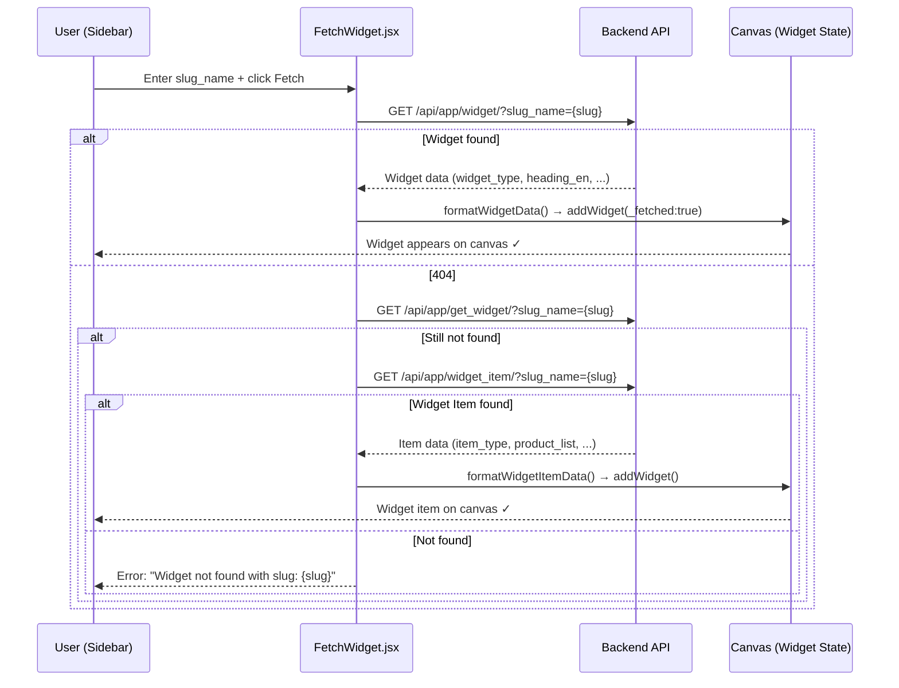
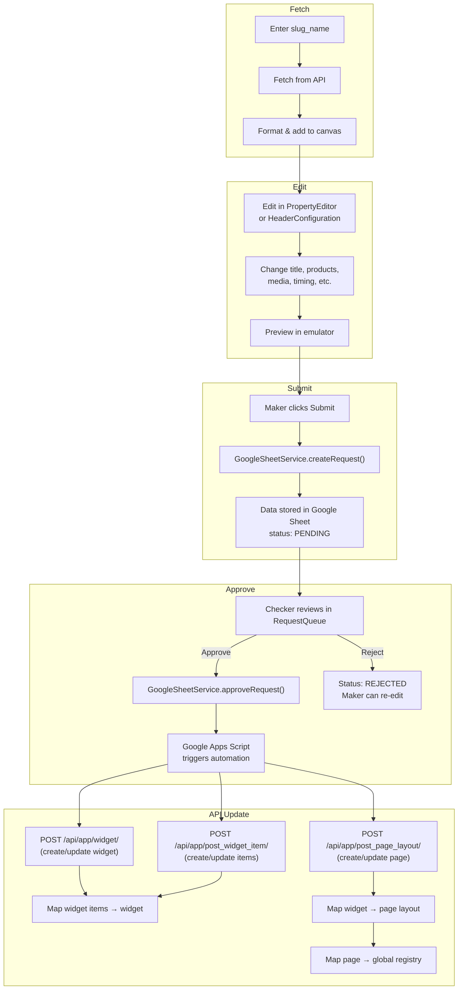

# Fetch Widget — Fetch, Edit & Update All Widget Types

## 1. Overview

The **Fetch Widget** feature allows users to:

1. **Fetch** any existing widget or widget item from the backend by `slug_name`
2. **Edit** all fields of the fetched widget in the builder (PropertyEditor / HeaderConfiguration)
3. **Submit** changes for review (Maker → Google Sheet queue)
4. **Approve** and trigger API calls to update the widget on the backend (Checker → automation)

### FetchWidget — Sidebar Skeleton

```
┌─────────────────────────────────────────────────────────┐
│  FETCH WIDGET                                            │
│                                                          │
│  Slug Name: [rice_mela_spr_opt___________________]  [→] │
│                                                          │
│  ── Phase 1: Try as Widget ───────────────────────────  │
│    GET /api/app/widget/?slug_name=rice_mela_spr_opt      │
│    GET /api/app/get_widget/?slug_name=...  (fallback)    │
│                                                          │
│  ── Phase 2: Try as Widget Item ──────────────────────  │
│    GET /api/app/widget_item/?slug_name=...               │
│    GET /api/app/get_widget_item/?widget_item_slug_name=… │
│                                                          │
│  ── Result ────────────────────────────────────────────  │
│  ✓ Found: Single Product Row Optimize                    │
│  ┌──────────────────────────────────────────────────┐   │
│  │ Title:    Rice Mela Rail                          │   │
│  │ Slug:     rice_mela_spr_opt   [_fetched: true ✓] │   │
│  │ Products: 1001, 1002, 1003                        │   │
│  │ Start:    2026-02-15 19:21:37                     │   │
│  │ End:      2026-07-01 18:29:00                     │   │
│  └──────────────────────────────────────────────────┘   │
│                                                          │
│  [Added to Canvas ↓]                                     │
└──────────────────────────────────────────────────────────┘
```

### Fetch Flow — Sequence Diagram



```
Fetch (slug) → Edit (all fields) → Submit (Maker) → Approve (Checker) → API Update (Backend)
```

**Source:** `src/components/FetchWidget.jsx`
**Location:** Sidebar → top section (above Widget Library)

---

## 2. Supported Widget Types — Complete Reference

### 2.1 Widget Types (`formatWidgetData`)

All `widget_type` values returned by the API are mapped to internal builder types:

| # | API `widget_type` | Internal Builder Type | Emulator Component | Editor |
| :---: | :--- | :--- | :--- | :--- |
| 1 | `carousel` | `Banner With Product Listing` | `CollectionBanner` (scroll) | LegacyPropertyEditor |
| 2 | `category` | `Category Grid` | `CollectionBanner` (stick) / `CategoryGrid` | LegacyPropertyEditor |
| 3 | `single_product_row` | `Single Product Row` | `SingleProductRow` | LegacyPropertyEditor |
| 4 | `single_product_row_v2` | `Single Product Row Optimize` | `SingleProductRowOptimized` | LegacyPropertyEditor |
| 5 | `double_product_row` | `Double Product Row` | `ProductRail` | PropertyEditor (config) |
| 6 | `double_product_row_v2` | `Double Product Row Optimize` | `ProductRail` | PropertyEditor (config) |
| 7 | `multimedia_single_product_row` | `Multimedia Single Product Row` | `ProductRail` | PropertyEditor (config) |
| 8 | `multimedia_single_product_row_v2` | `Multimedia Single Product Row V2` | `ProductRail` | PropertyEditor (config) |
| 9 | `multimedia_double_product_row` | `Multimedia Double Product Row` | `ProductRail` | PropertyEditor (config) |
| 10 | `multimedia_double_product_row_v2` | `Multimedia Double Product Row V2` | `ProductRail` | PropertyEditor (config) |
| 11 | `product_listing` | `Product Listing Page (CLP)` | `BannerWithProductListing` | LegacyPropertyEditor |
| 12 | `masthead_primary` | `Primary Masthead` | `PrimaryMasthead` | HeaderConfiguration |
| 13 | `masthead_secondary_category_hp` | `Secondary Masthead Carousel` | `PrimaryMasthead` | HeaderConfiguration |

### 2.2 Widget Item Types (`formatWidgetItemData`)

| # | API `item_type` | Internal Builder Type | Used By |
| :---: | :--- | :--- | :--- |
| 1 | `carousel` | `Banner With Product Listing` | Carousel Widget, Secondary Masthead |
| 2 | `sub_category` | `Product Listing Page (CLP)` | Category Grid, Carousel, SPR Optimized |
| 3 | `item_rows` | `Single Product Row Optimize` | All Product Rail variants |
| 4 | `category` | `Category Grid` | Category Grid items |

---

## 3. Fetch Flow

```
User enters slug_name → clicks Fetch (or Enter key)
    ↓
Phase 1: Try as WIDGET
    ├── GET /api/app/widget/?slug_name={slug}
    │       ↓ 404?
    └── GET /api/app/get_widget/?slug_name={slug}
    ↓ Found? → formatWidgetData() → addWidget() → Done
    ↓ Not found?
Phase 2: Try as WIDGET ITEM
    ├── GET /api/app/widget_item/?slug_name={slug}
    │       ↓ 404?
    └── GET /api/app/get_widget_item/?widget_item_slug_name={slug}
    ↓ Found? → formatWidgetItemData() → addWidget() → Done
    ↓ Not found?
Show error: "Widget not found with slug: {slug}"
```

---

## 4. Editable Fields — Per Widget Type

After fetching, the widget is added to the canvas and can be edited via the PropertyEditor (config-driven) or LegacyPropertyEditor (legacy).

### 4.1 Product Rail (All 8 Variants)

**Editor:** `PropertyEditor.jsx` (config-driven via `ProductRailConfig.js`)

| Field | Input Type | Required | Validation | API Field |
| :--- | :--- | :---: | :--- | :--- |
| Slug Name | SlugBuilder | Yes | lowercase alphanumeric + `_`, 3-100 chars | `slug_name` |
| Title (English) | TextInput | Yes | 2-200 chars | `heading_en` |
| Title (Hindi) | TextInput | No | Auto-translated | `heading_hi` |
| Products | ProductListInput | Yes | Min 1, max 200 numeric codes | `product_list` (on widget item) |
| Background Image | ImageUpload | No | Max 300KB, .jpeg/.jpg/.png/.webp/.gif/.svg | `background_multimedia` |
| Background Video | UrlInput | No | .mp4/.mov/.webm URL | `background_multimedia` |
| View All Link | TextInput | Conditional | Only for non-optimized variants | `view_all_action_params` |
| Rows | PillSelector | Yes | `1` or `2` | Determines `widget_type` |
| Optimized | CardToggle | Yes | `true` / `false` | Determines `widget_type` |
| Start Time | DateTimeInput | Yes | — | `start_time` |
| End Time | DateTimeInput | Yes | — | `end_time` |

**State-wise Products (Location Mapping):**

| State | Input | Slug Suffix | `level_tag` | `level_property` |
| :--- | :--- | :--- | :--- | :--- |
| Global | Product codes | `_sc_wi_global` | `global` | `global` |
| Jharkhand | Product codes | `_sc_wi_jh` | `state` | `jharkhand` |
| Chhattisgarh | Product codes | `_sc_wi_cg` | `state` | `chhattisgarh` |
| West Bengal | Product codes | `_sc_wi_wb` | `state` | `west bengal` |
| *(dynamic)* | Product codes | `_sc_wi_{key}` | `state` | `{state_name}` |

**Advanced Settings:**

| Field | Type | API Field |
| :--- | :--- | :--- |
| OOS Product Count | Number | `app_configurations.oos_product_count` |
| Show PB Tag | Toggle | `app_configurations.show_pb_tag` |
| PB Reorder | Toggle | `app_configurations.pb_reorder` |
| Filter Dict | JSON | `filter_dict` |
| App Configurations | JSON | `app_configurations` |

---

### 4.2 Carousel Widget (Collection Banner — Scroll Mode)

**Editor:** `LegacyPropertyEditor.jsx`

| Field | Input Type | Required | API Field |
| :--- | :--- | :---: | :--- |
| Slug Name | TextInput | Yes | `slug_name` |
| Title (English) | TextInput | Yes | `heading_en` |
| Title (Hindi) | TextInput | No | `heading_hi` |
| Aspect Ratio | NumberInput | Yes | `media_aspect_ratio` |
| Start Time | DateTimeInput | Yes | `start_time` |
| End Time | DateTimeInput | Yes | `end_time` |

**Per Carousel Item:**

| Field | Input Type | Required | API Field |
| :--- | :--- | :---: | :--- |
| Image | ImageUpload / URL | Yes | `media_en` |
| Text (English) | TextInput | No | `text_en` |
| Text (Hindi) | TextInput | No | `text_hi` |
| Page Type | Dropdown | Yes | `click_action_params.page_type` |
| Page Layout Slug | TextInput | Yes | `click_action_params.page_layout_slug_name` |
| Products (Global) | ProductCodes | Yes | `product_list` (on sub-cat) |
| Products (JH) | ProductCodes | No | `product_list` (state sub-cat) |
| Products (CG) | ProductCodes | No | `product_list` (state sub-cat) |
| Products (WB) | ProductCodes | No | `product_list` (state sub-cat) |
| + Add State | Button | — | Creates new state sub-cat |

---

### 4.3 Category Grid (Collection Banner — Stick Mode)

**Editor:** `LegacyPropertyEditor.jsx` + `HeaderConfiguration.jsx`

| Field | Input Type | Required | API Field |
| :--- | :--- | :---: | :--- |
| Slug Name | TextInput | Yes | `slug_name` |
| Title (English) | TextInput | Yes | `heading` |
| Title (Hindi) | TextInput | No | `heading_hi` |
| Start Time | DateTimeInput | Yes | `start_time` |
| End Time | DateTimeInput | Yes | `end_time` |

**Per Category Item:**

| Field | Input Type | Required | API Field |
| :--- | :--- | :---: | :--- |
| Category Name | TextInput | Yes | `text_en` |
| Category Name (Hindi) | TextInput | No | `text_hi` |
| Image | ImageUpload | Yes | `media_en` |
| Page Type | Dropdown | Yes | `click_action_params.page_type` |

**Per Sub-Category (within each item):**

| Field | Input Type | Required | API Field |
| :--- | :--- | :---: | :--- |
| Sub-Category Name | TextInput | Yes | `text_en` |
| Sub-Category Name (Hindi) | TextInput | No | `text_hi` |
| Image | ImageUpload | No | `media_en` |
| Products (Global) | ProductCodes | Yes | `product_list` |
| Products (JH) | ProductCodes | No | `product_list` (state) |
| Products (CG) | ProductCodes | No | `product_list` (state) |
| Products (WB) | ProductCodes | No | `product_list` (state) |
| + Add State | Button | — | Creates new state sub-cat |

---

### 4.4 Secondary Masthead

**Editor:** `HeaderConfiguration.jsx`

| Field | Input Type | Required | API Field |
| :--- | :--- | :---: | :--- |
| Slug Name | TextInput | Yes | `slug_name` |
| Title (English) | TextInput | Yes | `heading` |
| Title (Hindi) | TextInput | No | `heading_hi` |
| Aspect Ratio | Dropdown (4/3/2/1) | Yes | `media_aspect_ratio` |
| Background Multimedia | FileUpload / DriveURL | No | `background_multimedia` |
| Start Time | DateTimeInput | Yes | `start_time` |
| End Time | DateTimeInput | Yes | `end_time` |

**Per Carousel Item:**

| Field | Input Type | Required | API Field |
| :--- | :--- | :---: | :--- |
| Text (English) | TextInput | Yes | `text_en` |
| Text (Hindi) | TextInput | No | `text_hi` |
| Image | ImageUpload / DriveURL | Yes | `media_en` |
| Redirect Link (Page Slug) | TextInput | Yes | `click_action_params.page_layout_slug_name` |
| Page Type | Dropdown | Yes | `click_action_params.page_type` |

**Per Sub-Category (state-wise products):**

| Field | Input Type | Required | API Field |
| :--- | :--- | :---: | :--- |
| Sub-Cat Name | TextInput | Yes | `text_en` |
| Products (Global) | ProductCodes | Yes | `product_list` |
| Products (JH/CG/WB/dynamic) | ProductCodes | No | `product_list` (state) |

---

### 4.5 Primary Masthead

**Editor:** `HeaderConfiguration.jsx`

| Field | Input Type | Required | API Field |
| :--- | :--- | :---: | :--- |
| Slug Name | TextInput | Yes | `slug_name` |
| Master Key | TextInput | Yes | `master_key` |
| End Time | DateTimeInput | Yes | `end_time` |
| Multimedia Type | Dropdown | No | `background_multimedia` type (1=Lottie, 2=Video, 3=Image) |
| Multimedia File | FileUpload / DriveURL | No | `background_multimedia` value |
| Aspect Ratio | NumberInput | No | Multimedia `aspect_ratio` |
| Transition Color | ColorPicker | No | Multimedia `transition_color` |
| Accent Color | ColorPicker | No | Multimedia `accent_color` |
| Text Color | ColorPicker | No | Multimedia `text_color` |
| Icon BG Color | ColorPicker | No | Multimedia `icon_bg_color` |
| Is Dark | Toggle | No | Multimedia `is_multimedia_dark` |

---

### 4.6 Product Listing Page (CLP)

**Editor:** `LegacyPropertyEditor.jsx`

| Field | Input Type | Required | API Field |
| :--- | :--- | :---: | :--- |
| Slug Name | TextInput | Yes | `slug_name` |
| Title (English) | TextInput | Yes | `text_en` / `heading` |
| Title (Hindi) | TextInput | No | `text_hi` / `heading_hi` |
| Products | ProductCodes / CSV URL | Yes | `product_list` |
| Image | ImageUpload / URL | Yes | `media_en` (carousel item) |
| Aspect Ratio | NumberInput | Yes | `media_aspect_ratio` |
| Start Time | DateTimeInput | Yes | `start_time` |
| End Time | DateTimeInput | Yes | `end_time` |
| Page Type | Dropdown | Yes | `page_type` on Page Layout |

---

## 5. Edit → Submit → Approve → API Update Lifecycle

### 5.1 End-to-End Flow



### 5.2 Page Status Workflow

```
DRAFT → PENDING → APPROVED → (API Updated)
                → REJECTED → DRAFT (re-edit)
```

| Status | Who | Can Edit? | Can Submit? | Can Approve? |
| :--- | :--- | :---: | :---: | :---: |
| `DRAFT` | Maker | Yes | Yes | No |
| `PENDING` | — | No | No | Yes (Checker) |
| `APPROVED` | — | No | No | No |
| `REJECTED` | Maker | Yes | Yes | No |

### 5.3 Submit (Maker)

**Triggered by:** `WidgetContext.submitForReview()`

```javascript
// Payload sent to Google Sheet
{
    action: 'create',
    id: UUID,
    user: 'Satyam Gupta',         // From AuthContext
    type: 'Homepage Update',
    status: 'PENDING',
    widgets: [ /* all canvas widgets */ ],
    headerWidgets: { /* primaryMasthead, secondaryMasthead */ }
}
```

**Service:** `GoogleSheetService.createRequest()`
**Endpoint:** Google Apps Script (`Approval_Automation.gs`)

### 5.4 Approve (Checker)

**Triggered by:** `WidgetContext.approvePage()`

```javascript
// Payload sent to Google Sheet
{
    action: 'approve',
    id: requestId,
    widgets: [ /* all canvas widgets */ ],
    headerWidgets: { /* primaryMasthead, secondaryMasthead */ }
}
```

**Service:** `GoogleSheetService.approveRequest()`

### 5.5 API Calls on Approval

When approved, the Google Apps Script automation triggers the backend API calls:

**For each widget type, these API calls are made:**

#### Product Rail (SPR / DPR — all 8 variants)

| Step | API Endpoint | Payload Key Fields |
| :--- | :--- | :--- |
| 1 | `POST /api/app/post_page_layout/` | `slug_name`, `page_heading`, `page_type` |
| 2 | `POST /api/app/post_widget_item/` | `slug_name`, `item_type: item_rows`, `product_list`, `filter_lst` |
| 3 | `POST /api/app/post_widget_item/` (per state) | `slug_name`, `item_type: sub_category`, `product_list` |
| 4 | `POST /api/app/widget/` | `slug_name`, `widget_type`, `heading_en`, `view_all_action_params` |
| 5 | `POST /api/app/update_widget_widget_item_mapping/` | `widget_slug`, CSV mapping file |
| 6 | `POST /api/app/update_layout_widget_mapping/` | `page_layout_slug`, CSV mapping file |
| 7 | `POST /api/app/update_page_page_layout_mapping/` | `page_layout_slug`, CSV mapping file |

#### Carousel Widget

| Step | API Endpoint | Payload Key Fields |
| :--- | :--- | :--- |
| 1 | `POST /api/app/post_widget_item/` (sub-cat, per state) | `item_type: sub_category`, `product_list` |
| 2 | `POST /api/app/widget/` (PLP) | `widget_type: product_listing` |
| 3 | `POST /api/app/post_page_layout/` | `page_type`, `page_heading` |
| 4 | `POST /api/app/post_widget_item/` (carousel item) | `item_type: carousel`, `media_en`, `click_action_params` |
| 5 | `POST /api/app/widget/` (carousel) | `widget_type: carousel`, `media_aspect_ratio` |
| 6 | Mapping calls (widget_item → widget, widget → layout, layout → global) |

#### Category Grid

| Step | API Endpoint | Payload Key Fields |
| :--- | :--- | :--- |
| 1 | `POST /api/app/post_widget_item/` (sub-cat, per state per item) | `item_type: sub_category`, `product_list` |
| 2 | `POST /api/app/widget/` (PLP per item) | `widget_type: product_listing`, `app_configurations: {show_sub_cat: true}` |
| 3 | `POST /api/app/post_page_layout/` (per item) | `page_type` |
| 4 | `POST /api/app/post_widget_item/` (category item) | `item_type: category`, `media_en`, `click_action_params` |
| 5 | `POST /api/app/widget/` | `widget_type: category` |
| 6 | Mapping calls (all 3 layers) |

#### Secondary Masthead

| Step | API Endpoint | Payload Key Fields |
| :--- | :--- | :--- |
| 1 | `POST /api/app/post_widget_item/` (sub-cat, per state per item) | `item_type: sub_category`, `product_list` |
| 2 | `POST /api/app/widget/` (PLP per item) | `widget_type: product_listing`, `app_configurations: {show_sub_cat: true}` |
| 3 | `POST /api/app/post_page_layout/` (per item) | `page_type` |
| 4 | `POST /api/app/post_widget_item/` (carousel item) | `item_type: carousel`, `click_action_params` |
| 5 | `POST /api/app/widget/` | `widget_type: masthead_secondary_category_hp`, `background_multimedia` |
| 6 | Mapping calls (all 3 layers) |

#### Primary Masthead

| Step | API Endpoint | Payload Key Fields |
| :--- | :--- | :--- |
| 1 | `POST /api/app/widget/` | `widget_type: masthead_primary`, `master_key`, `background_multimedia` |

#### Product Listing Page (CLP)

| Step | API Endpoint | Payload Key Fields |
| :--- | :--- | :--- |
| 1 | `POST /api/app/post_widget_item/` (sub-cat) | `item_type: sub_category`, `product_list` |
| 2 | `POST /api/app/widget/` (PLP) | `widget_type: product_listing` |
| 3 | `POST /api/app/post_page_layout/` | `page_type: product_listing_page` |
| 4 | `POST /api/app/post_widget_item/` (carousel item) | `item_type: carousel`, `media_en` |
| 5 | `POST /api/app/widget/` (carousel) | `widget_type: carousel` |
| 6 | Mapping calls (all 3 layers) |

---

## 6. API Payload Reference — All Fields

### 6.1 POST `/api/app/widget/` (Create/Update Widget)

| Field | Type | Used By | Example |
| :--- | :--- | :--- | :--- |
| `slug_name` | string | All | `rice_mela_spr_opt` |
| `widget_type` | string | All | `single_product_row_v2` |
| `heading_en` | string | All | `Rice Mela` |
| `heading_hi` | string | All | `चावल मेला` |
| `heading` | string | All | *(legacy, same as heading_en)* |
| `heading_bg` | string | All | *(background heading)* |
| `description` | string | All | *(widget description)* |
| `master_key` | string | Primary Masthead | `grocery_master` |
| `background_multimedia` | string | Masthead, Multimedia SPR | Drive URL or slug |
| `media_aspect_ratio` | string | All | `1`, `3.2`, `4` |
| `view_all_action_name` | string | Product Rails | `redirect-to-page` |
| `view_all_action_params` | JSON string | Product Rails | `{"page_type":"...","page_layout_slug_name":"..."}` |
| `filter_dict` | JSON string | All | `{}` |
| `app_configurations` | JSON string | All | `{"show_sub_cat":true}` |
| `start_time` | datetime | All | `2026-02-15T19:21:37Z` |
| `end_time` | datetime | All | `2026-07-01T18:29:00Z` |
| `clear_bg_media` | string | All | *(clear background)* |
| `deactivated_flag` | string | All | `no` |

### 6.2 POST `/api/app/post_widget_item/` (Create/Update Widget Item)

| Field | Type | Used By | Example |
| :--- | :--- | :--- | :--- |
| `slug_name` | string | All | `rice_mela_sc_wi_global` |
| `widget_item_id` | string | All | `undefined` (create) or ID (update) |
| `item_type` | string | All | `item_rows`, `sub_category`, `carousel`, `category` |
| `text_en` | string | All | `Rice Mela` |
| `text_hi` | string | All | `चावल मेला` |
| `text_bg` | string | All | *(background text)* |
| `product_list` | string | sub_category, item_rows | `4586,4591,4592` |
| `media_en` | file/blob | carousel, category | Image file |
| `media_hi` | file | All | Hindi image |
| `media_bg` | string | All | Background media |
| `media` | string | All | General media |
| `item_click_action` | string | All | `redirect-to-page`, `deal-detail-redirect` |
| `click_action_params` | JSON string | carousel, category | `{"page_type":"...","page_layout_slug_name":"..."}` |
| `is_clickable` | string | All | `yes` / `no` |
| `filter_lst` | JSON string | item_rows, sub_category | `[{"condition":"in_stk_item_codes","value":"..."}]` |
| `filters` | string | All | `[]` |
| `property_lst` | string | All | `[]` |
| `pl_edit` | string | All | `PL` |
| `update_product_list` | string | All | `no` |
| `slave_key` | string | All | *(linking key)* |
| `deactivated_flag` | string | All | `no` |
| `start_time` | datetime | All | `2026-02-15T19:21:37Z` |
| `end_time` | datetime | All | `2026-07-01T18:29:00Z` |
| `background_multimedia` | string | All | *(background media slug)* |
| `image_multimedia` | string | All | *(image media slug)* |
| `secondary_image_multimedia` | string | All | *(secondary image)* |
| `progress_bar` | string | All | *(progress bar config)* |
| `offer_id` | string | All | *(linked offer)* |

### 6.3 POST `/api/app/post_page_layout/` (Create/Update Page)

| Field | Type | Example |
| :--- | :--- | :--- |
| `slug_name` | string | `rice_mela_page_p` |
| `page_heading` | string | `Rice Mela` |
| `page_layout_type` | string | `2` |
| `page_type` | string | `product_listing_page` or `category_page` |

### 6.4 Mapping APIs (CSV Upload)

| API | CSV Headers | Example Row |
| :--- | :--- | :--- |
| `/api/app/update_widget_widget_item_mapping/` | `widget_item_slug_name,level_tag,level_property,priority,cohort` | `rice_sc_wi_global,global,global,1,` |
| `/api/app/update_layout_widget_mapping/` | `widget_slug_name,level_tag,level_property,priority,cohort` | `rice_plp_w,global,global,1,` |
| `/api/app/update_page_page_layout_mapping/` | `level_tag,level_property` | `global,global` |

---

## 7. Automation Scripts

Each widget type has a corresponding Google Apps Script that handles the API calls on approval:

| Widget Type | Script File | Entry Function |
| :--- | :--- | :--- |
| Product Rail (all variants) | `scripts/SPR_Optimized_Automation.gs` | `createSPROptimizedWidget()` |
| Carousel (CLP) | `scripts/CLP_Automation.gs` | `createCLPWidget()` |
| Category Grid | `scripts/Category_Grid_Backend.gs` | `createCategoryGridWidget()` |
| Secondary Masthead | `scripts/Secondary_Masthead_Backend.gs` | 3-Phase creation |
| Primary Masthead | `scripts/Primary_Masthead_Automation.gs` | `createPrimaryMasthead()` |
| Approval Router | `scripts/Approval_Automation.gs` | Routes to correct script |

**Frontend Services:**

| Service | File | Role |
| :--- | :--- | :--- |
| `GoogleSheetService` | `src/services/GoogleSheetService.js` | Submit, approve, media upload |
| `BackendSyncService` | `src/services/BackendSyncService.js` | Direct API calls (Category Grid, CLP, Masthead) |
| `WidgetApiService` | `src/services/WidgetApiService.js` | Product Rail API calls |

---

## 8. Error Handling

| Scenario | Behavior |
| :--- | :--- |
| Empty slug input | Shows "Please enter a slug name" |
| Slug not found (both phases) | Shows "Widget not found with slug: {slug}" |
| Network / API error | Shows "Failed to fetch widget: {error.message}" |
| Page in PENDING/APPROVED | Toast: "Cannot edit while in review or approved" |
| Fetch in progress | Input and button are disabled |
| Submit fails | Toast: "Failed to submit to sheet" |
| Approval fails | Toast: "Failed to trigger automation: {error}" |
| Backend API fails | Logged in automation script, returned in response |

---

## 9. Related Files

| File | Role |
| :--- | :--- |
| `src/components/FetchWidget.jsx` | Fetch logic, type mapping, UI |
| `src/components/Sidebar/Sidebar.jsx` | Mounts FetchWidget, passes `onWidgetFetched` |
| `src/components/Sidebar/PropertyEditor.jsx` | Config-driven widget editor |
| `src/components/Sidebar/LegacyPropertyEditor.jsx` | Legacy widget editor |
| `src/components/Sidebar/HeaderConfiguration.jsx` | Masthead + Category Grid editor |
| `src/context/WidgetContext.jsx` | `addWidget()`, `updateWidget()`, `submitForReview()`, `approvePage()` |
| `src/config/widgets/ProductRailConfig.js` | Product Rail field definitions, variants, validation |
| `src/config/WidgetRegistry.js` | All registered widget types |
| `src/components/Widgets/WidgetRenderer.jsx` | Resolves component for emulator rendering |
| `src/services/GoogleSheetService.js` | Submit/approve via Google Sheet |
| `src/services/BackendSyncService.js` | Direct backend API deployment |
| `src/services/WidgetApiService.js` | Widget creation API calls |

---

## 10. Related Documentation

- [Homepage Widget Mapping](./Homepage_mapping.md) — GL-HP-global mapping, location filtering, API endpoints (Prod & UAT)
- [PLP Page Widget Support](./PLP-PAGE-widget-support.md) — 3-layer ecosystem, all widget types, page types
- [Slug Name Reference](./SLUG_NAME.md) — All slug patterns to use as fetch input
- [Product Rail Widget](./Widget-spr.md) — All 8 SPR/DPR variants
- [Collection Banner Widget](./WIDGET-Collection-Banner.md) — Carousel (scroll) + Category Grid (stick)
- [Masthead Widget](./WIDGET-Masthead.md) — Primary + Secondary Masthead
- [Widget Library Reference](./REFERENCE-Widget-Library.md) — All supported widgets and configs

---

## 11. Fetched Widget Re-Deploy (PATCH Flow)

Jab Checker kisi fetched widget ko Deploy karta hai, `BackendSyncService.deployRequest()` detect karta hai ki widget `_fetched: true` marker ke saath hai aur `PATCH` use karta hai instead of `POST`.

### Re-Deploy Flow

```
Fetch Widget (slug) → Edit in canvas → Submit (Maker)
    → Approve (Checker) → Deploy
        → _fetched? YES → PATCH /api/app/widget/<slug>/
                        → 405? → Skip (PATCH not supported, log warning)
        → _fetched? NO  → POST  /api/app/widget/ (new create)
```

### Code Reference

| File | Function | Role |
| :--- | :--- | :--- |
| `src/services/BackendSyncService.js` | `updateWidget(widget, tokens, log)` | PATCH request with title, start_time, end_time |
| `src/config/BackendFlow.js` | `FETCHED_WIDGET_UPDATE_STRATEGY` | Config: marker field, slug field, preferred method |

### PATCH Payload

```javascript
// PATCH /api/app/widget/<slug>/
FormData:
  heading      → widget.title
  start_time   → widget.start_time
  end_time     → widget.end_time
```

### Partial Deploy Results

After each deploy (PATCH or POST), the result is shown in RequestQueue:

| Status | Icon | Meaning |
| :--- | :--- | :--- |
| `ok` | ✅ | New widget created successfully |
| `updated` | ✅ | Fetched widget updated via PATCH |
| `skipped` | ⏳ | Widget type not supported, skipped |
| `failed` | ❌ | Error — message shown in card |

