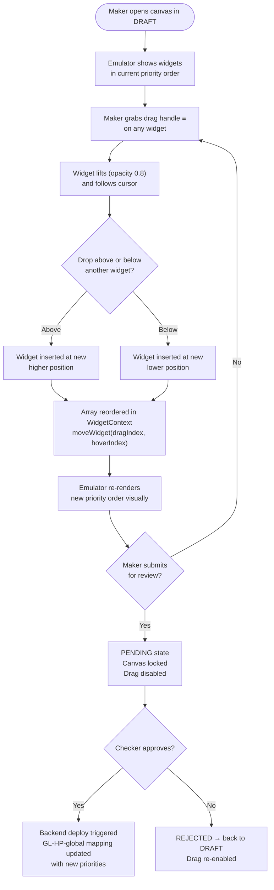

# Feature — Widget Drag & Drop (Emulator Reorder)

## 1. Overview

The **Drag & Drop** feature allows a Maker to reorder widgets in the emulator (phone preview canvas) by dragging them up or down. The new order directly becomes the **priority** at which widgets appear on the homepage (`GL-HP-global`).

> **Important:** Drag & drop is only available in **DRAFT** or **REJECTED** states. Locked (PENDING / APPROVED) canvases do not allow reordering.

> **Pinned Widgets:** **Primary Masthead** and **Secondary Masthead** have a **fixed position** and are **excluded from drag & drop**. Their order is always preserved regardless of other widget movements.

```
Emulator (PhoneFrame)
┌─────────────────────────────────┐
│  📌 Primary Masthead        [×] │ ← PINNED — cannot reorder
│  📌 Secondary Masthead      [×] │ ← PINNED — cannot reorder
│  ≡  Rice Mela SPR           [×] │ ← priority: 1 (draggable)
│  ≡  Carousel (Diwali)       [×] │ ← priority: 2  ←── drag me up ↑
│  ≡  Double Product Row      [×] │ ← priority: 3
└─────────────────────────────────┘
         ≡ = drag handle, 📌 = pinned (fixed)
```

After dragging "Carousel (Diwali)" above "Rice Mela SPR":

```
┌─────────────────────────────────┐
│  📌 Primary Masthead        [×] │ ← PINNED — unchanged
│  📌 Secondary Masthead      [×] │ ← PINNED — unchanged
│  ≡  Carousel (Diwali)       [×] │ ← priority: 1  (moved up)
│  ≡  Rice Mela SPR           [×] │ ← priority: 2
│  ≡  Double Product Row      [×] │ ← priority: 3
└─────────────────────────────────┘
```

When submitted + approved → `GL-HP-global` mapping updated with these exact priorities.

---

## 2. Priority Logic

| Position in Emulator | Priority Value | Widget Type | Behavior |
| :---: | :---: | :--- | :--- |
| Top (pinned) | Fixed | Primary Masthead | Always first — cannot reorder |
| Top (pinned) | Fixed | Secondary Masthead | Always second — cannot reorder |
| First draggable | `1` | Any other type | Rendered first among draggables |
| Second draggable | `2` | Any other type | Rendered second |
| Position N | `N` | Any other type | Rendered Nth |

**Rules:**
- Priority is **1-indexed** among draggable widgets (topmost draggable = priority 1)
- Priority is **sequential** — no gaps
- **Pinned widgets** (Primary Masthead, Secondary Masthead) are excluded from priority reordering — their position is always preserved
- When a widget is dragged, all subsequent draggable widgets' priorities shift automatically
- The backend `GL-HP-global` mapping CSV uses `priority` as the sort column

---

## 3. Feature Flow



---

## 4. Components Involved

### 4.1 `SortableWidget.jsx`

Wraps each widget in the emulator with `@dnd-kit/sortable`. Provides the drag handle and visual feedback.

```jsx
// src/components/Widgets/SortableWidget.jsx
const { attributes, listeners, setNodeRef, transform, transition, isDragging }
    = useSortable({ id: widget.id });

// Visual feedback while dragging
style = {
    transform: CSS.Transform.toString(transform),
    transition,
    zIndex: isDragging ? 50 : 'auto',   // lifted above siblings
    opacity: isDragging ? 0.8 : 1,      // semi-transparent while held
}
```

### 4.2 `WidgetContext.jsx` — `moveWidget()`

Core logic that updates the widgets array when a drag completes:

```jsx
// src/context/WidgetContext.jsx
const moveWidget = (dragIndex, hoverIndex) => {
    // Guard: only allow in DRAFT or REJECTED
    if (pageStatus !== 'DRAFT' && pageStatus !== 'REJECTED') return;

    const newWidgets = [...widgets];
    const [movedWidget] = newWidgets.splice(dragIndex, 1);   // remove from old position
    newWidgets.splice(hoverIndex, 0, movedWidget);            // insert at new position
    setWidgets(newWidgets);                                   // triggers re-render
};
```

### 4.3 `PhoneFrame.jsx`

The container wrapping all `SortableWidget` components. Listens for `onDragEnd` events from `@dnd-kit` and calls `moveWidget()`.

```jsx
// src/components/Preview/PhoneFrame.jsx
const handleDragEnd = (event) => {
    // Resolves old index → new index → calls moveWidget()
};
```

---

## 5. Backend Impact — `GL-HP-global` Mapping Update

When a Checker **approves** the canvas, the deploy script reads the current widget order and sends an updated **CSV mapping** to the backend.

### Priority → Backend Mapping CSV

The array index (0-based in JS) becomes **priority** (1-based in CSV):

```csv
widget_slug_name,level_tag,level_property,priority,cohort
primary_masthead_HP,global,global,1,
carousel_diwali_Cl_w_HP,global,global,2,
rice_mela_rail_spr_opt,global,global,3,
double_row_offers_dpr_opt,global,global,4,
```

### API Call

```
POST /api/app/update_layout_widget_mapping/
Content-Type: text/csv

Body: <CSV with new priority order>
Page Layout: GL-HP-global
```

The backend **replaces** all existing mappings for `GL-HP-global` with the new priority order.

---

## 6. Drag Handle — UI Detail

Each widget in the emulator shows a **`≡` drag handle** on the left edge:

```
┌──────────────────────────────────────┐
│ ≡  [Widget Thumbnail / Preview]  [×] │
└──────────────────────────────────────┘
 ↑
 Drag handle — click & hold to drag
```

- The `≡` handle is always visible in DRAFT/REJECTED on **draggable** widgets
- **Pinned widgets** (`📌`) do not show a drag handle — they show a lock icon instead
- The `[×]` delete button is top-right
- Clicking the widget body (not the handle) selects it → opens Property Editor

---

## 7. State Guard

Drag & drop is **blocked** in non-editable states:

| Page Status | Drag Allowed? | Pinned Widgets |
| :--- | :---: | :--- |
| `DRAFT` | ✅ Yes | 📌 Always fixed |
| `REJECTED` | ✅ Yes | 📌 Always fixed |
| `PENDING` | ❌ No (canvas locked) | 📌 Always fixed |
| `APPROVED` | ❌ No (canvas locked) | 📌 Always fixed |

**Pinned widget types** (never draggable, regardless of state):
```js
// src/config/Feature/DragAndDropConfig.js
export const PINNED_WIDGET_TYPES = [
    'masthead_primary',
    'masthead_secondary_category_hp',
];
```

The guard lives in `moveWidget()`:
```js
if (pageStatus !== 'DRAFT' && pageStatus !== 'REJECTED') return;
```

---

## 8. Priority Persistence

The reordered priority only becomes **permanent** after the full Maker-Checker workflow:

```
Drag & drop in emulator
        ↓ (saved only in browser state)
Submit for Review (PENDING)
        ↓
Checker Approves
        ↓
Backend deploy: GL-HP-global updated
        ↓
Priority live on app ✓
```

> If the Maker navigates away before submitting, the reorder is **lost** (not persisted to server). Persistence requires saving/submitting.

---

## 9. Library

| Library | Purpose |
| :--- | :--- |
| `@dnd-kit/sortable` | Sortable list with keyboard + pointer drag |
| `@dnd-kit/utilities` | CSS transform helpers (`CSS.Transform.toString`) |

---

## 10. Related Documentation

- [Homepage Mapping — `GL-HP-global`](./Homepage_mapping.md) — Mapping CSV format, priority field, API endpoints
- [Feature — Maker-Checker Workflow](./Feature-Maker-Checker.md) — DRAFT → PENDING → APPROVED flow
- [Feature — Mapping Widget](./Feature-Mapping-Widget.md) — How widgets are mapped to pages via CSV
- [Backend Workflow](./Backend-work-flow.md) — End-to-end deploy after approval
