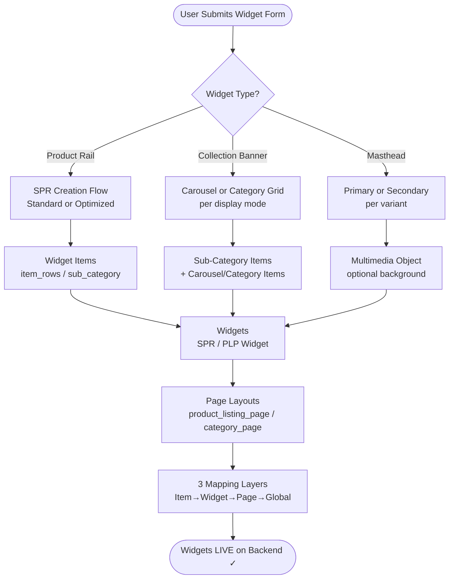
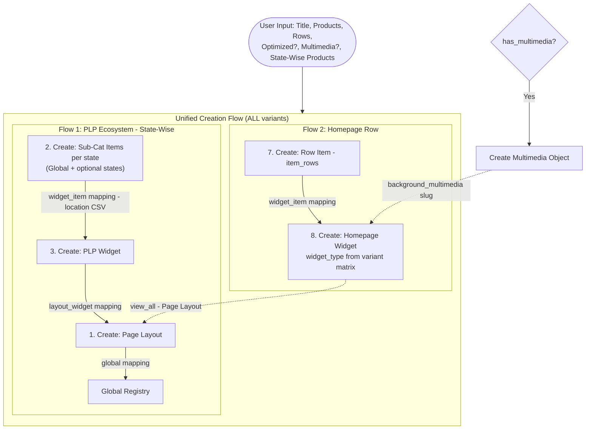

# Widget Creation — Logic & Flow (All Types)

> **Looking for the user-facing selection journey?** See **[STEP-Create-Widget.md](./STEP-Create-Widget.md)** — step-by-step: what users select when creating each widget type.
>
> **Config file:** `src/config/Feature/stepCreateWidgetConfig.js` — UI flow config (PNC definitions, field order, nested item schemas, validation rules).
> **Backend config:** `src/config/Feature/CreationConfig.js` — API endpoints, creation paths, payload templates.

## 1. Overview

Every widget in Optimus follows a **bottom-up creation pattern**: create the smallest objects first (widget items), then containers (widgets), then pages (page layouts), and finally wire them together with mappings.

```
Widget Items (products / banners / categories)
    ↓ created first
Widgets (containers — Product Rail, Carousel, Category Grid, Masthead)
    ↓ created second
Page Layouts (navigation targets — PLP / Category Page)
    ↓ created third
Mappings (wire everything together)
    ↓ created last
```

### Bottom-Up Creation Architecture

```
┌──────────────────────────────────────────────────────────────────┐
│  CREATION ORDER (bottom → up)                                     │
│                                                                    │
│  Layer 4 ── Global Registry ─────────────────────────────────    │
│             ↑ Layer 3 Mapping (page_page_layout)                 │
│  Layer 3 ── Page Layout ─────────────────────────────────────    │
│             {base}_page  /  {base}_Page_p  /  {base}_item_n_page │
│             ↑ Layer 2 Mapping (layout_widget)                    │
│  Layer 2 ── Widget ──────────────────────────────────────────    │
│             SPR / Carousel / Category / PLP / Masthead Widget    │
│             ↑ Layer 1 Mapping (widget_widget_item)               │
│  Layer 1 ── Widget Items ────────────────────────────────────    │
│             item_rows / sub_category / carousel / category       │
│                 ↑ State-wise rows (global, jh, cg, wb, up...)    │
└──────────────────────────────────────────────────────────────────┘
```



### Widget Types at a Glance

| Widget | Backend Type(s) | Sidebar Selection | Complexity |
| :--- | :--- | :--- | :--- |
| **Product Rail** | 8 variants (see Section 3) | Rows × Optimized × Multimedia | Low–Medium |
| **Collection Banner** | `carousel` (Scroll) / `category` (Stick) | Display Mode toggle | Medium–High |
| **Masthead** | `masthead_primary` / `masthead_secondary_category_hp` | Primary / Secondary toggle | Low / High |

> See [Feature-Mapping-Widget.md](./Feature-Mapping-Widget.md) for detailed mapping documentation.

---

## 2. Creation API Endpoints

| Endpoint | Method | Creates | Content-Type |
| :--- | :--- | :--- | :--- |
| `/api/app/post_widget_item/` | POST | Widget Item | `multipart/form-data` |
| `/api/app/widget/` | POST | Widget | `multipart/form-data` |
| `/api/app/post_page_layout/` | POST | Page Layout | `application/json` |
| `/api/app/multimedia/` | POST | Multimedia Object | `multipart/form-data` |

---

## 3. Product Rail — Unified Creation Flow

> **Ref:** [Widget-spr.md](./Widget-spr.md)

The Product Rail is defined by a **composition of 3 properties**. All 8 variants share the **same creation flow** — only the homepage widget's `widget_type` field differs.

### 3.1 Variant Composition Matrix

| Rows | Is Optimized? | Has Multimedia? | Resolved `widget_type` |
| :---: | :---: | :---: | :--- |
| **1** | `false` | `false` | `single_product_row` |
| **1** | `true` | `false` | `single_product_row_v2` |
| **1** | `false` | `true` | `multimedia_single_product_row` |
| **1** | `true` | `true` | `multimedia_single_product_row_v2` |
| **2** | `false` | `false` | `double_product_row` |
| **2** | `true` | `false` | `double_product_row_v2` |
| **2** | `false` | `true` | ~~`multimedia_double_product_row`~~ **NOT AVAILABLE** |
| **2** | `true` | `true` | `multimedia_double_product_row_v2` |

### 3.2 Unified Creation Path

**All** Product Rail variants follow the **same creation flow** — a PLP ecosystem with state-wise sub-categories AND a homepage row widget. The `is_optimized` flag only controls:
1. The `widget_type` name (`_v2` suffix when ON)
2. The homepage widget slug suffix (`_spr_opt` when ON, `_spr` when OFF)
3. The "View All Page Slug" field visibility (hidden when ON, auto-linked to PLP page)

| Flag | When | PLP Ecosystem? | State-wise Sub-Categories? | Widget Type Suffix |
| :--- | :--- | :---: | :---: | :--- |
| **Standard** | `is_optimized = false` | Yes | Yes | No `_v2` |
| **Optimized** | `is_optimized = true` | Yes | Yes | `_v2` |

**Multimedia** (`has_multimedia = true`) adds **one extra step** (create multimedia object) to the flow. The rest of the creation stays identical.

### 3.3 Creation Steps (ALL Variants — Standard & Optimized)

All Product Rail variants follow this unified creation path:

```
Flow 1 — PLP Ecosystem (state-wise — ALL variants):
    1. Page Layout
    2. Sub-Category Items (per state — Global, JH, CG, WB, + dynamic)
    3. PLP Widget (product_listing)
    4. Map: Sub-Cats → PLP (location-wise CSV)
    5. Map: PLP → Page Layout
    6. Map: Page → Global

Flow 2 — Homepage Row:
    7. Row Widget Item (item_rows) — single product list
    8. Homepage Widget (widget_type from matrix — _v2 suffix if optimized)
    9. Map: Row Item → Homepage Widget

    Homepage Widget → view_all → Page Layout (from Flow 1)
```

> The old "Standard Path" (simple Page → Widget Item → Widget without PLP ecosystem) is **no longer used**. All variants create state-wise sub-categories.

### 3.5 Multimedia Addition (Either Path)

For `multimedia_*` variants, create the multimedia object **before** the homepage widget:

```
Extra Step — Multimedia Object:
    POST /api/app/multimedia/
    Then set widget's background_multimedia = multimedia slug
```

### 3.6 Data Flow Diagram



### 3.7 Skeleton — Product Rail Sidebar Form

```
┌─────────────────────────────────────────────────────┐
│  PRODUCT RAIL                                        │
│                                                       │
│  Title (EN):  [________________________]             │
│  Title (HI):  [________________________]             │
│                                                       │
│  Rows:   ○ Single (1)    ○ Double (2)                │
│                                                       │
│  ☐ Optimized (V2)                                    │
│  ☐ Multimedia Background                             │
│                                                       │
│  ─── Products ───────────────────────────────────    │
│  Product Codes: [1001, 1002, 1003, 1004______]       │
│                                                       │
│  ─── Timing (DateTimeInput — calendar + time) ──    │
│  Start: [📅 2026-02-15  19:21]                       │
│  End:   [📅 2026-07-01  18:29]                       │
│                                                       │
│  ═══════════════════════════════════════════════════  │
│  ─── State-Wise Products (ALL variants) ─────────    │
│                                                       │
│  Global Products:  [1001, 1002, 1003, 1004___]       │
│                                                       │
│  ┌─ State: Jharkhand ───────────────────────────┐   │
│  │ Products: [1003, 1004, 1005______________]    │   │
│  │                                          [✕]  │   │
│  └───────────────────────────────────────────────┘   │
│                                                       │
│  ┌─ State: West Bengal ─────────────────────────┐   │
│  │ Products: [1007, 1008____________________]    │   │
│  │                                          [✕]  │   │
│  └───────────────────────────────────────────────┘   │
│                                                       │
│  [ + Add State ]                                      │
│                                                       │
│  ═══════════════════════════════════════════════════  │
│  ▼ IF Multimedia = ON                                │
│  ─── Background Media ───────────────────────────    │
│                                                       │
│  Media Type:  ○ Image   ○ Video   ○ Lottie           │
│  Upload:      [Choose File]  [preview.jpg]           │
│  Accent Color:      [#0277FA]                        │
│  Transition Color:  [#FFFFFF]                        │
│  Text Color:        [#FFFFFF]                        │
│  Icon BG Color:     [#F0F0F0]                        │
│                                                       │
│  ═══════════════════════════════════════════════════  │
│  ─── Advanced Filters (Optional) ────────────────    │
│  OOS Product Count:  [0__]                           │
│  ☐ Show PB Tag                                       │
│  ☐ PB Reorder                                        │
│  Min Order Constraint: [___]                         │
│  Max Order Constraint: [___]                         │
│  Min Android Version:  [___]                         │
│                                                       │
└─────────────────────────────────────────────────────┘
```

### 3.8 Emulator Preview Skeleton

```
┌─ Phone Emulator ────────────────────┐
│                                      │
│  ┌──────────────────────────────┐   │
│  │  ★ Rice Mela Rail    View All│   │  ← heading + view_all link
│  │  ┌─────┐ ┌─────┐ ┌─────┐   │   │
│  │  │ img │ │ img │ │ img │   │   │  ← Single Row (rows=1)
│  │  │     │ │     │ │     │   │   │
│  │  │ ₹99 │ │₹149 │ │₹199 │   │   │
│  │  │Rice │ │Atta │ │Dal  │   │   │
│  │  └─────┘ └─────┘ └─────┘   │   │
│  └──────────────────────────────┘   │
│                                      │
│  ┌──────────────────────────────┐   │
│  │  ★ Best Sellers      View All│   │  ← Double Row (rows=2)
│  │  ┌─────┐ ┌─────┐ ┌─────┐   │   │
│  │  │ img │ │ img │ │ img │   │   │  ← Row 1
│  │  │ ₹99 │ │₹149 │ │₹199 │   │   │
│  │  └─────┘ └─────┘ └─────┘   │   │
│  │  ┌─────┐ ┌─────┐ ┌─────┐   │   │
│  │  │ img │ │ img │ │ img │   │   │  ← Row 2
│  │  │ ₹89 │ │₹129 │ │₹179 │   │   │
│  │  └─────┘ └─────┘ └─────┘   │   │
│  └──────────────────────────────┘   │
│                                      │
│  ┌──────────────────────────────┐   │
│  │ ▓▓▓▓▓▓▓ BACKGROUND ▓▓▓▓▓▓▓ │   │  ← Multimedia variant
│  │  ★ Diwali Offers    View All│   │     (has background media)
│  │  ┌─────┐ ┌─────┐ ┌─────┐   │   │
│  │  │ img │ │ img │ │ img │   │   │
│  │  │ ₹99 │ │₹149 │ │₹199 │   │   │
│  │  └─────┘ └─────┘ └─────┘   │   │
│  └──────────────────────────────┘   │
│                                      │
└──────────────────────────────────────┘
```

### 3.9 API Payloads

**Page Layout:**
```json
{
  "slug_name": "{base}_page",
  "page_heading": "{title}",
  "page_layout_type": "2",
  "page_type": "product_listing_page"
}
```

**Widget Item (item_rows):**
```
slug_name:           {base}_wi           (Standard) / {base}_pr_wi (Optimized)
item_type:           item_rows
text_en:             {title}
text_hi:             {titleHi}
product_list:        4586,4591,4592
filter_lst:          [{"condition":"in_stk_item_codes","value":[4586,4591,4592]}]
item_click_action:   deal-detail-redirect
is_clickable:        no
deactivated_flag:    no
start_time:          2026-02-15 19:21:37
end_time:            2026-07-01 18:29:00
media_en:            (blank blob)
```

**Sub-Category Item (Optimized — per state):**
```
slug_name:           {base}_sc_wi_{state_suffix}
item_type:           sub_category
text_en:             {title}
product_list:        {state-specific product codes}
filter_lst:          [{"condition":"in_stk_item_codes","value":[codes]}]   // array of integers, NOT string
is_clickable:        yes
item_click_action:   deal-detail-redirect
start_time:          {start}
end_time:            {end}
```

**Homepage Widget:**
```
slug_name:              {base}_spr      (Standard) / {base}_spr_opt (Optimized)
widget_type:            {resolved from matrix — e.g. single_product_row_v2}
heading_en:             {title}
heading_hi:             {titleHi}
view_all_action_name:   redirect-to-page
view_all_action_params: {"page_type":"product_listing_page","page_layout_slug_name":"{base}_page"}
background_multimedia:  {base}_bg       (only if multimedia)
media_aspect_ratio:     1
start_time:             {start}
end_time:               {end}
filter_dict:            {}
app_configurations:     {}
```

**Multimedia Object (if multimedia):**
```
name:                {base}_bg
multimedia_type:     3                    // 3=image, 4=video, 1=lottie
aspect_ratio:        1
file_en:             (image/video blob)
transition_color:    #FFFFFF
accent_color:        #0277FA
text_color:          #FFFFFF
icon_bg_color:       #F0F0F0
is_multimedia_dark:  false
```

---

## 4. Collection Banner — Scroll Mode (Carousel)

> **Ref:** [WIDGET-Collection-Banner.md](./WIDGET-Collection-Banner.md)

The Collection Banner is a unified widget with two display modes. **Scroll mode** creates a horizontal carousel of banner images. Each banner navigates to a **product listing page** or **category page** with state-wise products.

**Script:** `scripts/CLP_Automation.gs` → `createCLPWidget()`
**Widget Type:** `carousel`

### 4.1 Creation Steps

```
For each carousel banner item:
    1. Sub-Category Items (per state — Global, JH, CG, WB, + dynamic)
    2. PLP Widget (product_listing)
    3. Page Layout (product_listing_page OR category_page)
    4. Map: Sub-Cats → PLP (location-wise CSV)
    5. Map: PLP → Page Layout
    6. Map: Page → Global
    7. Carousel Item (carousel)

Final Assembly:
    8. Carousel Widget (carousel)
    9. Map: All Carousel Items → Carousel Widget
```

### 4.2 Skeleton — Collection Banner Sidebar (Scroll Mode)

```
┌─────────────────────────────────────────────────────┐
│  COLLECTION BANNER                                    │
│                                                       │
│  Display Mode:                                        │
│  ┌───────────┐ ┌───────────┐                         │
│  │▶ Scroll   │ │  Stick    │                         │
│  └───────────┘ └───────────┘                         │
│                                                       │
│  Title (EN):  [________________________]             │
│  Media-Number: [3.5_] (visible items in carousel)    │
│                                                       │
│  ─── Timing (DateTimeInput — calendar + time) ──    │
│  Start: [📅 2026-02-15  19:21]                       │
│  End:   [📅 2026-07-01  18:29]                       │
│                                                       │
│  ═══════════════════════════════════════════════════  │
│  ─── Carousel Item #1 ──────────────────────────     │
│                                                       │
│  Banner Image:  [Choose File]  [banner_1.jpg]        │
│  Title:         [Summer Sale_________________]       │
│  Page Type:     [product_listing_page ▼]             │
│                                                       │
│  ─── State-Wise Products ────────────────────────    │
│  Global Products:  [1001, 1002, 1003_________]       │
│                                                       │
│  ┌─ State: Jharkhand ───────────────────────────┐   │
│  │ Products: [1003, 1004____________________]    │   │
│  └───────────────────────────────────────────────┘   │
│                                                       │
│  ┌─ State: West Bengal ─────────────────────────┐   │
│  │ Products: [1007, 1008____________________]    │   │
│  └───────────────────────────────────────────────┘   │
│                                                       │
│  [ + Add State ]                                      │
│                                                       │
│  ═══════════════════════════════════════════════════  │
│  ─── Carousel Item #2 ──────────────────────────     │
│                                                       │
│  Banner Image:  [Choose File]  [banner_2.jpg]        │
│  Title:         [Diwali Offers_______________]       │
│  Page Type:     [category_page ▼]                    │
│                                                       │
│  ─── State-Wise Products ────────────────────────    │
│  Global Products:  [2001, 2002, 2003_________]       │
│  [ + Add State ]                                      │
│                                                       │
│  ═══════════════════════════════════════════════════  │
│  [ + Add Carousel Item ]                              │
│                                                       │
└─────────────────────────────────────────────────────┘
```

### 4.3 Emulator Preview Skeleton — Scroll Mode

```
┌─ Phone Emulator ────────────────────┐
│                                      │
│  ┌──────────────────────────────┐   │
│  │ ┌────────┐┌────────┐┌──── │   │  ← media_number: 3.5
│  │ │        ││        ││     │   │     (3 full + peek of 4th)
│  │ │ Banner ││ Banner ││ Ban │   │
│  │ │   1    ││   2    ││  3  │   │
│  │ │        ││        ││     │   │
│  │ └────────┘└────────┘└──── │   │
│  │  ● ○ ○ ○                    │   │  ← dot indicators
│  └──────────────────────────────┘   │
│                                      │
└──────────────────────────────────────┘
```

### 4.4 API Payloads

**Sub-Category Item (per state):**
```
slug_name:           {base}_sub_cat_wi_{state_suffix}
item_type:           sub_category
text_en:             {title}
product_list:        {state-specific product codes}
filter_lst:          [{"condition":"in_stk_item_codes","value":[codes]}]   // array of integers, NOT string
media_en:            [blank.gif]
deactivated_flag:    no
item_click_action:   deal-detail-redirect
is_clickable:        yes
```

**PLP Widget:**
```
slug_name:           {base}_plp_w
widget_type:         product_listing
heading_en:          {title}
start_time:          {start}
end_time:            {end}
```

**Page Layout:**
```json
{
  "slug_name": "{base}_Page_p",
  "page_type": "product_listing_page",
  "page_heading": "{title}",
  "page_layout_type": "2"
}
```

**Carousel Item:**
```
slug_name:           {base}_cl_wi
item_type:           carousel
media_en:            (banner image blob)
item_click_action:   redirect-to-page
click_action_params: {"page_type":"product_listing_page","page_layout_slug_name":"{base}_Page_p"}
is_clickable:        yes
text_en:             (optional banner text)
```

**Carousel Widget:**
```
slug_name:           {base}_Cl_w_HP
widget_type:         carousel
media_number:        3.5
heading_en:          {title}
start_time:          {start}
end_time:            {end}
```

---

## 5. Collection Banner — Stick Mode (Category Grid)

> **Ref:** [WIDGET-Collection-Banner.md](./WIDGET-Collection-Banner.md)

**Stick mode** creates a static 4-column grid of category cards. Each card navigates to its own **product listing page** or **category page** with state-wise sub-categories.

**Script:** `scripts/Category_Grid_Backend.gs`
**Widget Type:** `category`

### 5.1 Creation Steps (Per Category Item)

Each category item creates its **own full PLP ecosystem**:

```
For each category item (e.g., "Milk & Dairy", "Bread & Buns"):
    1. Sub-Category Items (per state — Global, JH, CG, WB, + dynamic)
    2. PLP Widget (product_listing, show_sub_cat: true)
    3. Page Layout (category_page OR product_listing_page)
    4. Map: Sub-Cats → PLP (location-wise CSV)
    5. Map: PLP → Page Layout
    6. Map: Page → Global
    7. Category Widget Item (category)

Final Assembly:
    8. Category Grid Widget (category)
    9. Map: All Category Items → Category Grid Widget
```

### 5.2 Skeleton — Collection Banner Sidebar (Stick Mode)

```
┌─────────────────────────────────────────────────────┐
│  COLLECTION BANNER                                    │
│                                                       │
│  Display Mode:                                        │
│  ┌───────────┐ ┌───────────┐                         │
│  │  Scroll   │ │▶ Stick    │                         │
│  └───────────┘ └───────────┘                         │
│                                                       │
│  Title (EN):  [________________________]             │
│  Title (HI):  [________________________]             │
│                                                       │
│  ─── Timing (DateTimeInput — calendar + time) ──    │
│  Start: [📅 2026-02-15  19:21]                       │
│  End:   [📅 2026-07-01  18:29]                       │
│                                                       │
│  ═══════════════════════════════════════════════════  │
│  ─── Category Item #1 ──────────────────────────     │
│                                                       │
│  Name (EN):   [Milk & Dairy_________________]        │
│  Name (HI):   [दूध और डेयरी_________________]        │
│  Image:       [Choose File]  [milk.jpg]              │
│  Page Type:   [category_page ▼]                      │
│  Page Heading: [Milk & Dairy Products_______]        │
│                                                       │
│  ─── Sub-Category #1: "Fresh Milk" ──────────────   │
│  ┌──────────────────────────────────────────────┐   │
│  │ Global Products:  [1001, 1002, 1003_______]   │   │
│  │                                                │   │
│  │ ┌─ State: Jharkhand ────────────────────┐     │   │
│  │ │ Products: [1003, 1004______________]   │     │   │
│  │ │                                   [✕]  │     │   │
│  │ └────────────────────────────────────────┘     │   │
│  │                                                │   │
│  │ ┌─ State: Chhattisgarh ─────────────────┐     │   │
│  │ │ Products: [1005, 1006______________]   │     │   │
│  │ │                                   [✕]  │     │   │
│  │ └────────────────────────────────────────┘     │   │
│  │                                                │   │
│  │ [ + Add State ]                                │   │
│  └──────────────────────────────────────────────┘   │
│                                                       │
│  ─── Sub-Category #2: "Paneer" ──────────────────   │
│  ┌──────────────────────────────────────────────┐   │
│  │ Global Products:  [2001, 2002_____________]   │   │
│  │ [ + Add State ]                                │   │
│  └──────────────────────────────────────────────┘   │
│                                                       │
│  [ + Add Sub-Category ]                               │
│                                                       │
│  ═══════════════════════════════════════════════════  │
│  ─── Category Item #2 ──────────────────────────     │
│                                                       │
│  Name (EN):   [Bread & Buns_________________]        │
│  Image:       [Choose File]  [bread.jpg]             │
│  Page Type:   [product_listing_page ▼]               │
│                                                       │
│  ─── State-Wise Products ────────────────────────    │
│  Global Products:  [2001, 2002, 2003_________]       │
│  [ + Add State ]                                      │
│                                                       │
│  ═══════════════════════════════════════════════════  │
│  [ + Add Category Item ]                              │
│                                                       │
└─────────────────────────────────────────────────────┘
```

### 5.3 Emulator Preview Skeleton — Stick Mode

```
┌─ Phone Emulator ────────────────────┐
│                                      │
│  ┌──────────────────────────────┐   │
│  │  ★ Rice Mela                  │   │  ← Widget heading
│  │  ┌──────┐ ┌──────┐          │   │
│  │  │ img  │ │ img  │          │   │  ← 4-column grid
│  │  │      │ │      │          │   │
│  │  │ Milk │ │Bread │          │   │
│  │  │& Dair│ │& Buns│          │   │
│  │  └──────┘ └──────┘          │   │
│  │  ┌──────┐ ┌──────┐          │   │
│  │  │ img  │ │ img  │          │   │
│  │  │      │ │      │          │   │
│  │  │Break-│ │ Jams │          │   │
│  │  │ fast │ │Spread│          │   │
│  │  └──────┘ └──────┘          │   │
│  └──────────────────────────────┘   │
│                                      │
└──────────────────────────────────────┘
```

### 5.4 API Payloads

**Sub-Category Item (per state):**
```
slug_name:           {base}_item_{n}_subcat_{m}_{state_suffix}
item_type:           sub_category
text_en:             {subCategoryName}
text_hi:             {subCategoryNameHi}
media_en:            {subCategory image URL}
product_list:        {state-specific product codes}
filter_lst:          [{"condition":"in_stk_item_codes","value":[codes]}]
pl_edit:             PL
deactivated_flag:    no
is_clickable:        yes
```

**PLP Widget (per category item):**
```
slug_name:           {base}_item_{n}_plp
widget_type:         product_listing
start_time:          {start}
end_time:            {end}
app_configurations:  {"show_sub_cat": true}
filter_dict:         {}
deactivated_flag:    no
```

**Page Layout (per category item):**
```json
{
  "slug_name": "{base}_item_{n}_page",
  "page_type": "category_page",
  "page_heading": "{categoryItemName}",
  "page_layout_type": "2"
}
```

**Category Widget Item:**
```
slug_name:           {base}_item_{n}_cat_wi
item_type:           category
text_en:             {categoryName}
text_hi:             {categoryNameHi}
media_en:            (category image blob)
item_click_action:   redirect-to-page
click_action_params: {"page_type":"category_page","page_layout_slug_name":"{base}_item_{n}_page"}
is_clickable:        yes
deactivated_flag:    no
```

**Category Grid Widget:**
```
slug_name:           {base}_cm_hp
widget_type:         category
heading_en:          {title}
heading_hi:          {titleHi}
start_time:          {start}
end_time:            {end}
media_aspect_ratio:  1
filter_dict:         {}
app_configurations:  {}
```

---

## 6. Masthead — Primary

> **Ref:** [WIDGET-Masthead.md](./WIDGET-Masthead.md) — Part A

The **Primary Masthead** is the simplest widget — a header-only component that displays category navigation icons with a configurable multimedia background. No widget items, no page layouts, no mappings.

**Script:** `scripts/Primary_Masthead_Automation.gs`
**Widget Type:** `masthead_primary`

### 6.1 Creation Steps

```
1. Multimedia Object (background — optional)
2. Primary Masthead Widget
    └── background_multimedia → multimedia slug
```

### 6.2 Skeleton — Primary Masthead Sidebar Form

```
┌─────────────────────────────────────────────────────┐
│  MASTHEAD                                             │
│                                                       │
│  Variant:                                             │
│  ┌────────────┐ ┌──────────────┐                     │
│  │▶ Primary   │ │  Secondary   │                     │
│  └────────────┘ └──────────────┘                     │
│                                                       │
│  Slug:        [diwali_2024___________________]       │
│  Master Key:  [1020__________________________]       │
│                                                       │
│  ─── Timing (DateTimeInput — calendar + time) ──    │
│  Start: [📅 2026-02-15  19:21]                       │
│  End:   [📅 2026-07-01  18:29]                       │
│                                                       │
│  ─── Background Media (Shared) ──────────────────    │
│  Media Type:  ○ Image   ○ Video   ○ Lottie           │
│  Upload:      [Choose File]  [diwali_bg.jpg]         │
│  Aspect Ratio:      [1__]                            │
│  Accent Color:      [#0000FF]                        │
│  Transition Color:  [#FFFFFF]                        │
│  Text Color:        [#FFFFFF]                        │
│  Icon BG Color:     [#F0F0F0]                        │
│                                                       │
└─────────────────────────────────────────────────────┘
```

### 6.3 Emulator Preview Skeleton — Primary Masthead

```
┌─ Phone Emulator ────────────────────┐
│                                      │
│  ┌──────────────────────────────┐   │
│  │ ▓▓▓▓▓▓▓ BACKGROUND ▓▓▓▓▓▓▓ │   │  ← multimedia background
│  │                              │   │
│  │  ┌───┐ ┌───┐ ┌───┐ ┌───┐  │   │
│  │  │All│ │Buy│ │Ric│ │Kir│  │   │  ← category icons
│  │  │   │ │Agn│ │ e │ │ana│  │   │
│  │  └───┘ └───┘ └───┘ └───┘  │   │
│  │  ┌───┐ ┌───┐ ┌───┐ ┌───┐  │   │
│  │  │Bod│ │Hom│ │Bab│ │Sna│  │   │
│  │  │Car│ │ e │ │ y │ │cks│  │   │
│  │  └───┘ └───┘ └───┘ └───┘  │   │
│  │                              │   │
│  └──────────────────────────────┘   │
│                                      │
└──────────────────────────────────────┘
```

### 6.4 API Payloads

**Multimedia Object:**
```
name:                {base}_bg
multimedia_type:     3                    // 3=image, 4=video, 1=lottie
aspect_ratio:        1
file_en:             (image/video blob)
transition_color:    #FFFFFF
accent_color:        #0000FF
text_color:          #FFFFFF
icon_bg_color:       #F0F0F0
is_multimedia_dark:  false
```

**Primary Masthead Widget:**
```
slug_name:              {base}_pm_hp
widget_type:            masthead_primary
master_key:             {masterKey}
background_multimedia:  {base}_bg           (omit if empty)
media_aspect_ratio:     1
start_time:             {start}
end_time:               {end}
heading:
heading_en:
filter_dict:            {}
app_configurations:     {}
```

> **Important:** If `background_multimedia` is empty, do NOT include it — causes "Background Multimedia Name is invalid" error.

---

## 7. Masthead — Secondary

> **Ref:** [WIDGET-Masthead.md](./WIDGET-Masthead.md) — Part B

The **Secondary Masthead** is a complex widget with a full-width banner background + carousel items below it. Each carousel item creates its own full PLP ecosystem with state-wise sub-categories.

**Script:** `scripts/Secondary_Masthead_Backend.gs`
**Widget Type:** `masthead_secondary_category_hp`

### 7.1 Creation Steps (3 Phases)

```
Phase 1 — Parent Containers:
    1. Multimedia Object (background)
    2. Secondary Masthead Widget

Phase 2 — Per Carousel Item (repeat for each):
    3. Sub-Category Items (per state — Global, JH, CG, WB, + dynamic)
    4. PLP Widget (product_listing, show_sub_cat: true)
    5. Page Layout (category_page OR product_listing_page — selected per item)
    6. Map: Sub-Cats → PLP (location-wise CSV)
    7. Map: PLP → Page Layout
    8. Map: Page → Global
    9. Carousel Widget Item (carousel)

Phase 3 — Final Mapping:
    10. Map: All Carousel Items → SM Widget
```

### 7.2 Skeleton — Secondary Masthead Sidebar Form

```
┌─────────────────────────────────────────────────────┐
│  MASTHEAD                                             │
│                                                       │
│  Variant:                                             │
│  ┌────────────┐ ┌──────────────┐                     │
│  │  Primary   │ │▶ Secondary   │                     │
│  └────────────┘ └──────────────┘                     │
│                                                       │
│  Slug:        [festive_banner________________]       │
│  Master Key:  [gl_hp_global_category_pane_wi_]       │
│                                                       │
│  ─── Timing (DateTimeInput — calendar + time) ──    │
│  Start: [📅 2026-02-15  19:21]                       │
│  End:   [📅 2026-07-01  18:29]                       │
│                                                       │
│  ─── Background Media (Shared) ──────────────────    │
│  Media Type:  ○ Image   ○ Video   ○ Lottie           │
│  Upload:      [Choose File]  [festive_bg.jpg]        │
│  Aspect Ratio:      [4__]                            │
│  Accent Color:      [#0000FF]                        │
│  Transition Color:  [#FFFFFF]                        │
│  Text Color:        [#FFFFFF]                        │
│  Icon BG Color:     [#F0F0F0]                        │
│                                                       │
│  ═══════════════════════════════════════════════════  │
│  ─── Carousel Item #1 ──────────────────────────     │
│                                                       │
│  Banner Image:  [Choose File]  [item_1.jpg]          │
│  Title:         [Rice Products_______________]       │
│  Page Type:     [category_page ▼]                    │
│  Page Heading:  [Rice Products_______________]       │
│                                                       │
│  ─── Sub-Category #1: "Basmati Rice" ────────────   │
│  ┌──────────────────────────────────────────────┐   │
│  │ Global Products:  [1001, 1002, 1003_______]   │   │
│  │                                                │   │
│  │ ┌─ State: Jharkhand ────────────────────┐     │   │
│  │ │ Products: [1003, 1004______________]   │     │   │
│  │ └────────────────────────────────────────┘     │   │
│  │                                                │   │
│  │ ┌─ State: Chhattisgarh ─────────────────┐     │   │
│  │ │ Products: [1005, 1006______________]   │     │   │
│  │ └────────────────────────────────────────┘     │   │
│  │                                                │   │
│  │ [ + Add State ]                                │   │
│  └──────────────────────────────────────────────┘   │
│                                                       │
│  [ + Add Sub-Category ]                               │
│                                                       │
│  ═══════════════════════════════════════════════════  │
│  ─── Carousel Item #2 ──────────────────────────     │
│                                                       │
│  Banner Image:  [Choose File]  [item_2.jpg]          │
│  Title:         [Snacks & Drinks_____________]       │
│  Page Type:     [product_listing_page ▼]             │
│  ...                                                  │
│                                                       │
│  ═══════════════════════════════════════════════════  │
│  [ + Add Carousel Item ]                              │
│                                                       │
└─────────────────────────────────────────────────────┘
```

### 7.3 Emulator Preview Skeleton — Secondary Masthead

```
┌─ Phone Emulator ────────────────────┐
│                                      │
│  ┌──────────────────────────────┐   │
│  │ ▓▓▓▓▓▓▓▓▓▓▓▓▓▓▓▓▓▓▓▓▓▓▓▓▓ │   │  ← multimedia background
│  │ ▓▓▓▓▓ FESTIVE BANNER ▓▓▓▓▓ │   │     (full-width, h-32)
│  │ ▓▓▓▓▓▓▓▓▓▓▓▓▓▓▓▓▓▓▓▓▓▓▓▓▓ │   │
│  │                              │   │
│  │  ┌────────┐ ┌────────┐     │   │  ← carousel items
│  │  │  img   │ │  img   │     │   │     (3-column grid)
│  │  │        │ │        │     │   │
│  │  │  Rice  │ │ Snacks │     │   │
│  │  └────────┘ └────────┘     │   │
│  │  ┌────────┐                 │   │
│  │  │  img   │                 │   │
│  │  │        │                 │   │
│  │  │ Drinks │                 │   │
│  │  └────────┘                 │   │
│  └──────────────────────────────┘   │
│                                      │
└──────────────────────────────────────┘
```

### 7.4 API Payloads

**Multimedia Object:** (same as Primary — see Section 6.4, with `aspect_ratio: 4`)

**Secondary Masthead Widget:**
```
slug_name:              {base}_sm_hp
widget_type:            masthead_secondary_category_hp
master_key:             {masterKey}
background_multimedia:  {base}_bg           (omit if empty)
media_aspect_ratio:     4
start_time:             {start}
end_time:               {end}
heading:
filter_dict:            {}
app_configurations:     {}
```

**Page Layout (per carousel item):**
```json
{
  "slug_name": "{base}_item_{n}_page",
  "page_type": "category_page",
  "page_heading": "{carouselItemTitle}",
  "page_layout_type": "2"
}
```

**PLP Widget (per carousel item):**
```
slug_name:           {base}_item_{n}_plp
widget_type:         product_listing
start_time:          {start}
end_time:            {end}
app_configurations:  {"show_sub_cat": true}
```

**Sub-Category Item (per state):**
```
slug_name:           {base}_item_{n}_subcat_{m}_{state_suffix}
item_type:           sub_category
text_en:             {subCategoryName}
product_list:        {state-specific product codes}
filter_lst:          [{"condition":"in_stk_item_codes","value":[codes]}]
deactivated_flag:    no
is_clickable:        yes
pl_edit:             PL
```

**Carousel Widget Item (per carousel item):**
```
slug_name:           {base}_item_{n}_carousel
item_type:           carousel
item_click_action:   redirect-to-page
click_action_params: {"page_type":"category_page","page_layout_slug_name":"{base}_item_{n}_page"}
media_en:            (banner image blob)
is_clickable:        yes
deactivated_flag:    no
```

---

## 8. State-Wise Location Mapping (Shared)

All widgets with PLP ecosystem (ALL Product Rail variants, Collection Banner, Secondary Masthead) use the **same location-wise mapping** pattern. States are **dynamic** — new states can be added via the "+ Add State" button.

### State Reference

| State Key | `level_tag` | `level_property` | Slug Suffix |
| :--- | :--- | :--- | :--- |
| Global (required) | `global` | `global` | `_global` |
| Jharkhand | `state` | `jharkhand` | `_jh` |
| Chhattisgarh | `state` | `chhattisgarh` | `_cg` |
| West Bengal | `state` | `west bengal` | `_wb` |
| Uttar Pradesh | `state` | `uttar pradesh` | `_up` |
| *(any new state)* | `state` | `{state_name_lowercase}` | `_{short_key}` |

### Mapping CSV Format

```csv
widget_item_slug_name,level_tag,level_property,priority,cohort
{base}_sc_wi_global,global,global,1,
{base}_sc_wi_jh,state,jharkhand,2,
{base}_sc_wi_cg,state,chhattisgarh,3,
{base}_sc_wi_wb,state,west bengal,4,
```

> Priority is auto-assigned incrementally. Global is always priority `1`.

---

## 9. Slug Name Generation

### Sanitization Rules

```javascript
function sanitizeSlug(text) {
  return text.toLowerCase()
    .replace(/[^a-z0-9]+/g, '_')
    .replace(/^_+|_+$/g, '')
    .substring(0, 50);
}
```

### Collision Handling

If a slug already exists, append `_1`, `_2`, etc. (up to 5 retries).

### Complete Slug Suffix Reference

| Widget Type | Object | Suffix |
| :--- | :--- | :--- |
| **Product Rail (ALL variants)** | Sub-Category (Global) | `_sc_wi_global` |
| | Sub-Category (State) | `_sc_wi_{state}` |
| | PLP Widget | `_plp_w` |
| | Page Layout | `_page_p` |
| | Row Item | `_pr_wi` |
| | Widget (Standard) | `_spr` |
| | Widget (Optimized) | `_spr_opt` |
| **Product Rail (Multimedia)** | Multimedia | `_bg` |
| **Collection Banner (Scroll)** | Sub-Category | `_sub_cat_wi_{state}` |
| | PLP Widget | `_plp_w` |
| | Page Layout | `_Page_p` |
| | Carousel Item | `_cl_wi` |
| | Carousel Widget | `_Cl_w_HP` |
| **Collection Banner (Stick)** | Sub-Category | `_item_{n}_subcat_{m}_{state}` |
| | PLP Widget | `_item_{n}_plp` |
| | Page Layout | `_item_{n}_page` |
| | Category Item | `_item_{n}_cat_wi` |
| | Category Widget | `_cm_hp` |
| **Primary Masthead** | Multimedia | `_bg` |
| | Widget | `_pm_hp` |
| **Secondary Masthead** | Multimedia | `_bg` |
| | Widget | `_sm_hp` |
| | Carousel Item | `_item_{n}_carousel` |
| | Sub-Category | `_item_{n}_subcat_{m}_{state}` |
| | PLP Widget | `_item_{n}_plp` |
| | Page Layout | `_item_{n}_page` |

---

## 10. Automation Scripts Reference

| Widget Type | Script | Entry Function |
| :--- | :--- | :--- |
| Product Rail (all 8 variants) | `scripts/SPR_Optimized_Automation.gs` | `createSPRStandardWidget()` / `createSPROptimizedWidget()` |
| Collection Banner (Scroll) | `scripts/CLP_Automation.gs` | `createCLPWidget()` |
| Collection Banner (Stick) | `scripts/Category_Grid_Backend.gs` | `createCategoryGridFromApproval()` |
| Secondary Masthead | `scripts/Secondary_Masthead_Backend.gs` | 3-Phase creation |
| Primary Masthead | `scripts/Primary_Masthead_Automation.gs` | `createPrimaryMastheadFromApproval()` |
| Approval Router | `scripts/Approval_Automation.gs` | `handleApprove()` |

### Frontend Services

| Service | File | Handles |
| :--- | :--- | :--- |
| `BackendSyncService` | `src/services/BackendSyncService.js` | Collection Banner, Masthead deployment |
| `WidgetApiService` | `src/services/WidgetApiService.js` | Product Rail creation |
| `LocalApiService` | `src/services/LocalApiService.js` | Submit, approve, widgets, users, catalog, activity, comments, media |

---

## 11. Related Documentation

- [Product Rail (SPR + DPR)](./Widget-spr.md) — Product Rail variant matrix, filters, state mapping
- [WIDGET-Collection-Banner.md](./WIDGET-Collection-Banner.md) — Scroll/Stick modes, page type selection
- [WIDGET-Masthead.md](./WIDGET-Masthead.md) — Primary & Secondary, shared multimedia, 3-phase creation
- [Feature-Mapping-Widget.md](./Feature-Mapping-Widget.md) — All mapping types and CSV formats
- [Feature-Maker-Checker.md](./Feature-Maker-Checker.md) — Submit → Approve → Deploy lifecycle
- [FEATURE-Fetch-Widget.md](./FEATURE-Fetch-Widget.md) — Fetch, edit, and update existing widgets
- [PLP-PAGE-widget-support.md](./PLP-PAGE-widget-support.md) — 3-layer PLP ecosystem
- [SLUG_NAME.md](./SLUG_NAME.md) — Slug naming conventions
