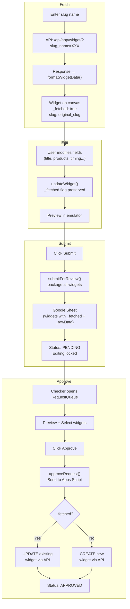
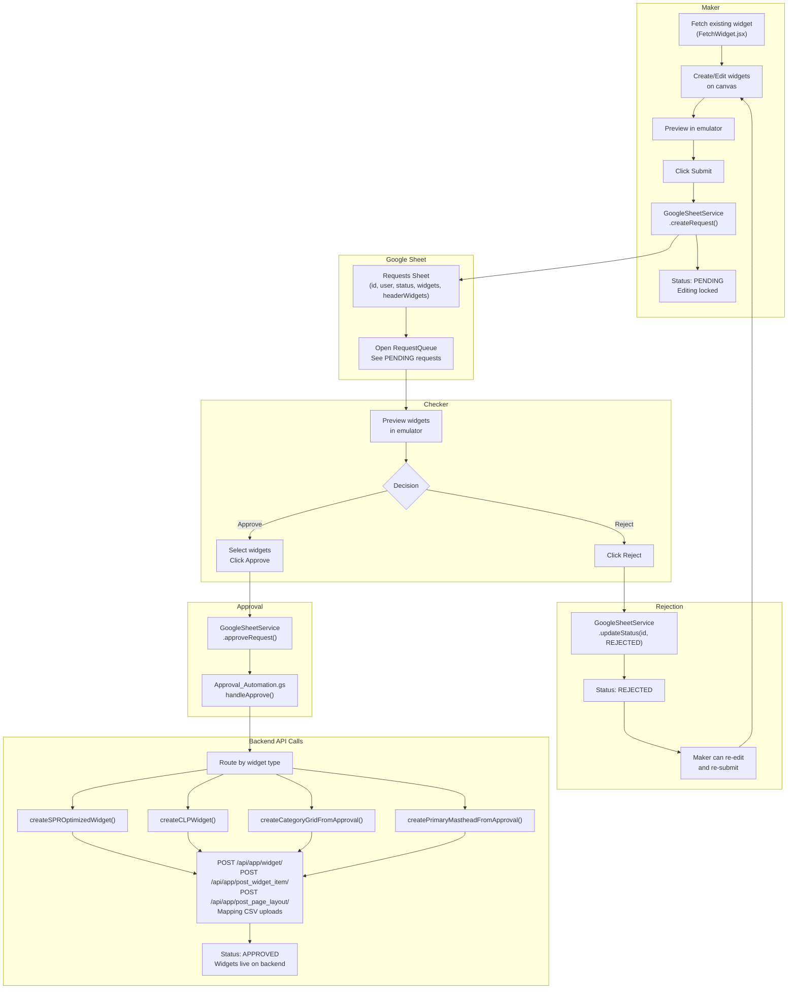

# Maker-Checker — Approval Workflow

## 1. Overview

Optimus uses a **Maker-Checker** approval workflow to ensure all widget changes are reviewed before going live on the backend. The flow is:

```
Maker (creates/edits) → Submit → Checker (reviews) → Approve/Reject → Backend API Update
```

| Role | Can Do | Cannot Do |
| :--- | :--- | :--- |
| **Maker** | Create, edit, delete widgets; Submit for review | Approve or reject |
| **Checker** | Preview, approve, reject, re-open; Deploy | Create or edit widgets |

---

## 2. Role Assignment

**Source:** `src/services/AuthService.js`, `src/context/AuthContext.jsx`, `src/services/GoogleSheetService.js`

### Roles

| Role | Description | Assigned To |
| :--- | :--- | :--- |
| **SUPER_ADMIN** | Full checker powers + can add/remove checkers from UI | `satyam.gupta@apnamart.in` (hardcoded) |
| **CHECKER** | Can preview, approve, reject, re-open, deploy | Users added to the approval list in Google Sheet |
| **MAKER** | Can create, edit, delete widgets; submit for review | All other authenticated users (default) |

### How Roles Are Assigned

Roles are resolved dynamically during login in two steps:

1. **AuthService.js** assigns the base role:
   - `satyam.gupta@apnamart.in` → `SUPER_ADMIN`
   - Everyone else → `MAKER`

2. **AuthContext.jsx** fetches the checker list from Google Sheet and overrides:
   - If user email is in the checker list → role becomes `CHECKER`
   - SUPER_ADMIN is never overridden

```javascript
// AuthService.js — Base role
if (lowerUser === 'satyam.gupta@apnamart.in') {
    role = 'SUPER_ADMIN';
}

// AuthContext.jsx — Dynamic override during login
const approvalUsers = await GoogleSheetService.getApprovalUsers();
if (userData.role !== 'SUPER_ADMIN') {
    const isInCheckerList = approvalUsers.some(
        (u) => u.email.toLowerCase() === email.toLowerCase()
    );
    if (isInCheckerList) {
        userData.role = 'CHECKER';
    }
}
```

### Adding / Removing Checkers (Dynamic — via UI)

The **Super Admin** can manage checkers from the UI without touching code:

1. Login as `satyam.gupta@apnamart.in`
2. Click **"Users"** button in the header
3. In the Manage Approval Users panel:
   - **Add**: Enter email + name → click "Add Checker"
   - **Remove**: Click the trash icon next to any checker
4. Changes are stored in Google Sheet and take effect on next login

**Google Sheet Actions:**

| Action | Method | Payload |
| :--- | :--- | :--- |
| `get_approval_users` | POST | `{action}` → returns `{users: [{email, name, addedAt}]}` |
| `add_approval_user` | POST | `{action, email, name}` |
| `remove_approval_user` | POST | `{action, email}` |

### Manage Users Panel

```
┌─────────────────────────────────────────┐
│  Manage Approval Users                  │
│                                         │
│  Email: [____________] Name: [________] │
│  [+ Add Checker]                        │
│                                         │
│  ── Current Checkers (3) ──────────     │
│                                         │
│  🛡 Satyam Gupta                        │
│    satyam.gupta@apnamart.in             │
│    [Super Admin]          (not removable)│
│                                         │
│  John Doe                               │
│    john.doe@apnamart.in   Added 2/17    │
│                              [🗑 Remove] │
│                                         │
│  Jane Smith                             │
│    jane.smith@apnamart.in Added 2/15    │
│                              [🗑 Remove] │
└─────────────────────────────────────────┘
```

### User Object

```javascript
{
  name: "Satyam Gupta",
  email: "satyam.gupta@apnamart.in",
  role: "SUPER_ADMIN",   // or "CHECKER" or "MAKER"
  csrfToken: "sVCVPj..."
}
```

### Context Helpers

```javascript
// AuthContext provides:
isAuthenticated   // !!user
isSuperAdmin      // user?.role === 'SUPER_ADMIN'
isChecker         // user?.role === 'CHECKER' || user?.role === 'SUPER_ADMIN'
isMaker           // user?.role === 'MAKER'
checkerList       // [{email, name, addedAt}]
addChecker(email, name)
removeChecker(email)
fetchCheckerList()
```

> **Note:** `isChecker` returns `true` for both CHECKER and SUPER_ADMIN, since the super admin has all checker powers. UI code should use `isChecker` instead of `user?.role === 'CHECKER'` for access control.

---

## 3. Page Status Lifecycle

**Source:** `src/context/WidgetContext.jsx`

### State Machine

```
           submitForReview()
  DRAFT ─────────────────────→ PENDING
    ↑                            │
    │ resetToDraft()    ┌────────┴────────┐
    │                   │                 │
    │              approvePage()     rejectPage()
    │                   │                 │
    │                   ↓                 ↓
    │               APPROVED          REJECTED
    │                                     │
    └─────────────────────────────────────┘
                  (re-edit & re-submit)
```

### Status Details

| Status | Badge | Editable? | Set By | Allowed Actions |
| :--- | :--- | :---: | :--- | :--- |
| `DRAFT` | `░░ DRAFT` (gray) | Yes | System (initial) / Checker (re-open) | Maker: edit, add, delete, submit |
| `PENDING` | `▓▓ PENDING` (amber, pulsing) | No | Maker (submit) | Checker: preview, approve, reject |
| `APPROVED` | `██ APPROVED` (green) | No | Checker (approve) | Checker: re-open, deploy |
| `REJECTED` | `▒▒ REJECTED` (red) | Yes | Checker (reject) | Maker: edit, re-submit |

### Status Transition Rules

```
DRAFT      → PENDING     Only Maker can submit (submitForReview)
PENDING    → APPROVED    Only Checker can approve (approvePage)
PENDING    → REJECTED    Only Checker can reject (rejectPage)
APPROVED   → DRAFT       Only Checker can re-open (resetToDraft)
REJECTED   → PENDING     Maker edits and re-submits (submitForReview)
```

### Edit Guards

All editing operations check page status before proceeding:

```javascript
// WidgetContext.jsx
const addWidget = (widget) => {
    if (pageStatus !== 'DRAFT' && pageStatus !== 'REJECTED') {
        showToast.warning("Cannot edit while in review or approved");
        return;
    }
    // ... add widget
};
```

**Guarded operations:** `addWidget`, `updateWidget`, `deleteWidget`, `moveWidget`, `duplicateWidget`, `bulkDelete`

### Submit / Approve Button Visibility

| Page Status | Submit (Maker) | Approve/Reject (Checker) | Re-open (Checker) | Deploy (Checker) |
| :--- | :---: | :---: | :---: | :---: |
| `DRAFT` | Visible | — | — | — |
| `PENDING` | Hidden | Visible | — | — |
| `APPROVED` | Hidden | — | Visible | Visible |
| `REJECTED` | Visible (re-submit) | — | — | — |

---

## 4. Maker Flow — Create & Submit

### Step-by-Step

```
1. Maker creates/edits widgets on the canvas
2. Maker previews changes in the emulator (PhoneFrame)
3. Maker clicks "Submit" button
4. WidgetContext.submitForReview() is called
5. Header widgets are cleaned (File objects removed for serialization)
6. Request payload is built:
    {
        action: "create",
        id: UUID,
        user: "maker_name",
        type: "Homepage Update",
        status: "PENDING",
        widgets: [...all canvas widgets],
        headerWidgets: { primaryMasthead, secondaryMasthead }
    }
7. GoogleSheetService.createRequest() sends to Google Sheet
8. pageStatus changes to PENDING
9. Toast: "Page submitted for review!"
10. All editing is now locked
```

### What Gets Submitted

| Data | Source | Stored In |
| :--- | :--- | :--- |
| Request ID | `crypto.randomUUID()` | Sheet Column A |
| User Name | `AuthContext.user.name` | Sheet Column B |
| Request Type | `"Homepage Update"` | Sheet Column C |
| Status | `"PENDING"` | Sheet Column D |
| Timestamp | `new Date().toISOString()` | Sheet Column E |
| Widgets Array | All canvas widgets (JSON) | Sheet Column F |
| Header Widgets | Primary + Secondary Masthead (cleaned JSON) | Sheet Column G |

---

## 5. Fetch Widget → Edit → Submit → Approve Flow

This section documents the complete lifecycle when a user **fetches an existing widget** from the backend, edits it, and submits it for approval.

### 5.1 Fetch (Retrieve Existing Widget)

**Source:** `src/components/FetchWidget.jsx`

```
1. User enters slug name in FetchWidget input
2. System tries multiple API endpoints:
    a. /api/app/widget/?slug_name={slug}              (primary)
    b. /api/app/get_widget/?slug_name={slug}           (fallback)
    c. /api/app/widget_item/?slug_name={slug}          (if not a widget)
    d. /api/app/get_widget_item/?widget_item_slug_name={slug}  (fallback)
3. API response is transformed into internal widget format
4. Widget is marked with:
    _fetched: true              ← identifies as fetched (not newly created)
    _rawData: {original API response}  ← preserves original data for comparison
    slug: "original_slug_name"  ← preserves backend slug
5. Widget passed to canvas via onWidgetFetched() callback
```

### 5.2 Widget Type Mapping (API → Internal)

| Backend `widget_type` | Internal `type` |
| :--- | :--- |
| `carousel` | Banner With Product Listing |
| `single_product_row` | Single Product Row |
| `single_product_row_v2` | Single Product Row Optimize |
| `product_listing` | Product Listing Page (CLP) |
| `masthead_secondary_category_hp` | Secondary Masthead |
| `category` | Category Grid |

### 5.3 Edit (Modify Fetched Widget)

```
1. Fetched widget appears on canvas with original data pre-filled
2. User modifies any fields (title, products, images, timing, etc.)
3. Each edit goes through WidgetContext.updateWidget():
    - Edit guard checks: pageStatus must be DRAFT or REJECTED
    - Widget updated in state
    - _fetched flag and slug are PRESERVED (not removed)
    - Activity logged: widget_updated with changed field names
4. Undo/redo history tracks all changes
```

### 5.4 Submit (Send Edited Widget for Review)

```
1. Maker clicks "Submit" button
2. WidgetContext.submitForReview() packages ALL canvas widgets
3. The submitted payload includes:
    - Newly created widgets (no _fetched flag)
    - Fetched+edited widgets (with _fetched: true, slug, _rawData)
4. Complete snapshot sent to Google Sheet
5. Status changes to PENDING
```

### 5.5 Approve (Checker Reviews & Approves)

```
1. Checker opens RequestQueue, sees PENDING request
2. Checker previews — fetched widgets are restored to canvas
3. Checker selects widgets to approve (checkboxes)
4. Checker clicks "Approve"
5. GoogleSheetService.approveRequest() sends selected widgets to Google Apps Script
6. Apps Script routes each widget to its automation function:
    - If widget has _fetched: true and slug → EDIT existing widget
    - If widget is newly created → CREATE new widget
7. Backend API calls create/update widgets
8. Status updated to APPROVED
```

### 5.6 Data Flow Diagram



### 5.7 Fetched vs Created Widget — Comparison

| Property | Newly Created Widget | Fetched + Edited Widget |
| :--- | :--- | :--- |
| `_fetched` | `undefined` | `true` |
| `slug` | *(empty or auto-generated)* | Original backend slug |
| `_rawData` | `undefined` | Original API response |
| **On Approve** | Create new backend records | Update existing backend records |
| **Slug on backend** | New slug with suffix | Original slug preserved |

---

## 6. Checker Flow — Review & Approve/Reject

### RequestQueue UI

**Source:** `src/components/Dashboard/RequestQueue.jsx`

```
┌─────────────────────────────────────────────┐
│  Review Queue                    [Filter ▼]  │
│                                              │
│  ┌──────────────────────────────────────┐   │
│  │  John Doe              2 min ago     │   │
│  │  PENDING    3 widgets                │   │
│  │                                      │   │
│  │  [x] Single Product Row - Rice Mela  │   │
│  │  [x] Category Grid - Grocery         │   │
│  │  [x] Primary Masthead                │   │
│  │                                      │   │
│  │  [Preview]  [Approve]  [Reject]      │   │
│  └──────────────────────────────────────┘   │
│                                              │
│  ┌──────────────────────────────────────┐   │
│  │  Jane Smith            1 hour ago    │   │
│  │  APPROVED   5 widgets   [Deploy]     │   │
│  └──────────────────────────────────────┘   │
└─────────────────────────────────────────────┘
```

### Checker Actions

#### Preview

- Restores the maker's widgets to the canvas
- Renders them in the emulator for visual review
- Does **not** change request status
- Toast: "Previewing {user}'s request"

#### Approve

```
1. Checker selects which widgets to approve (checkboxes)
2. Clicks "Approve"
3. GoogleSheetService.approveRequest() is called
4. Payload sent to Google Apps Script:
    {
        action: "approve",
        id: requestId,
        widgets: [selected widgets only],
        headerWidgets: { selected header widgets }
    }
5. Apps Script routes each widget to its automation:
    - "Single Product Row Optimize"  → createSPROptimizedWidget()
    - "Single Product Row"           → createSPRStandardWidget()
    - "Banner With Product Listing"  → createCLPWidget()
    - "Primary Masthead"             → createPrimaryMastheadFromApproval()
    - "Category Grid"                → createCategoryGridFromApproval()
    - "Secondary Masthead"           → (Secondary Masthead Backend)
6. Each automation creates/updates widgets via backend API
7. Sheet status updated to "APPROVED"
8. Response returned with results:
    {
        success: true,
        results: [
            { widget: "Rice Mela", status: "success", slug: "rice_mela_spr_opt" },
            { widget: "Grocery", status: "success", slug: "grocery_cm_hp" }
        ]
    }
9. Toast: "Widgets approved! Automation triggered successfully"
```

#### Reject

```
1. Checker clicks "Reject"
2. GoogleSheetService.updateStatus(id, 'REJECTED') is called
3. Sheet status updated to "REJECTED"
4. Maker can now edit and re-submit
5. Toast: "Page rejected. Maker can edit and resubmit"
```

#### Re-open (Approved → Draft)

```
1. Checker views an APPROVED request
2. Clicks "Re-open"
3. WidgetContext.resetToDraft() is called
4. pageStatus set to "DRAFT"
5. Editing unlocked for both maker and checker
6. Toast: "Page reset to draft mode"
```

#### Deploy (Manual Sync)

```
1. Checker views an APPROVED request
2. Clicks "Deploy"
3. Prompted for CSRF token
4. BackendSyncService.deployRequest() is called
5. Direct API calls to backend (bypassing Google Sheet)
6. Used for manual re-deployment if automation failed
```

---

## 7. Approval Automation — Google Apps Script

**Source:** `scripts/Approval_Automation.gs`

### Routing Logic

```javascript
// handleApprove() routes each widget to its creation function
for (var i = 0; i < widgets.length; i++) {
    var widget = widgets[i];
    switch (widget.type) {
        case 'Single Product Row Optimize':
            createSPROptimizedWidget(widget);
            break;
        case 'Single Product Row':
            createSPRStandardWidget(widget);
            break;
        case 'Banner With Product Listing':
            createCLPWidget(widget);
            break;
        case 'Primary Masthead':
            createPrimaryMastheadFromApproval(widget);
            break;
        case 'Category Grid':
        case 'Category Masthead':
            createCategoryGridFromApproval(widget);
            break;
        default:
            // Skipped — "Type not supported"
    }
}

// Header widgets processed separately
if (headerWidgets.primaryMasthead?.enabled)
    createPrimaryMastheadFromApproval(headerWidgets.primaryMasthead);
if (headerWidgets.secondaryMasthead?.enabled)
    // Process Secondary Masthead
if (headerWidgets.categoryMasthead?.enabled)
    createCategoryGridFromApproval(headerWidgets.categoryMasthead);
```

### Authentication

The Apps Script uses **hardcoded session cookies** for backend API authentication:

```javascript
var COOKIES = "csrftoken=rahrce1omL...;sessionid=0hr6v9r5pq...;theme=samaan";
```

> These cookies may expire and need periodic refresh.

### Response Format

```javascript
{
    success: true,                  // Overall success
    message: "Processed 3 widgets",
    results: [
        {
            widget: "Rice Mela",
            status: "success",      // "success" | "failed" | "skipped"
            slug: "rice_mela_spr_opt"
        },
        {
            widget: "Primary Masthead",
            status: "success",
            slug: "diwali_pm_hp"
        },
        {
            widget: "Unknown Type",
            status: "skipped",
            error: "Type not supported"
        }
    ],
    errors: []                      // Array of failed widget objects
}
```

---

## 8. Google Sheet — Data Storage

**Sheet Name:** `Requests`
**Apps Script ID:** `AKfycbwGI4r4nDqo5iKIYubUGpAUTaDN-Z1Su_fsD8EmQ7bxIP3XB0HmEdfXFG89hk0uMVZfBQ`

### Sheet Columns

| Column | Field | Type | Example |
| :--- | :--- | :--- | :--- |
| A | `id` | UUID | `550e8400-e29b-41d4-a716-446655440000` |
| B | `user` | string | `john.doe@apnamart.in` |
| C | `type` | string | `Homepage Update` |
| D | `status` | string | `PENDING` / `APPROVED` / `REJECTED` |
| E | `date` | ISO datetime | `2026-02-17T10:30:00.000Z` |
| F | `widgets` | JSON string | `[{type:"Single Product Row",...}]` |
| G | `headerWidgets` | JSON string | `{primaryMasthead:{...},secondaryMasthead:{...}}` |

### Sheet API Actions

| Action | Method | Payload | Description |
| :--- | :--- | :--- | :--- |
| `create` | POST | Full request object | Maker submits new request |
| `update_status` | POST | `{id, status}` | Checker approves/rejects |
| `approve` | POST | `{id, widgets, headerWidgets}` | Checker approves + triggers automation |
| `fetch_products` | POST | `{item_codes: [...]}` | Lookup product details |
| `uploadMedia` | POST | `{fileName, mimeType, fileData (base64)}` | Upload media to Google Drive |
| *(GET)* | GET | — | Fetch all requests |

---

## 9. Activity Logging

**Source:** `src/context/ActivityLogContext.jsx`

All actions are logged for audit trail:

| Action | Logged Details | Triggered By |
| :--- | :--- | :--- |
| `widget_added` | `{widgetId, type, title}` | addWidget() |
| `widget_updated` | `{widgetId, changes: [fieldNames]}` | updateWidget() |
| `widget_deleted` | `{widgetId, type}` | deleteWidget() |
| `widget_duplicated` | `{originalId, newId}` | duplicateWidget() |
| `bulk_delete` | `{count, widgetIds}` | bulkDelete() |
| `state_restored` | `{timestamp}` | restoreFromHistory() |
| `comment_added` | `{widgetId, commentId}` | addComment() |
| `comment_deleted` | `{commentId}` | deleteComment() |

**Activity Log Limits:** Keeps last 100 entries.

---

## 10. End-to-End Flow Diagram



---

## 11. UI Components

| Component | File | Role |
| :--- | :--- | :--- |
| **MainLayout** | `src/components/Layout/MainLayout.jsx` | Status badge, Submit/Re-open buttons |
| **RequestQueue** | `src/components/Dashboard/RequestQueue.jsx` | Checker review UI, approve/reject/deploy |
| **FetchWidget** | `src/components/FetchWidget.jsx` | Fetch existing widgets by slug |
| **WidgetContext** | `src/context/WidgetContext.jsx` | State management, submit/approve/reject functions |
| **AuthContext** | `src/context/AuthContext.jsx` | Role assignment (MAKER/CHECKER), switchRole |
| **ActivityLogContext** | `src/context/ActivityLogContext.jsx` | Audit trail |
| **GoogleSheetService** | `src/services/GoogleSheetService.js` | Google Sheet API client |
| **BackendSyncService** | `src/services/BackendSyncService.js` | Direct backend deployment |
| **AuthService** | `src/services/AuthService.js` | Login, role assignment, CSRF |
| **Approval_Automation.gs** | `scripts/Approval_Automation.gs` | Server-side approval routing |

---

## 12. Error Handling

| Scenario | Behavior |
| :--- | :--- |
| Submit fails (network error) | Toast: "Failed to submit to sheet" — stays in DRAFT |
| Approval fails (automation error) | Toast: "Failed to trigger automation: {error}" — stays PENDING |
| Individual widget creation fails | Returned in `results` as `status: "failed"` with error message |
| Session cookies expired | Backend returns 403 — need to refresh cookies in Approval_Automation.gs |
| Unsupported widget type | Skipped with `status: "skipped"` |
| Editing while PENDING/APPROVED | Toast: "Cannot edit while in review or approved" |
| Fetch widget not found | Toast: "Widget not found with slug: {slug}" |
| Empty `background_multimedia` on deploy | "Background Multimedia Name is invalid" — omit field if empty |

---

## 13. Related Documentation

- [Feature-Creation-Widget.md](./Feature-Creation-Widget.md) — Widget creation steps and API payloads
- [Feature-Mapping-Widget.md](./Feature-Mapping-Widget.md) — All mapping types and CSV formats
- [FEATURE-Fetch-Widget.md](./FEATURE-Fetch-Widget.md) — Fetch, edit, and update existing widgets
- [WIDGET-Product-Rail.md](./WIDGET-Product-Rail.md) — Product Rail variants and filters
- [WIDGET-Collection-Banner.md](./WIDGET-Collection-Banner.md) — Carousel (Scroll) and Category Grid (Stick)
- [WIDGET-Masthead.md](./WIDGET-Masthead.md) — Primary & Secondary Masthead
- [Homepage_mapping.md](./Homepage_mapping.md) — GL-HP-global homepage mapping
- [PLP-PAGE-widget-support.md](./PLP-PAGE-widget-support.md) — 3-layer PLP ecosystem
