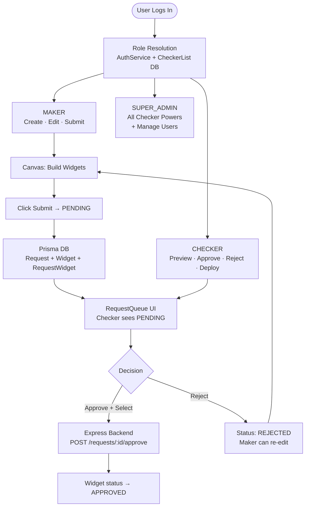
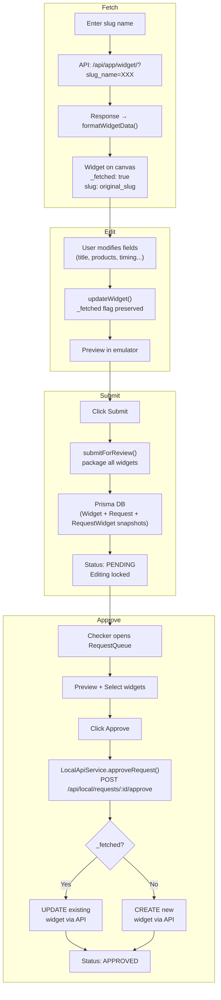
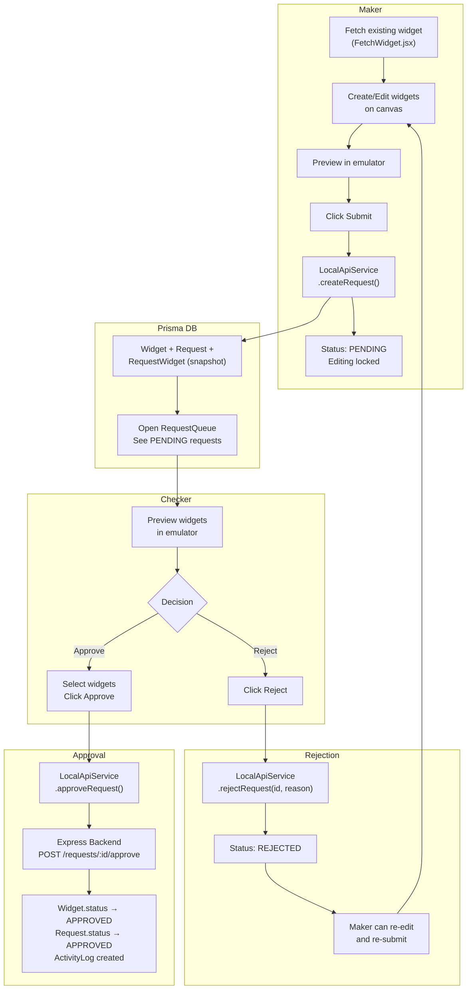

# Maker-Checker — Approval Workflow

## 1. Overview

Optimus uses a **Maker-Checker** approval workflow to ensure all widget changes are reviewed before going live on the backend. The flow is:

```
Maker (creates/edits) → Submit → Checker (reviews) → Approve/Reject → Backend API Update
```

### Approval Workflow — System Diagram



### Maker Sidebar vs Checker Review Queue

```
MAKER UI                                  CHECKER UI
┌──────────────────────────────┐          ┌──────────────────────────────┐
│  OPTIMUS   ░░░ DRAFT [Submit]│          │  OPTIMUS  [RequestQueue]      │
│                              │          │                               │
│  Sidebar │ Canvas  │ Emulator│          │  Review Queue    [Filter ▼]   │
│  ─────── │ ─────── │ ─────── │          │                               │
│  + SPR   │ [SPR-1] │ [Phone] │          │  PENDING: John Doe 2m ago     │
│  + CB    │ [CB-1 ] │ [img  ] │          │  ┌──────────────────────────┐ │
│  + Mast  │         │ [₹99  ] │          │  │ [☑] SPR – Rice Mela      │ │
│          │         │         │          │  │ [☑] Masthead – Diwali    │ │
│  ─────── │         │ ─────── │          │  │ [☐] CB – Summer Sale     │ │
│  [🔍 Fetch Slug ▢ ]          │          │  │                          │ │
│                              │          │  │ [Preview] [Approve] [✕]  │ │
└──────────────────────────────┘          │  └──────────────────────────┘ │
                                          └──────────────────────────────┘
```

| Role | Can Do | Cannot Do |
| :--- | :--- | :--- |
| **Maker** | Create, edit, delete widgets; Submit for review | Approve or reject |
| **Checker** | Preview, approve, reject, re-open; Deploy | Create or edit widgets |

---

> **Auth & Role Assignment** has moved to **[AUTH-Flow.md](./AUTH-Flow.md)** | Config: `src/config/Feature/AuthConfig.js`

---

## 2. Page Status Lifecycle

**Source:** `src/context/WidgetContext.jsx`

### State Machine

```
           submitForReview()
  DRAFT ─────────────────────→ PENDING
    ↑                            │
    │ resetToDraft()    ┌────────┴────────┐
    │                   │                 │
    │              approvePage()     rejectPage()
    │                   │                 │
    │                   ↓                 ↓
    │               APPROVED          REJECTED
    │                                     │
    └─────────────────────────────────────┘
                  (re-edit & re-submit)
```

### Status Details

| Status | Badge | Editable? | Set By | Allowed Actions |
| :--- | :--- | :---: | :--- | :--- |
| `DRAFT` | `░░ DRAFT` (gray) | Yes | System (initial) / Checker (re-open) | Maker: edit, add, delete, submit |
| `PENDING` | `▓▓ PENDING` (amber, pulsing) | No | Maker (submit) | Checker: preview, approve, reject |
| `APPROVED` | `██ APPROVED` (green) | No | Checker (approve) | Checker: re-open, deploy |
| `REJECTED` | `▒▒ REJECTED` (red) | Yes | Checker (reject) | Maker: edit, re-submit |

### Status Transition Rules

```
DRAFT      → PENDING     Only Maker can submit (submitForReview)
PENDING    → APPROVED    Only Checker can approve (approvePage)
PENDING    → REJECTED    Only Checker can reject (rejectPage)
APPROVED   → DRAFT       Only Checker can re-open (resetToDraft)
REJECTED   → PENDING     Maker edits and re-submits (submitForReview)
```

### Edit Guards

All editing operations check page status before proceeding:

```javascript
// WidgetContext.jsx
const addWidget = (widget) => {
    if (pageStatus !== 'DRAFT' && pageStatus !== 'REJECTED') {
        showToast.warning("Cannot edit while in review or approved");
        return;
    }
    // ... add widget
};
```

**Guarded operations:** `addWidget`, `updateWidget`, `deleteWidget`, `moveWidget`, `duplicateWidget`, `bulkDelete`

### Submit / Approve Button Visibility

| Page Status | Submit (Maker) | Approve/Reject (Checker) | Re-open (Checker) | Deploy (Checker) |
| :--- | :---: | :---: | :---: | :---: |
| `DRAFT` | Visible | — | — | — |
| `PENDING` | Hidden | Visible | — | — |
| `APPROVED` | Hidden | — | Visible | Visible |
| `REJECTED` | Visible (re-submit) | — | — | — |

---

## 3. Maker Flow — Create & Submit

### Step-by-Step

```
1. Maker creates/edits widgets on the canvas
2. Maker previews changes in the emulator (PhoneFrame)
3. Maker clicks "Submit" button
4. Widget Selection Modal opens (all widgets pre-selected by default)
5. Maker selects/deselects widgets to include in the submission
6. Maker clicks "Submit N Widgets" in modal
7. WidgetContext.submitForReview(selectedWidgetIds) is called
8. ValidationService.validateAndCheckSlugs() runs pre-submit checks on selected widgets only
9. Slug auto-increment: if any slug already exists on backend,
   system auto-appends _1, _2, ... to find available slug
10. Header widgets are cleaned (File objects removed for serialization)
11. Request payload is built with only the selected widgets + selected header widgets:
    {
        widgets: [...selected body widgets],
        headerWidgets: { ...only selected mastheads }  // e.g. if Primary unchecked → omitted
    }
12. LocalApiService.createRequest() sends to Express backend (POST /api/local/requests)
13. Prisma creates Widget records + Request record + RequestWidget snapshots in one transaction
14. pageStatus changes to PENDING
15. Toast: "N widget(s) submitted for review!"
16. All editing is now locked
```

### Widget Selection Modal

Submit button click karne pe **selection modal** khulta hai. Maker choose karta hai konse widgets review ke liye bhejne hain.

| Feature | Detail |
| :--- | :--- |
| Default state | All widgets pre-selected (body + header) |
| Min selection | At least 1 widget required |
| Header widgets | Primary Masthead + Secondary Masthead shown with purple HEADER badge |
| Header selection | Mastheads are selectable/deselectable — unchecked mastheads are not submitted |
| FETCHED badge | Green "FETCHED" badge on widgets loaded from backend |
| Slug preview | Each widget's current slug shown in the list |
| Select All / Deselect All | Quick toggle buttons at the top (includes header widgets) |
| Section divider | "Body Widgets" divider separates header and body sections |

**State Management:**
- `submitSelection` (Set of widget IDs) — tracks which body + header widgets are selected
- `showSubmitModal` — controls modal visibility
- `openSubmitModal()` — initializes selection with all body widget IDs + header widget IDs and opens modal
- `toggleSubmitSelection(widgetId)` — toggles individual widget (body or header)

**Files:**
- Modal UI: `src/components/Layout/MainLayout.jsx`
- State: `src/context/WidgetContext.jsx`
- Config: `WIDGET_SELECTION_CONFIG.maker` in `src/config/BackendFlow.js`

### Slug Handling

Slug ko as-is pass kiya jaata hai — **no uniqueness check, no auto-increment**. Jo slug SlugBuilder se create hota hai, wahi directly Prisma DB mein store hota hai. Sirf required check hota hai (slug empty nahi hona chahiye).

### What Gets Submitted

| Data | Source | Stored In |
| :--- | :--- | :--- |
| Request ID | `uuid()` (Prisma auto-generated) | `Request.id` |
| Submitter | `req.user.id` (from auth middleware) | `Request.submittedBy` → `User` |
| Request Type | `"Homepage Update"` | `Request.type` |
| Status | `"PENDING"` | `Request.status` |
| Timestamp | `@default(now())` | `Request.createdAt` |
| Widgets | **Selected** canvas widgets (JSON snapshots) | `RequestWidget.snapshot` (per widget) |
| Header Widgets | Primary + Secondary Masthead (cleaned JSON) | `Request.headerWidgets` |

---

## 4. Fetch Widget → Edit → Submit → Approve Flow

This section documents the complete lifecycle when a user **fetches an existing widget** from the backend, edits it, and submits it for approval.

### 4.1 Fetch (Retrieve Existing Widget)

**Source:** `src/components/FetchWidget.jsx`

```
1. User enters slug name in FetchWidget input
2. System tries multiple API endpoints:
    a. /api/app/widget/?slug_name={slug}              (primary)
    b. /api/app/get_widget/?slug_name={slug}           (fallback)
    c. /api/app/widget_item/?slug_name={slug}          (if not a widget)
    d. /api/app/get_widget_item/?widget_item_slug_name={slug}  (fallback)
3. API response is transformed into internal widget format
4. Widget is marked with:
    _fetched: true              ← identifies as fetched (not newly created)
    _rawData: {original API response}  ← preserves original data for comparison
    slug: "original_slug_name"  ← preserves backend slug
5. Widget passed to canvas via onWidgetFetched() callback
```

### 4.2 Widget Type Mapping (API → Internal)

| Backend `widget_type` | Internal `type` |
| :--- | :--- |
| `carousel` | Banner With Product Listing |
| `single_product_row` | Single Product Row |
| `single_product_row_v2` | Single Product Row Optimize |
| `product_listing` | Product Listing Page (CLP) |
| `masthead_secondary_category_hp` | Secondary Masthead |
| `category` | Category Grid |

### 4.3 Edit (Modify Fetched Widget)

```
1. Fetched widget appears on canvas with original data pre-filled
2. User modifies any fields (title, products, images, timing, etc.)
3. Each edit goes through WidgetContext.updateWidget():
    - Edit guard checks: pageStatus must be DRAFT or REJECTED
    - Widget updated in state
    - _fetched flag and slug are PRESERVED (not removed)
    - Activity logged: widget_updated with changed field names
4. Undo/redo history tracks all changes
```

### 4.4 Submit (Send Edited Widget for Review)

```
1. Maker clicks "Submit" button
2. WidgetContext.submitForReview() packages ALL canvas widgets
3. The submitted payload includes:
    - Newly created widgets (no _fetched flag)
    - Fetched+edited widgets (with _fetched: true, slug, _rawData)
4. Complete snapshot sent to Express backend (Prisma DB)
5. Status changes to PENDING
```

### 4.5 Approve (Checker Reviews & Approves)

```
1. Checker opens RequestQueue, sees PENDING request
2. Checker previews — widgets are restored to canvas emulator
3. Checker selects widgets to approve (checkboxes)
4. Checker clicks "Approve"
5. LocalApiService.approveRequest(id, selectedWidgetIds) sends to Express backend
6. Express route handler validates role + status:
    - Updates Request.status → APPROVED
    - Updates Widget.status → APPROVED for selected widgets
    - Logs ActivityLog entry
7. Status updated to APPROVED
```

### 4.6 Data Flow Diagram



### 4.7 Fetched vs Created Widget — Comparison

| Property | Newly Created Widget | Fetched + Edited Widget |
| :--- | :--- | :--- |
| `_fetched` | `undefined` | `true` |
| `slug` | *(empty or auto-generated)* | Original backend slug |
| `_rawData` | `undefined` | Original API response |
| **On Approve** | Create new backend records | Update existing backend records |
| **Slug on backend** | New slug with suffix | Original slug preserved |

---

## 5. Checker Flow — Review & Approve/Reject

### RequestQueue UI

**Source:** `src/components/Dashboard/RequestQueue.jsx`

```
┌─────────────────────────────────────────────┐
│  Review Queue                    [Filter ▼]  │
│                                              │
│  ┌──────────────────────────────────────┐   │
│  │  John Doe              2 min ago     │   │
│  │  PENDING    3 widgets                │   │
│  │                                      │   │
│  │  [x] Single Product Row - Rice Mela  │   │
│  │  [x] Category Grid - Grocery         │   │
│  │  [x] Primary Masthead                │   │
│  │                                      │   │
│  │  [Preview]  [Approve]  [Reject]      │   │
│  └──────────────────────────────────────┘   │
│                                              │
│  ┌──────────────────────────────────────┐   │
│  │  Jane Smith            1 hour ago    │   │
│  │  APPROVED   5 widgets   [Deploy]     │   │
│  └──────────────────────────────────────┘   │
└─────────────────────────────────────────────┘
```

### Checker Actions

#### Preview

- Restores the maker's widgets to the canvas
- Renders them in the emulator for visual review
- Does **not** change request status
- Toast: "Previewing {user}'s request"

#### Approve

```
1. Checker selects which widgets to approve (checkboxes)
2. Clicks "Approve"
3. LocalApiService.approveRequest(id, { selectedWidgetIds, selectedHeaderWidgets }) is called
4. Express backend (POST /api/local/requests/:id/approve):
    - Validates role: CHECKER or SUPER_ADMIN only
    - Checks request status is PENDING
    - Updates Request.status → APPROVED
    - Updates Widget.status → APPROVED for selected widgets
    - Logs ActivityLog entry (action: 'approve')
5. Response: { id, status: "APPROVED", updatedAt }
6. Toast: "Widgets approved successfully"
```

#### Reject

```
1. Checker clicks "Reject" and enters rejection reason
2. LocalApiService.rejectRequest(id, reason) is called
3. Express backend:
    - Updates Request.status → REJECTED + stores rejectionReason
    - Updates Widget.status → REJECTED
    - Logs ActivityLog entry (action: 'reject')
4. Maker can now edit and re-submit
5. Toast: "Page rejected. Maker can edit and resubmit"
```

#### Re-open (Approved → Draft)

```
1. Checker views an APPROVED request
2. Clicks "Re-open"
3. WidgetContext.resetToDraft() is called
4. pageStatus set to "DRAFT"
5. Editing unlocked for both maker and checker
6. Toast: "Page reset to draft mode"
```

#### Approve vs Deploy — Important Distinction

```
APPROVE ≠ DEPLOY. These are two separate steps:

  Approve → Updates Prisma DB status only (PENDING → APPROVED).
             NO backend API calls are made.
  Deploy  → Makes actual POST/PATCH calls to Django backend
             (creates widgets, mappings, etc.)
```

#### Deploy (from APPROVED request)

```
1. Checker opens "All History" tab in Queue
2. Finds an APPROVED request
3. Clicks "Deploy"
4. CSRF token auto-read from session cookie via getCsrfToken() (AuthService.js)
   - If no token found → toast error "Session expired — please re-login"
5. BackendSyncService.deployRequest() is called
6. Direct API calls to Django backend (POST widgets, map items, etc.)
```

#### Approve & Deploy (one-click)

```
1. Checker views a PENDING request
2. Clicks "Approve & Deploy" button
3. Step 1: LocalApiService.approveRequest() → Prisma status → APPROVED
4. Step 2: BackendSyncService.deployRequest() → API calls to Django backend
5. Both steps happen in sequence — if approve succeeds, deploy starts automatically
6. CSRF token auto-read from session cookie (no manual prompt)
```

#### Map to Page (after Deploy)

After a successful deploy, the Checker can map deployed widgets to a CMS page layout (e.g. `GL-HP-global`).

```
1. After deploy succeeds, "Map to Page" button appears (purple gradient) next to Deploy
   - Only visible to Checker (not Maker)
   - Only shown when deployResults has widgets with status 'ok' or 'updated'
2. Clicking opens MapToPageModal with:
   - Page Layout Slug input (default: GL-HP-global)
   - List of deployed widget slugs with checkboxes (pre-checked for successful ones)
   - Per-widget controls: Level (global/state/city/store_id), Value, Priority
3. On submit: builds a single batch CSV and POSTs to Layer 2 mapping API:
   POST /api/app/update_layout_widget_mapping/
   FormData: page_layout_slug + mapping_file (CSV blob)
4. The API REPLACES all mappings for that page_layout_slug — so batch is correct
```

**Files:** `src/components/Dashboard/MapToPageModal.jsx`, `src/components/Dashboard/RequestQueue.jsx`

**Important:** This is a Layer 2 mapping operation. See [Feature-Mapping-Widget.md](./Feature-Mapping-Widget.md) for full mapping architecture.

---

## 6. Approval Automation — Express Backend

**Source:** `server/routes/requests.js`

### Approve Flow

```javascript
// POST /api/local/requests/:id/approve
// 1. Validates role: CHECKER or SUPER_ADMIN only
// 2. Checks request status is PENDING
// 3. Optionally approves only selected widgets (selectedWidgetIds)
// 4. Updates Request.status → APPROVED
// 5. Updates Widget.status → APPROVED for all selected widgets
// 6. Logs ActivityLog entry (action: 'approve')
```

### Reject Flow

```javascript
// POST /api/local/requests/:id/reject
// 1. Validates role: CHECKER or SUPER_ADMIN only
// 2. Checks request status is PENDING
// 3. Updates Request.status → REJECTED + stores rejectionReason
// 4. Updates Widget.status → REJECTED for all widgets in request
// 5. Logs ActivityLog entry (action: 'reject')
```

### Reopen Flow

```javascript
// POST /api/local/requests/:id/reopen
// 1. Checks request status is APPROVED or REJECTED
// 2. Updates Request.status → DRAFT + clears rejectionReason
// 3. Updates Widget.status → DRAFT for all widgets
// 4. Logs ActivityLog entry (action: 'reopen')
```

### Authentication

The Express backend uses **header-based auth** via `server/middleware/auth.js`:

```
Every request:
  1. Read X-Optimus-User header (email)
  2. Read X-Optimus-Env header (UAT or PROD, default: PROD)
  3. Upsert User in Prisma DB
  4. Check CheckerList table for CHECKER role WHERE env = current env
  5. Set req.user = { id, email, name, role }, req.env = env
```

> **Environment Isolation:** CheckerList is scoped per environment. A user can be CHECKER in UAT but MAKER in PROD.
>
> **Widget Environment Isolation:** Widget model has `env` field (UAT | PROD). All widget CRUD routes filter by `req.env`. Same slug is allowed in both environments — unique constraint is `@@unique([slug, env])`.

### Response Format

```javascript
// Approve response
{
    id: "uuid",
    status: "APPROVED",
    updatedAt: "2026-02-21T09:43:27.547Z"
}
    ],
    errors: []                      // Array of failed widget objects
}
```

---

## 7. Data Storage — Prisma DB (SQLite)

**Database:** `server/prisma/optimus.db`
**Schema:** `server/prisma/schema.prisma`

### Database Tables

| Table | Purpose | Key Fields |
| :--- | :--- | :--- |
| **Request** | Approval workflow record | `id`, `status`, `submittedBy`, `headerWidgets`, `rejectionReason` |
| **RequestWidget** | Snapshot of each widget at submission | `requestId`, `widgetId`, `snapshot` (JSON), `sortOrder` |
| **Widget** | Central widget entity | `id`, `type`, `slug`, `env` (UAT/PROD, default PROD), `title`, `status`, `pnc`, `config`, `products`. Unique on `[slug, env]` — same slug allowed in both envs. |
| **User** | User identity + role | `email` (unique), `name`, `role` (MAKER/CHECKER/SUPER_ADMIN) |
| **ActivityLog** | Audit trail | `action`, `userId`, `targetId`, `details` (JSON) |
| **CheckerList** | Users authorized as Checkers (per env) | `userId`, `env` (UAT/PROD), unique on `[userId, env]` |

### API Routes (Express Backend)

| Method | Route | Description |
| :--- | :--- | :--- |
| POST | `/api/local/requests` | Maker submits — creates Widgets + Request + RequestWidget snapshots |
| GET | `/api/local/requests` | Fetch all requests (with status filter) |
| POST | `/api/local/requests/:id/approve` | Checker approves — updates status to APPROVED |
| POST | `/api/local/requests/:id/reject` | Checker rejects — updates status to REJECTED + stores reason |
| POST | `/api/local/requests/:id/reopen` | Re-open — sets status back to DRAFT |

### Slug Validation Logic

Widgets may have their slug in either `slug` or `slug_name` field depending on origin:
- **SlugBuilder** (newly created) → sets `widget.slug`
- **Fetched from backend** → has `widget.slug_name`

Validation checks both fields:
```javascript
// Frontend: ValidationService.js
let fieldValue = widget[rule.field];
if (rule.field === 'slug' && !fieldValue) {
    fieldValue = widget.slug_name;  // fallback for fetched widgets
}

// Backend: server/middleware/validate.js — same logic
// Backend: server/routes/requests.js — slug = w.slug || w.slug_name || auto-generated
```

---

## 8. Activity Logging

**Source:** `src/context/ActivityLogContext.jsx`

All actions are logged for audit trail:

| Action | Logged Details | Triggered By |
| :--- | :--- | :--- |
| `widget_added` | `{widgetId, type, title}` | addWidget() |
| `widget_updated` | `{widgetId, changes: [fieldNames]}` | updateWidget() |
| `widget_deleted` | `{widgetId, type}` | deleteWidget() |
| `widget_duplicated` | `{originalId, newId}` | duplicateWidget() |
| `bulk_delete` | `{count, widgetIds}` | bulkDelete() |
| `state_restored` | `{timestamp}` | restoreFromHistory() |
| `comment_added` | `{widgetId, commentId}` | addComment() |
| `comment_deleted` | `{commentId}` | deleteComment() |

**Activity Log Limits:** Keeps last 100 entries.

---

## 9. End-to-End Flow Diagram



---

## 10. Widget History — Load from History → Edit → Submit → Approve

### Overview

Widget History lets **both Maker and Checker** browse past submissions by date. Widgets are grouped by their submission request — so 4 widgets submitted together appear as one group with the submission time.

**Source:** `src/components/Dashboard/WidgetHistory.jsx`

```
┌───────────────────────────────────────────────────────────────┐
│  📅 Widget History                                       [X] │
│  (gradient indigo-violet header)                              │
├───────────────────────────────────────────────────────────────┤
│  Date: [____2026-02-25____]  [Today] [Yesterday] [This Week] │
├───────────────────────────────────────────────────────────────┤
│  2 submissions · 6 widgets on 25 Feb, 2026                   │
│                                                               │
│  ┌─ 📦 4 Widgets ─── APPROVED ────────────── 2:30 PM ────┐  │
│  │  By: satyam                 Homepage Update         [v] │  │
│  │  ┌─────────────────────────────────────────────────────┐│  │
│  │  │ rice_mela_spr_opt    product_rail                   ││  │
│  │  │ Rice Mela   [Preview] [Load to Canvas]              ││  │
│  │  ├─────────────────────────────────────────────────────┤│  │
│  │  │ thursday_bazaar_spr  product_rail                   ││  │
│  │  │ Thursday Bazaar  [Preview] [Load to Canvas]         ││  │
│  │  ├─────────────────────────────────────────────────────┤│  │
│  │  │ diwali_banner_cb     collection_banner              ││  │
│  │  │ Diwali Banner  [Preview] [Load to Canvas]           ││  │
│  │  ├─────────────────────────────────────────────────────┤│  │
│  │  │ grocery_grid_cat     category_grid                  ││  │
│  │  │ Grocery Grid  [Preview] [Load to Canvas]            ││  │
│  │  └─────────────────────────────────────────────────────┘│  │
│  └─────────────────────────────────────────────────────────┘  │
│                                                               │
│  ┌─ 📦 2 Widgets ─── PENDING ─────────────── 11:15 AM ───┐  │
│  │  By: checker                Homepage Update         [v] │  │
│  │  ...                                                    │  │
│  └─────────────────────────────────────────────────────────┘  │
├───────────────────────────────────────────────────────────────┤
│ 2 submissions · 6 widgets                             [Close] │
└───────────────────────────────────────────────────────────────┘
```

### Data Source

`GET /api/local/requests?date=YYYY-MM-DD` — returns requests with their `requestWidgets` (snapshot + widget reference).

### Load to Canvas Flow (Maker)

```
1. Maker opens Widget History → picks a date
2. Sees all submissions grouped by request (4 widgets together = 1 group)
3. Clicks "Load to Canvas" on any widget
4. dbWidgetToCanvas() converts snapshot → canvas format:
   - Spreads ALL snapshot fields first (...srcFields) — preserves stateProducts, background_media, etc.
   - Then spreads ...config (for DB-format widgets where config is a JSON blob)
   - Strips transient keys (id, lastModified, lastModifiedBy) — regenerated by addWidget
   - Sets _fromDB: true (bypasses addWidget page status guard)
   - Sets _fetched: true (marks as fetched, not newly created)
   - Resolves pnc.variant for mastheads
5. Widget appears on canvas with REAL data (products, images, config) in the PhoneFrame emulator
6. Maker edits the widget (title, products, styling, etc.)
7. Maker clicks Submit → standard Maker-Checker approval flow
```

### Load to Canvas Flow (Checker)

```
1. Checker opens Widget History → picks a date
2. Clicks "Preview" to see visual preview inline
3. Clicks "Load to Canvas" to load widget for review
4. Widget loads to canvas (read-only if page is APPROVED/PENDING)
```

### Key: Snapshot Spread Pattern

The snapshot saved in `RequestWidget.snapshot` is the **original canvas widget** (all fields at top level). For DB widget records, `config` is a JSON blob. `dbWidgetToCanvas()` handles both shapes:

```javascript
// WRONG — only picks explicit fields, loses stateProducts/background_media/etc:
return { type, slug_name, title, ...config, pnc, products };

// CORRECT — spread ALL snapshot fields first, then config for DB fallback:
const { id, lastModified, lastModifiedBy, ...srcFields } = src;
return {
    ...srcFields,       // spread ALL snapshot fields (preserves stateProducts, background_media, etc.)
    ...config,          // then spread DB config (for DB-format widgets where config is a JSON blob)
    type, slug_name, title, titleHi, status,  // explicit overrides
    pnc: resolvedPnc,   // set LAST so config spread can't overwrite
    products, _fetched: true, _fromDB: true, _dbId
};
```

**Why `...srcFields` first?** The snapshot IS the canvas widget — `stateProducts`, `background_media`, `background`, `pageType`, `expand_page`, `homeRowProducts`, `subCategories` etc. are all at top level. Without spreading `...srcFields`, these fields are lost and the emulator shows an empty/invisible widget.

### Files

| File | Role |
|------|------|
| `src/components/Dashboard/WidgetHistory.jsx` | Date-based history panel UI |
| `src/components/Dashboard/SnapshotPreview.jsx` | Visual preview renderer |
| `src/services/LocalApiService.js` | `getRequestsByDate(date)` |
| `server/routes/requests.js` | `GET /requests?date=YYYY-MM-DD` |
| `src/config/Feature/DesignSpecConfig.js` | `WIDGET_HISTORY_CONFIG` |

---

## 11. State/City Management — Backend Persistence

### Overview

States and cities for state-wise product mapping are now **persisted in Prisma DB** (Location model). Previously stored in localStorage — now shared across all users and browsers.

**Source:** `src/components/AdminPanel/StateManagerModal.jsx`

### Prisma Model

```prisma
model Location {
  id, key, env, levelTag, levelProperty, slugSuffix, label, type,
  isDefault, isEnabled, isCustom, createdAt, updatedAt
  @@unique([key, env])
}
```

### API Routes

| Method | Path | Purpose |
|--------|------|---------|
| GET | `/api/local/locations` | List all locations (`?enabledOnly=true`) |
| POST | `/api/local/locations` | Create custom location |
| PATCH | `/api/local/locations/:key/toggle` | Toggle isEnabled (blocks defaults) |
| DELETE | `/api/local/locations/:key` | Delete custom only |

### LocationService (Cache Layer)

**Source:** `src/services/LocationService.js`

| Function | Type | Purpose |
|----------|------|---------|
| `fetchEffectiveStateDefinitions()` | async | Fetch enabled locations from DB, return as `{ [key]: { levelTag, ... } }` |
| `getEffectiveStateDefinitionsSync()` | sync | Return cached value or hardcoded fallback |
| `invalidateLocationCache()` | sync | Clear cache (called on StateManagerModal close) |

### Files

| File | Role |
|------|------|
| `server/prisma/schema.prisma` | Location model |
| `server/prisma/seed.js` | Seeds 44 locations per env (4 defaults + 40 catalog) |
| `server/routes/locations.js` | CRUD API |
| `src/services/LocationService.js` | Async cache + fetcher |
| `src/services/LocalApiService.js` | API client methods |
| `src/components/AdminPanel/StateManagerModal.jsx` | UI — toggle/create/delete locations |
| `src/components/Inputs/StateProductEditor.jsx` | Uses LocationService for state definitions |

---

## 12. UI Components

| Component | File | Role |
| :--- | :--- | :--- |
| **MainLayout** | `src/components/Layout/MainLayout.jsx` | Status badge, Submit/Re-open buttons |
| **RequestQueue** | `src/components/Dashboard/RequestQueue.jsx` | Checker review UI, approve/reject/deploy |
| **FetchWidget** | `src/components/FetchWidget.jsx` | Fetch existing widgets by slug |
| **WidgetContext** | `src/context/WidgetContext.jsx` | State management, submit/approve/reject functions |
| **AuthContext** | `src/context/AuthContext.jsx` | Role assignment (MAKER/CHECKER), switchRole |
| **ActivityLogContext** | `src/context/ActivityLogContext.jsx` | Audit trail |
| **LocalApiService** | `src/services/LocalApiService.js` | Express backend API client (submit, approve, widgets, users, catalog) |
| **BackendSyncService** | `src/services/BackendSyncService.js` | Direct backend deployment |
| **MapToPageModal** | `src/components/Dashboard/MapToPageModal.jsx` | Post-deploy Layer 2 mapping (Checker only) |
| **AuthService** | `src/services/AuthService.js` | Login, role assignment, CSRF |
| **ValidationService** | `src/services/ValidationService.js` | Pre-submit validation + slug uniqueness checks |
| **WidgetHistory** | `src/components/Dashboard/WidgetHistory.jsx` | Date-based history — browse submissions, load to canvas |
| **StateManagerModal** | `src/components/AdminPanel/StateManagerModal.jsx` | Manage states/cities — backend-persisted (Location model) |
| **LocationService** | `src/services/LocationService.js` | Async state definitions cache + fetcher |

---

## 13. Error Handling

| Scenario | Behavior |
| :--- | :--- |
| Submit fails (network error) | Toast: "Failed to submit" — stays in DRAFT |
| Approval fails (backend error) | Toast: "Failed to approve: {error}" — stays PENDING |
| Individual widget creation fails | Backend returns 400 with validation error details |
| Auth session expired | Re-login required — auth middleware rejects request |
| Unsupported widget type | Skipped during approval routing |
| Editing while PENDING/APPROVED | Toast: "Cannot edit while in review or approved" |
| Fetch widget not found | Toast: "Widget not found with slug: {slug}" |
| Empty `background_multimedia` on deploy | "Background Multimedia Name is invalid" — omit field if empty |
| Slug validation fails | Checks both `widget.slug` and `widget.slug_name` before failing |

---

## 14. Related Documentation

- [AUTH-Flow.md](./AUTH-Flow.md) — Login flow, role assignment, CSRF, checker management
- [DATA-Architecture.md](./DATA-Architecture.md) — Database schema, API routes, local backend
- [Feature-Creation-Widget.md](./Feature-Creation-Widget.md) — Widget creation steps and API payloads
- [Feature-Mapping-Widget.md](./Feature-Mapping-Widget.md) — All mapping types and CSV formats
- [FEATURE-Fetch-Widget.md](./FEATURE-Fetch-Widget.md) — Fetch, edit, and update existing widgets
- [Product Rail (SPR + DPR)](./Widget-spr.md) — Product Rail variants and filters
- [WIDGET-Collection-Banner.md](./WIDGET-Collection-Banner.md) — Carousel (Scroll) and Category Grid (Stick)
- [WIDGET-Masthead.md](./WIDGET-Masthead.md) — Primary & Secondary Masthead
- [Homepage_mapping.md](./Homepage_mapping.md) — GL-HP-global homepage mapping
- [PLP-PAGE-widget-support.md](./PLP-PAGE-widget-support.md) — 3-layer PLP ecosystem
