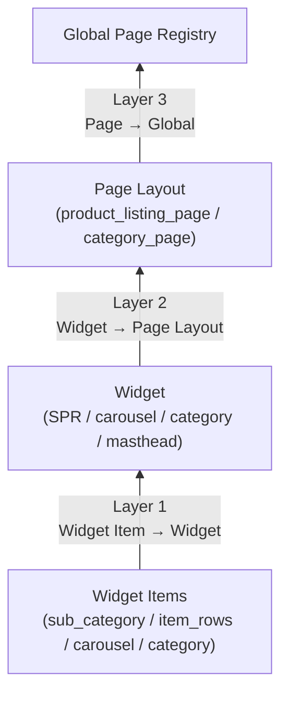
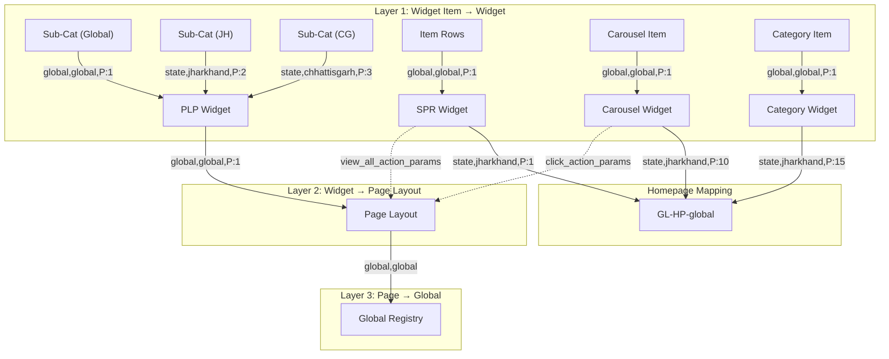

# Widget Mapping — Logic & Flow (All Mapping Types)

## 1. Overview

After widgets and widget items are created, they must be **mapped** (linked) together using CSV-based mapping APIs. There are **3 mapping layers** that form the complete ecosystem:

```
Layer 1: Widget Item → Widget          (items belong to a widget)
Layer 2: Widget → Page Layout           (widget is placed on a page)
Layer 3: Page Layout → Global Registry  (page is discoverable globally)
```

### Architecture Skeleton

```
┌─────────────────────────────────────────────────────────────────┐
│  MAPPING ARCHITECTURE                                            │
│                                                                   │
│  ┌─ Layer 3: Global Registry ─────────────────────────────┐     │
│  │  GL-HP-global / product_listing_page / category_page    │     │
│  └─────────────────────────────────────────────────────────┘     │
│              ↑ update_page_page_layout_mapping CSV               │
│  ┌─ Layer 2: Page Layout ──────────────────────────────────┐     │
│  │  {base}_page   widget → page mapping CSV               │     │
│  └─────────────────────────────────────────────────────────┘     │
│              ↑ update_layout_widget_mapping CSV                  │
│  ┌─ Layer 1: Widget ───────────────────────────────────────┐     │
│  │  SPR Widget / Carousel / Category / PLP Widget          │     │
│  └─────────────────────────────────────────────────────────┘     │
│              ↑ update_widget_widget_item_mapping CSV             │
│  ┌─ Widget Items (State-wise) ─────────────────────────────┐     │
│  │  global  │  jharkhand  │  chhattisgarh  │  west bengal  │     │
│  └─────────────────────────────────────────────────────────┘     │
└─────────────────────────────────────────────────────────────────┘
```



---

## 2. Mapping API Endpoints

| Layer | Endpoint | Method | Content-Type |
| :---: | :--- | :--- | :--- |
| **1** | `/api/app/update_widget_widget_item_mapping/` | POST | `multipart/form-data` |
| **2** | `/api/app/update_layout_widget_mapping/` | POST | `multipart/form-data` |
| **3** | `/api/app/update_page_page_layout_mapping/` | POST | `multipart/form-data` |

All three endpoints accept a **CSV file upload** as the mapping payload.

> **Implementation Note:** All mapping calls use the dedicated `postMapping()` helper in `BackendSyncService.js` — no `csrfmiddlewaretoken` in form body, only `X-CSRFToken` header, `Blob` + 3-arg `FormData.append`. See [Section 9](#9-code-implementation--csv-generation).

---

## 3. Layer 1 — Widget Item → Widget Mapping

Maps widget items (products, banners, categories, sub-categories) to their parent widget.

### API

```
POST /api/app/update_widget_widget_item_mapping/
```

### Request Payload

| Field | Type | Description |
| :--- | :--- | :--- |
| `widget_slug` | string | The parent widget's slug name |
| `mapping_file` | CSV file | CSV with item mappings |

### CSV Format

```csv
widget_item_slug_name,level_tag,level_property,priority,cohort
```

### CSV Fields

| Column | Type | Description | Values |
| :--- | :--- | :--- | :--- |
| `widget_item_slug_name` | string | Widget item slug | `rice_mela_sc_wi_global` |
| `level_tag` | string | Location level | `global`, `state`, `store_id` |
| `level_property` | string | Location value | `global`, `jharkhand`, `166` |
| `priority` | int | Display order (1 = highest) | `1`, `2`, `3` |
| `cohort` | string | Cohort targeting (optional) | *(usually empty)* |

### Examples by Widget Type

#### SPR Standard — Single item, global mapping

```csv
widget_item_slug_name,level_tag,level_property,priority,cohort
rice_mela_wi,global,global,1,
```

#### SPR Optimized — Multiple state-wise sub-categories

```csv
widget_item_slug_name,level_tag,level_property,priority,cohort
rice_mela_sc_wi_global,global,global,1,
rice_mela_sc_wi_jh,state,jharkhand,2,
rice_mela_sc_wi_cg,state,chhattisgarh,3,
rice_mela_sc_wi_wb,state,west bengal,4,
```

#### Carousel — Carousel items mapped globally

```csv
widget_item_slug_name,level_tag,level_property,priority,cohort
summer_sale_cl_wi,global,global,1,
diwali_offer_cl_wi,global,global,2,
new_launches_cl_wi,global,global,3,
```

#### Category Grid — Category items mapped globally

```csv
widget_item_slug_name,level_tag,level_property,priority,cohort
milk_dairy_cat_wi,global,global,1,
bread_buns_cat_wi,global,global,2,
breakfast_cereals_cat_wi,global,global,3,
jams_spreads_cat_wi,global,global,4,
```

#### Secondary Masthead — Carousel items mapped globally

```csv
widget_item_slug_name,level_tag,level_property,priority,cohort
sm_item_1_carousel,global,global,1,
sm_item_2_carousel,global,global,2,
sm_item_3_carousel,global,global,3,
```

#### Sub-Categories → PLP Widget (state-wise, used by Category Grid / SM)

```csv
widget_item_slug_name,level_tag,level_property,priority,cohort
item_1_subcat_1_global,global,global,1,
item_1_subcat_1_jh,state,jharkhand,2,
item_1_subcat_1_cg,state,chhattisgarh,3,
item_1_subcat_1_wb,state,west bengal,4,
item_1_subcat_1_up,state,uttar pradesh,5,
```

---

## 4. Layer 2 — Widget → Page Layout Mapping

Maps a widget to the page layout it belongs to. This determines which widgets appear on a given page.

### API

```
POST /api/app/update_layout_widget_mapping/
```

### Request Payload

| Field | Type | Description |
| :--- | :--- | :--- |
| `page_layout_slug` | string | The page layout's slug name |
| `mapping_file` | CSV file | CSV with widget mappings |

### CSV Format

```csv
widget_slug_name,level_tag,level_property,priority,cohort
```

### CSV Fields

| Column | Type | Description | Values |
| :--- | :--- | :--- | :--- |
| `widget_slug_name` | string | Widget slug | `rice_mela_plp_w` |
| `level_tag` | string | Location level | `global`, `state`, `store_id` |
| `level_property` | string | Location value | `global`, `jharkhand`, `166` |
| `priority` | int | Widget display order on page | `1`, `2`, `3` |
| `cohort` | string | Cohort targeting (optional) | *(usually empty)* |

### Examples

#### PLP Widget → PLP Page Layout (simple)

```csv
widget_slug_name,level_tag,level_property,priority,cohort
rice_mela_plp_w,global,global,1,
```

#### Multiple Widgets → Homepage (GL-HP-global)

```csv
widget_slug_name,level_tag,level_property,priority,cohort
Ramadan_Essentials_spr_opt,state,jharkhand,1,
Best_Sellers_spr_w_OPT_w,state,jharkhand,2,
Fresh_Fruits_spr_opt,state,jharkhand,6,
christmas_widgets_cl_w,state,jharkhand,10,
CAT_BREAK_FAST_W,state,jharkhand,15,
CAT_GROCERY_W,state,jharkhand,16,
CAT_SNACKS_DRINKS_W,state,jharkhand,17,
```

#### Same widget mapped to multiple locations

```csv
widget_slug_name,level_tag,level_property,priority,cohort
rice_mela_spr_opt,state,jharkhand,1,
rice_mela_spr_opt,state,chhattisgarh,1,
rice_mela_spr_opt,state,west bengal,1,
rice_mela_spr_opt,store_id,166,1,
```

---

## 5. Layer 3 — Page Layout → Global Registry Mapping

Registers a page layout in the global page registry so it can be discovered and navigated to.

### API

```
POST /api/app/update_page_page_layout_mapping/
```

### Request Payload

| Field | Type | Description |
| :--- | :--- | :--- |
| `page_layout_slug` | string | The page layout's slug name |
| `page_type` | string | `product_listing_page` or `category_page` |
| `mapping_file` | CSV file | CSV with global mapping |

### CSV Format

```csv
level_tag,level_property
global,global
```

> This is always `global,global` — making the page accessible from anywhere.

### Example

```
page_layout_slug: rice_mela_page
page_type: product_listing_page

CSV:
level_tag,level_property
global,global
```

---

## 6. Location-Wise Mapping — Deep Dive

### How Location Mapping Works

Location mapping allows **different widget items to serve different content based on the user's location**. When the app requests a widget, the backend resolves the best match using this priority:

```
store_id (most specific) > city > state > global (fallback)
```

### State Reference

| State | `level_tag` | `level_property` | Slug Suffix |
| :--- | :--- | :--- | :--- |
| Global (Default) | `global` | `global` | `_global` |
| Jharkhand | `state` | `jharkhand` | `_jh` |
| Chhattisgarh | `state` | `chhattisgarh` | `_cg` |
| West Bengal | `state` | `west bengal` | `_wb` |
| Uttar Pradesh | `state` | `uttar pradesh` | `_up` |
| Store 166 (Bengaluru) | `store_id` | `166` | `_store_166` |
| *(dynamic)* | `state` | `{state_name}` | `_{short_key}` |

### Resolution Example

```
User in Jharkhand opens homepage:

Widget Item Mapping:
  rice_mela_sc_wi_global  → global/global    (priority 1)
  rice_mela_sc_wi_jh      → state/jharkhand  (priority 2)
  rice_mela_sc_wi_cg      → state/chhattisgarh (priority 3)

Backend resolves: User is in Jharkhand
  → Serves rice_mela_sc_wi_jh (state/jharkhand match)
  → Falls back to rice_mela_sc_wi_global for any other state
```

---

## 7. Mapping per Widget Type

### Which widgets use which mapping layers

| Widget Type | Layer 1 (Item → Widget) | Layer 2 (Widget → Page) | Layer 3 (Page → Global) |
| :--- | :---: | :---: | :---: |
| **SPR Standard** | item_rows → SPR | PLP → Page | Page → Global |
| **SPR Optimized** | sub_cats → PLP + item_rows → SPR | PLP → Page | Page → Global |
| **All Double Row** | Same as SPR equivalent | Same | Same |
| **Carousel/CLP** | sub_cat → PLP + carousel → Carousel | PLP → Page | Page → Global |
| **Category Grid** | sub_cats → PLP + category → Category | PLP → Page (per item) | Page → Global |
| **Secondary Masthead** | sub_cats → PLP + carousel → SM | PLP → Page (per item) | Page → Global |
| **Primary Masthead** | None | None | None |

> **Primary Masthead** is the only widget with **no mappings** — it's a standalone widget.

### Mapping count per widget type

| Widget Type | Layer 1 Calls | Layer 2 Calls | Layer 3 Calls | Total |
| :--- | :---: | :---: | :---: | :---: |
| SPR Standard | 1 | 1 | 1 | 3 |
| SPR Optimized | 2 | 1 | 1 | 4 |
| Carousel/CLP | 2 | 1 | 1 | 4 |
| Category Grid (N items) | N + 1 | N | N | 3N + 1 |
| Secondary Masthead (N items) | N + 1 | N | N | 3N + 1 |
| Primary Masthead | 0 | 0 | 0 | 0 |

---

## 8. Homepage Mapping — Special Case

The homepage (`GL-HP-global`) uses **Layer 2** mapping to place widgets on the homepage. This is managed via:

### View Mapping API

```
GET /api/app/get_paginated_page_widget_mappings/
    ?slug_name=GL-HP-global
    &status=active
    &store_id={store_id}
    &limit=50
    &page_no=1
    &timestamp={ISO_datetime}
```

### Response (per mapping entry)

```json
{
  "widget_id": 8715,
  "widget__slug_name": "Ramadan_Essentials_spr_opt",
  "priority": 1,
  "level_tag": "state",
  "level_property": "jharkhand",
  "widget__start_time": "2026-02-15T19:21:37Z",
  "widget__end_time": "2026-07-01T18:29:00Z",
  "updated_at": "2026-02-15T19:23:11Z",
  "widget__deactivated_flag": false,
  "event_id": null,
  "cohort": null
}
```

### Live Homepage Stats (Feb 2026)

| Location | Widget Count |
| :--- | :---: |
| `state/west bengal` | 42 |
| `state/chhattisgarh` | 40 |
| `state/jharkhand` | 40 |
| `store_id/166` | 21 |
| **Total** | **143 mappings, 60 unique widgets** |

---

## 9. Code Implementation — CSV Generation

### JavaScript (BackendSyncService.js) — `postMapping()` Helper

All CSV mapping calls go through a dedicated `postMapping()` helper. This is critical:
- **No `csrfmiddlewaretoken`** in the form body (only `X-CSRFToken` header)
- Uses **`Blob` + 3-arg `FormData.append`** for the CSV file

```javascript
// Dedicated mapping helper — BackendSyncService.js
const postMapping = async (url, slugFields, csvContent, tokens, log, label) => {
    const fd = new FormData();
    for (const [key, value] of Object.entries(slugFields)) {
        fd.append(key, value);
    }
    // Blob + 3-arg append — matches Django's expected multipart format
    fd.append('mapping_file', new Blob([csvContent], { type: 'text/csv' }), 'mapping.csv');
    const res = await fetchWithRetry(url, {
        method: 'POST',
        body: fd,
        headers: { 'X-CSRFToken': tokens.csrftoken },
    });
    if (!res.ok) throw new Error(`${label} failed (${res.status})`);
    return res;
};
```

### Usage — Global Mapping (simple)

```javascript
// Layer 1: Widget Item → Widget (single global item)
const csv = `widget_item_slug_name,level_tag,level_property,priority,cohort\n${itemSlug},global,global,1,`;
await postMapping(API.MAP_WIDGET_ITEMS, { widget_slug: widgetSlug }, csv, tokens, log, 'L1 Item→Widget');
```

### Usage — State-wise Mapping (from stateProducts)

```javascript
// Layer 1: Sub-Category Items → PLP Widget (state-wise)
// stateProducts = { global: '1001,1002', jharkhand: '1003,1004', chhattisgarh: '1005' }
const STATE_DEFS = { jharkhand: { tag: 'state', property: 'jharkhand', suffix: 'jh' }, ... };

const csvRows = ['widget_item_slug_name,level_tag,level_property,priority,cohort'];
csvRows.push(`${globalSubCatSlug},global,global,1,`);
let priority = 2;
for (const [stateKey, def] of Object.entries(STATE_DEFS)) {
    if (stateProducts[stateKey]) {
        csvRows.push(`${stateSubCatSlugs[stateKey]},${def.tag},${def.property},${priority},`);
        priority++;
    }
}
await postMapping(API.MAP_WIDGET_ITEMS, { widget_slug: plpSlug }, csvRows.join('\n'), tokens, log, 'L1 SubCat→PLP');
```

### Usage — Layer 3 with page_type

```javascript
// Layer 3: Page → Global Registry (must include page_type)
const csv3 = 'level_tag,level_property\nglobal,global';
await postMapping(API.MAP_PAGE_LAYOUT, {
    page_layout_slug: pageSlug,
    page_type: 'product_listing_page'   // REQUIRED — empty string causes mapping failure
}, csv3, tokens, log, 'L3 Page→Global');
```

### Google Apps Script (SPR_Optimized_Automation.gs)

```javascript
// Location-wise sub-category mapping
var csvRows = ["widget_item_slug_name,level_tag,level_property,priority,cohort"];
csvRows.push(globalSubCatSlug + ",global,global,1,");
csvRows.push(jhSubCatSlug + ",state,jharkhand,2,");
csvRows.push(cgSubCatSlug + ",state,chhattisgarh,3,");
csvRows.push(wbSubCatSlug + ",state,west bengal,4,");

var csvBlob = Utilities.newBlob(csvRows.join("\n"), "text/csv", "mapping.csv");
var payload = {
    "widget_slug": plpWidgetSlug,
    "mapping_file": csvBlob
};
UrlFetchApp.fetch(BASE_URL + "/api/app/update_widget_widget_item_mapping/", {
    method: "post",
    payload: payload,
    headers: headers
});
```

---

## 10. Complete Mapping Flow Diagram



---

## 11. Map to Page — UI Feature (Post-Deploy)

After deploying widgets via RequestQueue, the Checker can map them to a page layout directly from the UI.

### Flow

```
Deploy succeeds → "Map to Page" button appears → MapToPageModal opens
  → Enter page_layout_slug (e.g. GL-HP-global)
  → Select widgets + set level/priority per widget
  → Click "Map" → Layer 2 API call (batch CSV)
```

### Component: `MapToPageModal.jsx`

**Location:** `src/components/Dashboard/MapToPageModal.jsx`

**Props:**
- `slugs`: Array of `{ widget, slug, status }` from deploy results
- `onClose`: Close callback
- `onMapped`: Success callback

**Behavior:**
- Filters slugs to only show `status === 'ok'` or `'updated'`
- Each widget row: checkbox + Level dropdown + Value input + Priority
- Level options from `LOCATION_HIERARCHY` (HomepageMappingConfig.js)
- Builds single batch CSV → POST to `/api/app/update_layout_widget_mapping/`
- Uses `getCsrfToken()` from `ApiClient.js` for auth

### CSV Built by Modal

```csv
widget_slug_name,level_tag,level_property,priority,cohort
rice_mela_spr_opt,global,global,1,
thursday_bazaar_spr_opt,state,jharkhand,2,
```

### Visibility
- Only visible to **Checker** (`!isMaker` guard in RequestQueue)
- Button appears only when `deployResults[req.id]` has successful slugs

---

## 12. Related Documentation

- [Feature-Creation-Widget.md](./Feature-Creation-Widget.md) — Widget creation steps and API payloads
- [Feature-Maker-Checker.md](./Feature-Maker-Checker.md) — Submit → Approve → Deploy lifecycle
- [PLP-PAGE-widget-support.md](./PLP-PAGE-widget-support.md) — 3-layer PLP ecosystem, location mapping
- [Homepage_mapping.md](./Homepage_mapping.md) — GL-HP-global homepage mapping and endpoints
- [SLUG_NAME.md](./SLUG_NAME.md) — Slug naming conventions
