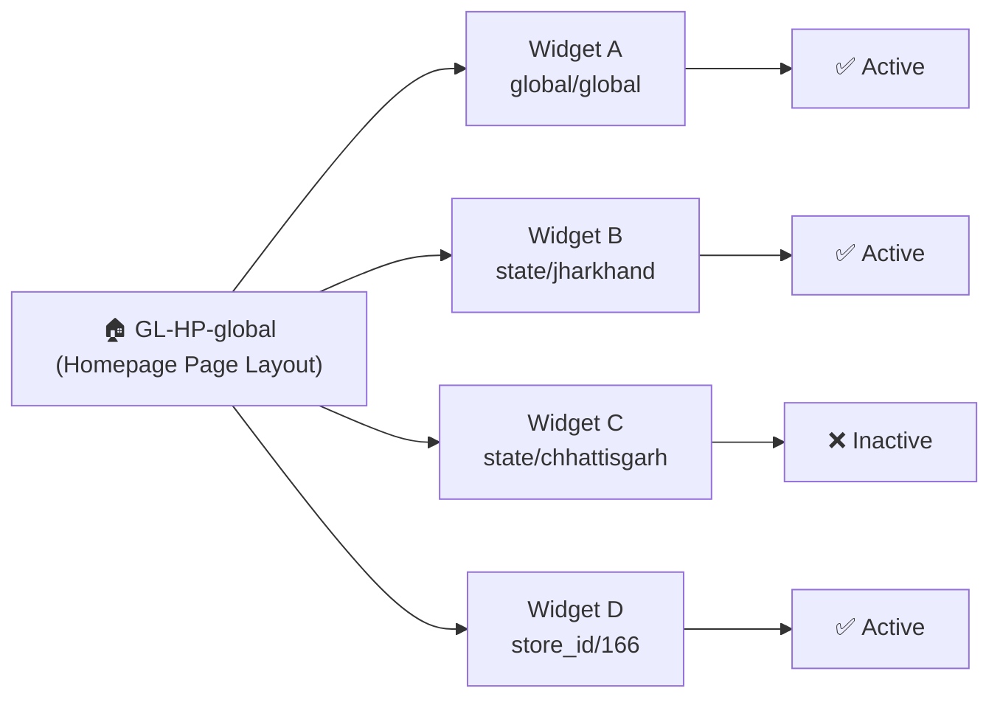
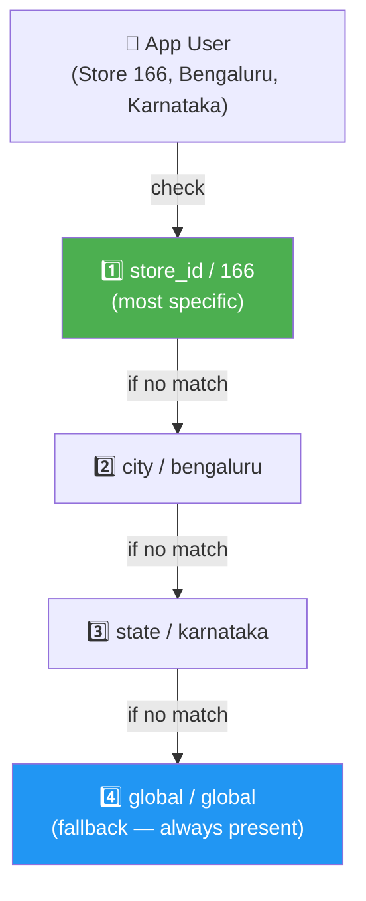
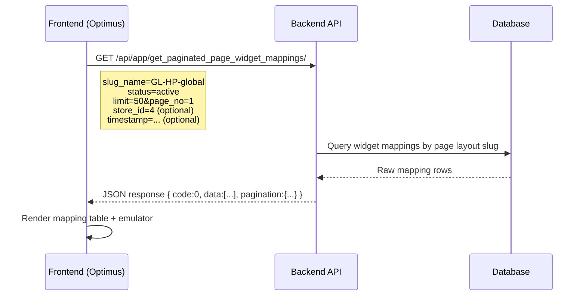
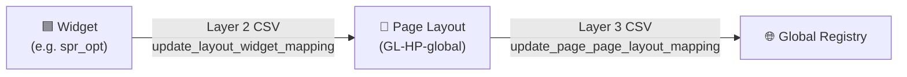
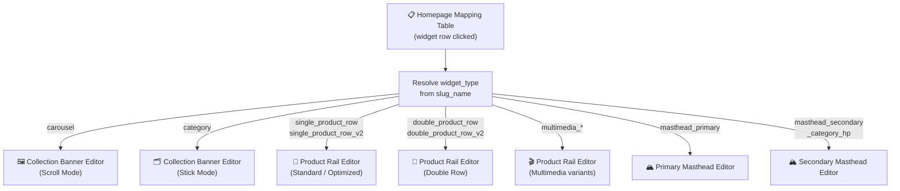
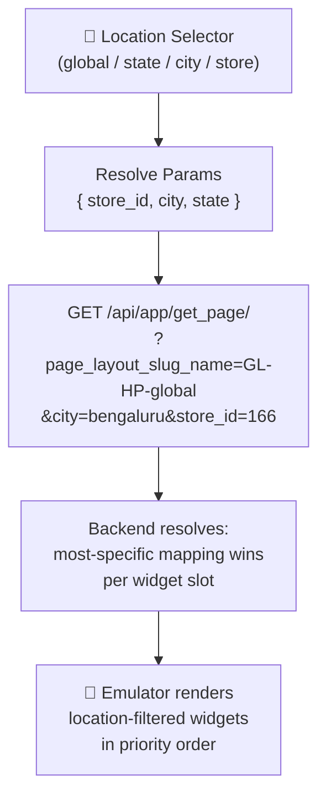
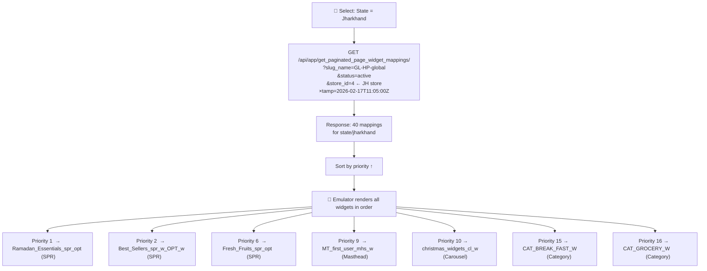
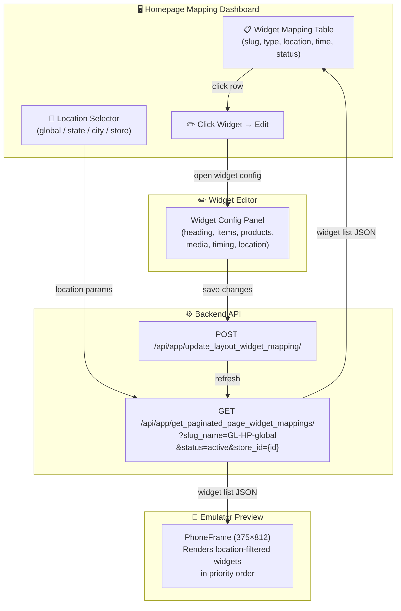

# Homepage Widget Mapping — `GL-HP-global`

## 1. Overview

The **Homepage Mapping** view is the central dashboard for managing all widgets mapped to the homepage (`GL-HP-global`).

```
┌──────────────────────────────────────────────────────────────────────┐
│                   HOMEPAGE MAPPING DASHBOARD                         │
│                       GL-HP-global                                   │
├──────────────────────────────────────────────────────────────────────┤
│                                                                      │
│  📋 Mapping Table         📍 Location Selector    📱 Emulator        │
│  ──────────────────        ──────────────────      ──────────────    │
│  Widget A  global/global   ○ Global               ┌──────────────┐  │
│  Widget B  state/jharkhand ○ State: JH             │ [Masthead]   │  │
│  Widget C  state/cg (off)  ● Store: 166            │ [Carousel]   │  │
│  Widget D  store_id/166   └──────────────────      │ [SPR]        │  │
│                                                    │ [Category]   │  │
│  click row → open editor                          └──────────────┘  │
└──────────────────────────────────────────────────────────────────────┘
```



> **`GL-HP-global`** is the slug of the homepage page layout. All homepage widgets are mapped to this slug via the Global Page Registry.

---

## 2. Homepage Mapping Table

### Table Schema

```
┌────┬────────────────────────────────────┬─────────────────────┬────────────────┬────────────────┬──────────┬─────────────────────┬─────────────────────┬──────────┐
│ #  │ Widget Slug                        │ Widget Type         │ Location Level │ Location Value │ Priority │ Start Time          │ End Time            │ Status   │
├────┼────────────────────────────────────┼─────────────────────┼────────────────┼────────────────┼──────────┼─────────────────────┼─────────────────────┼──────────┤
│  1 │ Ramadan_Essentials_spr_opt         │ single_product_row_v2│ state         │ jharkhand      │    1     │ 2026-02-15T19:21:37Z│ 2026-07-01T18:29:00Z│ ✅ Active │
│  2 │ bau_plp_firstfold_sale_rice_mela…  │ single_product_row_v2│ state         │ jharkhand      │    2     │ 2026-01-15T10:00:00Z│ 2026-12-31T11:35:00Z│ ✅ Active │
│  3 │ CAT_BREAK_FAST_W                   │ category            │ state         │ jharkhand      │   15     │ 2026-01-01T00:00:00Z│ 2026-06-01T00:00:00Z│ ✅ Active │
│  4 │ christmas_widgets_cl_w             │ carousel            │ store_id      │ 166            │   10     │ 2025-12-20T00:00:00Z│ 2026-01-05T00:00:00Z│ ❌ Inactive│
└────┴────────────────────────────────────┴─────────────────────┴────────────────┴────────────────┴──────────┴─────────────────────┴─────────────────────┴──────────┘
```

### Column Descriptions

| Column | API Field | Description | Example |
| :--- | :--- | :--- | :--- |
| **#** | — | Row index | `1` |
| **Widget Slug** | `widget__slug_name` | The `slug_name` of the widget | `Ramadan_Essentials_spr_opt` |
| **Widget Type** | — | Backend `widget_type` | `single_product_row_v2` |
| **Heading** | — | Display title | `Rice Mela` |
| **Location Level** | `level_tag` | Mapping granularity | `global`, `state`, `city`, `store_id` |
| **Location Value** | `level_property` | Specific location | `jharkhand`, `166` |
| **Priority** | `priority` | Sort order within level | `1`, `2`, `15` |
| **Start Time** | `widget__start_time` | Widget activation timestamp | `2026-01-15T10:00:00Z` |
| **End Time** | `widget__end_time` | Widget expiry timestamp | `2026-12-31T11:35:00Z` |
| **Status** | derived | Active or Inactive | `✅ Active` / `❌ Inactive` |

### Status Logic

```
         now
          │
          ▼
  ┌───────────────────────────────────────────────────────┐
  │  start_time ────────────────────────────── end_time  │
  │       │                                        │      │
  │   [Inactive]         [✅ Active]           [Inactive] │
  └───────────────────────────────────────────────────────┘

  Active   = now >= start_time  AND  now < end_time
  Inactive = now < start_time   OR   now >= end_time
```

---

## 3. Location Hierarchy

Widgets are served using **most-specific-first** resolution:

```
store  →  city  →  state  →  global (fallback)
```

### Location Level Architecture



### Location Reference Table

| Level | `level_tag` | `level_property` | Description | Example |
| :--- | :--- | :--- | :--- | :--- |
| **Global** | `global` | `global` | Default — shown to all users | All users see this |
| **State** | `state` | `{state_name}` | State-specific override | `jharkhand`, `chhattisgarh`, `west bengal`, `uttar pradesh` |
| **City** | `city` | `{city_name}` | City-specific override | `bengaluru`, `ranchi`, `kolkata` |
| **Store** | `store_id` | `{store_id}` | Store-specific override | `166` (Bengaluru store) |

### Resolution Example

```
User in Store 166, Bengaluru, Karnataka:

  Step 1 → Any widgets mapped to  store_id=166?    ✅ Yes → Show those
  Step 2 → Any widgets mapped to  city=bengaluru?  ✅ Yes → Show those
  Step 3 → Any widgets mapped to  state=karnataka? ✅ Yes → Show those
  Step 4 → Fallback: global/global                 ✅ Always shown
```

---

## 4. View Mapping API — `get_paginated_page_widget_mappings`

### API Flow



### Query Parameters

| Param | Type | Required | Description | Example |
| :--- | :--- | :---: | :--- | :--- |
| `slug_name` | string | ✅ | Page layout slug | `GL-HP-global` |
| `status` | string | ✅ | Filter by status | `active` or `inactive` |
| `limit` | int | ✅ | Items per page | `50` |
| `page_no` | int | ✅ | Page number | `1` |
| `store_id` | int | — | Filter by specific store | `4`, `166` |
| `timestamp` | ISO string | — | Point-in-time status check | `2026-02-17T11:05:00.000Z` |

### Example Request

```bash
curl 'https://samaan.apnamart.in/api/app/get_paginated_page_widget_mappings/?limit=50&page_no=1&slug_name=GL-HP-global&status=active&store_id=4&timestamp=2026-02-17T11:05:00.000Z' \
  -H 'accept: application/json' \
  -H 'x-csrftoken: {csrf_token}'
```

### Response Schema

```
┌─────────────────────────────────────────────────────────────┐
│ Response Body                                               │
├─────────────────────────────────────────────────────────────┤
│ code           : 0                                          │
│ message        : "success!"                                 │
│ pagination     : { has_previous, has_next,                  │
│                    page_size, current_page }                │
│                                                             │
│ data [ ]       : array of widget mapping objects            │
│  ├── widget_id              : int                           │
│  ├── widget__slug_name      : string                        │
│  ├── priority               : int                           │
│  ├── event_id               : int | null                    │
│  ├── widget__start_time     : ISO datetime                  │
│  ├── widget__end_time       : ISO datetime                  │
│  ├── updated_at             : ISO datetime                  │
│  ├── level_tag              : "global" | "state" | "city"   │
│  │                            | "store_id"                  │
│  ├── level_property         : "global" | "jharkhand" | ...  │
│  ├── cohort                 : string | null                  │
│  └── widget__deactivated_flag : boolean                     │
└─────────────────────────────────────────────────────────────┘
```

### Live Data — `GL-HP-global` (as of Feb 2026)

```
Total Active Mappings: 143   |   Unique Widgets: 60

  state/west bengal     ████████████████████████████████████████████ 42
  state/chhattisgarh    ████████████████████████████████████████     40
  state/jharkhand       ████████████████████████████████████████     40
  store_id/166          █████████████████████████                    21
```

> **Note:** The same widget can appear in multiple location mappings. For example, `Ramadan_Essentials_spr_opt` is mapped to `state/jharkhand`, `state/chhattisgarh`, and `state/west bengal` — all at priority 1.

---

## 5. Other Mapping APIs

### CSV Upload Endpoints



### Widget → Page Layout Mapping CSV (Layer 2)

```csv
widget_slug_name,level_tag,level_property,priority,cohort
Ramadan_Essentials_spr_opt,state,jharkhand,1,
bau_plp_firstfold_sale_Best_Sellers_spr_w_all_both_OPT_w,state,jharkhand,2,
Fresh_Fruits_Everyday_spr_opt,state,jharkhand,6,
CAT_BREAK_FAST_W,state,jharkhand,15,
CAT_GROCERY_W,state,jharkhand,16,
```

### Page Layout → Global Registry CSV (Layer 3)

```csv
level_tag,level_property
global,global
```

---

## 6. Widget Click → Edit Flow



### Edit Capabilities

```
┌──────────────────────────────────────────────────────────┐
│              Widget Edit Panel                           │
├────────────────────────────────────┬─────────┬──────────┤
│ Field                              │ Edit?   │ Notes    │
├────────────────────────────────────┼─────────┼──────────┤
│ Heading / Title                    │ ✅ Yes  │ EN + HI  │
│ Widget Items / Products            │ ✅ Yes  │ +/-/sort │
│ Location Mapping                   │ ✅ Yes  │ level_tag│
│ Start / End Time                   │ ✅ Yes  │ Active   │
│ Images / Media                     │ ✅ Yes  │ Upload   │
│ Page Type (PLP / CP)               │ ✅ Yes  │ per item │
│ Slug Name                          │ ❌ No   │ Immutable│
└────────────────────────────────────┴─────────┴──────────┘
```

---

## 7. Emulator — Location-Based Preview

### How It Works



### Location Selector + Emulator UI Skeleton

```
┌─────────────────────────────────────────────────────────────────┐
│  📍 Location:  [Bengaluru, Store 166  ▼]          [🔄 Refresh] │
├─────────────────────────────────────────────────────────────────┤
│                          ╔══════════════════╗                   │
│                          ║  📱 (375 × 812)  ║                   │
│                          ║ ┌──────────────┐ ║                   │
│                          ║ │   🔍 Search  │ ║                   │
│                          ║ ├──────────────┤ ║                   │
│                          ║ │──── P.Mas ───│ ║ ← masthead_primary│
│                          ║ ├──────────────┤ ║                   │
│                          ║ │ ▓▓ S.Mas ▓▓ │ ║ ← secondary_mast  │
│                          ║ ├──────────────┤ ║                   │
│                          ║ │ ◀ Carousel ▶│ ║ ← carousel        │
│                          ║ ├──────────────┤ ║                   │
│                          ║ │[CAT][CAT][CA]│ ║ ← category        │
│                          ║ ├──────────────┤ ║                   │
│                          ║ │━ Rice Mela ━ │ ║ ← SPR             │
│                          ║ │ ▓ ▓ ▓ ▓ ▓  │ ║                   │
│                          ║ ├──────────────┤ ║                   │
│                          ║ │━━ Namkeens ━━│ ║ ← Double Row      │
│                          ║ │▓▓ ▓▓ ▓▓ ▓▓ │ ║                   │
│                          ║ │▓▓ ▓▓ ▓▓ ▓▓ │ ║                   │
│                          ║ └──────────────┘ ║                   │
│                          ╚══════════════════╝                   │
└─────────────────────────────────────────────────────────────────┘
```

### Location → What Gets Shown

| Selected Location | Widgets Shown |
| :--- | :--- |
| **Global** | Only `global/global` widgets |
| **State: Jharkhand** | `state/jharkhand` + `global/global` fallback |
| **City: Bengaluru** | `city/bengaluru` + `state/karnataka` + `global/global` |
| **Store: 166** | `store_id/166` + `city/bengaluru` + `state/karnataka` + `global/global` |

---

## 8. Location Filter → Emulator Widget Rendering

### Widget Types Rendered on Emulator

```
  widget_type                        │  Component          │  Looks Like
  ────────────────────────────────── │ ─────────────────── │ ─────────────────────────────
  masthead_primary                   │  PrimaryMasthead    │  █ Header BG + 🔲🔲🔲 Icons
  masthead_secondary_category_hp     │  PrimaryMasthead    │  █ Banner + ◀▓▓▓▓▓▓▓▓▓▓▓▓▶
  carousel                           │  CollectionBanner   │  ◀ [Banner1][Banner2][Ban..▶
  category                           │  CollectionBanner   │  [🗂️CAT1][🗂️CAT2][🗂️CAT3][🗂️CAT4]
  single_product_row_v2              │  ProductRail        │  ── Title ── [🛒][🛒][🛒][🛒]▶
  double_product_row_v2              │  ProductRail        │  ── Title ── [🛒][🛒][🛒][🛒]▶
                                     │                     │             [🛒][🛒][🛒][🛒]▶
  multimedia_single_product_row_v2   │  ProductRail        │  [████ BG ████] [🛒][🛒][🛒]▶
  multimedia_double_product_row_v2   │  ProductRail        │  [████ BG ████] 2-row scroll ▶
```

### Location Filter Flow



### Live Homepage Widgets — Sample

| Widget ID | Type | Heading | Slug | Items |
| :--- | :--- | :--- | :--- | :---: |
| 5735 | `single_product_row_v2` | *(Thursday Bazaar)* | `bau_plp_firstfold_sale_malamaal_thursday_spr_opt_w_all_both` | 1 |
| 7101 | `single_product_row_v2` | Rice Mela | `bau_plp_firstfold_sale_rice_mela_spr_w_all_both_OPT_w` | 1 |
| 6123 | `category` | Dairy & Breakfast | `CAT_BREAK_FAST_W_Pane` | 4 |
| 6124 | `category` | Grocery | `CAT_GROCERY_W_Pane` | 8 |
| 6125 | `category` | Snacks & Drinks | `CAT_SNACKS_DRINKS_W_Pane` | 8 |
| 7177 | `double_product_row_v2` | Namkeens | `event_plp_firstfold_sale_Namkeen_dspr_w_all_both_copy` | 1 |
| 6806 | `carousel` | Featured this Week | `bau_plp_firstfold_sale_christmas_widgets_cl_w_all_both` | 5 |

### GL-HP Slug Naming Convention

```
  GL-HP-{description}        ← hyphen style
  GL_HP_{description}        ← underscore style (both exist in live data)

  Examples:
  GL_HP_milk_dairy_crausel_wi_listing_wb   → Milk & Dairy
  GL-HP-atta_besan_sooji_cat-wi            → Atta, Besan & Sooji
  GL-HP-oils-ghee_cat-wi                   → Oils & Ghee
  GL_HP_Chips_Namkeen_listing_wi           → Chips & Namkeen
  GL_HP_Bath_BodyWash_listing_wi_cg        → Bath & Body Wash
```

---

## 9. Data Flow — End to End



---

## 10. Environment Endpoints — Prod & UAT

```
┌──────────────────────────────────────────────────────────────────────┐
│                     ENVIRONMENT OVERVIEW                             │
├──────────────────────────────┬───────────────────────────────────────┤
│         PRODUCTION           │              UAT                      │
│  samaan.apnamart.in          │  uat.apnamart.in                      │
│  GL-HP-global                │  GL-HP-global (same slug)             │
│  /page-layout-widget-list/   │  /page-layout-widget-list/            │
└──────────────────────────────┴───────────────────────────────────────┘

  To switch → update vite.config.js proxy target:

  '/api': {
      target: 'https://samaan.apnamart.in',  // ← PROD (default)
    // target: 'https://uat.apnamart.in',    // ← UAT (uncomment)
  }
```

### All API Endpoints (same path on both environments)

| API | Path |
| :--- | :--- |
| **View widget mappings** | `/api/app/get_paginated_page_widget_mappings/` |
| **Fetch page** | `/api/app/get_page/` |
| **Create widget** | `/api/app/widget/` |
| **Create widget item** | `/api/app/post_widget_item/` |
| **Create page layout** | `/api/app/post_page_layout/` |
| **Map widget items** | `/api/app/update_widget_widget_item_mapping/` |
| **Map layout widget** | `/api/app/update_layout_widget_mapping/` |
| **Map page layout** | `/api/app/update_page_page_layout_mapping/` |
| **Widget products** | `/api/app/get_paginated_widget_product_list/v2/` |
| **Multimedia** | `/api/app/multimedia/` |
| **Page skeleton** | `/api/app/page_skeleton/v2/` |
| **Get widget** | `/api/app/get_widget/` |
| **Get widget item** | `/api/app/get_widget_item/` |

---

## 11. Related Documentation

- [PLP Page Widget Support](./PLP-PAGE-widget-support.md) — 3-layer PLP ecosystem, page types, location mapping
- [Slug Name Reference](./SLUG_NAME.md) — All slug patterns and naming conventions
- [Product Rail Widget](./WIDGET-Product-Rail.md) — SPR / DPR widget variants
- [Collection Banner Widget](./WIDGET-Collection-Banner.md) — Carousel (scroll) and Category Grid (stick)
- [Masthead Widget](./WIDGET-Masthead.md) — Primary and Secondary Masthead
- [Widget Library Reference](./REFERENCE-Widget-Library.md) — All supported widgets
- **Config:** [`src/config/Feature/HomepageMappingConfig.js`](../src/config/Feature/HomepageMappingConfig.js) — JS source of truth for this wiki
