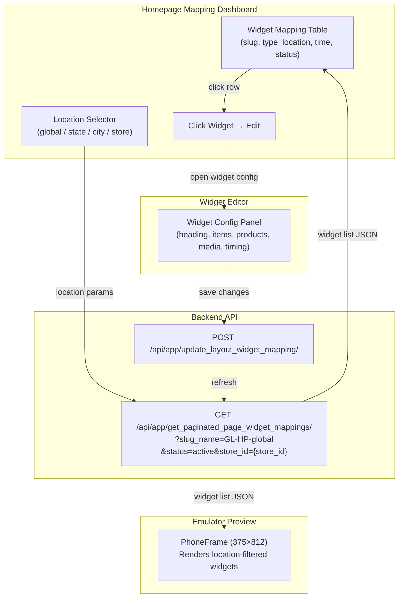

# Homepage Widget Mapping — `GL-HP-global`

## 1. Overview

The **Homepage Mapping** view is the central dashboard for managing all widgets mapped to the homepage (`GL-HP-global`). It lets you:

- **View** every widget currently on the homepage with its location mapping (store, state, city)
- **Track** each widget's timestamp and status (active / inactive)
- **Edit** any widget by clicking on its row
- **Preview** location-specific widget layouts in the emulator by selecting a location

```
Homepage (GL-HP-global)
    ├── Widget A  →  mapped: global/global          →  Active
    ├── Widget B  →  mapped: state/jharkhand         →  Active
    ├── Widget C  →  mapped: state/chhattisgarh      →  Inactive
    └── Widget D  →  mapped: store_id/166 (Bengaluru) →  Active
```

> **`GL-HP-global`** is the slug name of the homepage page layout. All homepage widgets are ultimately mapped to this slug via the Global Page Registry.

---

## 2. Homepage Mapping Table

The mapping table displays every widget on the homepage with its full location and scheduling context.

### Table Columns

| Column | Description | Example |
| :--- | :--- | :--- |
| **#** | Row index | `1` |
| **Widget Slug** | The `slug_name` of the widget | `bau_plp_firstfold_sale_rice_mela_spr_w_all_both_OPT_w` |
| **Widget Type** | Backend `widget_type` value | `single_product_row_v2`, `category`, `carousel` |
| **Heading** | Display title | `Rice Mela`, `Dairy & Breakfast` |
| **Location Level** | Mapping granularity | `global`, `state`, `city`, `store` |
| **Location Value** | Specific location | `global`, `jharkhand`, `bengaluru`, `166` |
| **Priority** | Sort order within level | `1`, `2`, `3` |
| **Start Time** | Widget activation timestamp | `2026-01-15T10:00:00Z` |
| **End Time** | Widget expiry timestamp | `2026-12-31T11:35:00Z` |
| **Status** | Active or Inactive | `Active` / `Inactive` |

### Status Logic

| Status | Condition |
| :--- | :--- |
| **Active** | `now >= start_time AND now < end_time` |
| **Inactive** | `now < start_time OR now >= end_time` |

---

## 3. Location Hierarchy

Widgets are mapped to the homepage at **four location levels**. When the app serves the homepage, it resolves widgets using a **most-specific-first** fallback:

```
store  →  city  →  state  →  global (fallback)
```

### Location Levels

| Level | `level_tag` | `level_property` | Description | Example |
| :--- | :--- | :--- | :--- | :--- |
| **Global** | `global` | `global` | Default — shown to all users | All users see this widget |
| **State** | `state` | `{state_name}` | State-specific override | `jharkhand`, `chhattisgarh`, `west bengal`, `uttar pradesh` |
| **City** | `city` | `{city_name}` | City-specific override | `bengaluru`, `ranchi`, `kolkata` |
| **Store** | `store_id` | `{store_id}` | Store-specific override | `166` (Bengaluru store) |

### Resolution Example

```
User in Store 166, Bengaluru, Karnataka:

1. Check: Any widgets mapped to store=166?         → Yes → Show those
2. Check: Any widgets mapped to city=bengaluru?     → Yes → Show those
3. Check: Any widgets mapped to state=karnataka?    → Yes → Show those
4. Fallback: Show widgets mapped to global/global   → Always available
```

---

## 4. View Mapping API — `get_paginated_page_widget_mappings`

This is the **primary API** used to fetch the homepage widget mapping table.

### Endpoint

```
GET /api/app/get_paginated_page_widget_mappings/
```

### Query Parameters

| Param | Type | Required | Description | Example |
| :--- | :--- | :---: | :--- | :--- |
| `slug_name` | string | Yes | Page layout slug | `GL-HP-global` |
| `status` | string | Yes | Filter by status | `active` or `inactive` |
| `limit` | int | Yes | Items per page | `50` |
| `page_no` | int | Yes | Page number | `1` |
| `store_id` | int | No | Filter by specific store | `4`, `166` |
| `timestamp` | ISO string | No | Point-in-time for status check | `2026-02-17T11:05:00.000Z` |

### Example Request

```bash
curl 'https://samaan.apnamart.in/api/app/get_paginated_page_widget_mappings/?limit=50&page_no=1&slug_name=GL-HP-global&status=active&store_id=4&timestamp=2026-02-17T11:05:00.000Z' \
  -H 'accept: application/json' \
  -H 'x-csrftoken: {csrf_token}'
```

### Response Schema

```json
{
  "code": 0,
  "message": "success!",
  "data": [
    {
      "widget_id": 8715,
      "widget__slug_name": "Ramadan_Essentials_spr_opt",
      "priority": 1,
      "event_id": null,
      "widget__start_time": "2026-02-15T19:21:37Z",
      "widget__end_time": "2026-07-01T18:29:00Z",
      "updated_at": "2026-02-15T19:23:11Z",
      "level_tag": "state",
      "level_property": "jharkhand",
      "cohort": null,
      "widget__deactivated_flag": false
    }
  ],
  "pagination": {
    "has_previous": false,
    "has_next": false,
    "page_size": 50,
    "current_page": 1
  }
}
```

### Response Fields

| Field | Type | Description |
| :--- | :--- | :--- |
| `widget_id` | int | Unique widget ID |
| `widget__slug_name` | string | Widget slug name |
| `priority` | int | Display order (lower = higher position) |
| `event_id` | int / null | Associated event (if any) |
| `widget__start_time` | ISO datetime | Widget activation time |
| `widget__end_time` | ISO datetime | Widget expiry time |
| `updated_at` | ISO datetime | Last mapping update time |
| `level_tag` | string | Location level: `global`, `state`, `city`, `store_id` |
| `level_property` | string | Location value: `global`, `jharkhand`, `166`, etc. |
| `cohort` | string / null | Cohort targeting (if any) |
| `widget__deactivated_flag` | boolean | Manual deactivation flag |

### Live Data — `GL-HP-global` (as of Feb 2026)

Total active mappings: **143** across **60 unique widgets**

| Location (`level_tag/level_property`) | Widget Count |
| :--- | :---: |
| `state/west bengal` | 42 |
| `state/chhattisgarh` | 40 |
| `state/jharkhand` | 40 |
| `store_id/166` | 21 |

> **Note:** The same widget can appear in multiple location mappings. For example, `Ramadan_Essentials_spr_opt` (widget 8715) is mapped to `state/jharkhand`, `state/chhattisgarh`, and `state/west bengal` — all at priority 1.

---

## 5. Other Mapping APIs

### CSV Upload Endpoints

| Operation | Endpoint | Method |
| :--- | :--- | :--- |
| Map widget → page layout | `/api/app/update_layout_widget_mapping/` | `POST` |
| Map page → global registry | `/api/app/update_page_page_layout_mapping/` | `POST` |
| Fetch paginated widget products | `/api/app/get_paginated_widget_product_list/v2/?widget_id={id}&store_id={store_id}` | `GET` |

### Widget → Page Layout Mapping CSV

```csv
widget_slug_name,level_tag,level_property,priority,cohort
Ramadan_Essentials_spr_opt,state,jharkhand,1,
bau_plp_firstfold_sale_Best_Sellers_spr_w_all_both_OPT_w,state,jharkhand,2,
Fresh_Fruits_Everyday_spr_opt,state,jharkhand,6,
CAT_BREAK_FAST_W,state,jharkhand,15,
CAT_GROCERY_W,state,jharkhand,16,
```

### Page Layout → Global Registry Mapping CSV

```csv
level_tag,level_property
global,global
```

---

## 6. Widget Click → Edit Flow

When a user clicks on any widget row in the Homepage Mapping table, the builder opens that widget for editing.

```
Homepage Mapping Table
    ↓ click on widget row
Resolve widget type from slug_name
    ↓
Route to the appropriate editor:
    ├── carousel         → Collection Banner editor (scroll mode)
    ├── category         → Collection Banner editor (stick mode) / Category Grid editor
    ├── single_product_row_v2    → Product Rail editor (Optimized)
    ├── double_product_row_v2    → Product Rail editor (Double, Optimized)
    ├── masthead_primary         → Primary Masthead editor
    └── masthead_secondary_category_hp  → Secondary Masthead editor
```

### Edit Capabilities

| Field | Editable? | Notes |
| :--- | :--- | :--- |
| Widget heading / title | Yes | English + Hindi |
| Widget items / products | Yes | Add, remove, reorder items |
| Location mapping | Yes | Change level_tag / level_property |
| Start / End time | Yes | Controls active/inactive status |
| Images / media | Yes | Upload or URL |
| Page type (PLP / CP) | Yes | `product_listing_page` or `category_page` |
| Slug name | No | Immutable after creation |

---

## 7. Emulator — Location-Based Preview

The **emulator** (phone frame preview) renders the homepage exactly as the end user would see it. When you **select a location** from the location selector, the emulator filters and displays only the widgets mapped to that location.

### How It Works

```
User selects location in emulator
    ↓
Location parameters resolved:
    { store_id: 166, city: "bengaluru", state: "karnataka" }
    ↓
Fetch widgets from API with location params:
    GET /api/app/get_page/?page_layout_slug_name=GL-HP-global
        &city=bengaluru&store_id=166
    ↓
API returns location-resolved widget list
    (most-specific mapping wins per widget slot)
    ↓
Emulator renders the filtered widgets in PhoneFrame
```

### Location Selector UI

```
┌─────────────────────────────────────────────┐
│  📍 Location: [Bengaluru, Store 166  ▼]     │
│                                             │
│  ┌─ Emulator (375×812) ──────────────────┐  │
│  │ ┌──────────────────────────────────┐   │  │
│  │ │  🔍 Search                       │   │  │
│  │ ├──────────────────────────────────┤   │  │
│  │ │  [Primary Masthead]              │   │  │
│  │ ├──────────────────────────────────┤   │  │
│  │ │  [Secondary Masthead]            │   │  │
│  │ ├──────────────────────────────────┤   │  │
│  │ │  [Carousel Banner]              │   │  │
│  │ ├──────────────────────────────────┤   │  │
│  │ │  [Category Grid: Grocery]        │   │  │
│  │ ├──────────────────────────────────┤   │  │
│  │ │  [SPR: Rice Mela]  [View All →]  │   │  │
│  │ ├──────────────────────────────────┤   │  │
│  │ │  [Double Row: Namkeens]          │   │  │
│  │ └──────────────────────────────────┘   │  │
│  └────────────────────────────────────────┘  │
└─────────────────────────────────────────────┘
```

### Location Change → Widget Refresh

| Selected Location | Widgets Shown |
| :--- | :--- |
| **Global** | Only `global/global` mapped widgets |
| **State: Jharkhand** | `state/jharkhand` widgets + `global/global` fallback |
| **City: Bengaluru** | `city/bengaluru` widgets + `state/karnataka` + `global/global` fallback |
| **Store: 166** | `store_id/166` widgets + `city/bengaluru` + `state/karnataka` + `global/global` fallback |

> **Key behavior:** Selecting a location triggers an API call (or local filter) with the location params. The emulator re-renders showing only the widgets the end user would actually see at that location.

---

## 8. Location Filter → Emulator Widget Rendering

When a location is selected (from the mapping table or location selector), **all widget types** mapped to that location are fetched and rendered on the emulator. The emulator shows the exact homepage the end user would see at that location.

### Widget Types Rendered on Emulator (per location)

| Widget Type | `widget_type` | Emulator Component | Rendered As |
| :--- | :--- | :--- | :--- |
| **Primary Masthead** | `masthead_primary` | `PrimaryMasthead` | App header background + category nav |
| **Secondary Masthead** | `masthead_secondary_category_hp` | `PrimaryMasthead` | Scrollable category banners |
| **Carousel** | `carousel` | `CollectionBanner` (scroll) | Swipeable banner carousel |
| **Category Grid** | `category` | `CollectionBanner` (stick) / `CategoryGrid` | 4-column category grid |
| **Single Product Row** | `single_product_row_v2` | `ProductRail` | Horizontal product scroll |
| **Double Product Row** | `double_product_row_v2` | `ProductRail` | 2-row product scroll |
| **Multimedia SPR** | `multimedia_single_product_row_v2` | `ProductRail` | Product scroll + background media |

### Location Filter Flow

```
Select Location: "State: Jharkhand"
    ↓
API Call:
    GET /api/app/get_paginated_page_widget_mappings/
        ?slug_name=GL-HP-global
        &status=active
        &store_id=4          ← Jharkhand store
        &timestamp=2026-02-17T11:05:00.000Z
    ↓
Response: 40 widget mappings for state/jharkhand
    ↓
Emulator renders ALL widget types in priority order:
    Priority 1  → Ramadan_Essentials_spr_opt         (SPR)
    Priority 2  → Best_Sellers_spr_w_OPT_w            (SPR)
    Priority 6  → Fresh_Fruits_Everyday_spr_opt       (SPR)
    Priority 9  → MT_first_user_mhs_w                 (Masthead)
    Priority 10 → christmas_widgets_cl_w              (Carousel)
    Priority 13 → fruit_vegetables_cl_w               (Carousel)
    Priority 15 → CAT_BREAK_FAST_W                    (Category Grid)
    Priority 16 → CAT_GROCERY_W                       (Category Grid)
    ...
```

### Live Homepage Widgets — Sample

| Widget ID | Type | Heading | Slug | Items |
| :--- | :--- | :--- | :--- | :---: |
| 5735 | `single_product_row_v2` | *(Thursday Bazaar)* | `bau_plp_firstfold_sale_malamaal_thursday_spr_opt_w_all_both` | 1 |
| 7101 | `single_product_row_v2` | Rice Mela | `bau_plp_firstfold_sale_rice_mela_spr_w_all_both_OPT_w` | 1 |
| 6123 | `category` | Dairy & Breakfast | `CAT_BREAK_FAST_W_Pane` | 4 |
| 6124 | `category` | Grocery | `CAT_GROCERY_W_Pane` | 8 |
| 6125 | `category` | Snacks & Drinks | `CAT_SNACKS_DRINKS_W_Pane` | 8 |
| 6126 | `category` | Beauty & Personal Care | `CAT_PERSONAL_CARE_W_Pane` | 8 |
| 6127 | `category` | Cleaning Essentials | `CAT_HOUSEHOLD_W_Pane` | 4 |
| 6128 | `category` | Shop By Store | `CAT_SHOP_BY_STORE_W_Pane` | 8 |
| 7177 | `double_product_row_v2` | Namkeens | `event_plp_firstfold_sale_Namkeen_dspr_w_all_both_copy` | 1 |
| 6806 | `carousel` | Featured this Week | `bau_plp_firstfold_sale_christmas_widgets_cl_w_all_both` | 5 |

### GL-HP Slug Naming Convention

Homepage widget items use the `GL-HP` or `GL_HP` prefix pattern:

| Slug | Widget | Category |
| :--- | :--- | :--- |
| `GL_HP_milk_dairy_crausel_wi_listing_wb` | Milk & Dairy | Dairy & Breakfast |
| `GL-HP-atta_besan_sooji_cat-wi` | Atta, Besan & Sooji | Grocery |
| `GL-HP-oils-ghee_cat-wi` | Oils & Ghee | Grocery |
| `GL-HP-pulses_cat-wi` | Pulses | Grocery |
| `GL-HP-cereals-rice_cat-wi` | Cereals & Rice | Grocery |
| `GL_HP_Chips_Namkeen_listing_wi` | Chips & Namkeen | Snacks & Drinks |
| `GL_HP_Bath_BodyWash_listing_wi_cg` | Bath & Body Wash | Beauty & Personal Care |

> **Note:** Some slugs use `GL-HP-` (hyphen) and others use `GL_HP_` (underscore). Both conventions exist in the live data.

---

## 9. Data Flow — End to End



---

## 10. Environment Endpoints — Prod & UAT

Optimus operates on **two environments**. All API paths are the same — only the base URL changes.

### Base URLs

| Environment | Base URL | Vite Proxy Target | Homepage Slug |
| :--- | :--- | :--- | :--- |
| **Production** | `https://samaan.apnamart.in` | `vite.config.js` → `/api` proxy | `GL-HP-global` |
| **UAT** | `https://uat.apnamart.in` | *(switch proxy target for UAT)* | `GL-HP-global` |

### Key API Endpoints (same path on both environments)

| API | Full Prod URL | Full UAT URL |
| :--- | :--- | :--- |
| **View widget mappings** | `https://samaan.apnamart.in/api/app/get_paginated_page_widget_mappings/` | `https://uat.apnamart.in/api/app/get_paginated_page_widget_mappings/` |
| **Fetch page** | `https://samaan.apnamart.in/api/app/get_page/` | `https://uat.apnamart.in/api/app/get_page/` |
| **Create widget** | `https://samaan.apnamart.in/api/app/widget/` | `https://uat.apnamart.in/api/app/widget/` |
| **Create widget item** | `https://samaan.apnamart.in/api/app/post_widget_item/` | `https://uat.apnamart.in/api/app/post_widget_item/` |
| **Create page layout** | `https://samaan.apnamart.in/api/app/post_page_layout/` | `https://uat.apnamart.in/api/app/post_page_layout/` |
| **Map widget items** | `https://samaan.apnamart.in/api/app/update_widget_widget_item_mapping/` | `https://uat.apnamart.in/api/app/update_widget_widget_item_mapping/` |
| **Map layout widget** | `https://samaan.apnamart.in/api/app/update_layout_widget_mapping/` | `https://uat.apnamart.in/api/app/update_layout_widget_mapping/` |
| **Map page layout** | `https://samaan.apnamart.in/api/app/update_page_page_layout_mapping/` | `https://uat.apnamart.in/api/app/update_page_page_layout_mapping/` |
| **Widget products** | `https://samaan.apnamart.in/api/app/get_paginated_widget_product_list/v2/` | `https://uat.apnamart.in/api/app/get_paginated_widget_product_list/v2/` |
| **Multimedia** | `https://samaan.apnamart.in/api/app/multimedia/` | `https://uat.apnamart.in/api/app/multimedia/` |
| **Page skeleton** | `https://samaan.apnamart.in/api/app/page_skeleton/v2/` | `https://uat.apnamart.in/api/app/page_skeleton/v2/` |
| **Get widget** | `https://samaan.apnamart.in/api/app/get_widget/` | `https://uat.apnamart.in/api/app/get_widget/` |
| **Get widget item** | `https://samaan.apnamart.in/api/app/get_widget_item/` | `https://uat.apnamart.in/api/app/get_widget_item/` |

### Switching Environments

To switch Optimus between Prod and UAT, update the proxy target in `vite.config.js`:

```javascript
// vite.config.js — switch target for environment
'/api': {
    target: 'https://samaan.apnamart.in',   // ← PROD
    // target: 'https://uat.apnamart.in',   // ← UAT
    changeOrigin: true,
    secure: false,
    ...
}
```

### Admin Panel URLs

| Environment | Widget Mapping Page |
| :--- | :--- |
| **Prod** | `https://samaan.apnamart.in/page-layout-widget-list/` |
| **UAT** | `https://uat.apnamart.in/page-layout-widget-list/` |

---

## 11. Related Documentation

- [PLP Page Widget Support](./PLP-PAGE-widget-support.md) — 3-layer PLP ecosystem, page types, location mapping
- [Slug Name Reference](./SLUG_NAME.md) — All slug patterns and naming conventions
- [Product Rail Widget](./WIDGET-Product-Rail.md) — SPR / DPR widget variants
- [Collection Banner Widget](./WIDGET-Collection-Banner.md) — Carousel (scroll) and Category Grid (stick)
- [Masthead Widget](./WIDGET-Masthead.md) — Primary and Secondary Masthead
- [Widget Library Reference](./REFERENCE-Widget-Library.md) — All supported widgets
