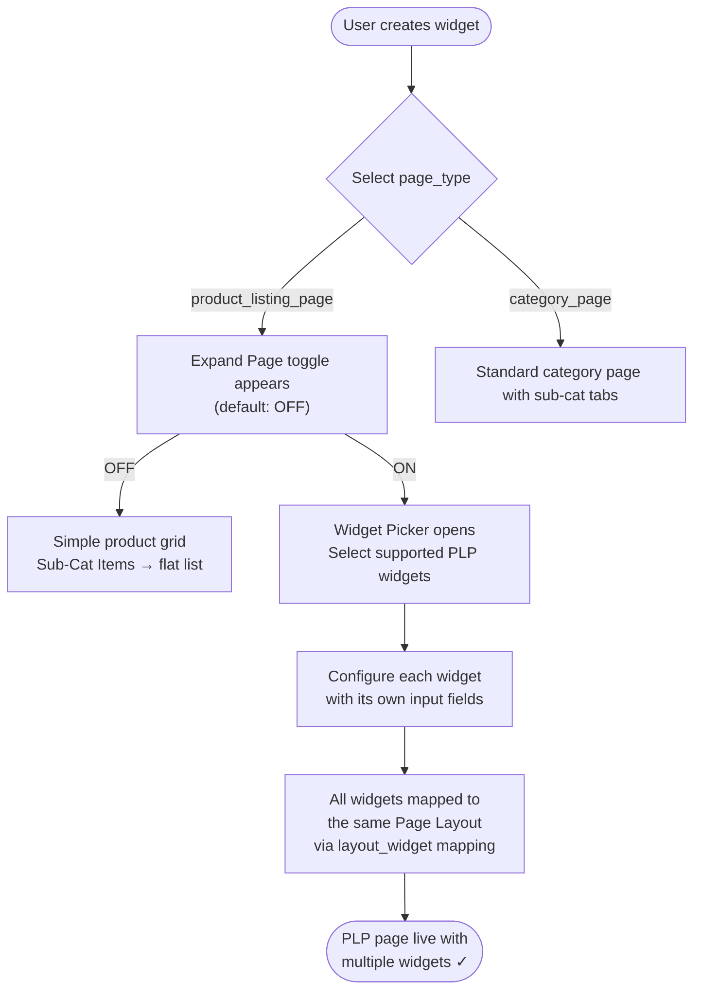
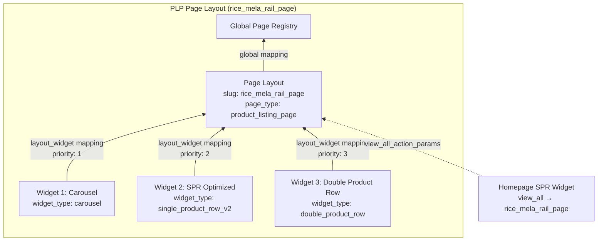
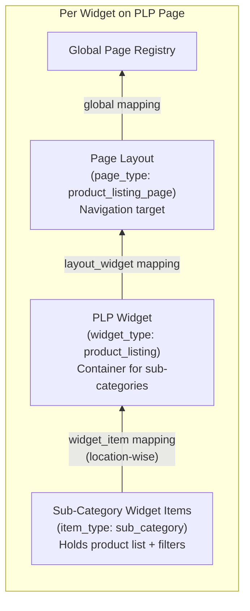
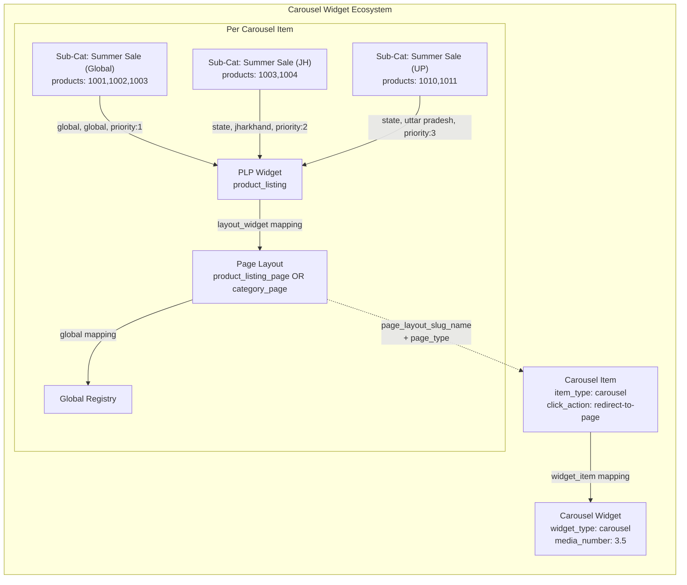
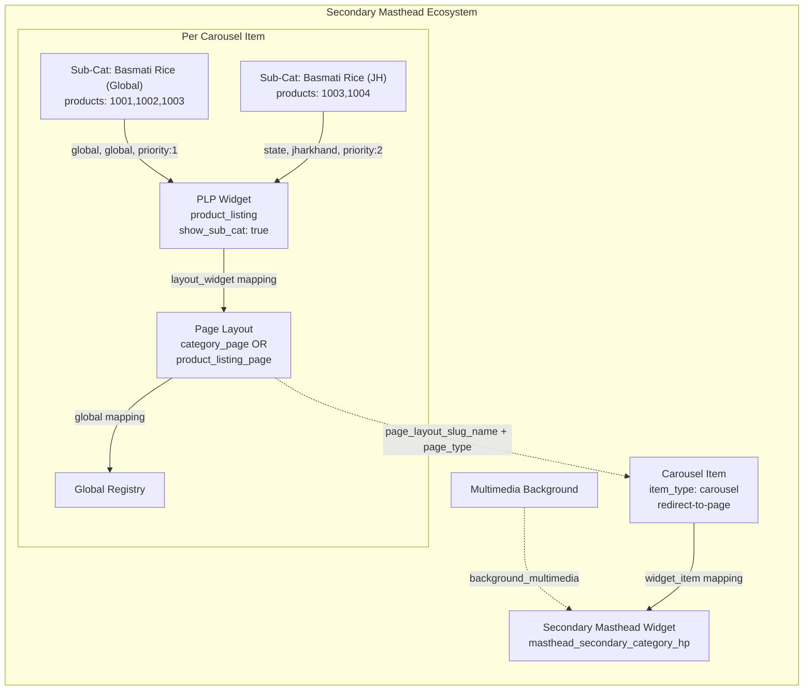
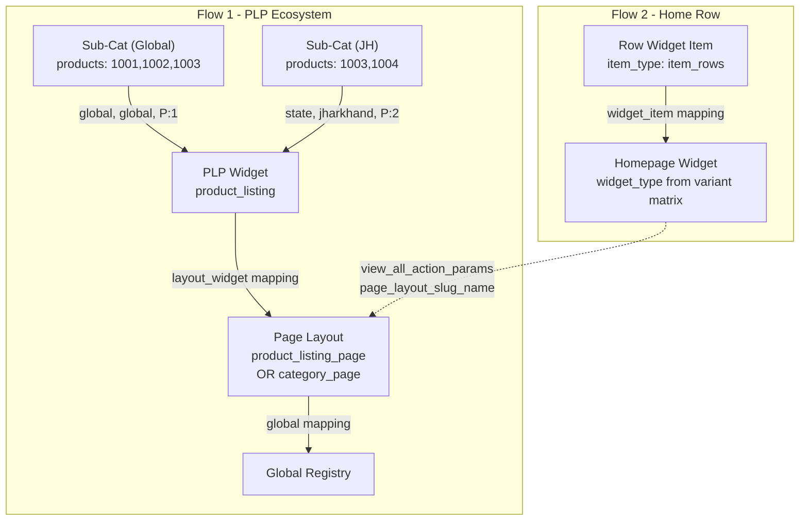
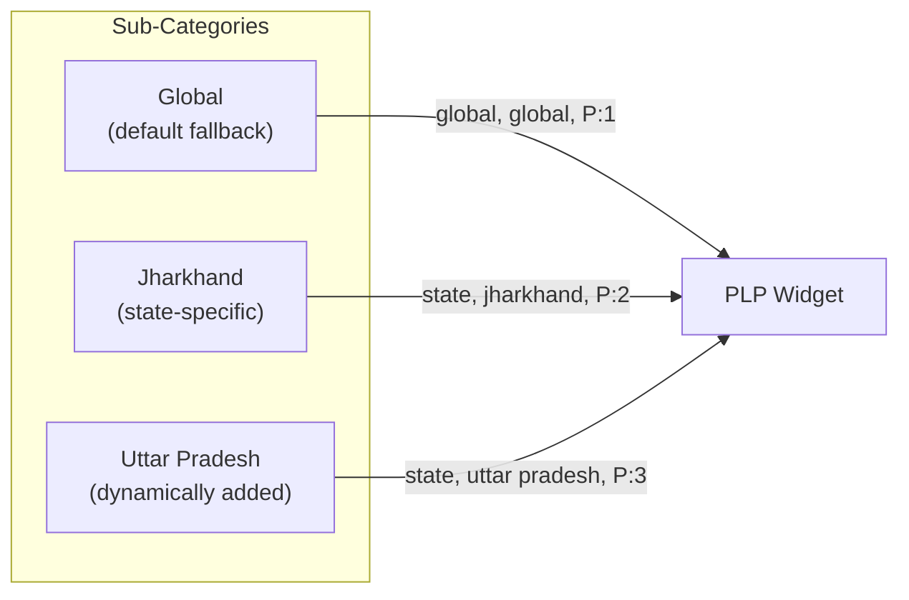

# PLP Page — Widget Support Reference

## 1. Overview

A **Product Listing Page (PLP)** is the navigation destination rendered when a user taps a homepage widget — a carousel banner, a secondary masthead item, or a product rail's "View All" button. By default the PLP shows a flat product grid, but with the **Expand Page** feature the Maker can add additional widgets to the page, turning it into a rich, multi-widget experience.

> **Category Grid is NOT supported on PLP pages.** It exists only on the homepage.

### Expand Page — High-Level Flow



---

## 2. Supported Widgets on PLP Pages

These widgets can be **added to a PLP page** when Expand Page is ON:

| Widget | `widget_type` | Page Type Selection | Expand Page Support |
| :--- | :--- | :--- | :---: |
| **Carousel** | `carousel` | Per carousel item | ✅ |
| **Secondary Masthead** | `masthead_secondary_category_hp` | Per carousel item | ✅ |
| **SPR Standard** | `single_product_row` | Per widget | ✅ |
| **SPR Optimized (V2)** | `single_product_row_v2` | Per widget | ✅ |
| **Multimedia SPR** | `multimedia_single_product_row` | Per widget | ✅ |
| **Multimedia SPR V2** | `multimedia_single_product_row_v2` | Per widget | ✅ |
| **Double Product Row** | `double_product_row` | Per widget | ✅ |
| **Double Product Row V2** | `double_product_row_v2` | Per widget | ✅ |
| **Multimedia Double Row** | `multimedia_double_product_row` | Per widget | ✅ |
| **Multimedia Double Row V2** | `multimedia_double_product_row_v2` | Per widget | ✅ |
| ~~Category Grid~~ | `category` | — | ❌ Not supported |

> **Key:** Carousel and Secondary Masthead select page type **per item**. All Product Rail variants select page type **per widget**.

---

## 3. Expand Page Toggle — Frontend Skeleton

### Default State (OFF) — Simple Product Listing

```
Widget Configuration Sidebar
┌──────────────────────────────────────────────────┐
│ Single Product Row: "Rice Mela Rail"             │
│                                                    │
│ Page Type: [product_listing_page ▼]               │
│                                                    │
│ Expand Page:  ○ OFF  ● ON                         │
│              ← default OFF                        │
│                                                    │
│ Slug:       rice_mela_rail                         │
│ Title:      Rice Mela                              │
│ Products:   1001, 1002, 1003, 1004                │
│                                                    │
│                            [Submit]                │
└──────────────────────────────────────────────────┘

Result → Flat PLP page with product grid only
```

### Expand Page: ON — Multi-Widget PLP

```
Widget Configuration Sidebar
┌──────────────────────────────────────────────────┐
│ Single Product Row: "Rice Mela Rail"             │
│                                                    │
│ Page Type: [product_listing_page ▼]               │
│                                                    │
│ Expand Page:  ● OFF  ○ ON                         │
│                                                    │
│ [All existing fields: slug, title, products...]   │
│                                                    │
│ ─── PLP Page Widgets ───────────────────────────  │
│                                                    │
│ ┌─ Widget 1: Carousel ─────────────────────────┐ │
│ │ Banner Image: [Upload]                         │ │
│ │ Products:     1005, 1006, 1007                 │ │
│ │ Page Type:    [product_listing_page ▼]         │ │
│ └────────────────────────────────────────────────┘ │
│                                                    │
│ ┌─ Widget 2: SPR Optimized ─────────────────────┐ │
│ │ Slug:     diwali_offers                        │ │
│ │ Title:    Diwali Offers                        │ │
│ │ Products: 2001, 2002, 2003                     │ │
│ └────────────────────────────────────────────────┘ │
│                                                    │
│  [ + Add Widget to PLP Page ]                      │
│                                                    │
│  Supported: Carousel · SPR · DPR · SecMasthead    │
│  Not supported: Category Grid                      │
│                                                    │
│                            [Submit]                │
└──────────────────────────────────────────────────┘

Result → PLP page with multiple widgets mapped
```

### Widget Picker (when "+ Add Widget" clicked)

```
┌────────────────────────────────────────┐
│   Select Widget for PLP Page           │
│                                        │
│   ○ Carousel                           │
│   ○ Secondary Masthead                 │
│   ○ Single Product Row                 │
│   ○ Single Product Row (Optimized)     │
│   ○ Multimedia SPR                     │
│   ○ Double Product Row                 │
│   ○ Double Product Row (Optimized)     │
│   ○ Multimedia Double Row              │
│                                        │
│   ✗ Category Grid (not supported)      │
│                                        │
│              [Add]    [Cancel]          │
└────────────────────────────────────────┘
```

---

## 4. Expand Page — Backend Mapping Flow

When Expand Page is ON, each added widget gets **mapped to the same Page Layout** using the standard `layout_widget` mapping:



### Mapping Flow (Step by Step)

```
1. Main widget creates Page Layout         POST /api/app/post_page_layout/
2. Each PLP widget is created              POST /api/app/widget/
3. Each PLP widget's items are created     POST /api/app/post_widget_item/
4. Items mapped to their widget            POST /api/app/update_widget_widget_item_mapping/
5. All widgets mapped to Page Layout       POST /api/app/update_layout_widget_mapping/
6. Page Layout mapped to Global Registry   POST /api/app/update_page_page_layout_mapping/
```

---

## 5. API Endpoints

### Entity Creation

| Entity | Endpoint | Method | Content-Type |
| :--- | :--- | :---: | :--- |
| Page Layout | `/api/app/post_page_layout/` | POST | `application/json` |
| Widget | `/api/app/widget/` | POST | `multipart/form-data` |
| Widget Item | `/api/app/post_widget_item/` | POST | `multipart/form-data` |
| Multimedia | `/api/app/multimedia/` | POST | `multipart/form-data` |

### Mapping

| Mapping | Endpoint | Method | Content-Type |
| :--- | :--- | :---: | :--- |
| Widget Item → Widget | `/api/app/update_widget_widget_item_mapping/` | POST | `text/csv` |
| Widget → Page Layout | `/api/app/update_layout_widget_mapping/` | POST | `text/csv` |
| Page Layout → Global | `/api/app/update_page_page_layout_mapping/` | POST | `text/csv` |

### Mapping CSV Format

**Widget → Page Layout mapping (`update_layout_widget_mapping`):**
```csv
widget_slug_name,priority
rice_mela_rail_carousel_w,1
rice_mela_rail_spr_opt,2
rice_mela_rail_dpr_w,3
```

**Widget Item → Widget mapping (`update_widget_widget_item_mapping`):**
```csv
widget_item_slug_name,level_tag,level_property,priority,cohort
rice_mela_rail_sc_wi_global,global,global,1,
rice_mela_rail_sc_wi_jh,state,jharkhand,2,
```

**Page → Global mapping (`update_page_page_layout_mapping`):**
```csv
page_layout_slug_name,priority,deactivated_flag
rice_mela_rail_page,1,no
```

---

## 6. Universal PLP Ecosystem (3-Layer Architecture)

Every widget on a PLP page follows this **same 3-layer ecosystem**:



### 3 Objects Created (per widget)

| Layer | Object | Type | API Endpoint |
| :---: | :--- | :--- | :--- |
| **Bottom** | Sub-Category Widget Item | `sub_category` | `/api/app/post_widget_item/` |
| **Middle** | PLP Widget | `product_listing` | `/api/app/widget/` |
| **Top** | Page Layout | `product_listing_page` or `category_page` | `/api/app/post_page_layout/` |

### 3 Mappings Created

| Mapping | Direction | API Endpoint |
| :--- | :--- | :--- |
| Sub-Cat → PLP Widget | `widget_item` mapping (location-wise CSV) | `/api/app/update_widget_widget_item_mapping/` |
| PLP Widget → Page Layout | `layout_widget` mapping | `/api/app/update_layout_widget_mapping/` |
| Page Layout → Global | `page_layout` mapping | `/api/app/update_page_page_layout_mapping/` |

---

## 7. Sub-Category Creation (Per Widget)

### 7.1 Carousel Widget (Collection Banner — Scroll Mode)

**Script:** `CLP_Automation.gs` → `createCLPWidget()`

Each carousel item supports **state-specific product lists** with dynamic state addition. Page type selected **per carousel item**.



**Slug Pattern:**

| Object | Slug | Purpose |
| :--- | :--- | :--- |
| Sub-Category (Global) | `{base}_sub_cat_wi_global` | Default products |
| Sub-Category (State) | `{base}_sub_cat_wi_{state_key}` | State-specific products |
| PLP Widget | `{base}_plp_w` | Product listing container |
| Page Layout | `{base}_Page_p` | Navigation target page |
| Carousel Item | `{base}_cl_wi` | Visible banner image |
| Carousel Widget | `{base}_Cl_w_HP` | Parent carousel container |

---

### 7.2 Secondary Masthead — Sub-Category Flow

**Script:** `Secondary_Masthead_Backend.gs` → 3-Phase Creation

Each carousel item creates **multiple sub-categories with location-wise mapping**. Page type selected **per carousel item**.



**Slug Pattern:**

| Object | Slug |
| :--- | :--- |
| Page Layout | `{base}_item_{n}_page` |
| PLP Widget | `{base}_item_{n}_plp` |
| Sub-Category (Global) | `{base}_item_{n}_subcat_{m}_global` |
| Sub-Category (State) | `{base}_item_{n}_subcat_{m}_{state_key}` |
| Carousel Item | `{base}_item_{n}_carousel` |
| SM Widget | `{base}_sm_hp` |

---

### 7.3 Single Product Row (ALL Variants — Standard & Optimized)

**Script:** `SPR_Widget_Optimized.gs`

**All** Product Rail variants create **two parallel flows** — a PLP ecosystem with state-wise `sub_category` items AND a home row with `item_rows`. The `is_optimized` flag only controls the `widget_type` name (`_v2` suffix), not the creation flow.



**Slug Pattern:**

| Object | Slug |
| :--- | :--- |
| Sub-Category (Global) | `{base}_sc_wi_global` |
| Sub-Category (State) | `{base}_sc_wi_{state_key}` |
| PLP Widget | `{base}_plp_w` |
| Page Layout | `{base}_page_p` |
| Row Item | `{base}_pr_wi` |
| SPR V2 Widget | `{base}_spr_opt` |

---

### 7.5 Multimedia Product Row

**Same creation flow as all Product Rail variants** with an additional **multimedia background** object.

- Widget type: `multimedia_single_product_row` or `multimedia_single_product_row_v2`
- Creates same PLP ecosystem with state-wise sub-category mapping
- **Additional step**: Creates multimedia via `POST /api/app/multimedia/` and sets `background_multimedia`

> Standard and Optimized SPR variants (`single_product_row`, `single_product_row_v2`) **IGNORE** `background_multimedia`. Only `multimedia_*` variants render backgrounds.

---

### 7.6 Double Product Row

**Identical ecosystem** to Single Product Row, just with different widget types:

| Single Row | Double Row |
| :--- | :--- |
| `single_product_row` | `double_product_row` |
| `single_product_row_v2` | `double_product_row_v2` |
| `multimedia_single_product_row` | `multimedia_double_product_row` |
| `multimedia_single_product_row_v2` | `multimedia_double_product_row_v2` |

---

## 8. Location-Wise Sub-Category Mapping

### How It Works

Sub-categories are **mapped to the PLP widget using a CSV file** specifying location (`level_tag` + `level_property`). Different products shown to users in different states.



### State Reference Table

| State | `level_tag` | `level_property` | Slug Suffix | Required? |
| :--- | :--- | :--- | :--- | :---: |
| Global (Default) | `global` | `global` | `_global` | ✅ Always |
| Jharkhand | `state` | `jharkhand` | `_jh` | Optional |
| Chhattisgarh | `state` | `chhattisgarh` | `_cg` | Optional |
| West Bengal | `state` | `west bengal` | `_wb` | Optional |
| Uttar Pradesh | `state` | `uttar pradesh` | `_up` | Optional |
| Patna | `state` | `patna` | `_patna` | Optional |
| *(any new)* | `state` | `{name_lowercase}` | `_{short_key}` | Optional |

### Which Widgets Use Location Mapping

| Widget | Location Mapping? | States |
| :--- | :---: | :--- |
| **Carousel** | ✅ | Dynamic (+ Add State) |
| **Secondary Masthead** | ✅ | Dynamic (+ Add State) |
| **SPR (all 4 variants)** | ✅ | Dynamic (+ Add State) |
| **DPR (all 4 variants)** | ✅ | Dynamic (+ Add State) |
| ~~Category Grid~~ | ❌ | Not supported on PLP |

---

## 9. Navigation Mechanisms

### Mechanism 1: `click_action_params` (Carousel, Secondary Masthead)

Used by **widget items**. Click redirects to a page.

```javascript
{
  "item_click_action": "redirect-to-page",
  "click_action_params": {
    "page_type": "product_listing_page",
    "page_layout_slug_name": "{base}_Page_p"
  }
}
```

### Mechanism 2: `view_all_action_params` (Product Rails)

Used by **widgets**. "View All" button redirects to a page.

```javascript
{
  "view_all_action_name": "redirect-to-page",
  "view_all_action_params": {
    "page_type": "product_listing_page",
    "page_layout_slug_name": "{base}_page_p"
  }
}
```

---

## 10. Universal Filters & Configurations

These filters are **universal** across ALL supported PLP widget types. Handled by `WidgetItemHelper` / `PageViewUtils` on the backend.

### Widget-Level Filters (`filter_dict` on Widget)

| Key | Type | Component | Description |
| :--- | :--- | :--- | :--- |
| `max_order_constraint` | int | `NumberInput` | Show only if user orders ≤ Y |
| `min_order_constraint` | int | `NumberInput` | Show only if user orders ≥ X |

### Item-Level Filters (`filter_dict` on WidgetItem)

| Key | Type | Component |
| :--- | :--- | :--- |
| `in_stk_item_codes` | list of int | `ProductListInput` |

### Product-Level Filters (`product_filter_dict` on WidgetItem)

| Key | Operators | Component |
| :--- | :--- | :--- |
| `category` | `in`, `equal` | `TextInput` |
| `sub_category` | `in`, `equal` | `TextInput` |
| `mrp` | `lte`, `gte`, `lt`, `gt`, `equal` | `NumberInput` |
| `sp` | `lte`, `gte`, `lt`, `gt`, `equal` | `NumberInput` |
| `discount` | `lte`, `gte`, `lt`, `gt`, `equal` | `NumberInput` |

### App Configurations (`app_configurations` on Widget)

| Key | Type | Default | Component |
| :--- | :--- | :--- | :--- |
| `allow_android` | boolean | `true` | `ToggleInput` |
| `allow_ios` | boolean | `true` | `ToggleInput` |
| `min_android_version` | version | — | `VersionInput` |
| `max_android_version` | version | — | `VersionInput` |
| `min_ios_version` | version | — | `VersionInput` |
| `max_ios_version` | version | — | `VersionInput` |

### Widget Item Additional Properties

| Property | Type | Default | Description |
| :--- | :--- | :--- | :--- |
| `oos_product_count` | int | `0` | OOS products appended at end |
| `show_pb_tag` | boolean | `true` | Show "Previously Bought" tag |
| `pb_reorder` | boolean | `true` | Re-sort PB items first |

---

## 11. PLP `app_configurations`

| Config Key | Type | Default | Description |
| :--- | :--- | :--- | :--- |
| `show_sub_cat` | Boolean | `false` | Show sub-category tabs on the page |

**`show_sub_cat: true`** → Carousel, Secondary Masthead, Category Grid (Stick)
**`show_sub_cat: false`** → All Product Rail variants (SPR Standard, SPR Optimized, DPR — all 8 variants)

---

## 12. Complete Widget → PLP Summary

### All 8 Product Rail Variants

| # | Rows | Opt? | MM? | `widget_type` | PLP Item Type |
| :---: | :---: | :---: | :---: | :--- | :--- |
| 1 | 1 | ❌ | ❌ | `single_product_row` | `item_rows` + `sub_category` |
| 2 | 1 | ✅ | ❌ | `single_product_row_v2` | `sub_category` + `item_rows` |
| 3 | 1 | ❌ | ✅ | `multimedia_single_product_row` | `item_rows` + `sub_category` |
| 4 | 1 | ✅ | ✅ | `multimedia_single_product_row_v2` | `sub_category` + `item_rows` |
| 5 | 2 | ❌ | ❌ | `double_product_row` | `item_rows` + `sub_category` |
| 6 | 2 | ✅ | ❌ | `double_product_row_v2` | `sub_category` + `item_rows` |
| 7 | 2 | ❌ | ✅ | `multimedia_double_product_row` | `item_rows` + `sub_category` |
| 8 | 2 | ✅ | ✅ | `multimedia_double_product_row_v2` | `sub_category` + `item_rows` |

### Master Summary Table

| Widget | `widget_type` | PLP Support | Location Mapping | Script |
| :--- | :--- | :---: | :---: | :--- |
| Carousel | `carousel` | ✅ | ✅ Dynamic | `CLP_Automation.gs` |
| Secondary Masthead | `masthead_secondary_category_hp` | ✅ | ✅ Dynamic | `Secondary_Masthead_Backend.gs` |
| SPR Standard | `single_product_row` | ✅ | ✅ Dynamic | `SPR_Widget_Optimized.gs` |
| SPR Optimized | `single_product_row_v2` | ✅ | ✅ Dynamic | `SPR_Widget_Optimized.gs` |
| Multimedia SPR | `multimedia_single_product_row` | ✅ | ✅ Dynamic | `SPR_Widget_Optimized.gs` |
| Multimedia SPR V2 | `multimedia_single_product_row_v2` | ✅ | ✅ Dynamic | `SPR_Widget_Optimized.gs` |
| Double Row | `double_product_row` | ✅ | ✅ Dynamic | `SPR_Widget_Optimized.gs` |
| Double Row V2 | `double_product_row_v2` | ✅ | ✅ Dynamic | `SPR_Widget_Optimized.gs` |
| MM Double | `multimedia_double_product_row` | ✅ | ✅ Dynamic | `SPR_Widget_Optimized.gs` |
| MM Double V2 | `multimedia_double_product_row_v2` | ✅ | ✅ Dynamic | `SPR_Widget_Optimized.gs` |
| ~~Category Grid~~ | `category` | ❌ | — | — |

---

## 13. Related Documentation

- [Product Rail Widget](./Widget-spr.md) — All 8 SPR variants and composition
- [Collection Banner Widget](./WIDGET-Collection-Banner.md) — Carousel (Scroll) and Category Grid (Stick) modes
- [Masthead Widget](./WIDGET-Masthead.md) — Secondary Masthead 3-phase creation
- [Slug Name Reference](./SLUG_NAME.md) — All slug patterns across widgets
- [Backend Automation Services](./BACKEND-Automation-Services.md) — Automation scripts
- [Architecture — Config-Driven System](./ARCH-Config-Driven-System.md) — WidgetRegistry, config schema
- [Widget Library Reference](./REFERENCE-Widget-Library.md) — All supported widgets
