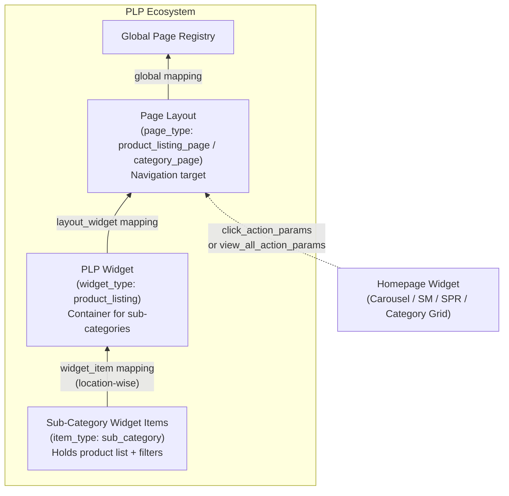
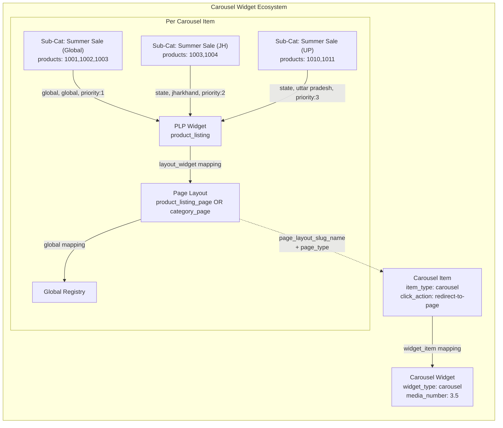
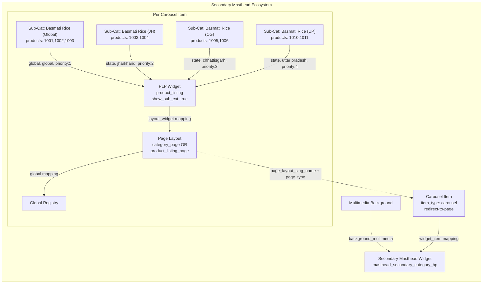
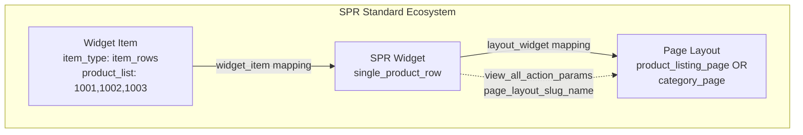
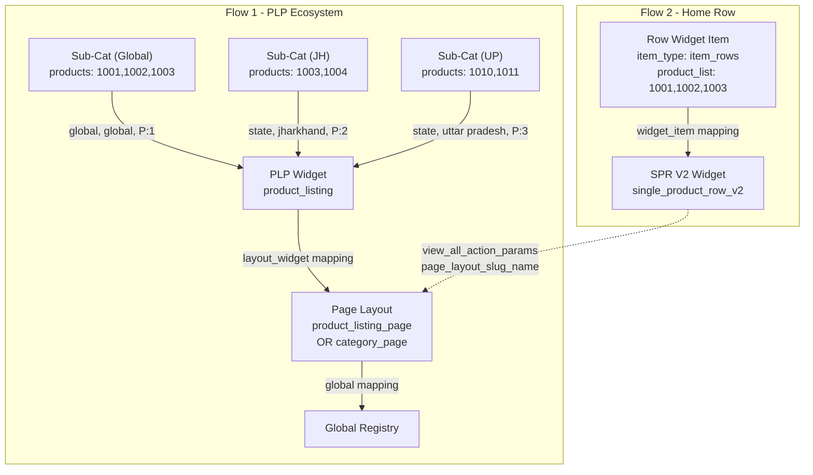
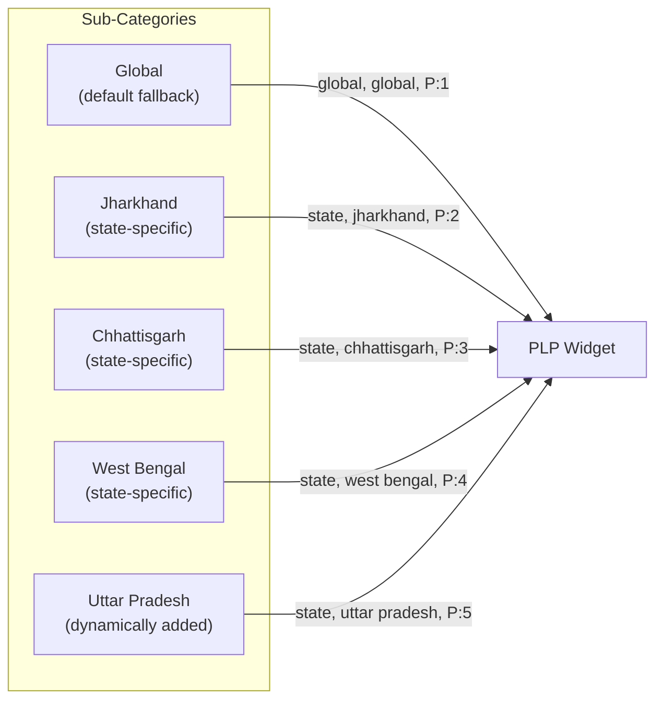

# Page Layout — Widget Support Reference

## 1. Overview

A **Page Layout** is the backend page structure that every navigable widget creates as its **click destination**. When a user taps a carousel banner, a secondary masthead item, a product rail's "View All", or a category grid card — they land on a Page Layout.

Every Page Layout follows the **same 3-layer ecosystem** regardless of which widget creates it:

```
Sub-Category Widget Items (products + location mapping)
        ↓ mapped to
PLP Widget (product_listing)
        ↓ mapped to
Page Layout (product_listing_page / category_page)
        ↓ mapped to
Global Page Registry
```

> The Page Layout is **not a visible widget itself** — it is the navigation target created automatically by each widget's automation script.

---

## 2. Page Type Support

Every widget that creates a Page Layout must specify a `page_type`. There are **two page types**:

| Page Type | Value | Description | Sub-Cat Tabs? |
| :--- | :--- | :--- | :---: |
| **Product Listing Page** | `product_listing_page` | Flat product grid — shows all products in a single list | Optional |
| **Category Page** | `category_page` | Categorized browsing — shows sub-category tabs/cards | ✅ Yes |

### Which Widgets Support Which Page Types

| Widget | Supports `product_listing_page` | Supports `category_page` | Page Type Selection |
| :--- | :---: | :---: | :--- |
| **Carousel Widget** | ✅ | ✅ | Per carousel item (user selects for each item) |
| **Secondary Masthead** | ✅ | ✅ | Per carousel item (user selects for each item) |
| **SPR Standard** | ✅ | ✅ | User selects page type during configuration |
| **SPR Optimized (V2)** | ✅ | ✅ | User selects page type during configuration |
| **Multimedia SPR** | ✅ | ✅ | User selects page type during configuration |
| **Double Product Row** | ✅ | ✅ | User selects page type during configuration |
| **Double Product Row (V2)** | ✅ | ✅ | User selects page type during configuration |
| **Multimedia Double Row** | ✅ | ✅ | User selects page type during configuration |
| **Category Grid** | ✅ | ✅ | User selects page type during configuration |

> **Key Insight:** Carousel and Secondary Masthead select page type **per item**. All other widgets (Product Rails and Category Grid) select page type **per widget**.

---

## 3. Universal PLP Ecosystem (3-Layer Architecture)

Every widget that navigates to a page creates this **same 3-layer ecosystem**:



### 3 Objects Created

| Layer | Object | `item_type` / `widget_type` | API Endpoint |
| :---: | :--- | :--- | :--- |
| **Bottom** | Sub-Category Widget Item | `sub_category` | `/api/app/post_widget_item/` |
| **Middle** | PLP Widget | `product_listing` | `/api/app/widget/` |
| **Top** | Page Layout | `product_listing_page` or `category_page` | `/api/app/post_page_layout/` |

### 3 Mappings Created

| Mapping | Direction | API Endpoint |
| :--- | :--- | :--- |
| Sub-Cat → PLP Widget | `widget_item` mapping (location-wise CSV) | `/api/app/update_widget_widget_item_mapping/` |
| PLP Widget → Page Layout | `layout_widget` mapping | `/api/app/update_layout_widget_mapping/` |
| Page Layout → Global | `page_layout` mapping | `/api/app/update_page_page_layout_mapping/` |

---

## 4. Sub-Category Creation (Per Widget)

**Every** widget that has a `category_page` or `product_listing_page` creates **sub-category widget items** to hold the product list. The sub-categories are then **mapped to the PLP widget location-wise**.

### 4.1 Carousel Widget (Collection Banner — Scroll Mode)

**Script:** `CLP_Automation.gs` → `createCLPWidget()`

Each carousel widget item supports **state-specific product lists** with dynamic state addition. The page type (`product_listing_page` or `category_page`) is selected **per carousel item**.



**Key Details:**
- **Multiple sub-categories per carousel item** (one per state)
- **Global is required** (always present), other states are optional
- States are **dynamic** — user adds via "Add State" button
- Sub-categories mapped location-wise: `global/global`, `state/jharkhand`, `state/uttar pradesh`, etc.
- Page type selected **per carousel item** independently
- Products source: item codes (direct text, CSV URL, or pre-fetched array)

**Frontend State Selection:**

```
Carousel Widget Item: "Summer Sale"
┌──────────────────────────────────────────────────┐
│ Page Type: [category_page ▼]                     │
│                                                    │
│ Global Products:  1001, 1002, 1003               │
│                                                    │
│ ┌─ State: Jharkhand ──────────────────────────┐  │
│ │ Products: 1003, 1004                         │  │
│ └──────────────────────────────────────────────┘  │
│                                                    │
│ ┌─ State: Uttar Pradesh ──────────────────────┐  │
│ │ Products: 1010, 1011, 1012                   │  │
│ └──────────────────────────────────────────────┘  │
│                                                    │
│  [ + Add State ]                                   │
└──────────────────────────────────────────────────┘
```

**Slug Pattern:**
| Object | Slug | Purpose |
| :--- | :--- | :--- |
| Sub-Category (Global) | `{base}_sub_cat_wi_global` | Default products |
| Sub-Category (JH) | `{base}_sub_cat_wi_jh` | Jharkhand products |
| Sub-Category (UP) | `{base}_sub_cat_wi_up` | Uttar Pradesh products |
| Sub-Category (dynamic) | `{base}_sub_cat_wi_{state_key}` | Any new state |
| PLP Widget | `{base}_plp_w` | Product listing container |
| Page Layout | `{base}_Page_p` | Navigation target page |
| Carousel Item | `{base}_cl_wi` | The visible banner image |
| Carousel Widget | `{base}_Cl_w_HP` | Parent carousel container |


---

### 4.2 Secondary Masthead — Sub-Category Flow

**Script:** `Secondary_Masthead_Backend.gs` → 3-Phase Creation

Each carousel item in the Secondary Masthead creates **multiple sub-categories with location-wise (state-specific) product mapping**. The page type (`category_page` or `product_listing_page`) is selected **per carousel item**.



**Key Details:**
- **Multiple sub-categories per carousel item** — one per sub-category name × state
- Each sub-category mapped location-wise: `global/global`, `state/jharkhand`, `state/chhattisgarh`, etc.
- **States are dynamic** — user can add any state using the "Add State" button
- **Global is required** (always present), other states are optional
- Page type selected **per carousel item** independently
- PLP uses `app_configurations: {"show_sub_cat": true}` to render sub-category tabs

**Slug Pattern:**
| Object | Slug | Purpose |
| :--- | :--- | :--- |
| Page Layout | `{base}_item_{n}_page` | Per-item page |
| PLP Widget | `{base}_item_{n}_plp` | Per-item product listing |
| Sub-Category (Global) | `{base}_item_{n}_subcat_{m}_global` | Default products |
| Sub-Category (JH) | `{base}_item_{n}_subcat_{m}_jh` | Jharkhand products |
| Sub-Category (CG) | `{base}_item_{n}_subcat_{m}_cg` | Chhattisgarh products |
| Sub-Category (dynamic) | `{base}_item_{n}_subcat_{m}_{state_key}` | Any new state |
| Carousel Item | `{base}_item_{n}_carousel` | Visible carousel banner |
| SM Widget | `{base}_sm_hp` | Parent widget container |

---

### 4.3 Single Product Row (Standard) — Sub-Category Flow

**Script:** `SPR_Widget_Optimized.gs` → `createSPRStandardWidget()`

The standard SPR creates a **single widget item** of type `item_rows` (not `sub_category`). It creates a Page Layout but with a simpler mapping.



**Key Details:**
- Uses `item_rows` type (not `sub_category`) for the home row
- Supports **location-wise mapping** — Global + dynamic states (JH, CG, UP, etc.)
- Page type: `product_listing_page` or `category_page` (user selects)
- "View All" button links to the PLP page

---

### 4.4 Single Product Row (Optimized V2) — Sub-Category Flow

**Script:** `SPR_Widget_Optimized.gs` → `createSPROptimizedWidget()`

The Optimized SPR creates **two parallel flows** — a PLP ecosystem with `sub_category` items AND a home row widget with `item_rows`.



**Key Details:**
- **Creates sub_category** for the PLP ecosystem (Flow 1) — supports state-wise mapping
- **Creates item_rows** for the home row display (Flow 2)
- Page type: `product_listing_page` or `category_page` (user selects)
- Sub-categories mapped location-wise: `global/global`, `state/jharkhand`, etc.
- The SPR V2 widget's "View All" links to the PLP page
- Uses deterministic slugs (no timestamps)

**Slug Pattern:**
| Object | Slug | Purpose |
| :--- | :--- | :--- |
| Sub-Category (Global) | `{base}_sc_wi_global` | PLP product list (default) |
| Sub-Category (JH) | `{base}_sc_wi_jh` | PLP product list (Jharkhand) |
| Sub-Category (dynamic) | `{base}_sc_wi_{state_key}` | PLP product list (any state) |
| PLP Widget | `{base}_plp_w` | PLP container |
| Page Layout | `{base}_page_p` | Navigation target |
| Row Item | `{base}_pr_wi` | Home row display |
| SPR V2 Widget | `{base}_spr_opt` | Home widget |

---

### 4.5 Multimedia Product Row — Sub-Category Flow

**Same as Optimized (V2)** with an additional **multimedia background** object.

- Widget type: `multimedia_single_product_row` or `multimedia_single_product_row_v2`
- Creates same PLP ecosystem with **state-wise sub-category mapping**
- Supports **location-wise mapping** — Global + dynamic states
- **Additional step**: Creates a multimedia object and sets it in `background_multimedia`

> **Important:** Standard and Optimized SPR variants (`single_product_row`, `single_product_row_v2`) **IGNORE** the `background_multimedia` field. Only `multimedia_*` variants render backgrounds.

---

### 4.6 Double Product Row — Sub-Category Flow

**Identical ecosystem** to Single Product Row, just with different widget types:

| Single Row | Double Row |
| :--- | :--- |
| `single_product_row` | `double_product_row` |
| `single_product_row_v2` | `double_product_row_v2` |
| `multimedia_single_product_row` | `multimedia_double_product_row` |
| `multimedia_single_product_row_v2` | `multimedia_double_product_row_v2` |

**Key Difference:** Displays products in 2 rows instead of 1. The sub-category and PLP ecosystem creation is identical.

---

### 4.7 Category Grid — Sub-Category Flow

**Script:** `Category_Grid_Backend.gs`

Similar to Secondary Masthead — each category item creates **state-specific sub-categories** mapped location-wise.

- Page type: `product_listing_page` or `category_page` (user selects)
- State-wise sub-categories (Global, JH, CG, WB, + dynamic states)
- PLP uses `app_configurations: {"show_sub_cat": true}`

---

## 5. Location-Wise Sub-Category Mapping

### How Location Mapping Works

When sub-categories are created, they are **mapped to the PLP widget using a CSV file** that specifies the location (`level_tag` + `level_property`). This allows different products to be shown to users in different states.



### Mapping CSV Format

```csv
widget_item_slug_name,level_tag,level_property,priority,cohort
item_1_subcat_1_global,global,global,1,
item_1_subcat_1_jh,state,jharkhand,2,
item_1_subcat_1_cg,state,chhattisgarh,3,
item_1_subcat_1_wb,state,west bengal,4,
item_1_subcat_1_up,state,uttar pradesh,5,
```

### State Reference Table

| State | `level_tag` | `level_property` | Slug Suffix | Required? |
| :--- | :--- | :--- | :--- | :---: |
| Global (Default) | `global` | `global` | `_global` | ✅ Always |
| Jharkhand | `state` | `jharkhand` | `_jh` | Optional |
| Chhattisgarh | `state` | `chhattisgarh` | `_cg` | Optional |
| West Bengal | `state` | `west bengal` | `_wb` | Optional |
| Uttar Pradesh | `state` | `uttar pradesh` | `_up` | Optional (dynamic) |
| Patna | `state` | `patna` | `_patna` | Optional (dynamic) |
| *(any new state)* | `state` | `{state_name_lowercase}` | `_{short_key}` | Optional (dynamic) |

### Which Widgets Use Location Mapping

| Widget | Location Mapping? | States Supported |
| :--- | :---: | :--- |
| **Carousel Widget** | ✅ Yes | Dynamic (user adds via "Add State" button) |
| **Secondary Masthead** | ✅ Yes | Dynamic (user adds via "Add State" button) |
| **Category Grid** | ✅ Yes | Dynamic (user adds via "Add State" button) |
| **SPR Standard** | ✅ Yes | Dynamic (user adds via "Add State" button) |
| **SPR Optimized (V2)** | ✅ Yes | Dynamic (user adds via "Add State" button) |
| **Multimedia SPR** | ✅ Yes | Dynamic (user adds via "Add State" button) |
| **All Double Row Variants** | ✅ Yes | Same as Single Row equivalents |

---

## 6. PLP Navigation Mechanisms

Different widgets use different mechanisms to link to their Page Layout:

### Mechanism 1: `click_action_params` (Carousel, Secondary Masthead, Category Grid)

Used by **widget items** (carousel items, category items). The click redirects to a page.

```javascript
{
  "item_click_action": "redirect-to-page",
  "click_action_params": {
    "page_type": "product_listing_page",  // or "category_page"
    "page_layout_slug_name": "{base}_Page_p"
  }
}
```

**Note:** The `page_type` in `click_action_params` matches the `page_type` on the Page Layout.

### Mechanism 2: `view_all_action_params` (Product Rails)

Used by **widgets** (SPR, Double Row). The "View All" button redirects to a page.

```javascript
{
  "view_all_action_name": "redirect-to-page",
  "view_all_action_params": {
    "page_type": "product_listing_page",
    "page_layout_slug_name": "{base}_page_p"
  }
}
```

---

## 7. Universal Filters & Configurations

The following filters and configurations are **universal** across **ALL widget types** (Carousel, Secondary Masthead, SPR, Category Grid, etc.). They are handled by `WidgetItemHelper` / `PageViewUtils` on the backend and apply to every widget item in the PLP ecosystem.

### Widget-Level Filters (`filter_dict` on Widget)

| Key | Type | Component | Description |
| :--- | :--- | :--- | :--- |
| `max_order_constraint` | int | `NumberInput` | Show widget only if user's total orders <= Y |
| `min_order_constraint` | int | `NumberInput` | Show widget only if user's total orders >= X |

### Item-Level Filters (`filter_dict` on WidgetItem)

| Key | Type | Component | Description |
| :--- | :--- | :--- | :--- |
| `in_stk_item_codes` | list of int | `ProductListInput` | Mandatory in-stock item codes — widget item only shown if these items are in stock |

### Product-Level Filters (`product_filter_dict` on WidgetItem)

| Key | Operators | Component | Description |
| :--- | :--- | :--- | :--- |
| `category` | `in`, `equal` | `TextInput` | Filter by product category |
| `sub_category` | `in`, `equal` | `TextInput` | Filter by sub-category |
| `mrp` | `lte`, `gte`, `lt`, `gt`, `equal` | `NumberInput` | Filter by MRP |
| `sp` | `lte`, `gte`, `lt`, `gt`, `equal` | `NumberInput` | Filter by Selling Price |
| `discount` | `lte`, `gte`, `lt`, `gt`, `equal` | `NumberInput` | Filter by discount percentage |

### App Configurations (`app_configurations` on Widget)

| Key | Type | Default | Component | Description |
| :--- | :--- | :--- | :--- | :--- |
| `allow_android` | boolean | `true` | `ToggleInput` | Toggle visibility on Android |
| `allow_ios` | boolean | `true` | `ToggleInput` | Toggle visibility on iOS |
| `min_android_version` | version | — | `VersionInput` | Show only on Android >= V |
| `max_android_version` | version | — | `VersionInput` | Show only on Android <= V |
| `min_ios_version` | version | — | `VersionInput` | Show only on iOS >= V |
| `max_ios_version` | version | — | `VersionInput` | Show only on iOS <= V |

### Widget Item Additional Properties (`additional_properties` on WidgetItem)

| Property | Type | Default | Description |
| :--- | :--- | :--- | :--- |
| `oos_product_count` | int | `0` | Number of Out-of-Stock products to append at end |
| `show_pb_tag` | boolean | `true` | Show "Previously Bought" tag on product cards |
| `pb_reorder` | boolean | `true` | Re-sort to show Previously Bought items first |

### Which Widgets Support Which Filters

| Widget | Widget-Level Filters | Item-Level Filters | Product-Level Filters | App Config | Additional Properties |
| :--- | :---: | :---: | :---: | :---: | :---: |
| **Carousel Widget** | Yes | Yes | Yes | Yes | Yes |
| **Secondary Masthead** | Yes | Yes | Yes | Yes | Yes |
| **SPR (all 4 variants)** | Yes | Yes | Yes | Yes | Yes |
| **Category Grid** | Yes | Yes | Yes | Yes | Yes |

> These filters are applied at serve-time by the backend (`WidgetItemHelper` for item/product filters, `PageViewUtils.__filter_by_app_version` for app configurations). They do **not** affect the widget creation payload — they are set separately via `filter_dict`, `product_filter_dict`, `app_configurations`, and `additional_properties` fields.

---

## 8. PLP `app_configurations`

The PLP Widget's `app_configurations` field controls display behavior:

| Config Key | Type | Default | Description |
| :--- | :--- | :--- | :--- |
| `show_sub_cat` | Boolean | `false` | Show sub-category tabs on the page |

**When to use `show_sub_cat: true`:**
- Carousel Widget (has multiple state-wise sub-categories)
- Secondary Masthead (always — has multiple state-wise sub-categories)
- Category Grid (always — has multiple state-wise sub-categories)

**When to use `show_sub_cat: false` (or omit):**
- SPR Standard (uses `item_rows`, not sub-categories)
- SPR Optimized (single global sub-category)
- All non-optimized variants

---

## 9. Complete Widget → PLP Summary

**What this section shows:** This section provides two comprehensive reference tables that summarize how all widgets create their Product Listing Page (PLP) ecosystems. Use these tables to quickly understand:
- Which widgets create which types of sub-categories
- Which page types each widget supports
- Whether a widget uses location-based mapping
- The backend script responsible for creating each widget


### All 8 Product Rail Variants

| # | Rows | Optimized? | Multimedia? | `widget_type` | PLP Item Type |
| :---: | :---: | :---: | :---: | :--- | :--- |
| 1 | 1 | ❌ | ❌ | `single_product_row` | `item_rows` + `sub_category` |
| 2 | 1 | ✅ | ❌ | `single_product_row_v2` | `sub_category` + `item_rows` |
| 3 | 1 | ❌ | ✅ | `multimedia_single_product_row` | `item_rows` + `sub_category` |
| 4 | 1 | ✅ | ✅ | `multimedia_single_product_row_v2` | `sub_category` + `item_rows` |
| 5 | 2 | ❌ | ❌ | `double_product_row` | `item_rows` + `sub_category` |
| 6 | 2 | ✅ | ❌ | `double_product_row_v2` | `sub_category` + `item_rows` |
| 7 | 2 | ❌ | ✅ | `multimedia_double_product_row` | `item_rows` + `sub_category` |
| 8 | 2 | ✅ | ✅ | `multimedia_double_product_row_v2` | `sub_category` + `item_rows` |

### Master Summary Table

| Widget | `widget_type` | Page Type | Location Mapping? | Sub-Categories? | Script |
| :--- | :--- | :--- | :---: | :---: | :--- |
| Carousel | `carousel` | `PLP` or `CP` (per item) | ✅ Dynamic | ✅ (state-wise) | `CLP_Automation.gs` |
| Secondary Masthead | `masthead_secondary_category_hp` | `PLP` or `CP` (per item) | ✅ Dynamic | ✅ (state-wise) | `Secondary_Masthead_Backend.gs` |
| Category Grid | `category` | `PLP` or `CP` (per widget) | ✅ Dynamic | ✅ (state-wise) | `Category_Grid_Backend.gs` |
| SPR Standard | `single_product_row` | `PLP` or `CP` (per widget) | ✅ Dynamic | ✅ (state-wise) | `SPR_Widget_Optimized.gs` |
| SPR Optimized (V2) | `single_product_row_v2` | `PLP` or `CP` (per widget) | ✅ Dynamic | ✅ (state-wise) | `SPR_Widget_Optimized.gs` |
| Multimedia SPR | `multimedia_single_product_row` | `PLP` or `CP` (per widget) | ✅ Dynamic | ✅ (state-wise) | `SPR_Widget_Optimized.gs` |
| Multimedia SPR V2 | `multimedia_single_product_row_v2` | `PLP` or `CP` (per widget) | ✅ Dynamic | ✅ (state-wise) | `SPR_Widget_Optimized.gs` |
| Double Row | `double_product_row` | `PLP` or `CP` (per widget) | ✅ Dynamic | ✅ (state-wise) | `SPR_Widget_Optimized.gs` |
| Double Row V2 | `double_product_row_v2` | `PLP` or `CP` (per widget) | ✅ Dynamic | ✅ (state-wise) | `SPR_Widget_Optimized.gs` |
| Multimedia Double | `multimedia_double_product_row` | `PLP` or `CP` (per widget) | ✅ Dynamic | ✅ (state-wise) | `SPR_Widget_Optimized.gs` |

> **PLP** = `product_listing_page`, **CP** = `category_page`

---

## 10. Designing & Adding a Widget on the PLP Page (Frontend Builder)

### 9.1 Overview

The **PLP page** (Product Listing Page) is the navigation destination rendered when a user taps a widget on the homepage. In the Optimus builder you can design the PLP page by adding widgets to it — each widget you add appears on that page when served to the end user.

### 9.2 How the Builder Adds a Widget

The widget-add flow in `WidgetLibrary.jsx` follows these steps:

```
User selects a widget type from the dropdown
        ↓
Clicks the [ + ] button → handleAdd()
        ↓
Resolves widget definition from WIDGET_TYPES
        ↓
Calls addWidget({ ...widget.defaultProps, type: widget.type })
        ↓
Widget appears in the canvas / PLP page layout
```

`WIDGET_TYPES` is assembled from **two sources**:

| Source | How it is built | Where to register |
| :--- | :--- | :--- |
| Config-driven | `WidgetRegistry.getAllConfigs()` | `src/config/WidgetRegistry.js` → `configMap` |
| Legacy | `LegacyWidgetDefinitions` array | `src/config/WidgetRegistry.js` → exported array |

### 9.3 Widget Type Handling in the Builder

`WidgetRenderer.jsx` resolves which React component to render for any given `widget.type` using a **two-step lookup**:

```
1. Config-driven lookup
   WidgetRegistry.getConfig(widget.type)
       → reads config.rendering.component (string key)
       → resolves component from configComponentMap
       e.g. 'ProductRail' → <ProductRail />

2. Legacy fallback
   legacyComponentMap[widget.type]
       e.g. 'Collection Banner' → <CollectionBanner />
            'Category Grid'     → <CategoryGrid />
            'Primary Masthead'  → <PrimaryMasthead />

3. If neither matches → renders error: "Unknown: {type}"
```

**Current component maps:**

```javascript
// Config-driven (src/components/Widgets/WidgetRenderer.jsx)
const configComponentMap = {
    'ProductRail': ProductRail,
    // 'CategoryGrid': CategoryGridNew,   // future
    // 'Masthead':     MastheadNew,        // future
};

// Legacy
const legacyComponentMap = {
    'Single Product Row':           SingleProductRow,
    'Single Product Row Optimize':  SingleProductRowOptimized,
    'Secondary Masthead Carousel':  PrimaryMasthead,
    'Primary Masthead':             PrimaryMasthead,
    'Banner With Product Listing':  BannerWithProductListing,
    'Category Grid':                CategoryGrid,
    'Collection Banner':            CollectionBanner,
};
```

### 9.4 `CollectionBanner` — Dual-Mode Widget

`CollectionBanner.jsx` is a single widget component that switches its render based on `widget.displayMode`:

| `displayMode` | Renders | Use case | See also |
| :--- | :--- | :--- | :--- |
| `'scroll'` (default) | `BannerWithProductListing` | Scrollable carousel banners | [Section 4.1 — Carousel Widget](#41-carousel-widget-collection-banner--scroll-mode) |
| `'stick'` | `CategoryGrid` | 4-column static category grid | [Section 4.7 — Category Grid](#47-category-grid--sub-category-flow) |

---

## 11. Adding a New Widget Type to the PLP Page

Follow these steps to introduce a new widget type to the Optimus builder so it can be placed on PLP (or any) pages.

### Step 1 — Create the React component

Add a new file under `src/components/Widgets/`:

```
src/components/Widgets/MyNewWidget.jsx
```

Implement the component accepting a `widget` prop.

### Step 2A — Register as Config-Driven (recommended for new widgets)

**a)** Create a config file:

```
src/config/widgets/MyNewWidgetConfig.js
```

Minimum shape:

```javascript
export const MyNewWidgetConfig = {
    type: 'my_new_widget',          // unique type key
    label: 'My New Widget',         // shown in the dropdown
    description: 'Short description shown in the sidebar',
    defaultProps: {
        title: '',
        // ...other default field values
    },
    rendering: {
        component: 'MyNewWidget',   // key used in configComponentMap
    },
    // variant / strategy / form / validation sections as needed
};
```

**b)** Import and add to `WidgetRegistry.js`:

```javascript
// src/config/WidgetRegistry.js
import { MyNewWidgetConfig } from './widgets/MyNewWidgetConfig';

const configMap = {
    [ProductRailConfig.type]:    ProductRailConfig,
    [MyNewWidgetConfig.type]:    MyNewWidgetConfig,   // ← add here
};
```

**c)** Register the component in `WidgetRenderer.jsx`:

```javascript
import MyNewWidget from './MyNewWidget';

const configComponentMap = {
    'ProductRail':  ProductRail,
    'MyNewWidget':  MyNewWidget,   // ← must match config.rendering.component
};
```

### Step 2B — Register as Legacy (for quick additions / migration)

Add an entry directly to `LegacyWidgetDefinitions` in `WidgetRegistry.js`:

```javascript
export const LegacyWidgetDefinitions = [
    {
        type: 'My New Widget',           // must match legacyComponentMap key
        label: 'My New Widget',
        description: 'Short description',
        defaultProps: { title: '' },
    },
];
```

Then add the component to `legacyComponentMap` in `WidgetRenderer.jsx`:

```javascript
import MyNewWidget from './MyNewWidget';

const legacyComponentMap = {
    // ...existing entries...
    'My New Widget': MyNewWidget,
};
```

### Step 3 — Wire the PLP Backend type (if the widget navigates to a PLP)

If the new widget creates a Page Layout click destination, add its `widget_type` to:

1. **Section 2 table** in this document — add a row for the new widget.
2. **Section 8 Master Summary Table** — add page type + location mapping details.
3. The backend automation script — create/extend the Google Apps Script that builds the 3-layer PLP ecosystem (Sub-Cat → PLP Widget → Page Layout).

### Step 4 — Handle `widget_type` in Navigation Params

Depending on how the widget triggers PLP navigation, add one of:

```javascript
// Widget item click (Carousel / Category Grid style)
"click_action_params": {
    "page_type": "product_listing_page",   // or "category_page"
    "page_layout_slug_name": "{base}_Page_p"
}

// Widget-level "View All" (Product Rail style)
"view_all_action_params": {
    "page_type": "product_listing_page",
    "page_layout_slug_name": "{base}_page_p"
}
```

### Quick-Reference Checklist

```
[ ] src/components/Widgets/MyNewWidget.jsx        — React component
[ ] src/config/widgets/MyNewWidgetConfig.js       — Config (if config-driven)
[ ] src/config/WidgetRegistry.js                  — Add to configMap / LegacyWidgetDefinitions
[ ] src/components/Widgets/WidgetRenderer.jsx     — Add to configComponentMap / legacyComponentMap
[ ] Wiki: Section 2 — Page Type Support table
[ ] Wiki: Section 8 — Master Summary table
[ ] Backend script                                — 3-layer PLP ecosystem creation
```

---

## 12. Related Documentation

- [Product Rail Widget](./WIDGET-Product-Rail.md) — All 8 SPR variants and their composition
- [Collection Banner Widget](./WIDGET-Collection-Banner.md) — Carousel (Scroll) and Category Grid (Stick) modes
- [Masthead Widget](./WIDGET-Masthead.md) — Secondary Masthead 3-phase creation, state-wise mapping
- [Slug Name Reference](./SLUG_NAME.md) — All slug patterns across widgets
- [Backend Automation Services](./BACKEND-Automation-Services.md) — Overview of automation scripts
- [Architecture — Config-Driven System](./ARCH-Config-Driven-System.md) — WidgetRegistry, VariantResolver, config schema
- [Widget Library Reference](./REFERENCE-Widget-Library.md) — All supported widgets and their variants
