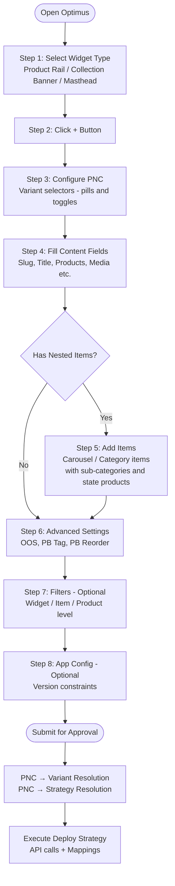

# Create Widget — User Selection Journey (Step-by-Step)

> **Purpose:** This is the single reference for what a user sees and selects when creating any widget. Every step, every field, every conditional section — in exact order.
>
> **Config file:** `src/config/Feature/stepCreateWidgetConfig.js`
> **Backend creation flow:** [Feature-Creation-Widget.md](./Feature-Creation-Widget.md)

---

## 1. Entry Point — Widget Type Selection

User opens Optimus → Sidebar shows **Widget Library** at the top.

```
┌─────────────────────────────────────────────┐
│  Widget Types                                │
│                                              │
│  ┌─────────────────────────────────┐ ┌───┐ │
│  │ Product Rail              ▼     │ │ + │ │
│  └─────────────────────────────────┘ └───┘ │
│                                              │
│  Scrollable product cards with "View All"    │
│  link. Supports single row and double row.   │
└─────────────────────────────────────────────┘
```

**Step 1: Pick Widget Type** (dropdown)

| Option | Description |
| :--- | :--- |
| **Product Rail** | Horizontal product cards row — SPR (single) or DPR (double) |
| **Collection Banner** | Carousel banners (Scroll) or 4-column category grid (Stick) |
| **Masthead** | Header with multimedia background — Primary (icons) or Secondary (carousel + ecosystem) |

**Step 2: Click "+"** → Widget added to canvas with default state → PropertyEditor opens below.

---

## 2. PropertyEditor — What Appears After "+"

Once a widget is added, the **PropertyEditor** sidebar shows sections **in this exact order**:

```
┌─────────────────────────────────────────────┐
│  Section 1 → Variant Properties (PNC)        │  ← ALWAYS first
│  Section 2 → Content Settings (fields)       │  ← form fields
│  Section 3 → Advanced Settings (optional)    │  ← OOS, PB tag etc.
│  Section 4 → Filters (optional)              │  ← widget/item/product
│  Section 5 → App Configuration (optional)    │  ← version constraints
└─────────────────────────────────────────────┘
```

The **PNC selection** (Section 1) determines:
1. Which **fields** appear in Section 2 (conditional visibility)
2. Which **backend widget_type** gets resolved (variant matrix)
3. Which **deploy strategy** runs at submission (Standard/Optimized etc.)

---

## 3. Product Rail — Full Selection Journey

### Step 1: PNC Selection (Variant Properties)

```
┌─────────────────────────────────────────────┐
│  ┌─────────────────────────────────────────┐│
│  │ Layout                                   ││
│  │  ┌──────────┐  ┌──────────┐             ││
│  │  │● Single(1)│  │  Double(2)│             ││  ← PillSelector
│  │  └──────────┘  └──────────┘             ││
│  └─────────────────────────────────────────┘│
│                                              │
│  ┌─────────────────────────────────────────┐│
│  │ ● Optimized Rendering                   ││
│  │   Creates PLP ecosystem with state-wise ││  ← Card Toggle (ON by default)
│  │   sub-categories                         ││
│  └─────────────────────────────────────────┘│
└─────────────────────────────────────────────┘
```

**PNC Properties:**

| Property | UI Component | Options | Default | What It Does |
| :--- | :--- | :--- | :--- | :--- |
| `rows` | PillSelector | `1` (Single Row), `2` (Double Row) | `1` | Controls card row count |
| `is_optimized` | Card Toggle | ON / OFF | `true` (ON) | ON → adds `_v2` suffix to widget_type (optimized rendering path) |

> `has_multimedia` is **NOT** a toggle — it's **implicit**. If user uploads a background image/video, `has_multimedia` automatically becomes `true`.

**Variant Resolution (PNC → backend type):**

| rows | is_optimized | has_multimedia | Resolved Backend Type |
| :---: | :---: | :---: | :--- |
| 1 | OFF | No media | `single_product_row` |
| 1 | ON | No media | `single_product_row_v2` |
| 1 | OFF | Has media | `multimedia_single_product_row` |
| 1 | ON | Has media | `multimedia_single_product_row_v2` |
| 2 | OFF | No media | `double_product_row` |
| 2 | ON | No media | `double_product_row_v2` |
| 2 | OFF | Has media | `multimedia_double_product_row` |
| 2 | ON | Has media | `multimedia_double_product_row_v2` |

### Step 2: Content Settings (Form Fields)

Fields appear in this order. Some are conditional.

| # | Field | Component | Condition | Required | Description |
| :---: | :--- | :--- | :--- | :---: | :--- |
| 1 | Page Type | SelectInput | Always | Yes | `product_listing_page` or `category_page` — determines "View All" navigation |
| 2 | Slug Name | SlugBuilder | Always | Yes | Base slug (e.g. `rice_mela_rail`) — all derived slugs built from this |
| 3 | Title (English) | TextInput | Always | Yes | Widget heading shown to user (EN) |
| 4 | Title (Hindi) | TextInput | Always | No | Widget heading (HI) |
| 5 | Products | ProductListInput | Always | Yes | Comma-separated item codes (1-200 products) |
| 6 | Background Media | ImageUpload | Always | No | Upload triggers `has_multimedia = true` → variant becomes `multimedia_*` |
| 7 | Background Video URL | UrlInput | Always | No | Alternative to image — `.mp4 / .mov / .webm` |
| 8 | View All Page Slug | TextInput | **Only if `is_optimized = OFF`** | No | Override for the "View All" link target |

### Step 3: State-Wise Products

A **State-Wise Products** section always appears below the content fields for all Product Rail variants. This creates location-specific sub-categories in the PLP ecosystem.

```
┌─────────────────────────────────────────────┐
│  ─── State-Wise Products ───────────────    │
│                                              │
│  Global Products: [1001, 1002, 1003____]     │  ← REQUIRED (always)
│                                              │
│  ┌─ State: Jharkhand ─────────────────────┐ │
│  │ Products: [1003, 1004______________]    │ │  ← optional state override
│  │                                    [✕]  │ │
│  └─────────────────────────────────────────┘ │
│                                              │
│  ┌─ State: West Bengal ───────────────────┐ │
│  │ Products: [1007, 1008______________]    │ │
│  │                                    [✕]  │ │
│  └─────────────────────────────────────────┘ │
│                                              │
│  [ + Add State ]                             │
│                                              │
│  Available states: Jharkhand (jh),           │
│  Chhattisgarh (cg), West Bengal (wb),        │
│  Uttar Pradesh (up), Patna (patna)           │
└─────────────────────────────────────────────┘
```

**State-Wise Rules:**
- Global is **always required** — cannot be removed
- Additional states are optional — added via "+ Add State" button
- Each state gets its own product list (location-specific override)
- States can be removed with "✕" button
- This section appears for **ALL Product Rail variants** — Standard and Optimized, Single and Double

### Step 4: If Background Media Uploaded → Multimedia Colors

When user uploads a background image/video, the multimedia color settings become relevant (these are part of the multimedia object creation).

| Field | Component | Default | Purpose |
| :--- | :--- | :--- | :--- |
| Accent Color | ColorPicker | `#0277FA` | Theme accent |
| Transition Color | ColorPicker | `#FFFFFF` | Background fade |
| Text Color | ColorPicker | `#FFFFFF` | Heading text |
| Icon BG Color | ColorPicker | `#F0F0F0` | Card icon background |

> These color fields are part of the multimedia object, not the widget itself. They only matter when `has_multimedia = true`.

### Step 5: Advanced Settings

| Field | Component | Default | Description |
| :--- | :--- | :--- | :--- |
| OOS Product Count | NumberInput | `0` | Out-of-stock products appended at end |
| Show PB Tag | ToggleInput | `true` | Show "Previously Bought" badge |
| PB Reorder | ToggleInput | `true` | Move PB items to front of list |

### Step 6: Filters (Optional)

| Level | Filter | Component | Description |
| :--- | :--- | :--- | :--- |
| Widget | Max Order Constraint | NumberInput | Show only if user orders <= Y |
| Widget | Min Order Constraint | NumberInput | Show only if user orders >= X |
| Item | In-Stock Item Codes | ProductListInput | Only show if these items are in stock |
| Product | Category / Sub-Category | TextInput | Filter by category |
| Product | MRP / SP / Discount | NumberInput | Filter by price/discount |

### Step 7: App Configuration (Optional)

| Field | Component | Description |
| :--- | :--- | :--- |
| Allow Android | ToggleInput | Show on Android? |
| Allow iOS | ToggleInput | Show on iOS? |
| Min/Max Android Version | VersionInput | Version range constraint |
| Min/Max iOS Version | VersionInput | Version range constraint |

### Decision Tree — Product Rail

```
User selects "Product Rail" + clicks "+"
│
├── PNC: Rows? ──→ [1] Single  or  [2] Double
│
├── PNC: Optimized? ──→ ON (default) or OFF
│   │
│   ├── ON  → widget_type gets `_v2` suffix
│   │         → "View All Page Slug" field HIDDEN (auto-linked to PLP page)
│   │
│   └── OFF → widget_type WITHOUT `_v2` suffix
│             → "View All Page Slug" field VISIBLE (manual override)
│
├── State-Wise Products section ALWAYS VISIBLE (all variants)
│   → Global products (required) + optional state overrides
│
├── Background Media uploaded?
│   │
│   ├── Yes → has_multimedia = true → variant becomes multimedia_*
│   │         → Color picker fields become relevant
│   │
│   └── No  → has_multimedia = false → standard variant
│
├── Fill: Page Type, Slug, Title EN/HI, Products
│
├── (Optional) Advanced Settings, Filters, App Config
│
└── Submit → variant resolved from PNC matrix → deploy strategy executes
```

---

## 4. Collection Banner — Full Selection Journey

### Step 1: PNC Selection

```
┌─────────────────────────────────────────────┐
│  ┌─────────────────────────────────────────┐│
│  │ Display Mode                             ││
│  │  ┌──────────┐  ┌──────────┐             ││
│  │  │● Scroll  │  │  Stick   │             ││  ← PillSelector
│  │  └──────────┘  └──────────┘             ││
│  └─────────────────────────────────────────┘│
└─────────────────────────────────────────────┘
```

| Property | UI Component | Options | Default | What It Does |
| :--- | :--- | :--- | :--- | :--- |
| `displayMode` | PillSelector | `scroll`, `stick` | `scroll` | Scroll = horizontal carousel banners; Stick = 4-column category grid |

**Variant Resolution:**

| displayMode | Resolved Backend Type |
| :--- | :--- |
| `scroll` | `carousel` |
| `stick` | `category` |

### Step 2A: Content Settings — Scroll Mode

If `displayMode = scroll`:

| # | Field | Component | Required | Description |
| :---: | :--- | :--- | :---: | :--- |
| 1 | Slug Name | SlugBuilder | Yes | Base slug |
| 2 | Title (English) | TextInput | Yes | Widget heading |
| 3 | Media Number | TextInput | No | Visible items count (e.g. `3.5` = 3 full + half peek of 4th) |
| 4 | **Carousel Items** | ScrollItemEditor | Yes | Nested editor — add multiple banner items |

**Each Carousel Item contains:**

```
┌─────────────────────────────────────────────┐
│  ─── Carousel Item #1 ──────────────────    │
│                                              │
│  Banner Image:  [Choose File] [banner.jpg]   │  ← ImageUpload (required, max 300KB)
│  Title:         [Summer Sale__________]      │  ← TextInput (required)
│  Page Type:     ○ Product Listing  ○ Category│  ← PillSelector (required)
│  Product Codes: [1001, 1002, 1003____]       │  ← TextInput (required)
│                                              │
│  ─── State-Wise Products ───────────────    │
│  Global Products: [1001, 1002, 1003__]       │  ← required
│  ┌─ Jharkhand ─────────────────────────┐    │
│  │ [1003, 1004________________]    [✕]  │    │  ← optional state
│  └──────────────────────────────────────┘    │
│  [ + Add State ]                             │
│                                              │
│  ═══════════════════════════════════════════ │
│  ─── Carousel Item #2 ──────────────────    │
│  ...                                         │
│  ═══════════════════════════════════════════ │
│  [ + Add Carousel Item ]                     │
└─────────────────────────────────────────────┘
```

**Per Carousel Item fields:**

| Field | Component | Required | Description |
| :--- | :--- | :---: | :--- |
| Banner Image | ImageUpload | Yes | Max 300KB, original dimensions preserved |
| Item Title | TextInput | Yes | Banner text |
| Page Type | PillSelector | Yes | `product_listing_page` or `category_page` — selected per item |
| Product Codes | TextInput | Yes | Comma-separated, CSV URL, or newline-separated |
| Global Products | TextInput | Yes | Global product list (required) |
| State Products | TextInput (× N) | No | Per-state override via "+ Add State" |

### Step 2B: Content Settings — Stick Mode

If `displayMode = stick`:

| # | Field | Component | Required | Description |
| :---: | :--- | :--- | :---: | :--- |
| 1 | Slug Name | SlugBuilder | Yes | Base slug |
| 2 | Title (English) | TextInput | Yes | Widget heading |
| 3 | Title (Hindi) | TextInput | No | Hindi heading (Stick only) |
| 4 | **Category Items** | CategoryItemEditor | Yes | Nested editor — add category cards |

**Each Category Item contains:**

```
┌─────────────────────────────────────────────┐
│  ─── Category Item #1 ──────────────────    │
│                                              │
│  Name (EN):    [Milk & Dairy__________]      │  ← required
│  Name (HI):    [दूध और डेयरी__________]      │  ← optional
│  Image:        [Choose File] [milk.jpg]      │  ← required, max 300KB
│  Page Type:    ○ Category  ○ Product Listing │  ← required, per item
│  Page Heading: [Milk Products_________]      │  ← required
│                                              │
│  ─── Sub-Category #1: "Fresh Milk" ─────   │
│  ┌──────────────────────────────────────┐   │
│  │ Name (EN): [Fresh Milk_________]      │   │
│  │ Name (HI): [ताजा दूध____________]      │   │
│  │ Image:     [Choose File] [sm.jpg]     │   │  ← optional, max 50KB
│  │                                        │   │
│  │ Global Products: [1001, 1002, 1003]   │   │  ← required
│  │ ┌─ Jharkhand ──────────────────┐      │   │
│  │ │ [1003, 1004__________]  [✕]   │      │   │
│  │ └──────────────────────────────┘      │   │
│  │ [ + Add State ]                        │   │
│  └──────────────────────────────────────┘   │
│                                              │
│  ─── Sub-Category #2: "Paneer" ─────────   │
│  ┌──────────────────────────────────────┐   │
│  │ Name (EN): [Paneer_____________]      │   │
│  │ Global Products: [2001, 2002___]      │   │
│  │ [ + Add State ]                        │   │
│  └──────────────────────────────────────┘   │
│                                              │
│  [ + Add Sub-Category ]                      │
│                                              │
│  ═══════════════════════════════════════════ │
│  ─── Category Item #2 ──────────────────    │
│  ...                                         │
│  ═══════════════════════════════════════════ │
│  [ + Add Category Item ]                     │
└─────────────────────────────────────────────┘
```

**Per Category Item fields:**

| Field | Component | Required | Description |
| :--- | :--- | :---: | :--- |
| Category Name (EN) | TextInput | Yes | Display name |
| Category Name (HI) | TextInput | No | Hindi name |
| Category Image | ImageUpload | Yes | Max 300KB |
| Page Type | PillSelector | Yes | Per item: `category_page` (default) or `product_listing_page` |
| Page Heading | TextInput | Yes | Heading shown on destination page |

**Per Sub-Category fields (nested inside each Category Item):**

| Field | Component | Required | Description |
| :--- | :--- | :---: | :--- |
| Name (EN) | TextInput | Yes | Sub-category label |
| Name (HI) | TextInput | No | Hindi label |
| Image | ImageUpload | No | Max 50KB (optional) |
| Global Products | TextInput | Yes | Product codes (required) |
| State Products | TextInput (× N) | No | Per-state override via "+ Add State" |

### Step 3: Advanced, Filters, App Config

Same as Product Rail — OOS count, PB tag, PB reorder, widget/item/product filters, version constraints.

### Decision Tree — Collection Banner

```
User selects "Collection Banner" + clicks "+"
│
├── PNC: Display Mode? ──→ [Scroll] or [Stick]
│
├── Scroll Mode:
│   ├── Fill: Slug, Title, Media Number
│   ├── Add Carousel Items (1-50):
│   │   └── Per item: Image, Title, Page Type, Products, State-wise Products
│   └── Deploy: SCROLL strategy
│
├── Stick Mode:
│   ├── Fill: Slug, Title EN, Title HI
│   ├── Add Category Items (1-20):
│   │   ├── Per item: Name EN/HI, Image, Page Type, Page Heading
│   │   └── Add Sub-Categories (1-50 per item):
│   │       └── Per sub-cat: Name EN/HI, Image, Global Products, State Products
│   └── Deploy: STICK strategy
│
├── (Optional) Advanced Settings, Filters, App Config
│
└── Submit → variant resolved → deploy strategy executes
```

---

## 5. Masthead — Full Selection Journey

### Step 1: PNC Selection

```
┌─────────────────────────────────────────────┐
│  ┌─────────────────────────────────────────┐│
│  │ Variant                                  ││
│  │  ┌───────────┐  ┌───────────┐           ││
│  │  │● Primary  │  │ Secondary │           ││  ← PillSelector
│  │  └───────────┘  └───────────┘           ││
│  └─────────────────────────────────────────┘│
└─────────────────────────────────────────────┘
```

| Property | UI Component | Options | Default | What It Does |
| :--- | :--- | :--- | :--- | :--- |
| `variant` | PillSelector | `primary`, `secondary` | `primary` | Primary = category icons only; Secondary = full carousel ecosystem |

**Variant Resolution:**

| variant | Resolved Backend Type |
| :--- | :--- |
| `primary` | `masthead_primary` |
| `secondary` | `masthead_secondary_category_hp` |

### Step 2: Common Fields (Both Variants)

These fields appear for **both** Primary and Secondary:

| # | Field | Component | Required | Description |
| :---: | :--- | :--- | :---: | :--- |
| 1 | Slug Name | SlugBuilder | Yes | Base slug (e.g. `diwali_2024`) |
| 2 | Background Media | ImageUpload | No | Upload image for multimedia background |
| 3 | Background Video URL | UrlInput | No | Video alternative (`.mp4 / .mov / .webm`) |
| 4 | Transition Color | ColorPicker | No | Default `#FFFFFF` |
| 5 | Accent Color | ColorPicker | No | Default `#0000FF` |
| 6 | Text Color | ColorPicker | No | Default `#FFFFFF` |
| 7 | Icon BG Color | ColorPicker | No | Default `#F0F0F0` |
| 8 | Dark Theme | ToggleInput | No | Default `false` |
| 9 | Aspect Ratio | PillSelector | No | `1:1` / `4:3` / `16:9` / `Full` — Primary defaults to `1`, Secondary to `4` |

### Step 3A: Primary-Only Fields

If `variant = primary`, one additional field:

| Field | Component | Required | Description |
| :--- | :--- | :---: | :--- |
| Master Key | TextInput | No | Numeric key linking to category pane widget (e.g. `1020`) |

**That's it!** Primary Masthead is the simplest widget. No items, no sub-categories, no PLP ecosystem.

### Step 3B: Secondary-Only Fields

If `variant = secondary`, a **Carousel Items** editor appears:

```
┌─────────────────────────────────────────────┐
│  ─── Carousel Item #1 ──────────────────    │
│                                              │
│  Display Text:  [Rice Products________]      │  ← required
│  Image:         [Choose File] [rice.jpg]     │  ← required, max 300KB
│  Page Type:     ○ Category  ○ Product Listing│  ← required, per item
│  Page Heading:  [Rice Products________]      │  ← required
│                                              │
│  ─── Sub-Category #1: "Basmati Rice" ───    │
│  ┌──────────────────────────────────────┐   │
│  │ Name: [Basmati Rice___________]       │   │  ← required
│  │                                        │   │
│  │ Global Products: [1001, 1002, 1003]   │   │  ← required
│  │ ┌─ Jharkhand ──────────────────┐      │   │
│  │ │ [1003, 1004__________]  [✕]   │      │   │
│  │ └──────────────────────────────┘      │   │
│  │ ┌─ Chhattisgarh ───────────────┐      │   │
│  │ │ [1005, 1006__________]  [✕]   │      │   │
│  │ └──────────────────────────────┘      │   │
│  │ [ + Add State ]                        │   │
│  └──────────────────────────────────────┘   │
│                                              │
│  [ + Add Sub-Category ]                      │
│                                              │
│  ═══════════════════════════════════════════ │
│  ─── Carousel Item #2 ──────────────────    │
│  ...                                         │
│  ═══════════════════════════════════════════ │
│  [ + Add Carousel Item ]                     │
└─────────────────────────────────────────────┘
```

**Per Carousel Item fields:**

| Field | Component | Required | Description |
| :--- | :--- | :---: | :--- |
| Display Text | TextInput | Yes | Banner label |
| Carousel Image | ImageUpload | Yes | Max 300KB |
| Page Type | PillSelector | Yes | Per item: `category_page` (default) or `product_listing_page` |
| Page Heading | TextInput | Yes | Heading on destination page |

**Per Sub-Category fields (nested inside each Carousel Item):**

| Field | Component | Required | Description |
| :--- | :--- | :---: | :--- |
| Name | TextInput | Yes | Sub-category label |
| Global Products | TextInput | Yes | Comma-separated item codes (required) |
| State Products | TextInput (× N) | No | Per-state override via "+ Add State" |

### Step 4: Advanced, Filters, App Config

Same pattern — OOS count, PB tag, PB reorder, widget/item/product filters, version constraints.

### Decision Tree — Masthead

```
User selects "Masthead" + clicks "+"
│
├── PNC: Variant? ──→ [Primary] or [Secondary]
│
├── Common Fields: Slug, Background Media/Video, Colors, Aspect Ratio, Dark Theme
│
├── Primary:
│   ├── Fill: Master Key (optional)
│   ├── No items, no sub-categories, no ecosystem
│   └── Deploy: PRIMARY strategy (1-phase: multimedia + widget)
│
├── Secondary:
│   ├── Add Carousel Items (1-20):
│   │   ├── Per item: Text, Image, Page Type, Page Heading
│   │   └── Add Sub-Categories (1-50 per item):
│   │       └── Per sub-cat: Name, Global Products, State Products
│   └── Deploy: SECONDARY strategy (3-phase: containers + ecosystems + mapping)
│
├── (Optional) Advanced Settings, Filters, App Config
│
└── Submit → variant resolved → deploy strategy executes
```

---

## 6. Master Comparison — All Widget Types Side by Side

### PNC Selection (Step 1)

| Widget | PNC Property | UI | Options | Default |
| :--- | :--- | :--- | :--- | :--- |
| Product Rail | `rows` | Pills | `1` (Single), `2` (Double) | `1` |
| Product Rail | `is_optimized` | Card Toggle | ON / OFF | `true` (ON) |
| Product Rail | `has_multimedia` | Implicit | Auto from media upload | `false` |
| Collection Banner | `displayMode` | Pills | `scroll`, `stick` | `scroll` |
| Masthead | `variant` | Pills | `primary`, `secondary` | `primary` |

### Content Fields (Step 2)

| Field | Product Rail | CB Scroll | CB Stick | Masthead Primary | Masthead Secondary |
| :--- | :---: | :---: | :---: | :---: | :---: |
| Slug | Yes | Yes | Yes | Yes | Yes |
| Title EN | Yes | Yes | Yes | - | - |
| Title HI | Yes | - | Yes | - | - |
| Page Type | Yes (per widget) | - | - | - | - |
| Products | Yes | - | - | - | - |
| Master Key | - | - | - | Yes | - |
| Media Number | - | Yes | - | - | - |
| Background Media | Yes | - | - | Yes | Yes |
| Background Video | Yes | - | - | Yes | Yes |
| Colors (4) | (on multimedia) | - | - | Yes | Yes |
| Aspect Ratio | - | - | - | Yes | Yes |
| Dark Theme | - | - | - | Yes | Yes |
| State-Wise Products | Yes (inline) | - | - | - | - |
| View All Slug | If NOT optimized | - | - | - | - |

### Nested Items (Step 3)

| Widget Variant | Has Items? | Item Type | Has Sub-Categories? | State-Wise Products? |
| :--- | :---: | :--- | :---: | :---: |
| Product Rail (all variants) | No (inline) | - | No | Yes (inline — Global + state overrides) |
| CB Scroll | Yes (1-50) | Carousel Items | No | Yes (per item) |
| CB Stick | Yes (1-20) | Category Items | Yes (1-50 per item) | Yes (per sub-cat) |
| Masthead Primary | No | - | No | No |
| Masthead Secondary | Yes (1-20) | Carousel Items | Yes (1-50 per item) | Yes (per sub-cat) |

### Nesting Depth

```
Product Rail (all variants):  Widget → State-Wise Products (1 level)
CB Scroll:                   Widget → Carousel Items → State-Wise Products (2 levels)
CB Stick:                    Widget → Category Items → Sub-Categories → State-Wise Products (3 levels)
Masthead Primary:            Widget (no nesting)
Masthead Secondary:          Widget → Carousel Items → Sub-Categories → State-Wise Products (3 levels)
```

---

## 7. Shared Patterns Across All Widgets

### "+ Add State" Button

Available wherever state-wise products exist. Shows a dropdown of available states.

| State | Key | level_tag | level_property | Slug Suffix |
| :--- | :--- | :--- | :--- | :--- |
| Global | `global` | `global` | `global` | `_global` |
| Jharkhand | `jh` | `state` | `jharkhand` | `_jh` |
| Chhattisgarh | `cg` | `state` | `chhattisgarh` | `_cg` |
| West Bengal | `wb` | `state` | `west bengal` | `_wb` |
| Uttar Pradesh | `up` | `state` | `uttar pradesh` | `_up` |
| Patna | `patna` | `state` | `patna` | `_patna` |

### Page Type Selection

| Widget | Level | Options | Default |
| :--- | :--- | :--- | :--- |
| Product Rail | Per widget | `product_listing_page`, `category_page` | `product_listing_page` |
| CB Scroll | Per carousel item | `product_listing_page`, `category_page` | `product_listing_page` |
| CB Stick | Per category item | `category_page`, `product_listing_page` | `category_page` |
| Masthead Secondary | Per carousel item | `category_page`, `product_listing_page` | `category_page` |

### Timing (Start/End Time)

Not currently a dedicated input component — start_time and end_time are set during deployment, not in the create form.

### Advanced + Filters + App Config

Identical across all 3 widget types:

```
Advanced: OOS Product Count, Show PB Tag, PB Reorder
Filters:  Widget (order constraints), Item (in-stock), Product (category/price/discount)
App Config: Allow Android/iOS, Min/Max Android/iOS Version
```

---

## 8. Summary Flow Diagram



---

## 9. Related Documentation

- [Feature-Creation-Widget.md](./Feature-Creation-Widget.md) — Backend creation flow, API payloads, mapping details
- [Widget-spr.md](./Widget-spr.md) — Product Rail deep dive
- [WIDGET-Collection-Banner.md](./WIDGET-Collection-Banner.md) — Collection Banner deep dive
- [WIDGET-Masthead.md](./WIDGET-Masthead.md) — Masthead deep dive
- [SLUG_NAME.md](./SLUG_NAME.md) — Slug naming conventions
- [REFERENCE-Widget-Library.md](./REFERENCE-Widget-Library.md) — Widget type reference
