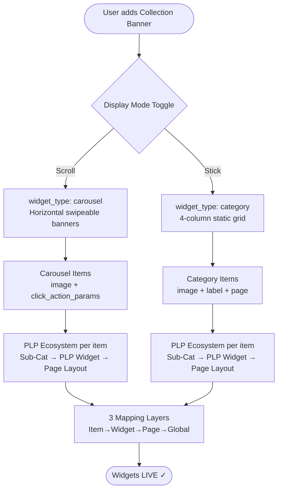
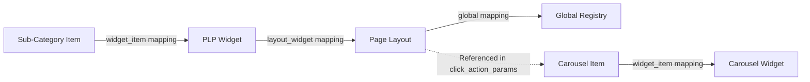
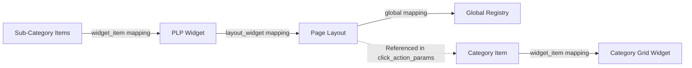

# WIDGET: Collection Banner

## 1. Overview

The **Collection Banner** is a unified widget for displaying clickable items that navigate users to a product listing page or category page. It supports **two display modes**, selectable via a toggle:

| Mode | Display | Backend Widget Type | Behavior |
| :--- | :--- | :--- | :--- |
| **Scroll** | Horizontal scrollable banner carousel | `carousel` | Swipeable banners with media-number control |
| **Stick** | 4-column static grid of category cards | `category` | Static grid with category images + labels |

> **Legacy Widget**: This widget uses hard-coded components and will be migrated to the config-driven system in a future phase.

### Mode Comparison — Emulator Preview

```
SCROLL MODE (carousel)              STICK MODE (category)
┌─ Phone Emulator ──────────┐       ┌─ Phone Emulator ──────────┐
│                            │       │                            │
│  ┌── Collection Banner ─┐  │       │  ┌── Collection Banner ─┐  │
│  │ ┌──────┐ ┌──────┐ ┌─ │  │       │  │  ★ Rice Mela          │  │
│  │ │      │ │      │ │   │  │       │  │  ┌────┐ ┌────┐       │  │
│  │ │Banner│ │Banner│ │Ba │  │       │  │  │img │ │img │       │  │
│  │ │  1   │ │  2   │ │ 3 │  │       │  │  │Milk│ │Brd │       │  │
│  │ │      │ │      │ │   │  │       │  │  └────┘ └────┘       │  │
│  │ └──────┘ └──────┘ └─ │  │       │  │  ┌────┐ ┌────┐       │  │
│  │  ● ○ ○ ○              │  │       │  │  │img │ │img │       │  │
│  └───────────────────────┘  │       │  │  │Brkf│ │Jam │       │  │
│  ← swipeable carousel →     │       │  │  └────┘ └────┘       │  │
│                            │       │  └─────────────────────┘  │
└────────────────────────────┘       └────────────────────────────┘
media_number: 3.5 (3 + peek)         4-col static grid (no scroll)
```

### Mode Decision Flowchart



---

## 2. Display Mode Toggle

The user selects the display mode using a **Scroll / Stick** toggle button on the frontend sidebar:

```
┌─────────────────────────────────────────────────┐
│ Collection Banner                                │
│                                                   │
│ Display Mode:                                     │
│ ┌──────────┐ ┌──────────────┐                    │
│ │  Scroll  │ │  Stick  │                    │
│ └──────────┘ └──────────────┘                    │
│                                                   │
│ [Mode-specific configuration below]               │
└─────────────────────────────────────────────────┘
```

- **Scroll** → Creates a **Carousel Widget** (`carousel`) — horizontal swipeable banners
- **Stick** → Creates a **Category Grid Widget** (`category`) — 4-column static grid

Both modes create the same underlying PLP ecosystem (sub-category → PLP widget → page layout).

---

## 3. Widget Composition

### Scroll Mode (Carousel)

| Component | Purpose | User-Facing |
| :--- | :--- | :--- |
| **Carousel Item** | The actual banner image displayed on the homepage | ✅ Yes |
| **Product Listing Ecosystem** | Backend page structure (Sub-category → PLP Widget → Page Layout) | ❌ No (Navigation target) |

### Stick Mode (Category Grid)

| Component | Purpose | User-Facing |
| :--- | :--- | :--- |
| **Category Grid Widget** | The main widget container on homepage | ✅ Yes |
| **Category Widget Items** | Individual category cards in the grid | ✅ Yes |
| **Page Layout (per item)** | Category page structure | ❌ No (navigation target) |
| **PLP Widget (per item)** | Product listing widget for the category page | ❌ No (navigation target) |
| **Sub-Category Items (per item)** | State-specific product lists | ❌ No (data layer) |

---

## 4. Data Flow Diagram

### Scroll Mode (Carousel)

```mermaid
flowchart TD
    Input([User Input: Title, Image, Products]) --> Process[CLP Automation Script]
    
    subgraph Bottom-Up Creation Flow
        direction TB
        
        Step1[1. Sub-Category Widget Item]
        Step2[2. PLP Widget]
        Step3[3. Page Layout]
        Step4[4. Carousel Item]
        Step5[5. Carousel Widget]
        
        Step1 -->|Contains product list| Map1((Map))
        Map1 -->|widget_item mapping| Step2
        
        Step2 -->|PLP for navigation| Map2((Map))
        Map2 -->|layout_widget mapping| Step3
        
        Step3 -->|Page exists| Map3((Map))
        Map3 -->|global mapping| Global[Global Page Registry]
        
        Step3 -.->|page_layout_slug_name| Step4
        Step4 -->|Carousel item created| Map4((Map))
        Map4 -->|widget_item mapping| Step5
    end
    
    Process --> Bottom-Up Creation Flow
    Step5 --> Output([Final: Carousel Widget Slug])
```

### Stick Mode (Category Grid)

```mermaid
flowchart TD
    Input([User Input: Title, Category Items + Sub-Categories]) --> Process[CategoryGridBuilder.js]

    subgraph Per Category Item - Steps 1-7
        direction TB
        Step1["Step 1: Sub-Cat Widget Items (sub_category) — Create or Update"]
        Step2["Step 2: PLP Widget (product_listing) — Create or Update"]
        Step3["Step 3: Page Layout — Create or Skip if exists"]
        Step4[Map Sub-Cats → PLP — CSV]
        Step5[Map PLP → Page — CSV]
        Step6[Map Page → Global — CSV]
        Step7["Step 7: Category Widget Item (category) — Create or Update"]

        Step1 --> Step4 --> Step2
        Step2 --> Step5 --> Step3
        Step3 --> Step6 --> Global[Global Page Registry]
        Step3 -.->|page_layout_slug_name| Step7
    end

    subgraph Phase 2 - Steps 8-9
        Step8["Step 8: Category Grid Widget (category) — Create or Update"]
        Step9[Map all Category Items → Widget — CSV]
        Step7 --> Step9 --> Step8
    end

    Process --> Per Category Item - Steps 1-7
    Per Category Item - Steps 1-7 --> Phase 2 - Steps 8-9
    Phase 2 - Steps 8-9 --> Output([Final: Category Grid Widget Slug])
```

---

## 5. Backend Object Hierarchy

### Scroll Mode (Carousel)

| Step | Object Type | Slug Pattern | Purpose | API Endpoint |
| :---: | :--- | :--- | :--- | :--- |
| **1** | Widget Item (Sub-Category) | `{base}_sub_cat_wi` | Holds the product list for the category page | `/api/app/post_widget_item/` |
| **2** | Widget (PLP) | `{base}_plp_w` | Product Listing Widget for the category page | `/api/app/widget/` |
| **3** | Page Layout | `{base}_Page_p` | Category page structure | `/api/app/post_page_layout/` |
| **4** | Widget Item (Carousel) | `{base}_cl_wi` | The banner image with click action | `/api/app/post_widget_item/` |
| **5** | Widget (Carousel) | `{base}_Cl_w_HP` | The carousel widget container | `/api/app/widget/` |

#### Mapping Flow (Scroll)



### Stick Mode (Category Grid)

| Step | Object Type | Slug Pattern | Purpose | Create/Update |
| :---: | :--- | :--- | :--- | :--- |
| **1** | Widget Item (Sub-Category) | `{base}_item_{n}_subcat_{m}_{state}` | State-specific product list; if PLP page type, auto-creates 1 virtual sub-cat from stateProducts | CREATE or UPDATE |
| **2** | Widget (PLP) | `{base}_item_{n}_plp` | Product Listing Widget for the category/PLP page | CREATE or UPDATE |
| **3** | Page Layout | `{base}_item_{n}_cat_page` or `{base}_item_{n}_plp_page` | Category or PLP page structure | CREATE or SKIP |
| **4** | Map Sub-Cats → PLP | CSV | `widget_item_slug_name` mapping | POST CSV |
| **5** | Map PLP → Page | CSV | `widget_slug_name` mapping | POST CSV |
| **6** | Map Page → Global | CSV | `level_tag,level_property` | POST CSV |
| **7** | Widget Item (Category) | `{base}_item_{n}_cat_wi` | Category card with `click_action_params` pointing to the page | CREATE or UPDATE |
| **8** | Widget (Category Grid) | `{base}_cm_hp` | The main category grid container | CREATE or UPDATE |
| **9** | Map Category Items → Widget | CSV | `widget_item_slug_name` mapping | POST CSV |

> [!NOTE]
> If a Category Item is set to `product_listing_page`, Step 1 automatically generates a single virtual sub-category to hold its `stateProducts`, passing them directly to the PLP Widget without rendering category tabs.

#### Full Object Tree (Stick)

```
Category Grid Widget (category)
├── slug_name: rice_mela_cm_hp
├── widget_type: category
│
├─→ Category Item #1 (category)
│   ├── slug: rice_mela_item_1_cat_wi
│   ├── click_action_params → page_layout_slug_name
│   │
│   └─→ Category Page Ecosystem
│       ├── Page Layout: rice_mela_item_1_page
│       ├── PLP Widget: rice_mela_item_1_plp
│       └── Sub-Category Items:
│           ├── rice_mela_item_1_subcat_1_global
│           ├── rice_mela_item_1_subcat_1_jh
│           ├── rice_mela_item_1_subcat_1_cg
│           └── rice_mela_item_1_subcat_1_up   ← dynamically added
│
├─→ Category Item #2 (category)
│   └─→ Category Page Ecosystem (same structure)
│
├─→ Category Item #3 (category)
│   └─→ ...
│
└─→ Category Item #4 (category)
    └─→ ...
```

#### Mapping Flow (Stick)



---

## 6. Page Type Selection

Both modes require **page type selection per item**. Each item (carousel item or category item) individually specifies which page type it navigates to.

### Scroll Mode

The **page type** is selected on **every carousel widget item** individually. Each carousel item within a single carousel widget can have its own page type.

### Stick Mode

The **page type** is selected on **every category widget item** individually. Each category item within a single category grid widget can have its own page type.

### Supported Page Types (Both Modes)

| Page Type | Value | Description |
| :--- | :--- | :--- |
| **Product Listing Page** | `product_listing_page` | Navigates to a PLP showing the mapped products |
| **Category Page** | `category_page` | Navigates to a category page with category-level browsing |

### How Page Type Affects Click Navigation

| Page Type | Click Result |
| :--- | :--- |
| `category_page` | Opens a category page with sub-category cards → user picks a sub-category → PLP |
| `product_listing_page` | Opens a flat product listing page directly with all mapped products |

> **Key Point:** The page type is set in the item's **Page Layout** (Step 3) and referenced in the item's `click_action_params`. Both the carousel item and category item use the same `click_action_params` structure.

---

## 7. Carousel Media-Number (Scroll Mode Only)

The **Carousel Media-Number** controls how many carousel items are visible in the carousel preview at once. This value is entered on the **frontend input sidebar** as a decimal number.

| Input Value | Visible Items | Preview Behavior |
| :--- | :--- | :--- |
| `3` | 3 full items | Exactly 3 banners visible, no partial item |
| `3.1` | 3 full + slight peek of 4th | Shows a small peek of the next item |
| `3.5` | 3 full + half of 4th | Shows 3 and a half banners visible |
| `4` | 4 full items | Exactly 4 banners visible |
| `4.4` | 4 full + partial 5th | Shows 4 banners with a peek of the next |

- Enter the value (e.g., `3.5`, `4.4`) in the **Media-Number** input field on the sidebar
- Decimal values create a **partial-item peek** effect, hinting to the user that more items can be swiped

---

## 8. Key Configuration Fields

### Scroll Mode — Required Fields

| Field | Type | Description | Example |
| :--- | :--- | :--- | :--- |
| `title` | `String` | Widget section heading (shown above the carousel) | `"Summer Sale"` |
| `media_number` | `Number` | Visible items count (e.g. `1.2` = 1 full + peek) | `"1.2"` |
| `start_time` | `DateTime` | Activation start | `"2026-01-01T00:00:00"` |
| `end_time` | `DateTime` | Activation end | `"2026-12-31T23:59:59"` |
| `scrollItems[]` | `Array` | List of carousel banner items (see sub-fields below) | — |

### Scroll Mode — Carousel Item Fields (`scrollItems[]`)

| Field | Type | Required | Description |
| :--- | :--- | :---: | :--- |
| `pageHeading` | `String` | Yes | Heading shown on the destination PLP/category page |
| `image` | `File/URL` | Yes | Banner image. Max **300KB**. Uploaded to local server on pick. |
| `pageType` | `String` | Yes | `product_listing_page` or `category_page` |
| `stateProducts` | `Object` | Yes (for PLP) | State-wise product codes `{ global: "1001,1002", JH: "1003" }` |
| `subCategories[]` | `Array` | Yes (for category) | Sub-category items (same as stick mode) |

> [!NOTE]
> `productIds` field has been **removed**. Use `stateProducts.global` for product codes. State-specific products go in `stateProducts.JH`, `stateProducts.CG`, etc.

### Stick Mode — Widget Fields

| Field | Type | Required | Description | Example |
| :--- | :--- | :---: | :--- | :--- |
| `slug_name` | String | Yes | Unique identifier | `rice_mela_cm_hp` |
| `widget_type` | String | Yes | Must be `category` | `category` |
| `title` | String | Yes | Widget heading | `"Rice Mela"` |
| `heading_en` | String | No | English heading | `"Rice Mela"` |
| `heading_hi` | String | No | Hindi heading | `"राइस मेला"` |
| `start_time` | DateTime | Yes | Activation start (via `DateTimeInput` calendar + time picker) | `2024-01-01T00:00:00` |
| `end_time` | DateTime | Yes | Activation end (via `DateTimeInput` calendar + time picker) | `2034-01-01T00:00:00` |

### Stick Mode — Category Item Fields

| Field | Type | Required | Description |
| :--- | :--- | :---: | :--- |
| `text` | String | Yes | Category name (English) — also used as `page_heading` in Page Layout |
| `textHi` | String | No | Category name (Hindi) |
| `image` | URL/File | Yes | Category item image (max 300KB). Falls back to blank 1×1 PNG if not uploaded |
| `pageType` | String | Yes | `"category_page"` or `"product_listing_page"` |
| `subCategories` | Array | Conditional | List of sub-categories (only when `pageType` = `category_page`) |
| `stateProducts` | Object | Conditional | State-wise product codes (only when `pageType` = `product_listing_page`) |
| `expandPage` | Boolean | No | Toggle for multi-widget PLPs on PLP pages |

### Stick Mode — Sub-Category Fields

| Field | Type | Required | Description |
| :--- | :--- | :---: | :--- |
| `name` | String | Yes | Sub-category name |
| `nameHi` | String | No | Sub-category name (Hindi) |
| `image` | URL | No | Sub-category image |
| `products.global` | String | Yes | Global product codes (comma-separated) |
| `products.{state}` | String | No | State-specific product codes (dynamically added) |

### Image / Media Handling (Scroll Mode)

The carousel does **not** use a separate aspect ratio field. Whatever image/media the user uploads is previewed **as-is** — the original dimensions are preserved.

---

## 9. Location / State-Based Product Mapping (Dynamic)

Both modes support **state-specific product lists**. The state list is **not fixed** — new states can be added at any time using the **"Add"** button on the frontend sidebar.

### How It Works

1. **Global** is always present (required — the default/fallback product list)
2. User clicks the **"+ Add State"** button to add a new state
3. User selects or types the state name (e.g., `Uttar Pradesh`, `Patna`)
4. User enters state-specific product codes for that state
5. Each added state generates its own sub-category widget item with a unique slug suffix

### State Mapping Reference

| State Key | `level_tag` | `level_property` | Slug Suffix |
| :--- | :--- | :--- | :--- |
| Global | `global` | `global` | `_global` |
| JH | `state` | `jharkhand` | `_jh` |
| CG | `state` | `chhattisgarh` | `_cg` |
| WB | `state` | `west bengal` | `_wb` |
| UP | `state` | `uttar pradesh` | `_up` |
| Patna | `state` | `patna` | `_patna` |
| *(any new state)* | `state` | `{state_name_lowercase}` | `_{short_key}` |

### Frontend Behavior — Scroll Mode

```
Carousel Widget Item: "Summer Sale"
┌──────────────────────────────────────────────────┐
│ Page Type: [category_page ▼]                     │
│                                                    │
│ Global Products:  1001, 1002, 1003               │
│                                                    │
│ ┌─ State: Jharkhand ──────────────────────────┐  │
│ │ Products: 1003, 1004                         │  │
│ └──────────────────────────────────────────────┘  │
│                                                    │
│ ┌─ State: Uttar Pradesh ──────────────────────┐  │
│ │ Products: 1010, 1011, 1012                   │  │
│ └──────────────────────────────────────────────┘  │
│                                                    │
│  [ + Add State ]                                   │
└──────────────────────────────────────────────────┘
```

### Sub-Category Slug Naming — SPR Pattern

Sub-cat widget item slugs follow the **SPR pattern**:

| Item Page Type | Slug Format | Example |
| :--- | :--- | :--- |
| `product_listing_page` | `{base}_item_{N}_sc_wi_{state}` | `rice_mela_item_1_sc_wi_global` |
| `category_page` | `{base}_item_{N}_subcat_{M}_{state}` | `rice_mela_item_1_subcat_2_jh` |

> [!NOTE]
> State keys are **normalized to lowercase** internally — entering `JH` or `jh` both produce `_jh` suffix. This is handled by `StateMapper.getActiveStates()`.

### Image Upload Rules

| Editor | Max Size | Upload |
| :--- | :--- | :--- |
| Category item | **300KB** | Local server via `LocalApiService.uploadMedia()` |
| Carousel item | **300KB** | Local server via `LocalApiService.uploadMedia()` |
| Sub-category item | **300KB** | Local server via `LocalApiService.uploadMedia()` |

> [!IMPORTANT]
> Images are uploaded to the local server immediately on file pick, returning a persistent URL. `_resolveImage()` fetches this URL at deploy time to send as a multipart blob to the backend.

### `filter_lst` Format

`StateMapper.buildInStockFilter()` produces an **array of integers**:
```json
[{"condition": "in_stk_item_codes", "value": [1001, 1002, 1003]}]
```
`value` must be `[1001, 1002]` — **not** `"1001,1002"` (string) and **not** `["1001"]` (string array).

### `item_click_action` Rules

| Sub-cat type | `item_click_action` |
| :--- | :--- |
| PLP page sub-cats | `deal-detail-redirect` |
| Category page sub-cats | `null` (string literal) |
| Carousel widget item | `redirect-to-page` |

### Frontend Behavior — Stick Mode

When `pageType` is **category_page**:
```
Category Item: "Basmati Rice"
┌──────────────────────────────────────────────────┐
│ Page Type: [category_page ▼]                     │
│                                                    │
│ Sub-Category: "Premium Basmati"                  │
│ ┌──────────────────────────────────────────────┐ │
│ │ Global Products:  1001, 1002, 1003           │ │
│ │                                                │ │
│ │ ┌─ State: Jharkhand ────────────────────┐    │ │
│ │ │ Products: 1003, 1004                   │    │ │
│ │ └────────────────────────────────────────┘    │ │
│ │                                                │ │
│ │  [ + Add State ]                               │ │
│ └──────────────────────────────────────────────┘ │
│                                                    │
│ [ + Add Sub-Category ]                             │
└──────────────────────────────────────────────────┘
```

When `pageType` is **product_listing_page** (and `expandPage` is false):
```
Category Item: "Basmati Rice"
┌──────────────────────────────────────────────────┐
│ Page Type: [product_listing_page ▼]              │
│                                                    │
│ 🌐 Global Products:  1001, 1002, 1003            │
│                                                    │
│ ┌─ State: Jharkhand ──────────────────────────┐  │
│ │ Products: 1003, 1004                         │  │
│ └──────────────────────────────────────────────┘  │
│                                                    │
│  [ + Add State ]                                   │
└──────────────────────────────────────────────────┘
```

### Slug Generation — Scroll Mode

```
{base}_sub_cat_wi_{state_suffix}

Examples:
  summer_sale_sub_cat_wi_global     ← Global
  summer_sale_sub_cat_wi_jh         ← Jharkhand
  summer_sale_sub_cat_wi_up         ← Uttar Pradesh
```

### Slug Generation — Stick Mode

```
{base}_item_{n}_subcat_{m}_{state_suffix}

Examples:
  rice_mela_item_1_subcat_1_global     ← Global
  rice_mela_item_1_subcat_1_jh         ← Jharkhand
  rice_mela_item_1_subcat_1_up         ← Uttar Pradesh
  rice_mela_item_1_subcat_2_global     ← 2nd sub-category, Global
```

### Mapping CSV Format

```csv
widget_item_slug_name,level_tag,level_property,priority,cohort
summer_sale_sub_cat_wi_global,global,global,1,
summer_sale_sub_cat_wi_jh,state,jharkhand,2,
summer_sale_sub_cat_wi_up,state,uttar pradesh,3,
```

> **Priority** is auto-assigned incrementally. Global is always priority `1`.

---

## 10. Filters & Configurations (Universal)

The following filters and configurations are **universal** — they apply to the Collection Banner widget (both Scroll and Stick modes) and all child widget items (carousel items, category items, sub-category items, PLP widgets). These are handled by `WidgetItemHelper` / `PageViewUtils` on the backend.

### Widget-Level Filters (`filter_dict` on Widget)

| Key | Type | Component | Description |
| :--- | :--- | :--- | :--- |
| `max_order_constraint` | int | `NumberInput` | Show widget only if user's total orders <= Y |
| `min_order_constraint` | int | `NumberInput` | Show widget only if user's total orders >= X |

### Item-Level Filters (`filter_dict` on WidgetItem)

| Key | Type | Component | Description |
| :--- | :--- | :--- | :--- |
| `in_stk_item_codes` | list of int | `ProductListInput` | Mandatory in-stock item codes — widget item only shown if these items are in stock |

### Product-Level Filters (`product_filter_dict` on WidgetItem)

| Key | Operators | Component | Description |
| :--- | :--- | :--- | :--- |
| `category` | `in`, `equal` | `TextInput` | Filter by product category |
| `sub_category` | `in`, `equal` | `TextInput` | Filter by sub-category |
| `mrp` | `lte`, `gte`, `lt`, `gt`, `equal` | `NumberInput` | Filter by MRP |
| `sp` | `lte`, `gte`, `lt`, `gt`, `equal` | `NumberInput` | Filter by Selling Price |
| `discount` | `lte`, `gte`, `lt`, `gt`, `equal` | `NumberInput` | Filter by discount percentage |

### App Configurations (`app_configurations` on Widget)

| Key | Type | Default | Component | Description |
| :--- | :--- | :--- | :--- | :--- |
| `allow_android` | boolean | `true` | `ToggleInput` | Toggle visibility on Android |
| `allow_ios` | boolean | `true` | `ToggleInput` | Toggle visibility on iOS |
| `min_android_version` | version | — | `VersionInput` | Show only on Android >= V |
| `max_android_version` | version | — | `VersionInput` | Show only on Android <= V |
| `min_ios_version` | version | — | `VersionInput` | Show only on iOS >= V |
| `max_ios_version` | version | — | `VersionInput` | Show only on iOS <= V |

### Widget Item Additional Properties (`additional_properties` on WidgetItem)

| Property | Type | Default | Description |
| :--- | :--- | :--- | :--- |
| `oos_product_count` | int | `0` | Number of Out-of-Stock products to append at end |
| `show_pb_tag` | boolean | `true` | Show "Previously Bought" tag on product cards |
| `pb_reorder` | boolean | `true` | Re-sort to show Previously Bought items first |

---

## 11. Product Input Formats (Scroll Mode)

The Scroll mode widget supports multiple product input formats with fallback priority:

### Priority 1: Pre-fetched Products Array
```javascript
{
  "products": [
    {
      "itemCode": "1001",
      "name": "Product Name",
      "price": 100,
      "mrp": 120,
      "image": "https://example.com/image.jpg"
    }
  ]
}
```

### Priority 2: Google Sheets CSV URL
```javascript
{
  "productIds": "https://docs.google.com/spreadsheets/d/.../export?format=csv"
}
```

**Expected CSV Format:**
```csv
Item Code,Display Name,Price,MRP,Main Image
1001,Product A,100,120,https://example.com/a.jpg
1002,Product B,150,180,https://example.com/b.jpg
```

### Priority 3: Comma-Separated Item Codes
```javascript
{
  "productIds": "1001,1002,1003,1004"
}
```
*Note: Uses local Product Database or Master Catalog for product details.*

### Priority 4: Newline-Separated Item Codes
```javascript
{
  "productIds": "1001\n1002\n1003\n1004"
}
```

---

## 12. Payload Structure Examples

### Scroll Mode — Sub-Category Widget Item (Step 1)
```javascript
{
  "slug_name": "summer_sale_item_1_sc_wi_global",   // PLP: _item_N_sc_wi_{state} | Cat: _item_N_subcat_M_{state}
  "item_type": "sub_category",
  "text_en": "Summer Sale",
  "product_list": "1001,1002,1003",
  // filter_lst value MUST be array of integers (not string)
  "filter_lst": "[{\"condition\":\"in_stk_item_codes\",\"value\":[1001,1002,1003]}]",
  "media_en": "[blank.png]",
  "deactivated_flag": "no",
  // PLP sub-cats: deal-detail-redirect | Category sub-cats: null
  "item_click_action": "deal-detail-redirect",
  "is_clickable": "yes",
  "pl_edit": "PL",
  "update_product_list": "no"
}
```

### Scroll Mode — PLP Widget (Step 2)
```javascript
{
  "slug_name": "summer_sale_plp_w",
  "widget_type": "product_listing",
  "heading": "Summer Sale",
  "heading_en": "Summer Sale",
  "start_time": "2024-01-01 00:00:00",
  "end_time": "2034-01-01 00:00:00"
}
```

### Scroll Mode — Page Layout (Step 3)
```javascript
{
  "slug_name": "summer_sale_Page_p",
  "page_type": "product_listing_page",  // or "category_page"
  "page_heading": "Summer Sale",
  "page_layout_type": "2"
}
```

### Scroll Mode — Carousel Widget Item (Step 4)
```javascript
{
  "slug_name": "summer_sale_cl_wi",
  "item_type": "carousel",
  "media_en": "[fetched_image.jpg]",
  "item_click_action": "redirect-to-page",
  "click_action_params": "{\"page_type\":\"product_listing_page\",\"page_layout_slug_name\":\"summer_sale_Page_p\"}",
  "is_clickable": "yes"
}
```

### Scroll Mode — Carousel Widget (Step 5)
```javascript
{
  "slug_name": "summer_sale_Cl_w_HP",
  "widget_type": "carousel",
  "media_number": "3.5",
  "start_time": "2024-01-01 00:00:00",
  "end_time": "2034-01-01 00:00:00"
}
```

---

### Stick Mode — Sub-Category Widget Item (Step 1 — per state)

```javascript
// CREATE payload (if slug does not exist on backend)
// For PLP page type, this is auto-generated from item.stateProducts
{
  "slug_name": "rice_mela_item_1_subcat_1_jh",
  "item_type": "sub_category",
  "item_click_action": "deal-detail-redirect",
  "text_en": "Premium Basmati",
  "text_hi": "प्रीमियम बासमती",
  "media_en": "[image_file_or_blank_1x1_png]",
  "product_list": "1003,1004",
  "filter_lst": "[{\"condition\":\"in_stk_item_codes\",\"value\":[1003,1004]}]",
  "filters": "[]",
  "property_lst": "[]",
  "pl_edit": "PL",
  "deactivated_flag": "no",
  "is_clickable": "yes",
  "update_product_list": "no",
  "start_time": "2024-01-01 00:00:00",
  "end_time": "2034-01-01 00:00:00",
  "click_action_params": "{}"
}
// UPDATE payload (if slug already exists — uses PUT /api/app/widget_item/{id}/)
// Only updates: text_en, text_hi, product_list, filter_lst, start_time, end_time
```

### Stick Mode — PLP Widget (Step 2 — per category item)

```javascript
// CREATE payload
{
  "slug_name": "rice_mela_item_1_plp",
  "widget_type": "product_listing",
  "heading": "",
  "heading_en": "",
  "heading_hi": "",
  "heading_bg": "",
  "start_time": "2024-01-01 00:00:00",
  "end_time": "2034-01-01 00:00:00",
  "app_configurations": "{\"show_sub_cat\": true}",
  "configurations": "{}",
  "filter_dict": "{}",
  "deactivated_flag": "no",
  "media_aspect_ratio": "1"
}
// UPDATE: updates heading_en, heading, start_time, end_time
```

### Stick Mode — Page Layout (Step 3 — per category item)

```javascript
// CREATE only — skipped if slug already exists on backend (getPageLayoutId check)
// page_heading is derived from item.text (category name) — no separate field
{
  "slug_name": "rice_mela_item_1_cat_page",   // _cat_page or _plp_page depending on pageType
  "page_type": "category_page",               // or "product_listing_page" — selected per item
  "page_heading": "Basmati Rice",             // = item.text (category name)
  "page_layout_type": "2"
}
```

### Stick Mode — Category Widget Item (Step 7 — per category item)

```javascript
{
  "slug_name": "rice_mela_item_1_cat_wi",
  "item_type": "category",
  "text_en": "Basmati Rice",
  "text_hi": "बासमती चावल",
  "media_en": "https://example.com/category-basmati.jpg",
  "item_click_action": "redirect-to-page",
  "click_action_params": "{\"page_type\":\"category_page\",\"page_layout_slug_name\":\"rice_mela_item_1_page\"}",
  // page_type can be "category_page" or "product_listing_page" — selected per item
  "is_clickable": "yes",
  "deactivated_flag": "no"
}
```

### Stick Mode — Category Grid Widget (Step 8)

```javascript
// CREATE payload
{
  "slug_name": "rice_mela_cm_hp",
  "widget_type": "category",
  "heading_en": "Rice Mela",
  "heading_hi": "राइस मेला",
  "heading": "",
  "heading_bg": "",
  "start_time": "2024-01-01 00:00:00",
  "end_time": "2034-01-01 00:00:00",
  "media_aspect_ratio": "1",
  "filter_dict": "{}",
  "app_configurations": "{}"
}
// UPDATE: updates heading_en, heading_hi, heading, start_time, end_time
```

---

## 13. Image Handling (Scroll Mode)

### Image Fetching Strategy

The backend script uses a **proxy-based image fetching** approach to avoid CORS issues and optimize image size:

```javascript
// Proxy URL for image optimization
var proxyUrl = "https://images.weserv.nl/?url=" + encodeURIComponent(imageUrl) + "&q=60&output=jpg";
```

**Benefits:**
- **Compression**: Reduces image size (quality=60%)
- **Format Conversion**: Converts to JPG
- **CORS Bypass**: Proxies through weserv.nl
- **Error Fallback**: Uses blank image if fetch fails

---

## 14. Frontend Components

### Scroll Mode Component
`src/components/Widgets/BannerWithProductListing.jsx`

**Click Behavior:**
1. User clicks banner
2. Component resolves product data (pre-fetched → CSV → item codes)
3. Navigates to Product Listing Page with product data
4. Listing page displays products in grid layout

### Stick Mode Component
`src/components/Widgets/CategoryGrid.jsx`

**Display Behavior:**
- Renders a **4-column grid** (`grid-cols-4`) of category items
- Each item shows: category image (square) + category name (2 lines max)
- Images support Google Drive file IDs with fallback logic

**Image Priority:**
```
1. Google Drive thumbnail (driveFileId with sz=w200)
2. Google Drive direct URL (lh3.googleusercontent.com)
3. No image fallback
```

**Click Behavior:**
```
User clicks Category Item
    ↓
navigateTo('category', {
  heading: item.categoryPage.heading,
  subCategories: item.subCategories
})
    ↓
CategoryPage renders sub-categories as cards
    ↓
Each sub-category clickable → product listing
```

---

### Frontend Components

| File | Mode | Purpose |
| :--- | :--- | :--- |
| `src/components/Widgets/CollectionBanner/index.jsx` | Both | Entry point — routes to Scroll or Stick based on `displayMode` |
| `src/components/Widgets/CollectionBanner/Scroll.jsx` | Scroll | Carousel banner component (delegates to BannerWithProductListing) |
| `src/components/Widgets/CollectionBanner/Stick.jsx` | Stick | 4-column category grid — uses `useCatalog()` for PLP product page resolution |
| `src/components/Preview/CategoryPage.jsx` | Stick | Category page preview (sub-categories grid) |

### Backend Builders

| File | Mode | Purpose |
| :--- | :--- | :--- |
| `src/Backend/builders/CategoryGridBuilder.js` | Stick | 9-step Create/Update deploy flow (mirrors SPRBuilder pattern) |
| `src/Backend/builders/CollectionBannerBuilder.js` | Scroll | 5-step deploy flow for carousel creation |
| `src/Backend/services/DeploymentService.js` | Both | Routes to correct builder based on `widget.pnc.displayMode` |

### GAS Script References

| File | Mode | Purpose |
| :--- | :--- | :--- |
| `scripts/CLP_Automation.gs` | Scroll | Original scroll creation logic |
| `scripts/Category_Grid_Backend.gs` | Stick | Original stick creation logic (ported to CategoryGridBuilder.js) |

---

## 16. API Endpoints

| Endpoint | Method | Purpose |
| :--- | :--- | :--- |
| `/api/app/post_widget_item/` | POST | Create sub-category & category/carousel items |
| `/api/app/widget/` | POST | Create PLP & parent widgets |
| `/api/app/post_page_layout/` | POST | Create page layouts |
| `/api/app/update_widget_widget_item_mapping/` | POST | Item → Widget mapping (CSV) |
| `/api/app/update_layout_widget_mapping/` | POST | Widget → Layout mapping (CSV) |
| `/api/app/update_page_page_layout_mapping/` | POST | Layout → Page mapping (CSV) |

---

## 17. Error Handling

### Scroll Mode
- **Carousel displays but click does nothing** — Page Layout not mapped to global registry. Verify mapping succeeded.
- **Products not loading on listing page** — Invalid product codes or missing catalog data.
- **Banner image not displaying** — Image URL blocked by CORS or proxy failure. Use a publicly accessible image URL.
- **"Slug already exists" error** — Carousel with same slug was previously created. Change the slug.
- **State-wise sub-cats not created** — Check `filter_lst` format: value must be **array of integers** `[1001,1002]`, not string `"1001,1002"`. Fixed in `StateMapper.buildInStockFilter()`.
- **State key mismatch** — State keys are normalized to **lowercase** (`jh`, `cg`, `wb`) before slug/mapping. If user entered `JH`, code converts to `jh` automatically.

### Stick Mode
- **Duplicate slug (409 Conflict)** — Widget/item slug already exists. Use timestamp suffix.
- **`filter_lst` product codes must be integers** — Use `[1003,1004]` not `["1003","1004"]` or `"1003,1004"`. Fixed in `StateMapper.buildInStockFilter()`.
- **`page_layout_type` must be string** — Use `"2"` not `2`.
- **Missing products** — Script skips states with empty product codes.
- **De-duplication** — `processedStates` object prevents duplicate sub-category creation for the same state.
- **PLP sub-cats use `deal-detail-redirect`** — Category sub-cats use `'null'` for `item_click_action`. Both are handled automatically based on `pageType`.

---

## 18. Common Use Cases (Scroll Mode)

### 1. Seasonal Campaign
```javascript
{
  "title": "Winter Collection 2024",
  "image": "https://cdn.example.com/winter-banner.jpg",
  "productIds": "5001,5002,5003,5004"
}
```

### 2. Category Highlight
```javascript
{
  "title": "Fresh Vegetables",
  "image": "https://cdn.example.com/vegetables.jpg",
  "productIds": "https://docs.google.com/spreadsheets/d/.../export?format=csv"
}
```

### 3. Flash Sale
```javascript
{
  "title": "24-Hour Flash Sale",
  "image": "https://cdn.example.com/flash-sale.jpg",
  "products": [/* pre-fetched product array */]
}
```

---

## 19. Initial State (Default Values)

```javascript
{
    type: 'collection_banner',
    pnc: { displayMode: 'scroll' },
    slug: '',
    title: '',
    titleHi: '',
    media_number: '3.5',
    start_time: '',
    end_time: '',
    scrollItems: [],    // Scroll mode items
    categoryItems: [],  // Stick mode items
}
```

**Config:** `CollectionBannerConfig.js` → `initialState`

---

## 20. Image Size Constraints

| Image Location | Max Size | Required | Component |
| :--- | :--- | :---: | :--- |
| Scroll — Banner Image | **300 KB** | Yes | `ImageUpload` |
| Stick — Category Item Image | **300 KB** | Yes | `ImageUpload` |
| Stick — Sub-Category Image | **50 KB** | No | `ImageUpload` |

---

## 21. Update Strategy

The Collection Banner widget does **NOT** currently support in-place updates. The automation scripts always create new objects. To modify an existing widget:

1. Create a new widget with a different slug
2. Delete the old widget manually (if needed)
3. **Future Enhancement**: Implement update logic similar to `SPR_Widget_Optimized.gs`

---

## 22. Related Documentation

- [Slug Name Reference](./SLUG_NAME.md) - All slug patterns across widgets
- [Product Rail Widget](./Widget-spr.md) - Similar product display logic
- [Masthead Widget](./WIDGET-Masthead.md) - Similar state-based mapping logic
- [PLP Page Widget Support](./PLP-PAGE-widget-support.md) - Universal PLP ecosystem
- [Backend Automation Services](./BACKEND-Automation-Services.md) - Overview of automation scripts
- [Config-Driven System](./ARCH-Config-Driven-System.md) - Future migration target
