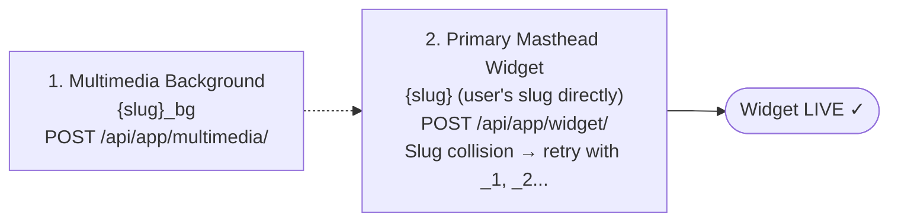
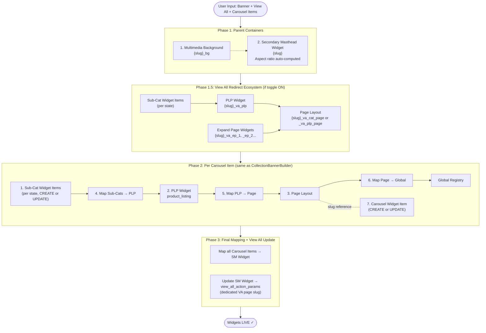

# WIDGET: Masthead (Primary & Secondary)

## User Flow: Masthead Selection

When creating a Masthead widget, the user follows this selection flow:

```
Step 1: Select "Masthead" widget type
    ↓
Step 2: Choose variant → "Primary Masthead" or "Secondary Masthead"
    ↓
Step 3: Configure Multimedia Background (shared input — same for both)
    ↓
Step 4: Configure variant-specific fields
```

Both Primary and Secondary Masthead share the **same multimedia background input and design**. The background media upload (image / video / WebM) works identically for both variants.

---

## Shared: Multimedia Background

The multimedia background configuration is **identical** for both Primary and Secondary Masthead. The same input UI, upload flow, and API payload apply regardless of which variant is selected.

### Supported Media Types

| Type | Code | Formats | File Required |
| :--- | :---: | :--- | :---: |
| **Image** | `"3"` | JPG, PNG, WEBP, GIF | Yes |
| **Video** | `"4"` | MP4, WEBM, MOV | Yes |
| **Lottie** | `"1"` | Animation JSON (embedded in backend) | No |

### Upload Flow (Same for Both)

```
1. User uploads file (image / video / webm) via the sidebar ImageUpload component
    ↓
2. ImageUpload auto-uploads to local Express server → returns persistent URL
    ↓
3. Widget state stores URL string (e.g. /api/local/media/view/xxx)
    ↓
4. URL survives JSON.stringify → stored in DB snapshot → available at deploy time
    ↓
5. On deploy: Builder fetches URL → converts to Blob → POST to /api/app/multimedia/
```

### Background Preview Priority (Same for Both)

```
1. Canvas widget background_media URL → uploaded image from local server
2. Transition color fallback       → solid color (#0277FA default)
```

### Multimedia API Payload (Same for Both)

**Endpoint:** `POST /api/app/multimedia/`

```javascript
{
  "name": "{base}_bg",                // e.g., "diwali_2024_bg"
  "multimedia_type": "3",             // "3" = image, "4" = video, "1" = lottie
  "aspect_ratio": "1",               // or "2", "3", "4"
  "file_en": "<binary blob>",        // the uploaded media file
  "transition_color": "#FFFFFF",
  "accent_color": "#0000FF",
  "text_color": "#FFFFFF",
  "icon_bg_color": "#F0F0F0",
  "is_multimedia_dark": "false"
}
```

### Multimedia Fields Reference

| Field | Type | Required | Description | Example |
| :--- | :--- | :---: | :--- | :--- |
| `name` | String | Yes | Unique multimedia slug (`{base}_bg`) | `diwali_2024_bg` |
| `multimedia_type` | String | Yes | `"3"` = Image, `"4"` = Video, `"1"` = Lottie | `3` |
| `file_en` | File | No | Image/video binary blob (not needed for Lottie) | Binary |
| `aspect_ratio` | String | No | Aspect ratio | `1` |
| `transition_color` | String | No | Transition color | `#FFFFFF` |
| `accent_color` | String | No | Icon fill / accent color | `#0000FF` |
| `text_color` | String | No | Label text color | `#FFFFFF` |
| `icon_bg_color` | String | No | Icon background color | `#F0F0F0` |
| `is_multimedia_dark` | String | No | Dark theme flag | `false` |

### Default Color Values

| Color Field | Default |
| :--- | :--- |
| `transition_color` | `#FFFFFF` |
| `accent_color` | `#0000FF` |
| `text_color` | `#FFFFFF` |
| `icon_bg_color` | `#F0F0F0` |

> **Important:** If `background_multimedia` is empty, do **not** include the field in the widget payload — it causes "Background Multimedia Name is invalid" error.

---

---

# Part A: Primary Masthead

## 1. Overview

The **Primary Masthead** is a header-only widget that displays category navigation icons with a configurable multimedia background. It is typically positioned at the top of the app homepage.

**Backend Widget Type:** `masthead_primary`

**Key Characteristics:**
- Header-only component (no body/carousel content)
- Uses the **shared multimedia background** (same as Secondary)
- Links to category panes via `master_key`
- Configurable colors (accent, text, icon background, transition)
- Time-bound activation (`start_time`, `end_time`)

> **Legacy Widget**: This widget uses a hard-coded component and will be migrated to the config-driven system in a future phase.

### Emulator Preview — Primary Masthead

```
┌─ Phone Emulator ────────────────────────────────┐
│                                                   │
│  ░░░░░░░░░░ BACKGROUND MEDIA ░░░░░░░░░░░░░░░░   │  ← multimedia bg
│                                                   │
│  ┌──────────────────────────────────────────┐    │
│  │  [🏠 All] [🔁 Buy Again] [🍚 Rice]      │    │
│  │  [🧴 Body Care] [🛒 Kirana] [🥦 Fresh]  │    │
│  └──────────────────────────────────────────┘    │  ← category icons row
│                                                   │
│  (No carousel body — header only)                │
│                                                   │
└───────────────────────────────────────────────────┘
```

### Creation Flow



## 2. Widget Composition

The Primary Masthead is a simple widget — no nested ecosystem or item mappings required.

| Component | Purpose | User-Facing |
| :--- | :--- | :--- |
| **Multimedia (Background)** | Shared background (image/video/webm) — see above | ✅ Yes |
| **Primary Masthead Widget** | The widget container with category icons | ✅ Yes |

## 3. Data Flow Diagram

```mermaid
flowchart TD
    Input([User Input: Slug, Master Key, Background Media]) --> Process[Automation Script / Frontend Deploy]

    subgraph Creation Flow
        direction TB
        Step1[1. Multimedia Background - OPTIONAL]
        Step2[2. Primary Masthead Widget]

        Step1 -.->|background_multimedia slug| Step2
    end

    Process --> Creation Flow
    Step2 --> Output([Final: Primary Masthead Widget Slug])
```

## 4. Backend Object Hierarchy

| Step | Object Type | Slug Pattern | Purpose | API Endpoint |
| :---: | :--- | :--- | :--- | :--- |
| **1** | Multimedia | `{slug}_bg` | Background media (image/video/lottie) | `/api/app/multimedia/` |
| **2** | Widget (Primary Masthead) | `{slug}` (user's slug directly) | The masthead widget container | `/api/app/widget/` |

> **Slug collision**: If widget slug already exists, builder retries with `{slug}_1`, `{slug}_2`, ... up to `{slug}_10`.  
> **Multimedia collision**: If multimedia slug already exists, builder continues silently (links to existing one).

### Object Hierarchy

```
Widget (masthead_primary)
├── slug_name: diwali_2024
├── widget_type: masthead_primary
├── master_key: 1020 (optional)
└── background_multimedia: diwali_2024_bg
    └─→ Multimedia (name: diwali_2024_bg)
        ├── multimedia_type: 3 (image)
        ├── transition_color: #FFFFFF
        ├── accent_color: #0000FF
        ├── text_color: #FFFFFF
        ├── icon_bg_color: #F0F0F0
        └── file_en: [Binary blob]
```

## 5. Form Input Fields (Frontend Sidebar)

These are the fields the user fills in the PropertyEditor / HeaderConfiguration. The form is config-driven via `MastheadConfig.js`.

| Field | Component | Required | Description | Condition |
| :--- | :--- | :---: | :--- | :--- |
| **Slug** | `SlugBuilder` | Yes | Unique identifier | Always |
| **Background Media** | `ImageUpload` | No | Image/video/webm file upload for multimedia background | Always |
| **Background Video URL** | `UrlInput` | No | Alternative: direct video URL (.mp4, .mov, .webm) | Always |
| **Transition Color** | `ColorPicker` | No | Transition color (default `#FFFFFF`) | Always |
| **Accent Color** | `ColorPicker` | No | Icon fill / accent color (default `#0000FF`) | Always |
| **Text Color** | `ColorPicker` | No | Label text color (default `#FFFFFF`) | Always |
| **Icon Bg Color** | `ColorPicker` | No | Icon container background (default `#F0F0F0`) | Always |
| **Dark Theme** | `ToggleInput` | No | `is_multimedia_dark` flag (default `false`) | Always |
| **Aspect Ratio** | `PillSelector` | No | `1:1`, `4:3`, `16:9`, `Full` (Primary default `1`, Secondary default `4`) | Always |
| **Master Key** | `TextInput` | No | Link to category pane widget | Primary only |
| **Start Time** | `DateTimeInput` | Yes | Activation start | Always |
| **End Time** | `DateTimeInput` | Yes | Activation end | Always |
| **Carousel Items** | `ScrollItemEditor` | Yes | Nested carousel items with sub-categories | Secondary only |

> **Background input**: User provides EITHER a file upload (`background_media`) OR a URL (`background_video`). During deploy, file is uploaded to `/api/app/multimedia/` and the returned slug is used as `background_multimedia` in the widget payload.

> **Color fields**: These are form inputs (ColorPicker components), not just API payload fields. Users can customize all 4 colors from the sidebar.

### Widget API Fields (Backend Payload)

| Field | Type | Required | Description | Example |
| :--- | :--- | :---: | :--- | :--- |
| `slug_name` | String | Yes | Unique identifier (= user's slug) | `diwali_2024` |
| `widget_type` | String | Yes | Must be `masthead_primary` | `masthead_primary` |
| `master_key` | String | No | Link to category pane widget | `1020` |
| `background_multimedia` | String | No | Multimedia slug for background (omit if empty) | `diwali_2024_bg` |
| `start_time` | DateTime | Yes | Activation start | `2024-03-01T10:00:00` |
| `end_time` | DateTime | Yes | Activation end | `2025-03-01T10:00:00` |
| `media_aspect_ratio` | String | No | Aspect ratio (default `"1"`) | `1` |

> Multimedia fields and colors are documented in the **Shared: Multimedia Background** section above.

## 6. Payload Structure Examples

> Multimedia payload is documented in the **Shared: Multimedia Background** section above.

### Primary Masthead Widget

```javascript
{
  "slug_name": "diwali_2024",
  "widget_type": "masthead_primary",
  "master_key": "1020",
  "background_multimedia": "diwali_2024_bg",
  "media_aspect_ratio": "1",
  "start_time": "2024-03-01 10:00:00",
  "end_time": "2025-03-01 10:00:00",
  "heading": "",
  "heading_en": "",
  "filter_dict": "{}",
  "app_configurations": "{}"
}
```

## 7. Frontend Component

### Component Path

`src/components/Widgets/PrimaryMasthead.jsx`

### Behavior

- Displays category icon buttons (All, Buy Again, Rice, Kirana, Body Care, etc.)
- Reads colors **directly from canvas widget** via `useWidgetContext()` (no props needed)
- Background is inherited from AppHeader (not rendered directly)
- Categories are hardcoded by default but can be overridden via `widget.categories`

### Color Logic (Emulator Preview)

| Color Field | Emulator Usage | Source |
| :--- | :--- | :--- |
| `transition_color` | Header solid background (fallback when no image) | `primaryWidget.transition_color` |
| `background_media` | Header background image (uploaded image URL) | `primaryWidget.background_media` |
| `accent_color` | Active icon color (highlighted category) | `primaryWidget.accent_color` |
| `text_color` | Category labels, all header text | `primaryWidget.text_color` |
| `icon_bg_color` | Active icon container background | `primaryWidget.icon_bg_color` |
| `is_multimedia_dark` | If true → forces white text over dark bg | `primaryWidget.is_multimedia_dark` |

> **Live Preview**: Change any color in PropertyEditor → emulator updates instantly (reads from canvas widget state).

## 8. Mapping Flow

Primary Masthead does **NOT** require item mappings. The widget stands alone.

It can optionally reference an external widget via `master_key`:

```
Primary Masthead Widget
    ↓ (via master_key)
  → Category Pane Widget (e.g., ID 1020)
```

## 9. API Endpoints

| Endpoint | Method | Purpose |
| :--- | :--- | :--- |
| `/api/app/multimedia/` | POST | Create/update background multimedia |
| `/api/app/widget/` | POST | Create Primary Masthead widget |

## 10. Filters & Configurations (Universal)

The following filters and configurations are **universal** — they apply to the Primary Masthead widget. These are handled by `WidgetItemHelper` / `PageViewUtils` on the backend.

### Widget-Level Filters (`filter_dict` on Widget)

| Key | Type | Component | Description |
| :--- | :--- | :--- | :--- |
| `max_order_constraint` | int | `NumberInput` | Show widget only if user's total orders <= Y |
| `min_order_constraint` | int | `NumberInput` | Show widget only if user's total orders >= X |

### App Configurations (`app_configurations` on Widget)

| Key | Type | Default | Component | Description |
| :--- | :--- | :--- | :--- | :--- |
| `allow_android` | boolean | `true` | `ToggleInput` | Toggle visibility on Android |
| `allow_ios` | boolean | `true` | `ToggleInput` | Toggle visibility on iOS |
| `min_android_version` | version | — | `VersionInput` | Show only on Android >= V |
| `max_android_version` | version | — | `VersionInput` | Show only on Android <= V |
| `min_ios_version` | version | — | `VersionInput` | Show only on iOS >= V |
| `max_ios_version` | version | — | `VersionInput` | Show only on iOS <= V |

## 11. Error Handling

- **Empty `background_multimedia`**: Causes "Background Multimedia Name is invalid" — only include the field if it has a value
- **Duplicate slug**: Returns 409 Conflict — use a different slug or append timestamp
- **Rate Limiting**: Script pauses 500ms between rows

## 12. Script Reference

| File | Purpose |
| :--- | :--- |
| `src/Backend/builders/PrimaryMastheadBuilder.js` | Deploy builder (try-create with slug increment) |
| `src/Backend/services/DeploymentService.js` | Routes masthead from canvas widgets via BUILDER_MAP |
| `src/services/BackendSyncService.js` | Frontend deploy via `deployPrimaryMasthead()` |

---

---

# Part B: Secondary Masthead

## 1. Overview

The **Secondary Masthead** is a promotional banner with a complex nested carousel ecosystem. It features a full-width banner background with multiple carousel items below it, where each carousel item links to its own page (category page or product listing page) with state-specific sub-categories.

**Backend Widget Type:** `masthead_secondary_carousal_hp`

**Key Characteristics:**
- Full-width banner (header) + carousel items (body)
- Supports multimedia backgrounds (Image, Video, Lottie)
- **Banner tap → View All redirect** (dedicated page ecosystem, configurable ON/OFF)
- Each carousel item creates a full page layout ecosystem (Page Layout → PLP → Sub-Categories)
- **Each carousel widget item has its own page type selection** (`category_page` or `product_listing_page`)
- State-based product mapping (Global, JH, CG, WB + dynamic states)
- Uses **4-Phase Creation Logic** (Phase 1 → 1.5 → 2 → 3)
- **Color fields hidden** (Transition, Accent, Text, Icon BG) — not applicable to secondary
- Configurable carousel media-number (e.g. 2.5 = 2 full + half peek)

### Emulator Preview — Secondary Masthead

```
┌─ Phone Emulator ────────────────────────────────┐
│                                                   │
│  ░░░ FULL-WIDTH BANNER BACKGROUND ░░░░░░░░░░░░  │  ← multimedia bg
│  ░░░░░░░░░░░░░░░░░░░░░░░░░░░░░░░░░░░░░░░░░░░░  │
│  ░░░░░░░░░░░░░░░░░░░░░░░░░░░░░░░░░░░░░░░░░░░░  │
│                                                   │
│  ┌── Carousel Items Below Banner ─────────────┐  │
│  │ ┌─────────┐ ┌─────────┐ ┌─────────┐       │  │
│  │ │         │ │         │ │         │       │  │
│  │ │  Item1  │ │  Item2  │ │  Item3  │  → │  │
│  │ │  image  │ │  image  │ │  image  │       │  │
│  │ │         │ │         │ │         │       │  │
│  │ │ Festive │ │  Rice   │ │ Kirana  │       │  │
│  │ └─────────┘ └─────────┘ └─────────┘       │  │
│  └────────────────────────────────────────────┘  │
│                                                   │
└───────────────────────────────────────────────────┘
```

### System Overview — 4-Phase Architecture



> **Aspect Ratio**: Now **hardcoded** from uploaded image/video dimensions (`width / height`) — no longer a user-configurable field. Maps to API values: ~1:1→`"1"`, ~4:3→`"2"`, ~16:9→`"3"`, other→`"4"` (Full).

## 2. Widget Composition

| Component | Purpose | User-Facing |
| :--- | :--- | :--- |
| **Multimedia (Background)** | Full-width banner background | ✅ Yes |
| **Secondary Masthead Widget** | The widget container | ✅ Yes |
| **Carousel Items** | Banner items with click navigation | ✅ Yes |
| **Page Layout (per item)** | Category page or product listing page structure | ❌ No (navigation target) |
| **PLP Widget (per item)** | Product listing widget for the category page | ❌ No (navigation target) |
| **Sub-Category Items (per item)** | State-specific product lists | ❌ No (data layer) |

## 3. Data Flow Diagram

```mermaid
flowchart TD
    Input([User Input: Slug, Banner, Carousel Items + Sub-Categories]) --> Process[3-Phase Creation Logic]

    subgraph Phase 1 - Parent Containers
        direction TB
        P1A[1. Multimedia Background]
        P1B[2. Secondary Masthead Widget]
        P1A -.->|background_multimedia| P1B
    end

    subgraph Phase 2 - Item Ecosystems per Carousel Item
        direction TB
        P2A[3. Page Layout - category_page / product_listing_page]
        P2B[4. PLP Widget - product_listing]
        P2C[5. Sub-Category Items - state-specific]
        P2D[6. Carousel Widget Item]

        P2C -->|widget_item mapping| P2B
        P2B -->|layout_widget mapping| P2A
        P2A -->|global mapping| Global[Global Page Registry]
        P2A -.->|page_layout_slug_name| P2D
    end

    subgraph Phase 3 - Final Mapping
        P3A[7. Map Carousel Items → SM Widget]
    end

    Process --> Phase 1 - Parent Containers
    Phase 1 - Parent Containers --> Phase 2 - Item Ecosystems per Carousel Item
    Phase 2 - Item Ecosystems per Carousel Item --> Phase 3 - Final Mapping
    Phase 3 - Final Mapping --> Output([Final: Secondary Masthead Widget Slug])
```

## 4. Backend Object Hierarchy

The Secondary Masthead creates the following objects per carousel item:

| Step | Object Type | Slug Pattern | Purpose | API Endpoint |
| :---: | :--- | :--- | :--- | :--- |
| **1** | Multimedia | `{slug}_bg` | Banner background | `/api/app/multimedia/` |
| **2** | Widget (SM) | `{slug}` (user's slug directly) | Secondary Masthead container | `/api/app/widget/` |
| **1.5a** | Widget (VA PLP) | `{slug}_va_plp` | View All redirect PLP | `/api/app/widget/` |
| **1.5b** | Page Layout (VA) | `{slug}_va_cat_page` or `{slug}_va_plp_page` | View All redirect page | `/api/app/post_page_layout/` |
| **1.5c** | Widget (VA Expand) | `{slug}_va_ep_{n}` | View All expand page widgets | `/api/app/widget/` |
| **3** | Page Layout | `{slug}_item_{n}_page` | Category/PLP page per carousel item | `/api/app/post_page_layout/` |
| **4** | Widget (PLP) | `{slug}_item_{n}_plp` | Product listing per carousel item | `/api/app/widget/` |
| **5** | Widget Item (Sub-Cat) | `{slug}_item_{n}_subcat_{m}_{state}` | State-specific product list | `/api/app/post_widget_item/` |
| **6** | Widget Item (Carousel) | `{slug}_item_{n}_carousel` | Carousel banner item | `/api/app/post_widget_item/` |

**Fallback slug:** `secondary_masthead_{timestamp}` (if no slug provided)

### Full Object Tree

```
Secondary Masthead Widget (masthead_secondary_category_hp)
├── slug_name: festive_banner_sm_hp
├── background_multimedia: festive_banner_bg
│   └─→ Multimedia (festive_banner_bg)
│       ├── multimedia_type: 3
│       ├── aspect_ratio: 4
│       └── file_en: [Binary blob]
│
├─→ Carousel Item #1 (carousel)
│   ├── slug: festive_banner_item_1_carousel
│   ├── click_action_params → page_layout_slug_name
│   │
│   └─→ Category Page Ecosystem
│       ├── Page Layout: festive_banner_item_1_page
│       ├── PLP Widget: festive_banner_item_1_plp
│       └── Sub-Category Items:
│           ├── festive_banner_item_1_subcat_1_global
│           ├── festive_banner_item_1_subcat_1_jh
│           ├── festive_banner_item_1_subcat_1_cg
│           └── festive_banner_item_1_subcat_1_wb
│
└─→ Carousel Item #2 (carousel)
    ├── slug: festive_banner_item_2_carousel
    └─→ Category Page Ecosystem (same structure)
```

## 5. 4-Phase Creation Strategy

The Secondary Masthead uses a **4-Phase batch creation** approach to resolve nested dependencies:

### Phase 1: Create Parent Containers

```
1. Create Multimedia (background) — {slug}_bg
2. Create Secondary Masthead Widget — {slug} (user's slug directly)
   - view_all_action_name: '' (set empty, updated after Phase 1.5)
   - view_all_action_params: '' (API rejects '{}', needs empty string)
   - media_aspect_ratio: user's media_number (e.g. '2.5')
```

### Phase 1.5: View All Redirect Ecosystem (only when toggle ON)

```
If view_all_redirect = true:
  1. Create sub-cat widget items for view_all page (per state)
     - category_page → real view_all_sub_categories[]
     - product_listing_page → virtual sub-cat from view_all_state_products
  2. Create VA PLP Widget — {slug}_va_plp
  3. Create VA Page Layout — {slug}_va_cat_page or {slug}_va_plp_page
  4. Map sub-cats → VA PLP
  5. If Expand Page ON:
     - Create expand widgets — {slug}_va_ep_1, {slug}_va_ep_2...
     - Create sub-cat items per expand widget
     - Map sub-cats → expand widgets
  6. Map PLP + expand widgets → VA Page (priority order)
  7. Map VA Page → Global
```

> **View All Expand Page**: When `view_all_expand.expandPage` is ON, the standalone `view_all_state_products` field is hidden. Each expand widget has its own title + state-wise products — same as CarouselItemEditor PLP flow.

### Phase 2: Create Item Ecosystems (per carousel item) — Same as CollectionBannerBuilder

```
For each carousel item:
  1. Determine sub-categories:
     - category_page → real subCategories[]
     - product_listing_page → virtual single sub-cat from stateProducts
  2. CREATE or UPDATE Sub-Category Widget Items (per state)
     - Check if slug exists via getWidgetItemId → update or create
     - PLP page: item_click_action = "deal-detail-redirect"
     - Cat page: item_click_action = "null"
  3. CREATE PLP Widget (product_listing)
  4. CREATE Page Layout (with page_type, page_layout_type: '2')
  5. Map Sub-Cats → PLP Widget (CSV via mapWidgetItems)
  6. Map PLP → Page Layout (CSV via mapLayoutWidget)
  7. Map Page → Global (CSV via mapPageLayout, page_type: '')
  8. CREATE or UPDATE Carousel Widget Item
     - Resolve image via _resolveImage (URL → fetch → File, or blank PNG)
     - click_action_params → page_layout_slug_name + page_type
```

### Phase 3: Final Mapping + View All Update

```
1. Map all Carousel Items → SM Widget (widget_item mapping)
2. If view_all_redirect ON:
   - Update SM Widget → view_all_action_name: 'redirect-to-page'
   - Update SM Widget → view_all_action_params: {page_type, page_layout_slug_name: VA page slug}
```

**Why 4 Phases?**
- Phase 1.5 creates View All page before carousel items (independent ecosystem)
- Dependencies are 100% resolved before child creation
- No orphaned references
- Prevents "slug not found" errors during mapping

## 6. Page Type Selection (Per Carousel Widget Item)

The **page type** is selected on **every carousel widget item** individually. Each carousel item within the same Secondary Masthead can navigate to a different page type.

| Page Type | Value | Description |
| :--- | :--- | :--- |
| **Category Page (CP)** | `category_page` | Navigates to a category page with sub-category browsing |
| **Product Listing Page (PLP)** | `product_listing_page` | Navigates to a PLP showing the mapped products |

The user selects the page type when configuring each carousel widget item. This value is set in the item's **Page Layout** (Step 3) and referenced in the item's `click_action_params`.

### State-Wise Product Details Apply to Both Page Types

Regardless of which page type is selected — **Category Page (CP)** or **Product Listing Page (PLP)** — each carousel item requires **state-wise product details**. The state-based product mapping works the same way for both:

```
Carousel Item (page_type: "category_page" OR "product_listing_page")
│
├── Sub-Category: "Basmati Rice"
│   ├── Global Products:  1001, 1002, 1003
│   ├── JH Products:      1003, 1004
│   ├── CG Products:      1005, 1006
│   ├── UP Products:      1010, 1011      ← dynamically added
│   └── [ + Add State ]
│
├── Sub-Category: "Atta & Flour"
│   ├── Global Products:  2001, 2002
│   ├── JH Products:      2003, 2004
│   └── [ + Add State ]
│
└── [ + Add Sub-Category ]
```

> The sub-categories and their state-wise products are **required for both CP and PLP**. The only difference is how the target page renders them — CP shows sub-category cards for browsing, PLP shows all products in a grid.

**Example — Mixed page types, both with state-wise products:**

```
Carousel Item #1 → page_type: "category_page"        + state-wise products (Global, JH, CG, UP)
Carousel Item #2 → page_type: "product_listing_page"  + state-wise products (Global, JH, WB)
Carousel Item #3 → page_type: "category_page"         + state-wise products (Global, CG, Patna)
```

## 7. Key Configuration Fields

### Widget Fields

| Field | Type | Required | Description | Example |
| :--- | :--- | :---: | :--- | :--- |
| `slug_name` | String | Yes | Unique identifier (user's slug directly) | `festive_banner` |
| `widget_type` | String | Yes | Must be `masthead_secondary_carousal_hp` | `masthead_secondary_carousal_hp` |
| `background_multimedia` | String | No | Multimedia slug (omit if empty) | `festive_banner_bg` |
| `media_aspect_ratio` | String | User | Carousel media-number (items visible) | `2.5` |
| `start_time` | DateTime | Yes | Activation start | `2024-03-01T10:00:00` |
| `end_time` | DateTime | Yes | Activation end | `2025-03-01T10:00:00` |
| `view_all_action_name` | String | No | `'redirect-to-page'` when toggle ON | `redirect-to-page` |
| `view_all_action_params` | JSON String | No | `{page_type, page_layout_slug_name}` | See below |

### View All Click Action Fields (Editor — Secondary Only)

| Field | Component | Condition | Description |
| :--- | :--- | :--- | :--- |
| `view_all_redirect` | `ToggleInput` | variant=secondary | ON = banner tap redirects to page |
| `view_all_page_type` | `PillSelector` | toggle ON | `category_page` or `product_listing_page` |
| `view_all_sub_categories` | `SubCategoryList` | toggle ON + category_page | Sub-cats for category page |
| `view_all_expand` | `ExpandPageSection` | toggle ON + product_listing_page | Expand Page toggle + PLP widgets |
| `view_all_state_products` | `StateProductEditor` | toggle ON + PLP + expand OFF | Direct item codes for PLP |

> **Expand Page ON** hides `view_all_state_products` — each expand widget has its own products.

### Carousel Item Fields

| Field | Type | Required | Description |
| :--- | :--- | :---: | :--- |
| `pageHeading` | String | Yes | Heading text (shown on destination page) |
| `image` | URL/File | Yes | Carousel item image |
| `pageType` | String | Yes | `"category_page"` or `"product_listing_page"` |
| `subCategories` | Array | CP only | List of sub-categories with images |
| `stateProducts` | Object | PLP only | State-wise product codes `{global, jh, cg...}` |

### Hidden Fields for Secondary Variant

| Field | Reason |
| :--- | :--- |
| `transition_color` | Not applicable — SM uses image-based banner |
| `accent_color` | Not applicable |
| `text_color` | Not applicable |
| `icon_bg_color` | Not applicable |

## 8. State-Based Product Mapping (Dynamic)

Each sub-category supports **state-specific product lists**. The state list is **not fixed** — new states can be added at any time using the **"Add"** button on the frontend sidebar.

### How It Works

1. **Global** is always present (required — the default/fallback product list)
2. User clicks the **"Add"** button to add a new state
3. User selects or types the state name (e.g., `Uttar Pradesh`, `Patna`)
4. User enters state-specific product codes for that state
5. Each added state generates its own sub-category widget item with a unique slug suffix

### Current States

| State Key | `level_tag` | `level_property` | Slug Suffix |
| :--- | :--- | :--- | :--- |
| Global | `global` | `global` | `_global` |
| JH | `state` | `jharkhand` | `_jh` |
| CG | `state` | `chhattisgarh` | `_cg` |
| WB | `state` | `west bengal` | `_wb` |

### Upcoming / Expandable States (via Add Button)

| State Key | `level_tag` | `level_property` | Slug Suffix |
| :--- | :--- | :--- | :--- |
| UP | `state` | `uttar pradesh` | `_up` |
| Patna | `state` | `patna` | `_patna` |
| *(any new state)* | `state` | `{state_name_lowercase}` | `_{short_key}` |

### Add State — Frontend Behavior

```
Sub-Category: "Basmati Rice"
┌──────────────────────────────────────────────────┐
│ Global Products:  1001, 1002, 1003               │
│                                                    │
│ ┌─ State: Jharkhand ──────────────────────────┐  │
│ │ Products: 1003, 1004                         │  │
│ └──────────────────────────────────────────────┘  │
│                                                    │
│ ┌─ State: Chhattisgarh ───────────────────────┐  │
│ │ Products: 1005, 1006                         │  │
│ └──────────────────────────────────────────────┘  │
│                                                    │
│ ┌─ State: Uttar Pradesh ──────────────────────┐  │
│ │ Products: 1010, 1011, 1012                   │  │
│ └──────────────────────────────────────────────┘  │
│                                                    │
│  [ + Add State ]                                   │
└──────────────────────────────────────────────────┘
```

- The **"+ Add State"** button appends a new state input row
- Each state row has: **State Name** (text/dropdown) + **Product Codes** (comma-separated)
- States can also be **removed** if no longer needed
- **Global** cannot be removed (it is always required as the fallback)

### Slug Generation for Dynamic States

When a new state is added, its slug suffix is auto-generated from the state key:

```
State Name → lowercase → spaces replaced with _ → truncated to short key

Examples:
  "Uttar Pradesh" → slug suffix: _up
  "Patna"         → slug suffix: _patna
  "West Bengal"   → slug suffix: _wb
  "New State"     → slug suffix: _ns (or _new_state)
```

**Full slug example:**
```
{base}_item_{n}_subcat_{m}_{state_suffix}

festive_banner_item_1_subcat_1_up        ← Uttar Pradesh
festive_banner_item_1_subcat_1_patna     ← Patna
```

### Mapping CSV Format (Dynamic)

The mapping CSV grows dynamically based on how many states the user has added:

```csv
widget_item_slug_name,level_tag,level_property,priority,cohort
item_1_subcat_1_global,global,global,1,
item_1_subcat_1_jh,state,jharkhand,2,
item_1_subcat_1_cg,state,chhattisgarh,3,
item_1_subcat_1_wb,state,west bengal,4,
item_1_subcat_1_up,state,uttar pradesh,5,
item_1_subcat_1_patna,state,patna,6,
```

> **Priority** is auto-assigned incrementally. Global is always priority `1`, then each state gets the next number in order.

## 9. Payload Structure Examples

> Multimedia payload is documented in the **Shared: Multimedia Background** section above.

### Secondary Masthead Widget (Step 2)

```javascript
{
  "slug_name": "festive_banner_sm_hp",
  "widget_type": "masthead_secondary_category_hp",
  "background_multimedia": "festive_banner_bg",
  "media_aspect_ratio": "4",
  "start_time": "2024-03-01 10:00:00",
  "end_time": "2025-03-01 10:00:00",
  "heading": "",
  "filter_dict": "{}",
  "app_configurations": "{}"
}
```

### Page Layout (Step 3 — per carousel item)

```javascript
{
  "slug_name": "festive_banner_item_1_page",
  "page_type": "category_page",  // or "product_listing_page" — selected per carousel item
  "page_heading": "Rice Products",
  "page_layout_type": "2"
}
```

### PLP Widget (Step 4 — per carousel item)

```javascript
{
  "slug_name": "festive_banner_item_1_plp",
  "widget_type": "product_listing",
  "start_time": "2024-03-01 10:00:00",
  "end_time": "2025-03-01 10:00:00",
  "app_configurations": "{\"show_sub_cat\": true}"
}
```

### Sub-Category Widget Item (Step 5 — per state)

```javascript
{
  "slug_name": "festive_banner_item_1_subcat_1_jh",
  "item_type": "sub_category",
  "text_en": "Basmati Rice",
  "product_list": "1003,1004",
  "filter_lst": "[{\"condition\":\"in_stk_item_codes\",\"value\":[1003,1004]}]",
  "deactivated_flag": "no",
  "is_clickable": "yes",
  "pl_edit": "PL"
}
```

### Carousel Widget Item (Step 6 — per carousel item)

```javascript
{
  "slug_name": "festive_banner_item_1_carousel",
  "item_type": "carousel",
  "item_click_action": "redirect-to-page",
  "click_action_params": "{\"page_type\":\"category_page\",\"page_layout_slug_name\":\"festive_banner_item_1_page\"}",
  // page_type can be "category_page" or "product_listing_page" — selected per item
  "media_en": "<binary blob>",
  "is_clickable": "yes",
  "deactivated_flag": "no"
}
```

### Carousel Items → SM Widget Mapping (Step 7)

```csv
widget_item_slug_name,level_tag,level_property,priority,cohort
festive_banner_item_1_carousel,global,global,1,
festive_banner_item_2_carousel,global,global,2,
festive_banner_item_3_carousel,global,global,3,
```

## 10. Frontend Component

### Component Path

`src/components/Widgets/SecondaryMasthead.jsx`

### Display Behavior

- Renders a full-width (h-32) rounded banner with background image/video
- Below the banner, displays a 3-column grid of carousel items
- Each item shows: category heading + category image

> Background preview priority is documented in the **Shared: Multimedia Background** section above.

### Click Behavior

**Banner tap (View All redirect — when toggle ON):**
```
User taps banner (top area above carousel items)
    ↓
If view_all_page_type = 'product_listing_page':
  → navigateTo('listing', { title, products from view_all_state_products })
  → ProductListingPage fetches real data via searchProductsBatch
If view_all_page_type = 'category_page':
  → navigateTo('category', { heading, subCategories from view_all_sub_categories })
```

> When toggle ON, a small **"View All →"** badge appears top-right on the banner.

**Carousel item tap:**

**If pageType = `category_page`:**
```
User clicks Carousel Item
    ↓
navigateTo('category', { heading: item.pageHeading, subCategories: item.subCategories })
    ↓
CategoryPage renders sub-categories as cards
```

**If pageType = `product_listing_page`:**
```
User clicks Carousel Item
    ↓
Extracts item codes from stateProducts.global → searchProductsBatch
    ↓
navigateTo('listing', { title: item.pageHeading, products })
    ↓
ProductListingPage fetches real catalog data (images, prices) from Google Sheet
```

## 11. API Endpoints (Secondary Masthead)

| Endpoint | Method | Purpose |
| :--- | :--- | :--- |
| `/api/app/multimedia/` | POST | Create background multimedia |
| `/api/app/widget/` | POST | Create SM widget & PLP widgets |
| `/api/app/post_page_layout/` | POST | Create page layouts |
| `/api/app/post_widget_item/` | POST | Create carousel & sub-category items |
| `/api/app/update_widget_widget_item_mapping/` | POST | Item → Widget mapping (CSV) |
| `/api/app/update_layout_widget_mapping/` | POST | Widget → Layout mapping (CSV) |
| `/api/app/update_page_page_layout_mapping/` | POST | Layout → Page mapping (CSV) |

## 12. Filters & Configurations (Universal)

The following filters and configurations are **universal** — they apply to the Secondary Masthead widget and all its child widget items (carousel items, sub-category items, PLP widgets). These are handled by `WidgetItemHelper` / `PageViewUtils` on the backend.

### Widget-Level Filters (`filter_dict` on Widget)

| Key | Type | Component | Description |
| :--- | :--- | :--- | :--- |
| `max_order_constraint` | int | `NumberInput` | Show widget only if user's total orders <= Y |
| `min_order_constraint` | int | `NumberInput` | Show widget only if user's total orders >= X |

### Item-Level Filters (`filter_dict` on WidgetItem)

| Key | Type | Component | Description |
| :--- | :--- | :--- | :--- |
| `in_stk_item_codes` | list of int | `ProductListInput` | Mandatory in-stock item codes — widget item only shown if these items are in stock |

### Product-Level Filters (`product_filter_dict` on WidgetItem)

| Key | Operators | Component | Description |
| :--- | :--- | :--- | :--- |
| `category` | `in`, `equal` | `TextInput` | Filter by product category |
| `sub_category` | `in`, `equal` | `TextInput` | Filter by sub-category |
| `mrp` | `lte`, `gte`, `lt`, `gt`, `equal` | `NumberInput` | Filter by MRP |
| `sp` | `lte`, `gte`, `lt`, `gt`, `equal` | `NumberInput` | Filter by Selling Price |
| `discount` | `lte`, `gte`, `lt`, `gt`, `equal` | `NumberInput` | Filter by discount percentage |

### App Configurations (`app_configurations` on Widget)

| Key | Type | Default | Component | Description |
| :--- | :--- | :--- | :--- | :--- |
| `allow_android` | boolean | `true` | `ToggleInput` | Toggle visibility on Android |
| `allow_ios` | boolean | `true` | `ToggleInput` | Toggle visibility on iOS |
| `min_android_version` | version | — | `VersionInput` | Show only on Android >= V |
| `max_android_version` | version | — | `VersionInput` | Show only on Android <= V |
| `min_ios_version` | version | — | `VersionInput` | Show only on iOS >= V |
| `max_ios_version` | version | — | `VersionInput` | Show only on iOS <= V |

### Widget Item Additional Properties (`additional_properties` on WidgetItem)

| Property | Type | Default | Description |
| :--- | :--- | :--- | :--- |
| `oos_product_count` | int | `0` | Number of Out-of-Stock products to append at end |
| `show_pb_tag` | boolean | `true` | Show "Previously Bought" tag on product cards |
| `pb_reorder` | boolean | `true` | Re-sort to show Previously Bought items first |

## 13. Error Handling

- **"Background Multimedia Name is invalid"**: Empty `background_multimedia` field — omit the field if no value
- **"Page Layout failed"**: Missing `page_type` or `page_heading`
- **"Sub-category mapping failed"**: Invalid product codes or incorrect state keys
- **Duplicate slug (409 Conflict)**: Widget/item slug already exists — use timestamp suffix
- **`filter_lst` product codes must be numbers**: Use `[1001,1002]` not `["1001","1002"]`
- **`page_layout_type` must be string**: Use `"2"` not `2`

## 14. Script Reference

| File | Purpose |
| :--- | :--- |
| `src/Backend/builders/SecondaryMastheadBuilder.js` | 3-Phase deploy builder (aligned with CollectionBannerBuilder flow) |
| `src/Backend/services/DeploymentService.js` | Routes masthead variant to correct builder |
| `src/services/BackendSyncService.js` | Frontend deploy entry point |

---

---

# Part C: Primary vs Secondary Comparison

| Aspect | Primary Masthead | Secondary Masthead |
| :--- | :--- | :--- |
| **Widget Type** | `masthead_primary` | `masthead_secondary_carousal_hp` |
| **Purpose** | Category navigation icons | Promotional banner + carousel |
| **Display** | Icon buttons with background | Full banner + carousel items grid |
| **Complexity** | Simple (1 widget + multimedia) | Complex (multi-item ecosystem) |
| **Creation Phases** | 1 phase | 4 phases (incl. Phase 1.5 for View All) |
| **Requires Item Mapping** | No | Yes |
| **Supports State Mapping** | No | Yes (Global/JH/CG/WB + dynamic) |
| **View All Redirect** | N/A | Dedicated page ecosystem (toggle ON/OFF) |
| **Multimedia Background** | Shared input & design (image/video/webm) | Shared input & design (image/video/webm) |
| **Color Fields** | All 4 (transition, accent, text, icon_bg) | Hidden (not applicable) |
| **Carousel Items** | None | Dynamic carousel items |
| **Sub-Categories** | N/A | Yes (with state-specific products) |
| **Page Type Selection** | N/A | Per carousel item + View All page |
| **Click Behavior** | Links to category pane via `master_key` | Banner tap → View All page; Item tap → Item page |
| **Default Aspect Ratio** | `1` (hardcoded) | Auto-computed from image dimensions |
| **Frontend Component** | `PrimaryMasthead.jsx` | `SecondaryMasthead.jsx` |
| **Widget Slug** | *(user's slug directly)* | *(user's slug directly)* |

---

## Initial State (Default Values)

```javascript
{
    type: 'masthead',
    pnc: { variant: 'primary', has_multimedia: false },
    slug: '',
    background_media: null,
    background_video: '',
    transition_color: '#FFFFFF',              // Primary only (hidden for secondary)
    accent_color: '#0000FF',                  // Primary only (hidden for secondary)
    text_color: '#FFFFFF',                    // Primary only (hidden for secondary)
    icon_bg_color: '#F0F0F0',                 // Primary only (hidden for secondary)
    is_multimedia_dark: false,
    master_key: '',                           // Primary only
    start_time: '',
    end_time: '',
    view_all_redirect: false,                 // Secondary only: toggle
    view_all_page_type: 'category_page',      // Secondary only
    view_all_sub_categories: [],              // Secondary only: for category_page
    view_all_state_products: { global: '' },  // Secondary only: for product_listing_page
    view_all_expand: { expandPage: false, plpWidgets: [] }, // Secondary only: expand page
    media_number: '2.5',                      // Secondary only: carousel items visible
    carouselItems: [],                        // Secondary only
}
```

**Config:** `MastheadConfig.js` → `initialState`

---

## Related Documentation

- [Slug Name Reference](./SLUG_NAME.md) — All slug patterns across widgets
- [Collection Banner Widget](./WIDGET-Collection-Banner.md) — Carousel (Scroll) and Category Grid (Stick) modes
- [Product Rail Widget](./Widget-spr.md) — Similar PLP ecosystem
- [Secondary Masthead Strategy](./BACKEND-Secondary-Masthead-Strategy.md) — 3-Phase creation deep dive
- [Backend Automation Services](./BACKEND-Automation-Services.md) — Overview of automation scripts
- [Config-Driven System](./ARCH-Config-Driven-System.md) — Future migration target
