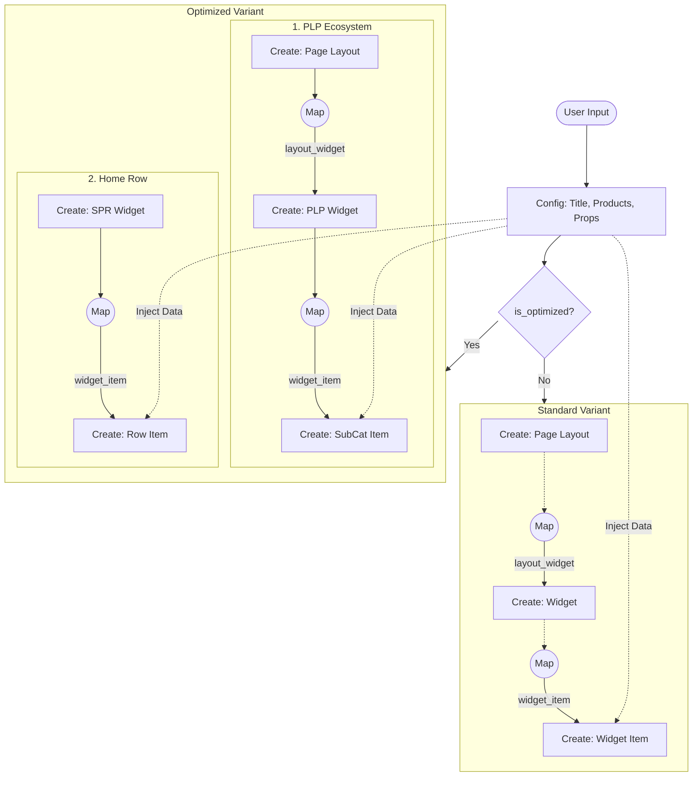

# WIDGET: Product Rail

## 1. Overview
The **Product Rail** is the core widget for displaying products on the homepage. It supports multiple variants (Standard, Optimized) and compositions (Multimedia, Rows) using a modular architecture.

> **Config-Driven**: This widget is fully driven by `ProductRailConfig.js`. See [ARCH-Config-Driven-System.md](./ARCH-Config-Driven-System.md) for the architecture and [REFERENCE-Widget-Library.md](./REFERENCE-Widget-Library.md) for all 8 variant types.

## 2. Variant Composition
Instead of fixed "Types", a widget is defined by a composition of properties.

| Property | Type | Description | Data Requirement |
| :--- | :--- | :--- | :--- |
| `pnc.rows` | `1 \| 2` | Number of product rows to display. | None (Layout only) |
| `pnc.is_optimized` | `Boolean` | Uses performance-tuned card & backend PLP generation. | `productIds` (for PLP generation) |
| `pnc.has_multimedia` | `Boolean` | **Implicit**: Set to true if `background_media` is present. | `background_media` URL |

## 3. Variant Mapping Matrix
This matrix defines the exact widget type resolved from the configuration permutations (`pnc.rows` x `pnc.is_optimized` x `pnc.has_multimedia`).

> [!WARNING]
> **Multimedia Usage Constraint**
> As shown below, **Standard** and **Optimized** rails (`single_product_row`, `single_product_row_v2`) **IGNORE** background media.
> You **MUST** ensure the resolved type is a `multimedia_*` variant for backgrounds to render.

| Rows | Is Optimized? | Has Multimedia? | Resolved Widget Type |
| :---: | :---: | :---: | :--- |
| **1** | `false` | `false` | `single_product_row` |
| **1** | `true` | `false` | `single_product_row_v2` |
| **1** | `false` | `true` | `multimedia_single_product_row` |
| **1** | `true` | `true` | `multimedia_single_product_row_v2` |
| **2** | `false` | `false` | `double_product_row` |
| **2** | `true` | `false` | `double_product_row_v2` |
| **2** | `false` | `true` | `multimedia_double_product_row` |
| **2** | `true` | `true` | `multimedia_double_product_row` |

## 4. Data Flow Diagram
This diagram illustrates how User Inputs translate into Backend Objects and Mappings.

## 5. Backend Mapping Details

| Variant | Object Created | Key Data Types | Mapping Created |
| :--- | :--- | :--- | :--- |
| **All** | **Widget Item** | `product_list` (item codes), `filters` (in_stock) | Mapped to parent Widget |
| **Standard** | **Widget** | `type: single_product_row` | `widget_item` mapping |
| **Standard** | **Page Layout** | `type: product_listing_page` (Created ad-hoc) | `layout_widget` mapping |
| **Optimized** | **SubCat Item** | `type: sub_category` (For PLP View) | Mapped to `product_listing` Widget |
| **Optimized** | **PLP Widget** | `type: product_listing` | Mapped to `Page Layout` |
| **Optimized** | **SPR V2 Widget** | `type: single_product_row_v2` | `widget_item` mapping |
| **Multimedia** | **Multimedia Widget** | `type: multimedia_single_product_row` | `widget_item` mapping |

### Supported Configurations & Filters
**Universal Support**: The following configurations apply to **ALL** variants (Standard, Optimized, Multimedia) as they all utilize the underlying `item_rows` structure handled by `WidgetItemHelper`.

### Widget Item Configurations (`additional_properties`)
| Property | Type | Description |
| :--- | :--- | :--- |
| `oos_product_count` | `Integer` | Number of Out-of-Stock products to append at the end (Default: 0). |
| `show_pb_tag` | `Boolean` | Show "Previously Bought" tag on cards. |
| `pb_reorder` | `Boolean` | Re-sort list to show Previously Bought items first. |

### Supported Filters
**Item Level (`filter_dict`)**
- `in_stk_item_codes`: List of Item Codes that MUST be in-stock.

**Product Level (`product_filter_dict`)**
Supports operators: `in`, `equal`, `lte`, `gte`, `lt`, `gt`.
- `category`
- `sub_category`
- `mrp`
- `sp` (Selling Price)
- `discount`

### Advanced Universal Filters
These filters are **Universal** and apply to **ALL** Product Rail variants (Standard, Optimized, Multimedia), as they are handled by the core `WidgetItemHelper` and `PageViewUtils`.

| Filter | Key | Description |
| :--- | :--- | :--- |
| **Order Count** | `min_order_constraint` | Show widget only if user's total orders $\ge$ X. |
| **Order Count** | `max_order_constraint` | Show widget only if user's total orders $\le$ Y. |
| **App Version** | `min_android_version` | Show widget only on Android App Version $\ge$ V (e.g. `2.4.7`). |
| **App Version** | `max_android_version` | Show widget only on Android App Version $\le$ V. |
| **Platform** | `allow_android`, `allow_ios`| Toggle visibility per platform. |

