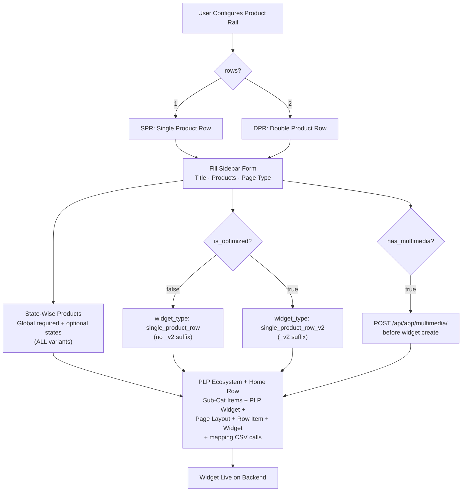
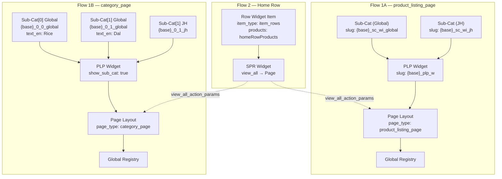

# WIDGET: Product Rail (SPR + DPR) — Complete Reference

## 1. Overview

The **Product Rail** is the core product display widget on the homepage. It renders horizontal scrollable rows of product cards with a "View All" link to a PLP page.

The Product Rail family includes:
- **Single Product Row (SPR)** — 1 row of products (`rows=1`)
- **Double Product Row (DPR)** — 2 rows of products (`rows=2`)

All variants are driven by a single `SPRConfig.js` configuration with **8 backend variants** based on three properties: **Rows**, **Optimized**, and **Multimedia**.

### System Architecture



### Emulator Preview — SPR (rows=1)

```
┌─ Phone Emulator (375×812) ─────────────────────┐
│                                                   │
│  ┌──────────────────────────────────────────┐    │
│  │  ★ Rice Mela                   View All  │    │  ← heading + CTA
│  │  ┌───────┐ ┌───────┐ ┌───────┐ ┌───── │    │
│  │  │       │ │       │ │       │ │      │    │
│  │  │  img  │ │  img  │ │  img  │ │ img  │    │  ← single row (rows=1)
│  │  │       │ │       │ │       │ │      │    │
│  │  │  ₹99  │ │ ₹149  │ │ ₹199  │ │ ₹89  │    │
│  │  │ Rice  │ │ Atta  │ │  Dal  │ │ Oil  │    │
│  │  └───────┘ └───────┘ └───────┘ └───── │    │
│  └──────────────────────────────────────────┘    │
│                                                   │
└───────────────────────────────────────────────────┘
```

### Emulator Preview — DPR (rows=2)

```
┌─ Phone Emulator (375×812) ─────────────────────┐
│                                                   │
│  ┌──────────────────────────────────────────┐    │
│  │  ★ Namkeens                    View All  │    │  ← heading + CTA
│  │  ┌───────┐ ┌───────┐ ┌───────┐ ┌───── │    │
│  │  │  img  │ │  img  │ │  img  │ │ img  │    │  ← row 1
│  │  │  ₹99  │ │ ₹149  │ │ ₹199  │ │ ₹89  │    │
│  │  └───────┘ └───────┘ └───────┘ └───── │    │
│  │  ┌───────┐ ┌───────┐ ┌───────┐ ┌───── │    │
│  │  │  img  │ │  img  │ │  img  │ │ img  │    │  ← row 2
│  │  │  ₹79  │ │ ₹129  │ │ ₹159  │ │ ₹69  │    │
│  │  └───────┘ └───────┘ └───────┘ └───── │    │
│  └──────────────────────────────────────────┘    │
│                                                   │
└───────────────────────────────────────────────────┘
```

### Emulator Preview — Multimedia Variant (SPR/DPR)

```
┌─ Phone Emulator (375×812) ─────────────────────┐
│                                                   │
│  ┌──────────────────────────────────────────┐    │
│  │ ▓▓▓▓▓▓▓ BACKGROUND MEDIA ▓▓▓▓▓▓▓▓▓▓▓▓ │    │  ← image/video bg
│  │  ★ Diwali Offers               View All  │    │
│  │  ┌──────┐ ┌──────┐ ┌──────┐ ┌────── │    │
│  │  │  img │ │  img │ │  img │ │  img  │    │
│  │  │      │ │      │ │      │ │       │    │
│  │  │  ₹99 │ │ ₹149 │ │ ₹199 │ │  ₹79  │    │
│  │  └──────┘ └──────┘ └──────┘ └────── │    │
│  └──────────────────────────────────────────┘    │
│                                                   │
└───────────────────────────────────────────────────┘
```

---

## 2. Variant Resolution

Three properties determine the exact `widget_type`:

| Property | Type | Default | Description |
| :--- | :--- | :--- | :--- |
| `rows` | `1 \| 2` | `1` | Number of product rows: 1 = Single (SPR), 2 = Double (DPR) |
| `is_optimized` | Boolean | `true` | Adds `_v2` suffix to widget_type for optimized rendering |
| `has_multimedia` | Boolean (implicit) | `false` | Auto-set to `true` when `background_media` is uploaded |

### Complete 8-Variant Matrix

| # | Rows | Optimized? | Multimedia? | Resolved `widget_type` |
| :---: | :---: | :---: | :---: | :--- |
| 1 | **1** | `false` | `false` | `single_product_row` |
| 2 | **1** | `true` | `false` | `single_product_row_v2` |
| 3 | **1** | `false` | `true` | `multimedia_single_product_row` |
| 4 | **1** | `true` | `true` | `multimedia_single_product_row_v2` |
| 5 | **2** | `false` | `false` | `double_product_row` |
| 6 | **2** | `true` | `false` | `double_product_row_v2` |
| 7 | **2** | `false` | `true` | `multimedia_double_product_row` | **NOT AVAILABLE** |
| 8 | **2** | `true` | `true` | `multimedia_double_product_row_v2` | Available |

> **Multimedia Constraint:** Non-multimedia variants (`single_product_row`, `single_product_row_v2`, `double_product_row`, `double_product_row_v2`) **IGNORE** `background_multimedia`. Only `multimedia_*` variants render backgrounds.
>
> **Availability:** `multimedia_double_product_row` (standard, non-optimized) is **NOT AVAILABLE** on the backend. The UI disables the Multimedia toggle when Double Row + Standard is selected. `multimedia_double_product_row_v2` (optimized) works fine.

---

## 3. Page Type Selection

The user selects the **page type** during widget creation. This determines the navigation destination when a user taps "View All" on the SPR widget.

| Page Type | Value | Description |
| :--- | :--- | :--- |
| **Product Listing Page** | `product_listing_page` | Flat product grid — shows all products in a single scrollable list |
| **Category Page** | `category_page` | Categorized browsing — shows sub-category tabs/cards for navigation |

### How Page Type Affects Navigation

| Page Type | "View All" Result |
| :--- | :--- |
| `product_listing_page` | Opens a flat product listing page directly with all mapped products |
| `category_page` | Opens a category page with sub-category tabs — user picks a sub-category — then sees products |

> The page type sets `page_type` on the **Page Layout** (Step 3) and `view_all_action_params` on the SPR widget. When `category_page` is selected, the form shows **Sub-Categories** and **Home Row Product Codes** fields instead of the standard Products field.

### Form Fields by Page Type

```
[product_listing_page]:     [category_page]:
  Slug                         Slug
  Title                        Title
  Products (state-wise)  →     Sub-Categories (list of tabs + per-tab state products)
                               Home Row Product Codes (codes for the home widget card)
  Start / End time             Start / End time
```

---

## 4. Form Fields & Validation

Driven from `SPRConfig.fields`.

### For `product_listing_page` (default)

| Field | Component | Required | Condition |
| :--- | :--- | :---: | :--- |
| **Page Type** | `SelectInput` | Yes | Always |
| **Slug** | `SlugBuilder` | Yes | Always |
| **Title (English)** | `TextInput` | Conditional* | Always |
| **Title (Hindi)** | `TextInput` | No | Always |
| **Products (State-wise)** | `StateProductEditor` | Yes | `pageType !== 'category_page'` |
| **Background Media** | `ImageUpload` | No | `pnc.has_multimedia` |
| **Background Video URL** | `UrlInput` | No | `pnc.has_multimedia` |
| **View All Background Color** | `ColorPicker` | No | `pnc.has_multimedia` |
| **View All Text Color** | `ColorPicker` | No | `pnc.has_multimedia` |
| **View All Page Slug** | `TextInput` | No | `!pnc.is_optimized && pageType !== 'category_page'` |
| **Start / End Date & Time** | `DateTimeInput` | Yes | Always |

*Title required when `has_multimedia = false`.

### For `category_page`

| Field | Component | Required | Notes |
| :--- | :--- | :---: | :--- |
| **Page Type** | `SelectInput` | Yes | — |
| **Slug** | `SlugBuilder` | Yes | — |
| **Title (English)** | `TextInput` | No* | Used as category page heading |
| **Title (Hindi)** | `TextInput` | No | — |
| **Sub-Categories** | `SubCategoryList` | Yes | Replaces Products. Each item has: `name`, `nameHi`, `image`, `products` (state-wise) |
| **Home Row Product Codes** | `StateProductEditor` | Yes | State-wise product codes for `item_rows` widget item shown on the HOME page. |
| **Background Media** | `ImageUpload` | No | `pnc.has_multimedia` |
| **Start / End Date & Time** | `DateTimeInput` | Yes | — |

### Sub-Categories Input (category_page only)

Each sub-category in the `SubCategoryList` has:
- **Name** — tab label shown on the category page
- **Products (state-wise)** — per-state product codes for this tab

```
┌─ Sub-Categories ─────────────────────────────────┐
│  ▸ #1  Rice & Grains                              │
│  ▾ #2  Pulses (expanded)                         │
│     Name:     Pulses                             │
│     Products: 1001, 1002, 1003   [Global]        │
│               2001, 2002         [Jharkhand]     │
│  [+ Add Sub-Category]                            │
└───────────────────────────────────────────────────┘
```

### Home Row Product Codes (category_page only)

The **Home Row Product Codes** are shown in the **homepage emulator preview** and used to create the `item_rows` widget item that maps to the SPR widget. They are independent from the sub-categories' product lists. It uses the `StateProductEditor` so you can define global and location-specific home page rows.

```
┌─ Home Row Product Codes ─────────────────────────┐
│  🌐 Global (Required)                         │
│  ┌──────────────────────────────────────┐    │
│  │ 10001, 10002, 10003                  │    │
│  └──────────────────────────────────────┘    │
│  [+ Add State]                                 │
└───────────────────────────────────────────────────┘
```

### Multimedia Background — Upload Flow

When `has_multimedia` is enabled and a background image is uploaded:
1. Image stored locally as `widget.background_media` (File object)
2. During deploy (Step 7.5), image uploaded to Django: `POST /api/app/multimedia/`
3. Returned slug (`{base}_bg_{suffix}`) used as `background_multimedia` on the widget

---

## 5. Deploy Strategies

### 5.1 Product Listing Page Flow (`product_listing_page` — default)

Creates **two parallel flows**: a PLP ecosystem with state-wise `sub_category` items AND a home row widget with `item_rows`.

```
-- Step 7.5: Multimedia Upload (only when has_multimedia = true) --

-- Flow 1: PLP Ecosystem (state-wise) --
Step 1: Create Sub-Cat Widget Item(s) POST /api/app/post_widget_item/  (slug: {base}_sc_wi_{state} — per state)
Step 2: Create PLP Widget             POST /api/app/widget/             (slug: {base}_plp_w)
Step 3: Create Page Layout            POST /api/app/post_page_layout/  (slug: {base}_page_p, page_type: product_listing_page)
Step 4: Map Sub-Cats → PLP Widget    CSV: _sc_wi_{state} per level_tag
Step 5: Map PLP Widget → Page        CSV: global layout_widget
Step 6: Register Page → Global       page_type: product_listing_page

-- Flow 2: Home Row --
Step 7: Create Row Widget Item        POST /api/app/post_widget_item/  (slug: {base}_pr_wi_{state} — per state, products from stateProducts)
Step 8: Create SPR Widget             POST /api/app/widget/             (slug: {base}_spr / {base}_spr_opt)
Step 9: Map Row Items → Widget        CSV: _pr_wi_{state} per state
```

### 5.2 Category Page Flow (`category_page`)

Creates a **category page ecosystem** (one sub-cat widget item per sub-category per state) and a home row item with separate product codes.

```
-- Flow 1: Category Page Ecosystem --
Step 1: For each subCategory[j], for each state:
          Create Sub-Cat Widget Item  POST /api/app/post_widget_item/  (slug: {base}_0_{j}_{state}, item_type: sub_category, text_en: sub.name)
Step 2: Create PLP Widget             POST /api/app/widget/             (slug: {base}_plp_w, app_configurations: {show_sub_cat: true})
Step 3: Create Page Layout            POST /api/app/post_page_layout/  (slug: {base}_page_p, page_type: category_page)
Step 4: Map all Sub-Cat Items → PLP  CSV: all sub-cat slugs
Step 5: Map PLP Widget → Page        CSV: global layout_widget
Step 6: Register Page → Global       page_type: category_page

-- Flow 2: Home Row --
Step 7: Create Row Widget Item        POST /api/app/post_widget_item/  (slug: {base}_pr_wi_global, products from homeRowProducts field)
Step 8: Create SPR Widget             POST /api/app/widget/             (slug: {base}_spr / {base}_spr_opt)
Step 9: Map Row Item → Widget         CSV: global, global, P:1
```

> **Key difference for `category_page`:**
> - `widget.subCategories` → multiple Sub-Cat Widget Items (each tab on the category page)
> - `widget.homeRowProducts` → separate codes for the home page `item_rows` item
> - PLP Widget gets `app_configurations: {show_sub_cat: true}` to render tabs



**Field Mapping:**

| Step | Entity | Slug Suffix | Key Fields |
| :--- | :--- | :--- | :--- |
| 1 (PLP) | Sub-Cat Widget Item | `_sc_wi_{state}` | `item_type: sub_category`, `product_list`, `filter_lst` |
| 1 (CAT) | Sub-Cat Widget Item | `_0_{j}_{state}` | `item_type: sub_category`, `text_en: sub.name`, `product_list` |
| 2 | PLP Widget | `_plp_w` | `widget_type: product_listing`, `app_configurations: {show_sub_cat:true}` for category_page |
| 3 | Page Layout | `_page_p` | `page_type: product_listing_page OR category_page`, `page_heading: title` |
| 7 | Row Widget Item | `_pr_wi_{state}` | `item_type: item_rows`, `product_list: homeRowProducts` (cat) or state codes (plp) |
| 8 | SPR Widget | `_spr` / `_spr_opt` | `widget_type`, `heading_en/hi`, `view_all_action_params → page` |

---

## 6. Slug Naming Convention

### ALL Variants (Unified Slug Pattern)

| Object | Slug Pattern | Example |
| :--- | :--- | :--- |
| Sub-Cat (Global) | `{base}_sc_wi_global` | `rice_mela_rail_sc_wi_global` |
| Sub-Cat (State) | `{base}_sc_wi_{state_key}` | `rice_mela_rail_sc_wi_jh` |
| PLP Widget | `{base}_plp_w` | `rice_mela_rail_plp_w` |
| Page Layout | `{base}_page_p` | `rice_mela_rail_page_p` |
| Row Widget Item | `{base}_pr_wi` | `rice_mela_rail_pr_wi` |
| Homepage Widget (Standard) | `{base}_spr` | `rice_mela_rail_spr` |
| Homepage Widget (Optimized) | `{base}_spr_opt` | `rice_mela_rail_spr_opt` |

---

## 7. Location / State-Based Product Mapping

Applies to **ALL** Product Rail variants (Standard and Optimized, Single and Double, with or without Multimedia). Creates one sub-category widget item per state for location-specific product lists. States are **dynamic** — added via "+ Add State" button.

### State Reference

| State | `level_tag` | `level_property` | Slug Suffix | Required? |
| :--- | :--- | :--- | :--- | :---: |
| Global (Default) | `global` | `global` | `_global` | Always |
| Jharkhand | `state` | `jharkhand` | `_jh` | Optional |
| Chhattisgarh | `state` | `chhattisgarh` | `_cg` | Optional |
| West Bengal | `state` | `west bengal` | `_wb` | Optional |
| Uttar Pradesh | `state` | `uttar pradesh` | `_up` | Optional |
| Patna | `state` | `patna` | `_patna` | Optional |
| *(any new)* | `state` | `{state_name_lowercase}` | `_{short_key}` | Optional |

### Mapping CSV Format

```csv
widget_item_slug_name,level_tag,level_property,priority,cohort
rice_mela_rail_sc_wi_global,global,global,1,
rice_mela_rail_sc_wi_jh,state,jharkhand,2,
rice_mela_rail_sc_wi_cg,state,chhattisgarh,3,
rice_mela_rail_sc_wi_up,state,uttar pradesh,4,
```

> Priority is auto-assigned incrementally. Global is always priority `1`.

---

## 8. Filters & Configurations

All filters are **universal** across all 8 variants (SPR + DPR) — handled by `WidgetItemHelper` / `PageViewUtils`.

### Widget-Level Filters (`filter_dict` on Widget)

| Key | Type | Component | Description |
| :--- | :--- | :--- | :--- |
| `max_order_constraint` | int | `NumberInput` | Show only if user orders <= Y |
| `min_order_constraint` | int | `NumberInput` | Show only if user orders >= X |

### Item-Level Filters (`filter_dict` on WidgetItem)

| Key | Type | Component |
| :--- | :--- | :--- |
| `in_stk_item_codes` | list of int | `ProductListInput` |

### Product-Level Filters (`product_filter_dict` on WidgetItem)

| Key | Operators | Component |
| :--- | :--- | :--- |
| `category` | `in`, `equal` | `TextInput` |
| `sub_category` | `in`, `equal` | `TextInput` |
| `mrp` | `lte`, `gte`, `lt`, `gt`, `equal` | `NumberInput` |
| `sp` | `lte`, `gte`, `lt`, `gt`, `equal` | `NumberInput` |
| `discount` | `lte`, `gte`, `lt`, `gt`, `equal` | `NumberInput` |

### App Configurations

| Key | Type | Default | Component |
| :--- | :--- | :--- | :--- |
| `allow_android` | boolean | `true` | `ToggleInput` |
| `allow_ios` | boolean | `true` | `ToggleInput` |
| `min_android_version` | version | — | `VersionInput` |
| `max_android_version` | version | — | `VersionInput` |
| `min_ios_version` | version | — | `VersionInput` |
| `max_ios_version` | version | — | `VersionInput` |

### Widget Item Additional Properties

| Property | Type | Default | Description |
| :--- | :--- | :--- | :--- |
| `oos_product_count` | int | `0` | OOS products appended at end |
| `show_pb_tag` | boolean | `true` | Show "Previously Bought" tag |
| `pb_reorder` | boolean | `true` | Re-sort PB items first |

---

## 9. Navigation — "View All" Link

SPR uses `view_all_action_params` to link to its PLP page:

```javascript
{
  "view_all_action_name": "redirect-to-page",
  "view_all_action_params": {
    "page_type": "product_listing_page",   // or "category_page"
    "page_layout_slug_name": "{base}_page_p"
  }
}
```

Both `product_listing_page` and `category_page` are supported — user selects during configuration.

---

## 10. Rendering

| Property | Value |
| :--- | :--- |
| Config Source | `SPRConfig.js` |
| Registry | Config-driven via `WidgetRegistry.configMap` (type: `product_rail`) |
| SPR Renderer | `WidgetRenderer.jsx` → `configComponentMap['SingleProductRow']` |
| DPR Renderer | `WidgetRenderer.jsx` → `configComponentMap['ProductRail']` |

| Variant | Emulator Component |
| :--- | :--- |
| `single_product_row*` (all 4 SPR) | `SingleProductRow` |
| `double_product_row*` (all 4 DPR) | `ProductRail` |

### Initial State

```javascript
{
    type: 'product_rail',
    title: '',
    stateProducts: { global: '' },
    pageType: 'product_listing_page',
    start_time: '',
    end_time: '',
    pnc: { rows: 1, is_optimized: true, has_multimedia: false }
}
```

---

## 11. API Endpoints

| Action | Endpoint | Type |
| :--- | :--- | :--- |
| Upload Multimedia | `/api/app/multimedia/` | Multipart (only when `has_multimedia`) |
| Create Page Layout | `/api/app/post_page_layout/` | JSON |
| Create Widget Item | `/api/app/post_widget_item/` | Multipart |
| Create Widget | `/api/app/widget/` | Multipart |
| Map Widget <-> Widget Item | `/api/app/update_widget_widget_item_mapping/` | CSV (via `postMapping`) |
| Map Page <-> Widget | `/api/app/update_layout_widget_mapping/` | CSV (via `postMapping`) |
| Map Page <-> Global Registry | `/api/app/update_page_page_layout_mapping/` | CSV (via `postMapping`) |

---

## 12. Related Documentation

- [PLP Page Widget Support](./PLP-PAGE-widget-support.md) — Universal 3-layer PLP ecosystem, location mapping
- [Slug Name Reference](./SLUG_NAME.md) — All slug patterns across widgets
- [Widget Library Reference](./REFERENCE-Widget-Library.md) — All supported widgets and variants
