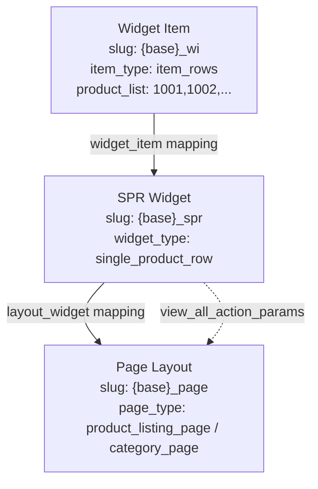
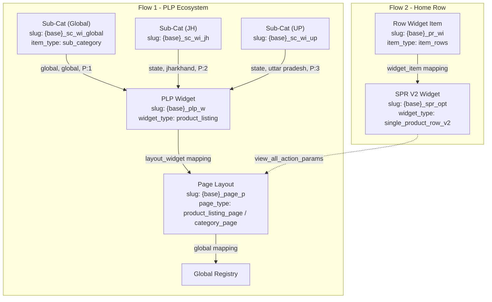

# WIDGET: Single Product Row (SPR) — Complete Reference

## 1. Overview

The **Single Product Row (SPR)** is the primary product display widget on the homepage. It renders a horizontal scrollable row of product cards with a "View All" link to a PLP page.

SPR is fully driven by `ProductRailConfig.js` and resolves into **4 backend variants** based on two properties: **Optimized** and **Multimedia**.

### System Architecture

```mermaid
flowchart TD
    User([User Configures SPR Widget]) --> Form[Fill Sidebar Form\nTitle · Products · Page Type]
    Form --> Opt{is_optimized?}
    Form --> MM{has_multimedia?}

    Opt -->|false| Std[Standard Path\nsingle_product_row]
    Opt -->|true|  Opt2[Optimized Path\nsingle_product_row_v2]
    MM  -->|true|  Media[+multimedia_ prefix\non widget_type]

    Std  --> API1[POST /api/app/post_page_layout/\nPOST /api/app/post_widget_item/\nPOST /api/app/widget/\n+ 3 mapping CSV calls]
    Opt2 --> API2[PLP Ecosystem + Home Row\n8 API calls total]
    Media --> MM2[POST /api/app/multimedia/\nbefore widget create]

    API1 --> Live([Widget Live on Backend])
    API2 --> Live
    MM2  --> Live
```

### Emulator Preview — SPR Widget

```
┌─ Phone Emulator (375×812) ─────────────────────┐
│                                                   │
│  ┌──────────────────────────────────────────┐    │
│  │  ★ Rice Mela                   View All  │    │  ← heading + CTA
│  │  ┌───────┐ ┌───────┐ ┌───────┐ ┌───── │    │
│  │  │       │ │       │ │       │ │      │    │
│  │  │  img  │ │  img  │ │  img  │ │ img  │    │  ← single row (rows=1)
│  │  │       │ │       │ │       │ │      │    │
│  │  │  ₹99  │ │ ₹149  │ │ ₹199  │ │ ₹89  │    │
│  │  │ Rice  │ │ Atta  │ │  Dal  │ │ Oil  │    │
│  │  └───────┘ └───────┘ └───────┘ └───── │    │
│  └──────────────────────────────────────────┘    │
│                                                   │
│  ── Multimedia Variant ───────────────────────   │
│  ┌──────────────────────────────────────────┐    │
│  │ ▓▓▓▓▓▓▓ BACKGROUND MEDIA ▓▓▓▓▓▓▓▓▓▓▓▓ │    │  ← image/video bg
│  │  ★ Diwali Offers               View All  │    │
│  │  ┌──────┐ ┌──────┐ ┌──────┐ ┌────── │    │
│  │  │  img │ │  img │ │  img │ │  img  │    │
│  │  │      │ │      │ │      │ │       │    │
│  │  │  ₹99 │ │ ₹149 │ │ ₹199 │ │  ₹79  │    │
│  │  └──────┘ └──────┘ └──────┘ └────── │    │
│  └──────────────────────────────────────────┘    │
│                                                   │
└───────────────────────────────────────────────────┘
```

---

## 2. Variant Resolution

Two properties determine the exact `widget_type`:

| Property | Type | Default | Description |
| :--- | :--- | :--- | :--- |
| `is_optimized` | Boolean | `true` | Enables PLP ecosystem creation with sub-categories |
| `has_multimedia` | Boolean (implicit) | `false` | Auto-set to `true` when `background_media` is uploaded |

### Variant Matrix

| Optimized? | Multimedia? | Resolved `widget_type` |
| :---: | :---: | :--- |
| `false` | `false` | `single_product_row` |
| `true` | `false` | `single_product_row_v2` |
| `false` | `true` | `multimedia_single_product_row` |
| `true` | `true` | `multimedia_single_product_row_v2` |

> **Multimedia Constraint:** `single_product_row` and `single_product_row_v2` **IGNORE** `background_multimedia`. Only `multimedia_*` variants render backgrounds.

---

## 3. Page Type Selection

The user selects the **page type** during widget creation. This determines the navigation destination when a user taps "View All" on the SPR widget.

| Page Type | Value | Description |
| :--- | :--- | :--- |
| **Product Listing Page** | `product_listing_page` | Flat product grid — shows all products in a single scrollable list |
| **Category Page** | `category_page` | Categorized browsing — shows sub-category tabs/cards for navigation |

### How Page Type Affects Navigation

| Page Type | "View All" Result |
| :--- | :--- |
| `product_listing_page` | Opens a flat product listing page directly with all mapped products |
| `category_page` | Opens a category page with sub-category cards — user picks a sub-category — then sees products |

> The page type is set on the **Page Layout** object (Step 1/3) and referenced in the widget's `view_all_action_params`. The user selects the page type **per widget** during configuration.

### Frontend Page Type Selection

```
Single Product Row: "Rice Mela Rail"
+-------------------------------------------------+
| Page Type:  [product_listing_page  v]           |
|             [category_page         ]            |
|                                                   |
| Slug:       rice_mela_rail                       |
| Title:      Rice Mela                            |
| Products:   1001, 1002, 1003, 1004              |
+-------------------------------------------------+
```

---

## 4. Form Fields & Validation

Driven from `ProductRailConfig.fields`:

| Field | Component | Required | Validation | Condition |
| :--- | :--- | :---: | :--- | :--- |
| **Page Type** | `SelectInput` | Yes | `product_listing_page` or `category_page` | Always |
| **Slug** | `SlugBuilder` | Yes | `/^[a-z0-9_]+$/`, 3-100 chars | Always |
| **Title (English)** | `TextInput` | Yes | 2-200 chars, auto-translate | Always |
| **Title (Hindi)** | `TextInput` | No | — | Always |
| **Products** | `ProductListInput` | Yes | 1-200 numeric item codes | Always |
| **Background Media** | `ImageUpload` | No | Supported formats: `.jpeg/.jpg/.png/.webp/.gif/.svg` | Always |
| **Background Video URL** | `UrlInput` | No | Valid URL ending `.mp4/.mov/.webm` | Always |
| **View All Page Slug** | `TextInput` | No | `/^[a-z0-9_-]*$/` | Only when `is_optimized = false` |

---

## 5. Deploy Strategies

### 5.1 STANDARD (`single_product_row` / `multimedia_single_product_row`)

**When:** `is_optimized = false`

**Flow:** Page Layout → Widget Item → Widget → Mappings

```
Step 1: Create Page Layout          POST /api/app/post_page_layout/      (slug: {base}_page)
Step 2: Create Widget Item          POST /api/app/post_widget_item/      (slug: {base}_wi)
Step 3: Create Widget               POST /api/app/widget/                (slug: {base}_spr)
Step 4: Map Widget <-> Widget Item  (parent: _spr, child: _wi)
Step 5: Map Page <-> Widget         (parent: _page, child: _spr)
```



**Field Mapping:**

| Step | Entity | Key Fields |
| :--- | :--- | :--- |
| 1 | Page Layout | `slug_name`, `page_heading: $title`, `page_layout_type: 2`, `page_type: $selectedPageType` |
| 2 | Widget Item | `slug_name`, `item_type: item_rows`, `text_en: $title`, `text_hi: $titleHi`, `product_list: $productCodes`, `filter_lst: $inStockFilter` |
| 3 | Widget | `slug_name`, `widget_type: $resolvedWidgetType`, `heading_en/hi`, `view_all_action_name: redirect-to-page`, `view_all_action_params`, `background_multimedia`, `filter_dict`, `app_configurations` |

---

### 5.2 OPTIMIZED (`single_product_row_v2` / `multimedia_single_product_row_v2`)

**When:** `is_optimized = true`

Creates **two parallel flows** — a PLP ecosystem with `sub_category` items AND a home row widget with `item_rows`.

```
-- Flow 1: PLP Ecosystem --
Step 1: Create Sub-Cat Widget Item   POST /api/app/post_widget_item/   (slug: {base}_sc_wi)
Step 2: Create PLP Widget            POST /api/app/widget/              (slug: {base}_plp_w)
Step 3: Create Page Layout            POST /api/app/post_page_layout/   (slug: {base}_page)
Step 4: Map PLP Widget <-> Sub-Cat   (parent: _plp_w, child: _sc_wi)
Step 5: Map Page <-> PLP Widget      (parent: _page, child: _plp_w)

-- Flow 2: Home Row --
Step 6: Create Row Widget Item        POST /api/app/post_widget_item/   (slug: {base}_pr_wi)
Step 7: Create SPR V2 Widget          POST /api/app/widget/              (slug: {base}_spr_opt)
Step 8: Map SPR V2 <-> Row Item      (parent: _spr_opt, child: _pr_wi)
```



**Field Mapping:**

| Step | Entity | Slug Suffix | Key Fields |
| :--- | :--- | :--- | :--- |
| 1 | Sub-Cat Widget Item | `_sc_wi` | `item_type: sub_category`, `product_list`, `filter_lst` |
| 2 | PLP Widget | `_plp_w` | `widget_type: product_listing`, `heading: $title` |
| 3 | Page Layout | `_page` | `page_type: $selectedPageType`, `page_heading: $title`, `page_layout_type: 2` |
| 6 | Row Widget Item | `_pr_wi` | `item_type: item_rows`, `product_list` |
| 7 | SPR V2 Widget | `_spr_opt` | `widget_type: $resolvedWidgetType`, `heading_en/hi`, `view_all: redirect-to-page`, `background_multimedia`, `filter_dict`, `app_configurations` |

---

## 6. Slug Naming Convention

### Standard Variant

| Object | Slug Pattern | Example |
| :--- | :--- | :--- |
| Page Layout | `{base}_page` | `rice_mela_rail_page` |
| Widget Item | `{base}_wi` | `rice_mela_rail_wi` |
| SPR Widget | `{base}_spr` | `rice_mela_rail_spr` |

### Optimized Variant

| Object | Slug Pattern | Example |
| :--- | :--- | :--- |
| Sub-Cat (Global) | `{base}_sc_wi_global` | `rice_mela_rail_sc_wi_global` |
| Sub-Cat (State) | `{base}_sc_wi_{state_key}` | `rice_mela_rail_sc_wi_jh` |
| PLP Widget | `{base}_plp_w` | `rice_mela_rail_plp_w` |
| Page Layout | `{base}_page_p` | `rice_mela_rail_page_p` |
| Row Widget Item | `{base}_pr_wi` | `rice_mela_rail_pr_wi` |
| SPR V2 Widget | `{base}_spr_opt` | `rice_mela_rail_spr_opt` |

---

## 7. Location / State-Based Product Mapping

Applies to **Optimized** variant only. Creates one sub-category widget item per state for location-specific product lists. States are **dynamic** — added via "+ Add State" button.

### State Reference

| State | `level_tag` | `level_property` | Slug Suffix | Required? |
| :--- | :--- | :--- | :--- | :---: |
| Global (Default) | `global` | `global` | `_global` | Always |
| Jharkhand | `state` | `jharkhand` | `_jh` | Optional |
| Chhattisgarh | `state` | `chhattisgarh` | `_cg` | Optional |
| West Bengal | `state` | `west bengal` | `_wb` | Optional |
| Uttar Pradesh | `state` | `uttar pradesh` | `_up` | Optional |
| Patna | `state` | `patna` | `_patna` | Optional |
| *(any new)* | `state` | `{state_name_lowercase}` | `_{short_key}` | Optional |

### Mapping CSV Format

```csv
widget_item_slug_name,level_tag,level_property,priority,cohort
rice_mela_rail_sc_wi_global,global,global,1,
rice_mela_rail_sc_wi_jh,state,jharkhand,2,
rice_mela_rail_sc_wi_cg,state,chhattisgarh,3,
rice_mela_rail_sc_wi_up,state,uttar pradesh,4,
```

> Priority is auto-assigned incrementally. Global is always priority `1`.

---

## 8. Filters & Configurations

All filters are **universal** across all 4 SPR variants — handled by `WidgetItemHelper` / `PageViewUtils`.

### Widget-Level Filters (`filter_dict` on Widget)

| Key | Type | Component | Description |
| :--- | :--- | :--- | :--- |
| `max_order_constraint` | int | `NumberInput` | Show only if user orders <= Y |
| `min_order_constraint` | int | `NumberInput` | Show only if user orders >= X |

### Item-Level Filters (`filter_dict` on WidgetItem)

| Key | Type | Component |
| :--- | :--- | :--- |
| `in_stk_item_codes` | list of int | `ProductListInput` |

### Product-Level Filters (`product_filter_dict` on WidgetItem)

| Key | Operators | Component |
| :--- | :--- | :--- |
| `category` | `in`, `equal` | `TextInput` |
| `sub_category` | `in`, `equal` | `TextInput` |
| `mrp` | `lte`, `gte`, `lt`, `gt`, `equal` | `NumberInput` |
| `sp` | `lte`, `gte`, `lt`, `gt`, `equal` | `NumberInput` |
| `discount` | `lte`, `gte`, `lt`, `gt`, `equal` | `NumberInput` |

### App Configurations

| Key | Type | Default | Component |
| :--- | :--- | :--- | :--- |
| `allow_android` | boolean | `true` | `ToggleInput` |
| `allow_ios` | boolean | `true` | `ToggleInput` |
| `min_android_version` | version | — | `VersionInput` |
| `max_android_version` | version | — | `VersionInput` |
| `min_ios_version` | version | — | `VersionInput` |
| `max_ios_version` | version | — | `VersionInput` |

### Widget Item Additional Properties

| Property | Type | Default | Description |
| :--- | :--- | :--- | :--- |
| `oos_product_count` | int | `0` | OOS products appended at end |
| `show_pb_tag` | boolean | `true` | Show "Previously Bought" tag |
| `pb_reorder` | boolean | `true` | Re-sort PB items first |

---

## 9. Navigation — "View All" Link

SPR uses `view_all_action_params` to link to its PLP page:

```javascript
{
  "view_all_action_name": "redirect-to-page",
  "view_all_action_params": {
    "page_type": "product_listing_page",   // or "category_page"
    "page_layout_slug_name": "{base}_page_p"
  }
}
```

Both `product_listing_page` and `category_page` are supported — user selects during configuration.

---

## 10. Rendering

| Property | Value |
| :--- | :--- |
| React Component | `ProductRail` |
| Config Source | `ProductRailConfig.js` |
| Registry | Config-driven via `WidgetRegistry.configMap` |
| Renderer | `WidgetRenderer.jsx` → `configComponentMap['ProductRail']` |

### Initial State

```javascript
{
    type: 'product_rail',
    title: 'New Collection',
    products: [],
    pnc: { rows: 1, is_optimized: true, has_multimedia: false }
}
```

---

## 11. API Endpoints

| Action | Endpoint | Type |
| :--- | :--- | :--- |
| Create Page Layout | `/api/app/post_page_layout/` | JSON |
| Create Widget Item | `/api/app/post_widget_item/` | Multipart |
| Create Widget | `/api/app/widget/` | Multipart |
| Map Widget <-> Widget Item | `/api/app/update_widget_widget_item_mapping/` | CSV |
| Map Page <-> Widget | `/api/app/update_layout_widget_mapping/` | — |
| Map Page <-> Global Registry | `/api/app/update_page_page_layout_mapping/` | — |

---

## 12. Related Documentation

- [Product Rail Widget](./WIDGET-Product-Rail.md) — Variant composition and backend mapping
- [PLP Page Widget Support](./PLP-PAGE-widget-support.md) — Universal 3-layer PLP ecosystem, location mapping
- [Slug Name Reference](./SLUG_NAME.md) — All slug patterns across widgets
- [Widget Library Reference](./REFERENCE-Widget-Library.md) — All supported widgets and variants
